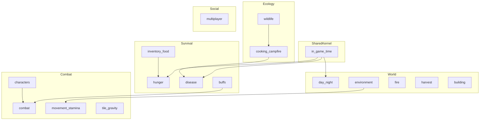

# Gameplay domain map (DDD)

Master index of plaza **player-facing** bounded contexts. Implementation wiring lives in [memory/game-engines-reference.md](../memory/game-engines-reference.md).

|                  |            |
| ---------------- | ---------- |
| **Version**      | 1.0.0      |
| **Last updated** | 2026-07-08 |

## Subdomain diagram

## Bounded context table

| Subdomain | Context            | Folder                                                       | Status       | Code anchor                                          |
| --------- | ------------------ | ------------------------------------------------------------ | ------------ | ---------------------------------------------------- |
| Shared    | In-game time       | [shared/in-game-time.md](./shared/in-game-time.md)           | Done         | `computingWorldPlazaInGameDurationMs.ts`             |
| Survival  | Hunger             | [mechanics/hunger/](./mechanics/hunger/)                     | **Complete** | `definingWorldPlazaHungerConstants.ts`               |
| Survival  | Disease            | [mechanics/disease/](./mechanics/disease/)                   | **Complete** | `definingWorldPlazaEntityDiseaseRegistry.ts`         |
| Survival  | Inventory / food   | [mechanics/inventory-food/](./mechanics/inventory-food/)     | **Complete** | `definingWorldPlazaInventoryItemTypes.ts`            |
| Survival  | Buffs              | [mechanics/buffs/](./mechanics/buffs/)                       | **Complete** | `definingWorldPlazaEntityBuffRegistry.ts`            |
| Combat    | Combat             | [mechanics/combat/](./mechanics/combat/)                     | **Complete** | `rollingWorldPlazaDamageEngine.ts`                   |
| Combat    | Movement / stamina | [mechanics/movement-stamina/](./mechanics/movement-stamina/) | **Complete** | `definingWorldPlazaRunStaminaConstants.ts`           |
| Combat    | Tile gravity       | [mechanics/tile-gravity/](./mechanics/tile-gravity/)         | **Complete** | `computingWorldPlazaTileGravityWellStep.ts`          |
| Combat    | Characters         | [mechanics/characters/](./mechanics/characters/)             | **Complete** | `registeringWorldPlazaCharacterEngineDefinitions.ts` |
| Ecology   | Wildlife           | [mechanics/wildlife/](./mechanics/wildlife/)                 | **Complete** | `definingWildlifeSpeciesRegistry.ts`                 |
| Ecology   | Cooking / campfire | [mechanics/cooking-campfire/](./mechanics/cooking-campfire/) | **Complete** | `definingWildlifeMeatRegistry.ts`                    |
| World     | Day / night        | [mechanics/day-night/](./mechanics/day-night/)               | **Complete** | `definingWorldPlazaDayNightCycleConstants.ts`        |
| World     | Environment        | [mechanics/environment/](./mechanics/environment/)           | **Complete** | `definingWorldPlazaTemperatureConstants.ts`          |
| World     | Fire               | [mechanics/fire/](./mechanics/fire/)                         | **Complete** | `src/client/world/fire/`                             |
| World     | Harvest            | [mechanics/harvest/](./mechanics/harvest/)                   | **Complete** | `definingWorldPlazaTreeChopConstants.ts`             |
| World     | Building           | [mechanics/building/](./mechanics/building/)                 | **Complete** | `definingWorldBuildingPlotConstants.ts`              |
| Social    | Multiplayer        | [mechanics/multiplayer/](./mechanics/multiplayer/)           | **Complete** | `plazaDevvitOnline.ts`                               |

## Overlap rules

| Topic                          | Owner context     | Others cross-link only                                      |
| ------------------------------ | ----------------- | ----------------------------------------------------------- |
| Disease infection              | Disease           | Cooking-campfire (meat odds), inventory-food (eat pipeline) |
| Meat catalog rows              | Cooking-campfire  | Disease (symptom grants), wildlife (species loot)           |
| Buff registry entries          | Buffs             | Disease (`disease-*` ids), combat (roll mods)               |
| Player vitals / incapacitation | Combat            | Buffs, disease grants                                       |
| Campfire fuel / cook channel   | Cooking-campfire  | Fire (ignite/spread), environment (72°C warmth)             |
| Wolf stalk phases              | Wildlife          | Combat (damage on commit)                                   |
| Tutorials / mechanics UI       | Meta (memory §15) | Link from [README.md](./README.md), no separate folder      |

## Automation

Code-to-doc mapping: [doc-triggers.json](./doc-triggers.json). Drift hook: `.cursor/hooks/check-gameplay-doc-drift.mjs`.

## Related

- Tuning numbers: [memory/game-mechanics-reference.md](../memory/game-mechanics-reference.md)
- Engine hooks: [memory/game-engines-reference.md](../memory/game-engines-reference.md)
