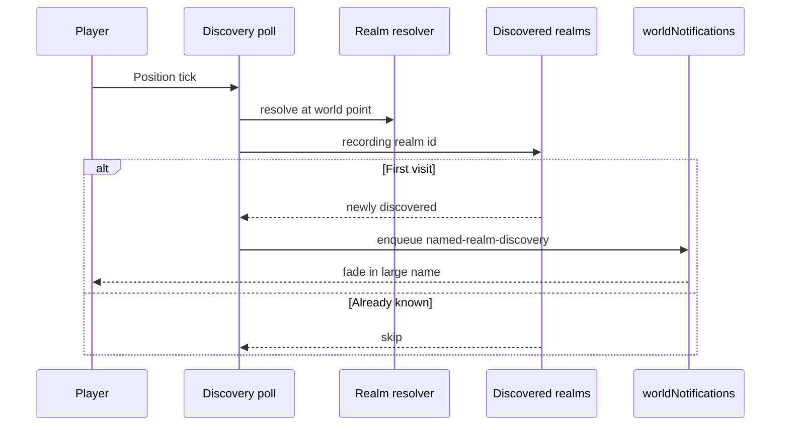

# Named realms mechanics

## Player-facing loop

1. Wanderer spawns (or first-ever enters a named realm).
2. **worldNotifications** shows `Welcome to {realm}`.
3. Later first visits to other realms show the realm title alone (no welcome).
4. Name holds, then fades out. Later visits to a known realm stay silent.
5. Realm is permanent for the world layout: same center always same name and borders.

## How realms are generated

1. Sparse lattice every **6** biome-region cells.
2. Each lattice cell has ~**62%** chance to place a realm center (jittered inside the cell).
3. Each center gets a **size weight** (about **0.55..2.4**), a **size_type** band (tiny → large), and a one-word place name (display name = place name).
4. Every biome-region cell joins the nearest center by **weighted distance** (larger weight claims more land).
5. Result: small realms (couple biomes) and large ones (lots of land), often spanning multiple biome kinds.

### size_type bands

Normalized size weight (0 at min, 1 at max) maps to equal fifths:

| size_type | Normalized range |
| --------- | ---------------- |
| `tiny` | 0.0 to under 0.2 |
| `small` | 0.2 to under 0.4 |
| `medium` | 0.4 to under 0.6 |
| `big` | 0.6 to under 0.8 |
| `large` | 0.8 to 1.0 |

## Permanence rules

| Rule | Detail |
| ---- | ------ |
| Deterministic | Hash of lattice coords picks spawn, size, place name |
| World-stable | Same layout always same realms |
| Per player | Discovery progress per storage owner |
| Biome-agnostic | Borders ignore biome kind |

## worldNotifications slot

| Kind | Presentation | Timing |
| ---- | ------------ | ------ |
| `controls-hint` | Small pill (boot) | ~6s then fade |
| `named-realm-discovery` | Large display font | Fade in ~0.9s, hold ~4.5s, fade out ~1.2s |

## Not in this context

- Codex explored biomes by **kind**
- Minimap biome kind label (chrome text)
- Climate / temperature hazards

## Minimap

Named-realm borders draw as thin **black** lines on the terrain layer where adjacent tiles belong to different realms (`drawingWorldPlazaMiniMapNamedRealmBordersOnTerrainLayer.ts`).
