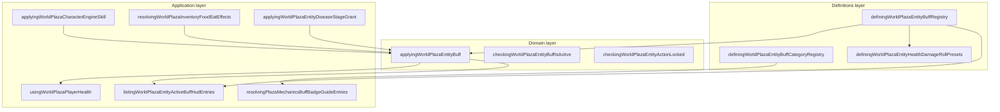

# Buffs bounded context (DDD)

|                  |            |
| ---------------- | ---------- |
| **Version**      | 1.0.0      |
| **Last updated** | 2026-07-09 |

Plaza **buffs** are declarative short-term modifiers on entity health: combat roll shifts, damage reduction, movement, temperature, food well-fed rewards, disease symptoms, and incapacitation.

## Docs in this folder

| File | Purpose |
| ---- | ------- |
| [glossary.md](./glossary.md) | Ubiquitous language for buff descriptors and runtime instances |
| [mechanics.md](./mechanics.md) | Lifecycle, stacking, HUD, categories |
| [catalog.md](./catalog.md) | All **95** registry buffs with effect, source, and edit file |

## DDD map

### Bounded context

**Plaza Entity Buffs** — catalog of `DefiningWorldPlazaEntityBuffDescriptor` entries, apply/toggle logic onto `DefiningWorldPlazaEntityHealthState`, and HUD/guide list builders.

Touches **Entity Health** (state slices), **Combat** (damage roll pipeline), **Characters** (skills), **Inventory/Food** (well-fed), and **Disease** (symptom grants). Hunger tier effects are **not** buffs (separate bounded context).

### Aggregates

| Aggregate | Root | Responsibility |
| --------- | ---- | -------------- |
| **Buff definition** | `DefiningWorldPlazaEntityBuffDescriptor` | Static id, polarity, category, duration, effect payload, optional action locks |
| **Player health** | `DefiningWorldPlazaEntityHealthState` | Runtime lists: movement modifiers, damage roll preset ids, DoT, sleep, stun, confusion, temp max HP, resistances |

A **buff instance** on health state uses the buff `id` or a scoped id (`disease-grant:{instance}:{index}:{buffId}`) for disease symptoms.

### Value objects

- Buff `id` — stable string key (`power-buff`, `well-fed-hearty-buff`, …)
- `DefiningWorldPlazaEntityBuffPolarity` — `buff | debuff`
- `DefiningWorldPlazaEntityBuffDurationKind` — `toggle | timed | instant`
- `DefiningWorldPlazaEntityBuffEffect` — discriminated union (`damage_roll_modifiers`, `movement_modifier`, …). Movement `modifierKind` includes `speed` (walk+run) and `walk_speed` (walk only).
- `DefiningWorldPlazaEntityBuffActionLock` — `jump | roll | sprint`
- Damage roll modifier id — `{buffId}:{modifierIndex}` via `creatingWorldPlazaEntityHealthDamageRollPresetModifierId`

### Domain services (pure)

| Service | File |
| ------- | ---- |
| Apply / toggle buff | `applyingWorldPlazaEntityBuff.ts` |
| Active check | `checkingWorldPlazaEntityBuffIsActive.ts` |
| Action lock check | `checkingWorldPlazaEntityActionLocked.ts` |
| HUD icon map | `mappingWorldPlazaEntityBuffHudIcon.ts` |
| Damage roll presets from registry | `definingWorldPlazaEntityHealthDamageRollPresets.ts` |

### Application layer

| Use case | Entry |
| -------- | ----- |
| Health frame + dev toggles | `usingWorldPlazaPlayerHealth.ts` (`toggleBuffRef`) |
| Character skills | `applyingWorldPlazaCharacterEngineSkill.ts` |
| Cooked meat well-fed | `resolvingWorldPlazaInventoryFoodEatEffects.ts` |
| Disease symptom grants | `applyingWorldPlazaEntityDiseaseStageGrant.ts` |
| Active HUD row | `listingWorldPlazaEntityActiveBuffHudEntries.ts` |
| Home mechanics guide | `resolvingPlazaMechanicsBuffBadgeGuideEntries.ts` |
| Starting buffs | `creatingWorldPlazaCharacterEngineInitialHealthState.ts` |

### Infrastructure

| Concern | File |
| ------- | ---- |
| Health state mutators | `managingWorldPlazaEntityHealthState.ts` |
| Damage roll engine | `rollingWorldPlazaDamageEngine.ts`, `resolvingWorldPlazaEntityHealthDamageRollParams.ts` |
| Persist conditions | `usingWorldPlazaPersistingPlayerConditions.ts` (disease; most buffs are session-local) |

### Declarative registries (source of truth)

| Registry | File |
| -------- | ---- |
| Buff catalog (**95 entries**) | `src/client/world/health/domains/definingWorldPlazaEntityBuffRegistry.ts` |
| Buff categories | `src/client/world/health/domains/definingWorldPlazaEntityBuffCategoryRegistry.ts` |
| Sleep / stun / confusion defaults | `definingWorldPlazaEntitySleepConstants.ts`, `StunConstants.ts`, `ConfusionConstants.ts` |
| Lifesteal / heal amp defaults | `definingWorldPlazaEntityDamageToHealConstants.ts`, `HealAmplifierConstants.ts` |

## Layer diagram

## How to add a new buff

1. **Definition** — add descriptor block to `DEFINING_WORLD_PLAZA_ENTITY_BUFF_REGISTRY` in `definingWorldPlazaEntityBuffRegistry.ts` (id, category, `durationKind`, `effect`, optional `actionLocks`, `hideFromHud`).
2. **Apply path** — wire a trigger: food eat (`cookedWellFedBuffId`), disease grant, character skill, or health dev toggle. Reuse `applyingWorldPlazaEntityBuff` when possible.
3. **HUD icon** — add mapping in `mappingWorldPlazaEntityBuffHudIcon.ts`; register Iconify in `registeringBundledIconifyIcons.ts` if new.
4. **Action locks** — if jump/roll/sprint should block, set `actionLocks`; verify `checkingWorldPlazaEntityActionLocked`.
5. **Docs** — add row to [catalog.md](./catalog.md) and trigger in [inventory-food](../inventory-food/) or [disease](../disease/) if player-facing source is food or illness.
6. **Verify** — toggle or eat in play; confirm HUD row and mechanics guide entry (`listingPlazaMechanicsBuffBadgeGuideEntries` reads registry automatically).

`damage_roll_modifiers` buffs also appear in `DEFINING_WORLD_PLAZA_ENTITY_HEALTH_DAMAGE_ROLL_PRESETS` automatically via `listingWorldPlazaEntityHealthDamageRollPresetsFromBuffRegistry()`.

## Related contexts

- Disease grants symptom buffs: [disease](../disease/)
- Cooked meat well-fed rolls: [inventory-food](../inventory-food/) + [cooking-campfire](../cooking-campfire/)
- Combat damage rolls: [combat](../combat/)
- Character skills (`swift-stride`, `heat-ward`): [characters](../characters/)
- **Frostbite** (scoped symptom buffs + linear walk_speed): [frostbite](../frostbite/)
- Hunger tier effects (not buffs): [hunger](../hunger/)

## Related AI references

- Engine wiring: [memory/game-engines-reference.md](../../../memory/game-engines-reference.md) (Entity health)
- Summary table: [memory/game-mechanics-reference.md](../../../memory/game-mechanics-reference.md) (section 9)
