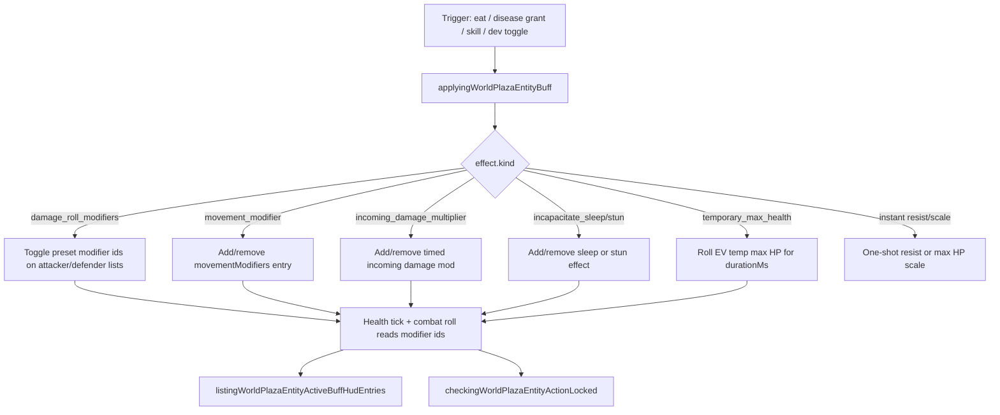

# Buffs mechanics and gameplay

How buffs are applied, how long they last, how they appear in UI, and how they interact with combat and movement.

## Lifecycle

### Duration kinds

| Kind        | Behavior                                                   | Examples                                                     |
| ----------- | ---------------------------------------------------------- | ------------------------------------------------------------ |
| **toggle**  | Second apply removes effect; `expiresAtMs` often null      | iron-armor, power-buff, long-leap-buff                       |
| **timed**   | `expiresAtMs = nowMs + durationMs`; expires on health tick | half-damage-buff (30s), swift-stride-buff (60s), well-fed-\* |
| **instant** | Immediate mutation, no ongoing HUD timer                   | double/halve max HP, +25% heat/cold resist or weakness       |

### Toggle vs timed movement

`movement_modifier` toggles off when the same `descriptor.id` is already active and unexpired. Re-applying a **timed** movement buff refreshes expiry to `nowMs + durationMs`.

## Stacking rules

| Effect family                          | Stacking behavior                                                                              |
| -------------------------------------- | ---------------------------------------------------------------------------------------------- |
| **Same toggle buff id**                | Toggles off (only one instance per id in that effect list)                                     |
| **Different movement buff ids**        | Multiple modifiers combine; movement resolver multiplies contributions                         |
| **Damage roll presets**                | Multiple preset ids can be active; modifiers merge in roll param resolver                      |
| **incoming_damage_multiplier**         | Separate entries per buff id; timed expiry independent                                         |
| **physical_damage_lifesteal / absorb** | Ratios sum toward cap **100%**                                                                 |
| **incoming/outgoing heal amplifier**   | Ratios sum toward bonus cap **+200%**                                                          |
| **temporary_max_health**               | Separate entries per buff id; each rolls its own EV bonus                                      |
| **Disease grant instances**            | Scoped ids per grant; same template buff can exist multiple times under different instance ids |

Hunger tier penalties ([hunger](../hunger/)) apply in parallel; they are not buff entries.

## Action locks

`actionLocks` on descriptor block sprint, jump, or roll while the buff instance is active:

| Buff ids with locks          | Locks        |
| ---------------------------- | ------------ |
| `food-sickness-debuff`       | sprint       |
| `disease-muscle-lock-debuff` | sprint, jump |
| `disease-joint-lock-debuff`  | jump, roll   |
| `disease-roll-lock-debuff`   | roll         |

Locks resolve through `checkingWorldPlazaEntityActionLocked`, including disease-scoped instance ids mapped back to template buff ids.

Hungry/starving tiers also disable sprint/jump via hunger refs (separate system).

## Death and respawn

Death revive (`revivingWorldPlazaEntityHealthToFull`) strips **all** transient
buff and debuff slices: movement, incoming damage, heal amplifiers, lifesteal,
confusion, sleep, stun, disease scheduler entries, damage-roll modifiers, temp
max HP, and DoT pools (poison/bleed/potential). Immune-system factor and
`diseaseImmunityIds` stay. Character immunities and `startingStatusEffectIds`
re-seed after wipe. Attacker-side roll modifiers clear on respawn/revive too.

## HUD

### Active row

`listingWorldPlazaEntityActiveBuffHudEntries`:

1. Lists registry buffs where `checkingWorldPlazaEntityBuffIsActive` is true.
2. Skips `hideFromHud` and `disease-grant:*` instance ids.
3. Appends **disease badges** for symptomatic `diseaseEffects` (separate icons, not buff catalog ids).
4. Shows countdown when `expiresAtMs` is set.
5. Disease badge rows carry `severityLabel` and `detailLines` (active / upcoming stages) from `resolvingWorldPlazaEntityDiseaseHudDetailLines.ts` for the tap popover.

Icons: `mappingWorldPlazaEntityBuffHudIcon.ts`.

### Mechanics guide

`listingPlazaMechanicsBuffBadgeGuideEntries` exports every registry descriptor sorted by category then label. Disease diseases have a parallel guide in `resolvingPlazaMechanicsDiseaseBadgeGuideEntries.ts`.

## Categories

| Category      | Role                                          | Example ids                                                         |
| ------------- | --------------------------------------------- | ------------------------------------------------------------------- |
| **combat**    | Attacker roll skew, lethality debuffs         | power-buff, assassin-buff, exposed-debuff                           |
| **defence**   | Defender roll skew, damage reduction, absorb, temp tolerance | iron-armor, guarded-buff, heat-tolerance-buff              |
| **utility**   | Consistency tools, immunities                 | focus-buff, heat-immunity-buff, invincibility-buff                  |
| **character** | Movement, stamina, well-fed, disease symptoms | swift-stride-buff, well-fed-hearty-buff, disease-nausea-slow-debuff |

## Apply sources (player-facing)

| Source                         | Buff ids                                                   | Entry                                                                                                           |
| ------------------------------ | ---------------------------------------------------------- | --------------------------------------------------------------------------------------------------------------- |
| Cooked meat eat                | `well-fed-*`                                               | `resolvingWorldPlazaInventoryFoodEatEffects.ts` (simulation clock)                                              |
| Disease grant                  | `disease-*`, confusion/sleep/stun from grants              | `applyingWorldPlazaEntityDiseaseStageGrant.ts` (effect stamps use simulation clock; fire times use world epoch) |
| Character skill                | `swift-stride-buff`, `heat-immunity-buff`                  | `applyingWorldPlazaCharacterEngineSkill.ts`                                                                     |
| Health dev / mechanics toggles | Most combat/defence roll presets, movement, incapacitation | `usingWorldPlazaPlayerHealth.ts` `toggleBuffRef`                                                                |
| Character spawn                | `startingStatusEffectIds` (empty today)                    | `creatingWorldPlazaCharacterEngineInitialHealthState.ts`                                                        |

## Key constants (shared defaults)

| Constant                                                   | Value       | Used by                     |
| ---------------------------------------------------------- | ----------- | --------------------------- |
| `DEFINING_WORLD_PLAZA_ENTITY_DAMAGE_TO_HEAL_DEFAULT_RATIO` | 0.25 (25%)  | siphoning-buff, absorb-buff |
| `DEFINING_WORLD_PLAZA_ENTITY_HEAL_AMPLIFIER_DEFAULT_RATIO` | 0.25 (+25%) | blessing-buff, mending-buff |
| `DEFINING_WORLD_PLAZA_SLEEP_DEFAULT_DURATION_MS`           | 8000 ms     | sleep-debuff                |
| `DEFINING_WORLD_PLAZA_SLEEP_WAKE_BONUS_DAMAGE`             | 30          | sleep-debuff wake hit       |
| `DEFINING_WORLD_PLAZA_SLEEP_FALL_ANIMATION_FPS`            | 6           | sleep fall (death strip)    |
| `DEFINING_WORLD_PLAZA_SLEEP_SPEECH_BUBBLE_DURATION_MS`     | 3200 ms     | player Zzz bubble refresh   |
| `DEFINING_WORLD_PLAZA_STUN_DEFAULT_DURATION_MS`            | 4000 ms     | stun-debuff                 |
| `DEFINING_WORLD_PLAZA_CONFUSION_DEFAULT_INTENSITY`         | 50          | confusion-debuff            |

## Key files

| Concern                    | File                                                                                 |
| -------------------------- | ------------------------------------------------------------------------------------ |
| Buff registry (77 entries) | `src/client/world/health/domains/definingWorldPlazaEntityBuffRegistry.ts`            |
| Apply / toggle             | `src/client/world/health/domains/applyingWorldPlazaEntityBuff.ts`                    |
| Active check               | `src/client/world/health/domains/checkingWorldPlazaEntityBuffIsActive.ts`            |
| HUD list                   | `src/client/world/health/domains/listingWorldPlazaEntityActiveBuffHudEntries.ts`     |
| Wildlife badge snapshot    | `src/client/world/wildlife/domains/resolvingWildlifeInstanceEntityHudBadgeSnapshot.ts` (listing only; no animal UI yet) |
| Mechanics guide            | `src/client/components/home/domains/resolvingPlazaMechanicsBuffBadgeGuideEntries.ts` |
| Roll presets               | `src/client/world/health/domains/definingWorldPlazaEntityHealthDamageRollPresets.ts` |
| Engine wiring              | `memory/game-engines-reference.md` (Entity health)                                   |

Full per-id table: [catalog.md](./catalog.md).
