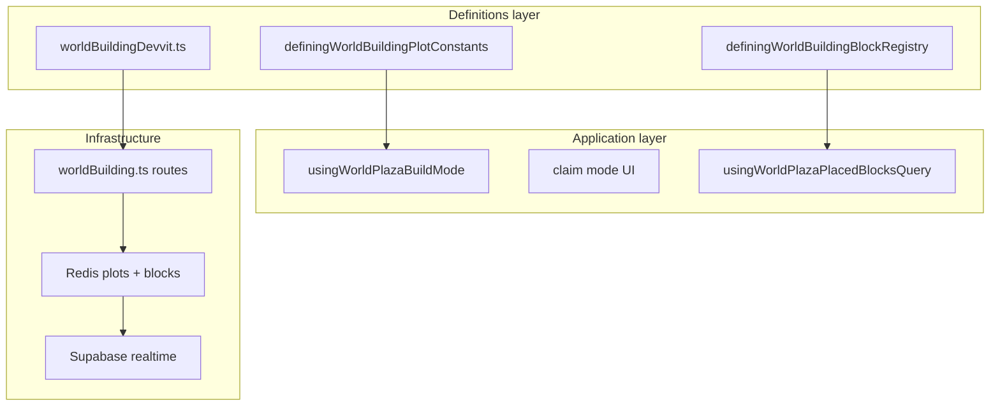

# Building bounded context (DDD)

|                  |            |
| ---------------- | ---------- |
| **Version**      | 1.0.0      |
| **Last updated** | 2026-07-08 |

Plaza **building** covers plot claims, placed blocks, build/claim modes, owner limits, and neighbor buffers between players.

## Docs in this folder

| File | Purpose |
| ---- | ------- |
| [glossary.md](./glossary.md) | Plot, claim, temporary tile, mode terms |
| [mechanics.md](./mechanics.md) | Claim rules, limits, build loop |
| [catalog.md](./catalog.md) | Plot limits, API paths, constants |

## DDD map

### Bounded context

**Plaza Player Building** — Redis-backed plot roster per online room, tile claims, block placement on owned plots, realtime block sync, and UI modes for claiming vs building.

Touches **Fire** (placed wood as campfire fuel, flammable blocks), **Multiplayer** (shared room scope), and **Inventory** (block items). Does not own terrain generation.

### Aggregates

| Aggregate | Root | Responsibility |
| --------- | ---- | -------------- |
| **Plot** | `WorldBuildingDevvitPlotRow` | Axis-aligned tile bounds, owner, temporary flag |
| **Placed block** | `WorldBuildingDevvitBlockRow` | Block on a plot tile with metadata |

Each new claim creates a **1×1** plot (`min_tile = max_tile`). Plots can be expanded by merging bounds (server logic on adjacent claims).

### Value objects

- Plot id — UUID
- Tile claim — one `(tileX, tileY)` per claim request
- Owner limits — `maxOwnedPlotCount`, `maxTileClaimCount`, `maxTemporaryTileCount`
- Chebyshev buffer — **3** tiles from other owners' plot bounds

### Domain services (pure)

| Service | File |
| ------- | ---- |
| Plot/block collision | `resolvingWorldBuildingCollision.ts` |
| Block definition | `definingWorldBuildingBlockRegistry.ts` |
| Owner limits fetch | `fetchingWorldBuildingPlotOwnerLimitsByUserId.ts` |

### Application layer

| Use case | Entry |
| -------- | ----- |
| Build mode toggle | `usingWorldPlazaBuildMode.ts` |
| Placed blocks query | `usingWorldPlazaPlacedBlocksQuery.ts` |
| Claim mode UI | Claim mode components + `definingWorldBuildingClaimModeConstants.ts` |
| Server claim/place | `src/server/routes/worldBuilding.ts` |

### Infrastructure

| Concern | File |
| ------- | ---- |
| Redis keys | `buildingWorldBuildingDevvitRedisKeys.ts` |
| Shared API paths | `src/shared/worldBuildingDevvit.ts` |
| Supabase realtime | `DEFINING_WORLD_BUILDING_PLOT_REALTIME_TOPIC_PREFIX` |

### Declarative registries (source of truth)

| Registry | File |
| -------- | ---- |
| Client plot constants | `src/client/world/building/domains/definingWorldBuildingPlotConstants.ts` |
| Server/shared limits | `src/shared/worldBuildingDevvit.ts` |
| Block catalog | `definingWorldBuildingBlockRegistry.ts` |

## Layer diagram

## Cross-context links

- Campfire block: [fire](../fire/) (`utility:campfire`)
- Fire fuel wood: placed blocks in plot vicinity
- Room scope: [multiplayer](../multiplayer/)

## Related AI references

- Tuning numbers: [memory/game-mechanics-reference.md](../../../memory/game-mechanics-reference.md) (section 13, building)
- Engine wiring: [memory/game-engines-reference.md](../../../memory/game-engines-reference.md)
