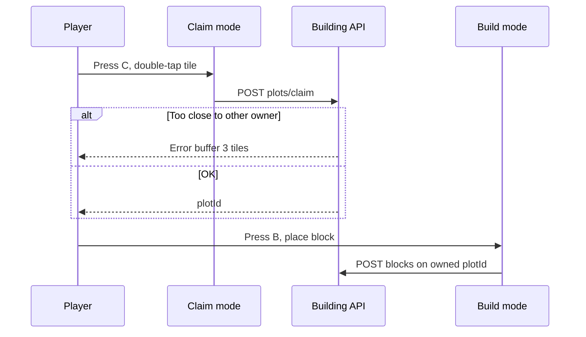
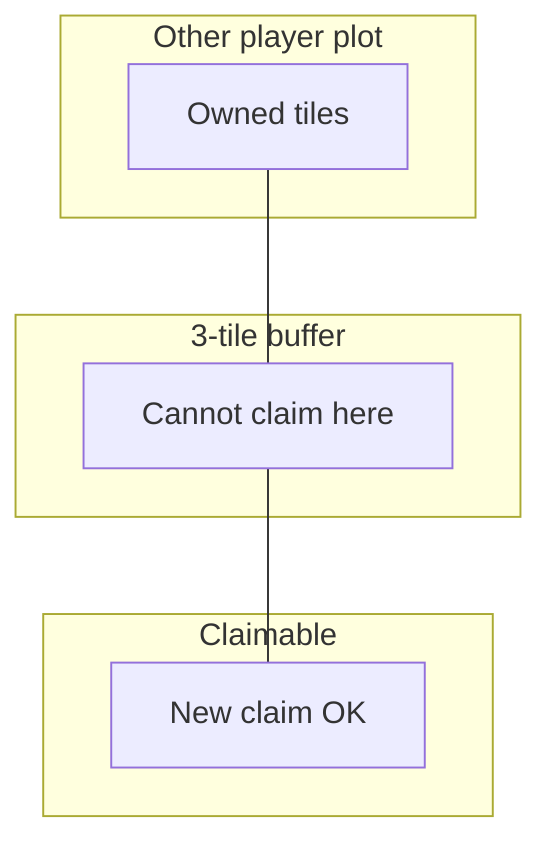

# Building mechanics and gameplay

How claiming land and placing blocks works.

## Player-facing loop



## Default limits

| Limit                    | Value   | Notes                              |
| ------------------------ | ------- | ---------------------------------- |
| Owned plots (aggregates) | **1**   | Increase via user profile later    |
| Permanent tile claims    | **64**  | Each claim can be 1×1 tile plot    |
| Temporary tiles          | **5**   | Short-lived claims                 |
| Blocks per plot          | **256** | Hard cap on placements             |
| Registry listing cap     | **512** | Max plots in one registry response |

Per-user overrides: `GET /owner-limits` reads `user_profile.world_plot_max_count` and `world_tile_claim_max_count`.

## Claim rules

### Eligibility

A tile claim succeeds when **all** pass:

1. User signed in to Reddit
2. Tile not already inside any plot bounds
3. Chebyshev distance to **other owners'** plot bounds ≥ **3**
4. Under permanent (**64**) or temporary (**5**) cap

### Claim request

```json
{ "tileX": number, "tileY": number, "isTemporary": boolean }
```

Server creates:

```
min_tile_x = max_tile_x = tileX
min_tile_y = max_tile_y = tileY
```

### Unclaim

`DELETE /plots/:plotId` — owner only; deletes all blocks on plot from Redis.

## Build rules

- Place only on plots you own (`owner_id` match)
- Tile must fall inside plot bounds
- Block count on plot ≤ **256**
- Blocks stored with `definitionId`, `tile_x/y`, `world_layer`, optional `metadata`

Collision and stack rules: `resolvingWorldBuildingCollision.ts`.

## Build and claim modes

| Mode  | Key   | Purpose                                                 |
| ----- | ----- | ------------------------------------------------------- |
| Build | **B** | Place/remove blocks, campfire utility, wood floors      |
| Claim | **C** | Sidebar plot list, claim/unclaim, teleport to own plots |

Claim sidebar shows capacity badges for plots (**orange**) and tiles (**sky**). At-max limits turn **amber**.

## Neighbor buffer (diagram)



Distance = Chebyshev from tile to nearest point on other plot rectangle.

## Realtime sync

Supabase Realtime topic prefix `world-building-plot` notifies clients of block changes in the room.

TanStack Query keys:

- `world-building-plots`
- `world-building-placed-blocks`
- `world-building-plots-registry`

## Cross-system effects

| Placement           | Effect                                                                             |
| ------------------- | ---------------------------------------------------------------------------------- |
| `basic:floor:wood`  | Campfire fuel within **2** tiles ([fire](../fire/))                                |
| `utility:campfire`  | Ignite with wood; **72°C** when lit ([environment](../environment/))               |
| `utility:ice-block` | **−22°C**; freezes surface water in neighbor ring ([environment](../environment/)) |
| Wooden door/sign    | Fuel wood + flammable ([fire](../fire/))                                           |

## Design knobs

| Knob            | Location                                                          |
| --------------- | ----------------------------------------------------------------- |
| Default caps    | `definingWorldBuildingPlotConstants.ts`, `worldBuildingDevvit.ts` |
| Buffer distance | `OTHER_OWNER_MIN_CLAIM_DISTANCE_TILES`                            |
| Mode hotkeys    | `BUILD_MODE_TOGGLE_KEY`, `CLAIM_MODE_TOGGLE_KEY`                  |
| Block cap       | `PLOT_MAX_BLOCK_COUNT`                                            |

## Edge cases

- **Sign in required**: All plot APIs return 401 without Reddit user.
- **Visit friend plot**: Claim UI offers visit request button (disabled when unavailable).
- **Temporary expiry**: `expires_at` on row; server may prune (check route logic).
- **SP without online room**: Building APIs require online room scope.
