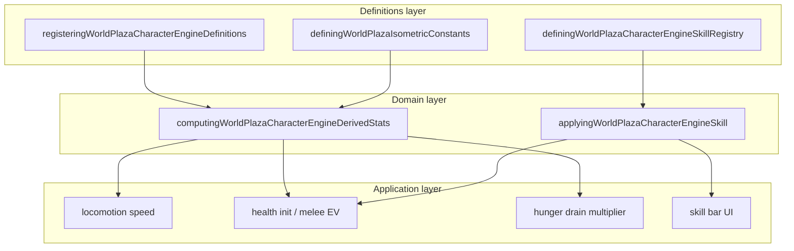

# Characters bounded context (DDD)

|                  |            |
| ---------------- | ---------- |
| **Version**      | 1.0.0      |
| **Last updated** | 2026-07-08 |

Plaza **characters** is a bounded context in the **Player Avatar** subdomain. Each playable skin is a declarative definition consumed by movement, health, hunger, and skill systems.

## Docs in this folder

| File | Purpose |
| ---- | ------- |
| [glossary.md](./glossary.md) | Ubiquitous language: terms every contributor should use the same way |
| [mechanics.md](./mechanics.md) | How skins feel in play and how stats resolve at runtime |
| [catalog.md](./catalog.md) | Every skin, skill, and exact code touchpoints |

## DDD map

### Bounded context

**Plaza Playable Characters** — declarative avatar definitions: vitals, combat stats, locomotion overrides, environmental immunities, hunger metabolism, and cooldown skill ids.

Touches **Combat** (attack power, defense, max HP), **Movement/Stamina** (walk/run speed, jump scale), **Hunger** (drain multiplier), **Buffs** (skill-applied buffs), and **Environment** (heat/cold immunity flags). Does not own skin sprite assets or animation clip registration.

### Aggregates

| Aggregate | Root | Responsibility |
| --------- | ---- | -------------- |
| **Character definition** | `DefiningWorldPlazaCharacterEngineDefinition` | Static catalog entry per skin |
| **Skill definition** | `DefiningWorldPlazaCharacterEngineSkillDefinition` | Cooldown ability with typed effect |

Runtime health state is **not** owned here; character definitions seed initial max HP and regen into the entity health aggregate ([combat](../combat/)).

### Value objects

- `DefiningWorldPlazaCharacterEngineId` — stable string (matches skin id for players)
- `DefiningWorldPlazaCharacterEngineImmunity` — `heat | cold | poison | bleed | fall | lava`
- Level scaling block — `healthPerLevel`, `attackPerLevel`, `defensePerLevel`
- `ComputingWorldPlazaCharacterEngineDerivedStats` — effective stats after level math

### Domain services (pure)

| Service | File |
| ------- | ---- |
| Derive effective stats | `computingWorldPlazaCharacterEngineDerivedStats.ts` |
| Grid speed → screen px | `convertingWorldPlazaCharacterEngineGridSpeedToScreenSpeedPerSecond` |
| Apply skill | `applyingWorldPlazaCharacterEngineSkill.ts` |

### Application layer

| Use case | Entry |
| -------- | ----- |
| Skin select / spawn | character engine init on plaza load |
| Skill hotkey | skill UI + `applyingWorldPlazaCharacterEngineSkill.ts` |
| Melee EV | attack pipeline reads `attackPower` |
| Movement speed | locomotion reads derived walk/run speeds |

### Infrastructure

| Concern | File |
| ------- | ---- |
| Skin id constants | `definingWorldPlazaAvatarSkinConstants.ts` |
| Multiplayer sync | avatar `skinId` in online payload |
| Animation clips | per-skin motion registration (Girl Sample combat clips) |

### Declarative registries (source of truth)

| Registry | File |
| -------- | ---- |
| Character definitions | `registeringWorldPlazaCharacterEngineDefinitions.ts` |
| Skills | `definingWorldPlazaCharacterEngineSkillRegistry.ts` |
| Default grid speeds | `definingWorldPlazaIsometricConstants.ts` (walk **2**, run **3**) |

## Layer diagram

## How to add a new playable skin

1. **Skin id** — add constant in `definingWorldPlazaAvatarSkinConstants.ts`.
2. **Definition** — add block in `registeringWorldPlazaCharacterEngineDefinitions.ts` (vitals, stats, locomotion, immunities, `skillIds`).
3. **Animation** — register walk/run/jump clips for the skin asset folder.
4. **Combat motion** (if roll/melee) — optional clip suffixes like Girl Sample.
5. **Skills** — reference existing skill ids or add new entries in skill registry + buff registry.
6. **Verify** — `npm run test -- registeringWorldPlazaCharacterEngineDefinitions` (if tests exist).
7. **Docs** — update [catalog.md](./catalog.md) and [glossary.md](./glossary.md).

## Related AI references

- Engine wiring: [memory/game-engines-reference.md](../../../memory/game-engines-reference.md) (Character engine)
- Tuning numbers: [memory/game-mechanics-reference.md](../../../memory/game-mechanics-reference.md) (section 8)
- Combat vitals: [combat](../combat/) bounded context
- Movement speeds: [movement-stamina](../movement-stamina/) bounded context
