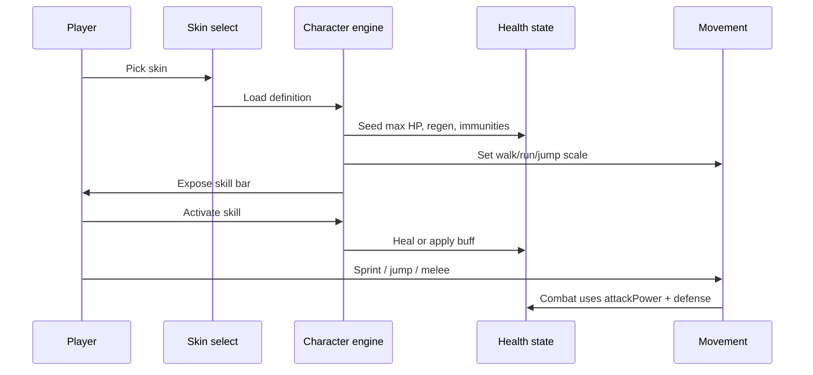
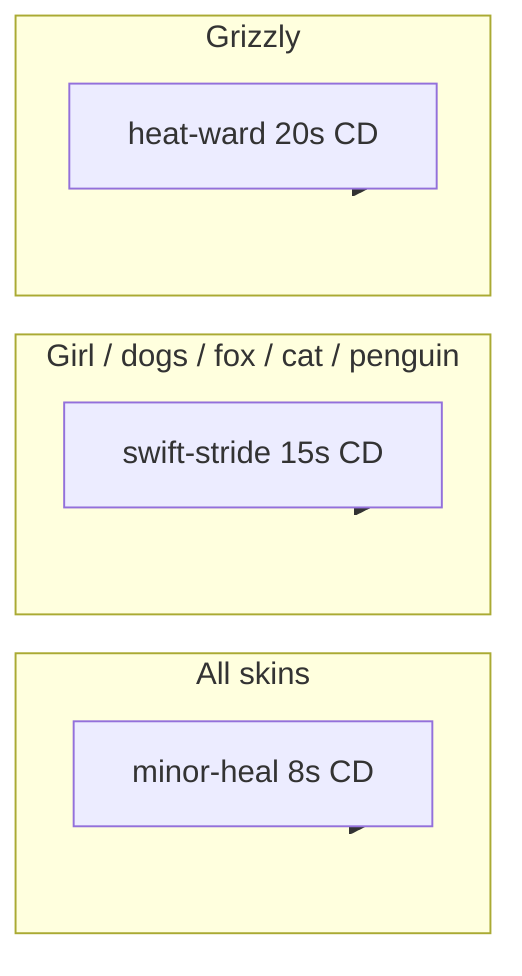

# Characters mechanics and gameplay

How playable skins feel in play and how the character engine resolves stats.

## Player-facing loop



## Skin selection

Seven playable skins are registered. `girl-sample` is the fallback when an unknown id is requested.

Each skin packages:

- **Vitals** — max HP and optional regen override
- **Combat stats** — attack power, attack speed, defense
- **Locomotion** — optional walk/run speed and jump scale
- **Metabolism** — hunger drain multiplier
- **Immunities** — spawn-time environmental/status flags
- **Skills** — ordered cooldown ability ids

Full per-skin numbers: [catalog.md](./catalog.md).

## Derived stats at level 1

`computingWorldPlazaCharacterEngineDerivedStats` computes runtime values:

```
effectiveMaxHealth = baseMaxHealth + healthPerLevel × (level − 1)
attackPower        = attackPower + attackPerLevel × (level − 1)
defense            = defense + defensePerLevel × (level − 1)
walkSpeed          = locomotion.walkSpeed ?? 2 grid/s
runSpeed           = locomotion.runSpeed ?? 3 grid/s
healthRegen        = vitals.healthRegenPerSecond ?? 2 HP/s
```

Attack speed floors at **0.25×** baseline strip timing.

## Combat contribution

| Stat                 | Combat use                                                                                   |
| -------------------- | -------------------------------------------------------------------------------------------- |
| `attackPower`        | Player melee EV before damage roll (**300** at level 1 for all skins) ([combat](../combat/)) |
| `attackSpeed`        | Melee animation speed multiplier                                                             |
| `defense`            | Flat mitigation on incoming hits                                                             |
| `effectiveMaxHealth` | HP bar max; scales bleed/poison % pools                                                      |
| Immunities           | Skip corresponding damage or status application                                              |

Player melee and projectile hits on wildlife always use EV rolls (`skipDamageRoll: false`). Grizzly is the heavy tank (**1400** HP, **10** def, bleed immune). Orange Cat is the glass striker (**880** HP, **3** def, **1.15×** attack speed).

## Movement contribution

| Skin archetype                      | Walk    | Run         | Jump scale      |
| ----------------------------------- | ------- | ----------- | --------------- |
| Default (Girl, Golden Retriever)    | **2**   | **3**       | **1**           |
| Fast (Husky, Fox Peach, Cat Orange) | **2**   | **3.2–3.5** | **1** / **1.1** |
| Slow tank (Grizzly)                 | **1.8** | **2.6**     | **0.9**         |
| Small (Penguin)                     | **1.6** | **2.2**     | **1**           |

Speed feeds into [movement-stamina](../movement-stamina/) sprint and hunger/frost modifiers stack on top.

## Metabolism (hunger drain multiplier)

| Multiplier | Skin                              | Effect                |
| ---------- | --------------------------------- | --------------------- |
| **0.85**   | Penguin                           | **−15%** hunger drain |
| **0.9**    | Orange Cat                        | **−10%** hunger drain |
| **1**      | Girl, Golden Retriever, Fox Peach | Normal drain          |
| **1.15**   | Husky                             | **+15%** hunger drain |
| **1.3**    | Grizzly                           | **+30%** hunger drain |

Applied by hunger tick via character-derived multiplier ([hunger](../hunger/)).

## Immunities in play

| Skin           | Immunities | Player feel                             |
| -------------- | ---------- | --------------------------------------- |
| Husky, Penguin | `cold`     | No frost slow, no cold climate DoT      |
| Grizzly        | `bleed`    | Wildlife bleed procs ignored            |
| All others     | —          | Standard environmental and status rules |

Heat Ward (Grizzly skill) toggles `heat-immunity-buff` for heat DoT immunity on demand.

## Skills

Three skills exist globally; each skin references a subset at spawn.

### `minor-heal`

- **120** HP flat heal (`healing` kind)
- Cooldown **8s**
- Icon: heart-plus
- Available on all seven skins

### `swift-stride`

- Applies `swift-stride-buff`: **+20%** movement speed for **60s**
- Cooldown **15s**
- Available on all skins except Grizzly

### `heat-ward`

- Applies toggle `heat-immunity-buff` (heat damage immunity)
- Cooldown **20s**
- Grizzly only (replaces swift-stride slot)



## Size and collision

`sizeScale` multiplies sprite presentation and default collision radius (base player radius × scale). Grizzly at **1.25** is the largest hitbox; Penguin at **0.9** is the smallest.

## HUD and teaching surfaces

| Surface               | Content                        |
| --------------------- | ------------------------------ |
| Skin picker           | Display names from definitions |
| Skill bar             | Icons from skill registry      |
| Home mechanics        | Character summary cards        |
| Tutorial survival tab | Skill and immunity callouts    |

## Design knobs (balance)

| Knob                       | Location                                                        |
| -------------------------- | --------------------------------------------------------------- |
| Per-skin vitals/stats      | `registeringWorldPlazaCharacterEngineDefinitions.ts`            |
| Skill heal amount / CD     | `definingWorldPlazaCharacterEngineSkillRegistry.ts`             |
| Swift stride buff strength | `definingWorldPlazaEntityBuffRegistry.ts` (`swift-stride-buff`) |
| Default walk/run           | `definingWorldPlazaIsometricConstants.ts`                       |
| Level scaling              | `scaling` block per character definition                        |

## Failure and edge cases

- **Unknown skin id**: Falls back to Girl Sample definition.
- **Skill on cooldown**: UI disabled; no effect fired.
- **Heal at full HP**: Heal still applies but clamps at max.
- **Bleed immune**: Bleed stacks do not increment; on-hit bleed procs from wildlife are dropped.
- **Cold immune**: Frost movement multiplier treated as **1** regardless of temperature.
