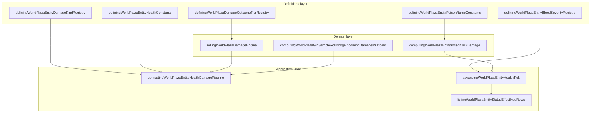

# Combat bounded context (DDD)

|                  |            |
| ---------------- | ---------- |
| **Version**      | 1.0.0      |
| **Last updated** | 2026-07-08 |

Plaza **combat** is a bounded context inside the **Entity Health** subdomain. It covers damage rolls, vitals tuning, shield absorption, DoT pools (bleed/poison), incapacitation (sleep/stun), and environmental hazard damage applied to the player health aggregate.

## Docs in this folder

| File | Purpose |
| ---- | ------- |
| [glossary.md](./glossary.md) | Ubiquitous language: terms every contributor should use the same way |
| [mechanics.md](./mechanics.md) | Player-facing combat loop and the runtime damage pipeline |
| [catalog.md](./catalog.md) | Damage tiers, damage kinds, incapacitation constants, roll dodge params |

## DDD map

### Bounded context

**Plaza Entity Combat** — statistical damage rolls, health vitals, shield, bleed/poison escalation, sleep/stun incapacitation, fall/lava/climate damage, and projectile hits against the local player health state.

Touches **Characters** (attack power, defense), **Movement/Stamina** (roll dodge mitigation), **Buffs** (damage roll modifiers), **Wildlife** (on-hit procs), **Disease** (symptom grants), and **Environment** (temperature hazards). Does not own wildlife AI or melee swing animation wiring.

### Aggregates

| Aggregate | Root | Responsibility |
| --------- | ---- | -------------- |
| **Player health** | `DefiningWorldPlazaEntityHealthState` | HP, shield, DoT pools, incapacitation effects, damage roll modifiers |
| **Damage outcome tier** | `DefiningWorldPlazaDamageOutcomeTierDescriptor` | Static tier thresholds, float styling, dev forced-roll metadata |
| **Damage kind** | `DefiningWorldPlazaEntityDamageKindDescriptor` | Per-source roll rules, shield absorption, float icons |

A **bleed stack** or **poison pool** is not its own aggregate root. Each lives inside player health and references severity/potency descriptors.

### Value objects

- `DefiningWorldPlazaDamageOutcomeTier` — `fatal | lethal | critical | normal | true_strike | softened | blocked | dodged`
- `DefiningWorldPlazaEntityDamageKind` — `physical`, `fall`, `toxic`, `bleeding`, `potential_damage`, etc.
- Deviation score (σ) — standard deviations from expected damage before tier classification
- Expected damage (EV) — mean instant hit before roll spread

### Domain services (pure)

| Service | File |
| ------- | ---- |
| Roll damage | `rollingWorldPlazaDamageEngine.ts` |
| Classify tier | `classifyingWorldPlazaDamageOutcomeTierFromRegistry` in tier registry |
| Poison tick damage | `computingWorldPlazaEntityPoisonTickDamage.ts` |
| Roll dodge multiplier | `computingWorldPlazaGirlSampleRollDodgeIncomingDamageMultiplier.ts` |

### Application layer

| Use case | Entry |
| -------- | ----- |
| Apply instant hit | `computingWorldPlazaEntityHealthDamagePipeline` (health engine) |
| Health frame tick | `advancingWorldPlazaEntityHealthTick.ts` |
| HUD status rows | `listingWorldPlazaEntityStatusEffectHudRows.ts` |
| Float text | `renderingWorldPlazaEntityHealthFloatText.tsx` |
| Player death cleanup | `clearingWildlifeAreaOnPlayerDeath.ts` |

### Infrastructure

| Concern | File |
| ------- | ---- |
| Multiplayer health sync | `src/shared/plazaDevvitOnline.ts` (HP, shield, invincibility) |
| Save slot conditions | `serializingWorldPlazaPlayerConditions.ts` |

### Declarative registries (source of truth)

| Registry | File |
| -------- | ---- |
| Health constants | `definingWorldPlazaEntityHealthConstants.ts` |
| Damage outcome tiers | `definingWorldPlazaDamageOutcomeTierRegistry.ts` |
| Damage kinds | `definingWorldPlazaEntityDamageKindRegistry.ts` |
| Bleed severity | `definingWorldPlazaEntityBleedSeverityRegistry.ts` |
| Bleed stack escalation | `definingWorldPlazaEntityBleedStackConstants.ts` |
| Poison ramp | `definingWorldPlazaEntityPoisonRampConstants.ts` |
| Sleep / stun defaults | `definingWorldPlazaEntitySleepConstants.ts`, `definingWorldPlazaEntityStunConstants.ts` |
| Projectile archetypes | `definingWorldPlazaProjectileArchetypeRegistry.ts` |

## Layer diagram

## How to add a new damage source

1. **Kind** — add id to the union and a descriptor block in `definingWorldPlazaEntityDamageKindRegistry.ts` (`usesDamageRoll`, `expectedDamageInput`, float styling).
2. **EV** — caller passes `rawAmount` as flat EV or max-health percent per descriptor.
3. **Roll** — if `usesDamageRoll: true`, pipeline calls `rollingWorldPlazaDamageEngine` with SD = max(1, EV × 0.2).
4. **Shield** — only `physical` absorbs shield points (`shouldWorldPlazaEntityDamageKindAbsorbShield`).
5. **Buff modifiers** — wire `damageRollModifiers` or `incomingDamageModifiers` in buff registry if needed.
6. **Verify** — `npm run test -- rollingWorldPlazaDamageEngine`.

No changes needed to tier classification when reusing existing roll modes and deviation thresholds.

## Related AI references

- Engine wiring: [memory/game-engines-reference.md](../../../memory/game-engines-reference.md) (Entity health, damage roll, projectile engines)
- Tuning numbers: [memory/game-mechanics-reference.md](../../../memory/game-mechanics-reference.md) (sections 3–4)
- Roll dodge presentation: [movement-stamina](../movement-stamina/) bounded context
- Buff damage modifiers: [buffs](../buffs/) bounded context
