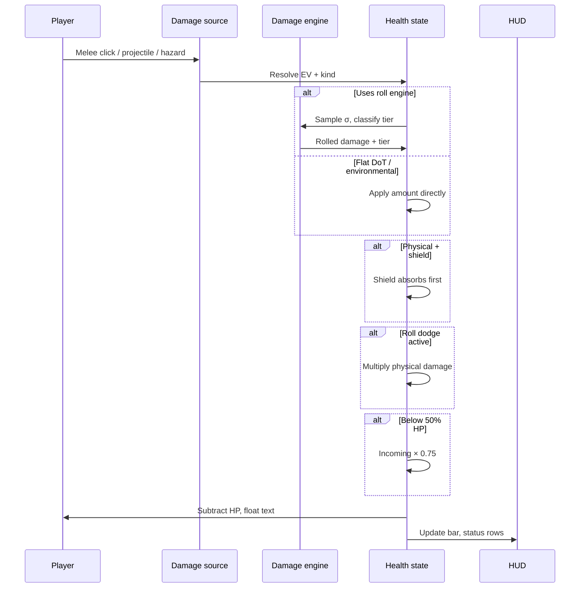
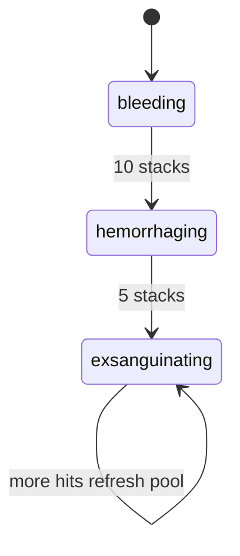

# Combat mechanics and gameplay

How combat feels in play and how the runtime executes damage.

## Player-facing loop

## Instant damage roll pipeline

### 1. Resolve expected damage

Caller supplies `rawAmount` and `damageKind`. The kind descriptor decides:

- Whether the roll engine runs (`usesDamageRoll`)
- How `rawAmount` maps to EV (`flat_ev` or `max_health_percent_ev`)

Kinds using the roll engine: `physical`, `fall`, `potential_damage`, `soulbreak`.

### 2. Sample deviation

`rollingWorldPlazaDamageEngine` draws a deviation score from a (optionally skewed) normal distribution:

- **SD** = max(**1**, EV × **0.2**)
- **Luck** skew in [−1, 1] biases toward high or low tiers
- **deviationBiasShift** nudges σ before damage math (buffs/debuffs)
- **lock_in** mode forces `true_strike` at exact EV
- **chaotic** mode favors extreme σ buckets for special encounters

Rolled damage = max(0, EV + σ × SD). Lower bound is zero; upper tail is unbounded.

### 3. Classify tier

`classifyingWorldPlazaDamageOutcomeTierFromRegistry` maps final σ to a float tier. See [catalog.md](./catalog.md) for thresholds.

### 4. Apply mitigation stack

Order of player-side reduction (conceptual):

1. Shield absorption (`physical` only)
2. Roll dodge multiplier ([movement-stamina](../movement-stamina/))
3. Incoming damage buff modifiers ([buffs](../buffs/))
4. Low-health bonus (× **0.75** incoming below **50%** HP)
5. Defense stat from character engine ([characters](../characters/))

## Player health baseline

| Knob                     | Value                    |
| ------------------------ | ------------------------ |
| Base max HP              | **1000**                 |
| Regen rate               | **2 HP/s**               |
| Regen delay after hit    | **5s**                   |
| Low HP threshold         | **50%**                  |
| Low HP damage multiplier | **0.75** (25% reduction) |
| DoT tick interval        | **1s**                   |
| Respawn invincibility    | **10s**                  |

Per-skin overrides (Grizzly **1400** HP, **2.5** regen/s) live in [characters/catalog.md](../characters/catalog.md).

Initial health (`DEFINING_WORLD_PLAZA_ENTITY_HEALTH_INITIAL_STATE`) starts with empty `healBlockModifiers` and `frostbite: null`. Cold exposure fills the frostbite meter; Necrotic stage can push heal-block modifiers. Full stage table: [frostbite](../frostbite/).

## Fall, lava, and climate

| Hazard          | Rule                                                        |
| --------------- | ----------------------------------------------------------- |
| Fall            | No damage for ≤ **5** layer drop; **15 HP** per extra layer |
| Lava entry      | **15** instant damage                                       |
| Lava standing   | **25 HP/s**                                                 |
| Heat climate    | **8 HP/s** when temp ≥ **0.72**                             |
| Cold climate    | **6 HP/s** when temp ≤ **0.3**                              |
| Lava tile noise | Sparse placement above **0.82** noise threshold             |

Fall damage uses the roll engine (`fall` kind). Environmental DoT kinds skip rolls.

## Melee and projectiles

### Player combat lock-on

Clicking a live animal locks combat on that instance:

1. **Chase** — if out of melee reach (**1.8** grid), the avatar runs toward the target and replans the path as it moves.
2. **Auto-melee** — once in reach, swings repeat automatically (rooted during each strip). Damage still lands at strip end.
3. **Cancel** — click empty ground, another interactable, a corpse, open chat, die, or dismiss a docile **Betray?** dialog. Clicking a different animal switches the lock.
4. **Crosshair** — locked target shows a small amber ring+ticks marker; hovering a live animal uses the native CSS `crosshair` cursor.

Tuning: `definingWorldPlazaPlayerCombatLockConstants.ts`. Tick resolver: `resolvingWorldPlazaPlayerCombatLockTick.ts`. Marker: `renderingWorldPlazaPlayerCombatLockCrosshair.tsx`. Wired in `renderingWorldPlazaPixiScene.tsx`.

Docile wildlife still shows **Betray?** before the first damage (then **Betraying....** windup). Auto-swing **holds** while confirm/windup is pending (`isDocileConfirmPending`); cancel clears the lock.

### Damage and wildlife melee

- Player melee EV comes from character `attackPower` (**300** at level 1) and always rolls through the EV damage engine (`resolvingWildlifePlayerOutgoingPhysicalDamageOptions.ts`), never flat fixed damage ([characters](../characters/)).
- **Connected-hit floor:** player melee and projectile hits on wildlife set `minimumOutcomeTier: 'normal'`. Soften / block / dodge miss floats never show on a connect; damage is floored to at least EV. Crit and higher still roll normally.
- **Spatial Miss float:** gray `Miss` text (`float kind: miss`) when:
  - Melee swing start is out of reach (**1.8** grid) → float on the wildlife
  - Jump-dodgeable projectile passes under an airborne player → float on the player
- **Exceptions (floor skipped):** forced deviation / roll mode (sleep ambush lethal, Ultra Instinct dodge, True Strike `lock_in`, dev forced tiers). Player roll-dodge still mitigates damage without a Miss float.
- **Equipped attack EV:** swing EV = character `attackPower` modified by the selected hotbar item's equipment capabilities (`resolvingWorldPlazaEquippedAttackEv` in the Pixi scene). Prefer `attackEvModifier` (`additive` = base + value, `multiplicative` = base × value). Legacy `meleeDamageMultiplier` still maps to multiplicative attack EV. Tiered swords ship **1.0–1.45×** via `definingWorldPlazaToolTierConstants.ts`. Unarmed (empty / non-weapon slot) uses base attack EV unchanged.
- **Multiplier-only helper:** `resolvingWorldPlazaEquippedMeleeDamageMultiplier.ts` returns the multiplicative factor when the modifier is multiplicative; additive modifiers return **1** there (callers that need full EV must use `resolvingWorldPlazaEquippedAttackEv`).
- **Defense EV modifier:** `defenseEvModifier` is declared on equipment capabilities and shown in item info; it is **not** applied in the incoming-damage pipeline yet.
- **Sword durability:** each completed swing that applies damage wears the equipped sword (`wearingWorldPlazaEquippedInventoryToolDurability`, tool kind `sword`). Held sword overlay stays visible during body melee strips (no separate weapon swing sheet).
- Wildlife melee range **1.1** grid (`definingWildlifeAggroConstants.ts`).
- Example projectile `arrow-straight`: **12** EV `physical`, **9** grid/s, jump-dodgeable, **4s** lifetime.
- Wildlife on-hit player procs: per-species bleed/poison/buff via `resolvingWildlifeSpeciesOnHitPlayerProcs.ts`; flat EV = max(**4**, meleeDamage × **0.25**).

## Bleed escalation

Repeat bleed hits add stacks on the active severity tier:

| Severity       | Duration | Pool % max HP |
| -------------- | -------- | ------------- |
| bleeding       | **60s**  | **5%**        |
| hemorrhaging   | **30s**  | **10%**       |
| exsanguinating | **10s**  | **25%**       |

Each tier also applies a flat hit component on application. Damage kind escalates with severity (`bleeding` → `hemorrhaging` → `exsanguinating`).

## Poison ramp

Poison pools drain over time with a front-loaded curve (`definingWorldPlazaEntityPoisonRampConstants.ts`):

| Time share    | Damage share    |
| ------------- | --------------- |
| First **50%** | **15%** of pool |
| Next **35%**  | **35%** of pool |
| Final **15%** | **50%** of pool |

Minimum tick damage: **1** while the pool is active. Potency lanes (`toxic`, `venomous`, `lethal`) use separate HUD styling.

## Incapacitation

### Sleep

- Default duration **8s** (`sleep-debuff` registry entry)
- Locks movement and all actions
- Presentation: slow death-strip fall to the ground (**6** fps), then wildlife-style **Zzz** speech bubbles above the avatar
- **Any damage wakes** the player and adds **30** bonus wake damage on that hit
- Disease grants and wildlife ambush can apply sleep ([disease](../disease/), [wildlife](../wildlife/))

### Stun

- Default duration **4s** (`stun-debuff` registry entry)
- Locks movement and all actions
- Presentation: avatar wobble (**0.12** rad max, **7** rad/s), **4** gold orbit dots

Neither sleep nor stun pauses other DoT timers.

## Player death

When HP reaches zero:

- Death float and per-kind death screen title fire
- Death overlay shows Souls-style framed title plus fixed Manus flavor: *Your soul is with Manus. He will reforge you for the climb.* (`definingWorldPlazaEntityDeathScreenConstants.ts`)
- Wildlife in simulation radius despawn (`clearingWildlifeAreaOnPlayerDeath.ts`)
- Threat state cleared elsewhere in the wildlife engine
- Transient buffs, debuffs, disease, and DoT wipe on revive (`revivingWorldPlazaEntityHealthToFull`)
- Respawn grants **10s** invincibility

## HUD and teaching surfaces

| Surface              | Builder                                                          |
| -------------------- | ---------------------------------------------------------------- |
| Health bar           | Entity health HUD push every **100ms** (epsilon **0.005** ratio) |
| Status rows          | `listingWorldPlazaEntityStatusEffectHudRows.ts` (includes frostbite) |
| Combat floats        | Tier styling from damage outcome tier registry                   |
| Home mechanics panel | `definingPlazaMechanicsConstants.ts`, tutorial combat tab        |

## Design knobs (balance)

| Knob                        | Location                                                                                          |
| --------------------------- | ------------------------------------------------------------------------------------------------- |
| Tier σ thresholds           | `definingWorldPlazaDamageOutcomeTierRegistry.ts`                                                  |
| Roll SD ratio / min SD      | `rollingWorldPlazaDamageEngine.ts`                                                                |
| Max HP / regen / fall rules | `definingWorldPlazaEntityHealthConstants.ts`                                                      |
| New damage source behavior  | `definingWorldPlazaEntityDamageKindRegistry.ts`                                                   |
| Bleed severity timing       | `definingWorldPlazaEntityBleedSeverityRegistry.ts`                                                |
| Bleed stack counts          | `definingWorldPlazaEntityBleedStackConstants.ts`                                                  |
| Poison ramp curve           | `definingWorldPlazaEntityPoisonRampConstants.ts`                                                  |
| Sleep / stun duration       | `definingWorldPlazaEntitySleepConstants.ts`, `definingWorldPlazaEntityStunConstants.ts`           |
| Roll dodge strength         | `definingWorldPlazaGirlSampleCombatMotionConstants.ts` ([movement-stamina](../movement-stamina/)) |

## Failure and edge cases

- **Zero EV**: Roll engine returns **0** damage, `normal` tier, no float spread.
- **True strike**: `lock_in` mode bypasses RNG; used by buffs that guarantee EV.
- **Connected-hit floor**: `minimumOutcomeTier` raises miss-like rolls to the floor tier at EV; skipped when forced σ / roll mode is set.
- **Spatial Miss**: gray `Miss` float for out-of-reach melee start (`enqueueingWildlifeMissFloatFeedback`) and jump-dodged projectiles (`resolvingWorldPlazaProjectileMissReason` → `missEvents`).
- **Shield overflow**: Physical damage beyond shield hits HP normally.
- **Sleep wake**: Wake hit includes bonus **30** before other mitigations on that strike.
- **Stacking bleed**: Same-tier hits refresh pool and increment stack counter toward escalation.
- **Offline regen**: Health regen pauses with combat; diseases use wall-clock separately ([disease](../disease/)).
