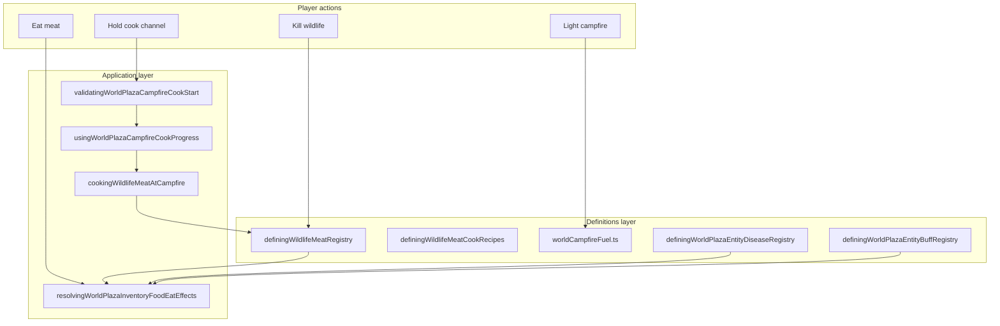

# Cooking and campfire bounded context (DDD)

|                  |            |
| ---------------- | ---------- |
| **Version**      | 1.0.0      |
| **Last updated** | 2026-07-09 |

Plaza **cooking-campfire** bridges wildlife loot, campfire fuel, timed cook channels, and the inventory eat pipeline (hunger, disease, well-fed buffs).

## Docs in this folder

| File                           | Purpose                                                              |
| ------------------------------ | -------------------------------------------------------------------- |
| [glossary.md](./glossary.md)   | Ubiquitous language for meat rows, cook channels, fuel, and warmth   |
| [mechanics.md](./mechanics.md) | Player-facing cook loop, fuel tiers, tile warmth, eat outcomes       |
| [catalog.md](./catalog.md)     | Every meat row: hunger, disease, well-fed, cook time, prion residual |

## DDD map

### Bounded context

**Plaza Campfire Cooking**: convert raw wildlife meat into cooked cuts at lit campfires; declare per-species hunger ratios, cook durations, disease odds, and well-fed rewards.

Touches **Wildlife** (loot source), **Inventory/Food** (eat and bag space), **Disease** (raw and residual infection), **Fire** (ignite, refuel, burn cells), **Buffs** (well-fed-\* rewards), and **Environment** (campfire tile warmth).

### Aggregates

| Aggregate              | Root                                    | Responsibility                                                                  |
| ---------------------- | --------------------------------------- | ------------------------------------------------------------------------------- |
| **Meat catalog entry** | `DefiningWildlifeMeatCatalogEntry`      | Per-species raw/cooked ids, hunger ratios, disease and buff odds, cook duration |
| **Campfire fire cell** | `WorldFireDevvitCell` (kind `campfire`) | Lit state, fuel remaining, tile position                                        |
| **Player inventory**   | `DefiningInventoryState`                | Raw meat consumed, cooked meat added                                            |

Cook progress is a short-lived timed interaction snapshot, not a persisted aggregate.

### Value objects

- `DefiningWildlifeMeatCookRecipe`: `{ rawItemTypeId, cookedItemTypeId, cookDurationMs }`
- `WorldCampfireBurnTier`: `weak | small | mid | big` from nearby placed wood
- Hunger restore **ratio**: fraction of player max hunger (see [inventory-food](../inventory-food/) and [hunger](../hunger/))
- Disease id + chance pairs: raw contract and optional cooked residual

### Domain services (pure)

| Service                    | File                                                                  |
| -------------------------- | --------------------------------------------------------------------- |
| Meat row lookup            | `definingWildlifeMeatRegistry.ts`                                     |
| Cook recipe lookup         | `definingWildlifeMeatCookRecipes.ts`                                  |
| Fuel ms from wood count    | `computingWorldCampfireFuelMsFromWoodCount` in `worldCampfireFuel.ts` |
| Burn tier from placed wood | `resolvingWorldCampfireBurnTierFromNearbyWoodCount`                   |
| Eat side effects           | `resolvingWorldPlazaInventoryFoodEatEffects.ts`                       |

### Application layer

| Use case                   | Entry                                                |
| -------------------------- | ---------------------------------------------------- |
| Validate cook start        | `validatingWorldPlazaCampfireCookStart.ts`           |
| Cook channel progress      | `usingWorldPlazaCampfireCookProgress.ts`             |
| Complete cook (swap items) | `cookingWildlifeMeatAtCampfire.ts`                   |
| Campfire UI labels         | `renderingWorldPlazaCampfireInteractionLabels.tsx`   |
| Scene wiring               | `renderingWorldPlazaPixiScene.tsx`                   |
| Register inventory items   | `registeringWorldPlazaWildlifeMeatInventoryItems.ts` |

### Infrastructure

| Concern                | File                                           |
| ---------------------- | ---------------------------------------------- |
| Shared fuel constants  | `src/shared/worldCampfireFuel.ts`              |
| Fire cells / ignite    | `src/client/world/fire/`                       |
| Campfire warmth (72°C) | `definingWorldPlazaTemperatureConstants.ts`    |
| Item descriptions      | `definingWildlifeMeatItemDescriptionCorpus.ts` |

### Declarative registries (source of truth)

| Registry               | File                                                     |
| ---------------------- | -------------------------------------------------------- |
| Meat catalog (11 rows) | `definingWildlifeMeatRegistry.ts`                        |
| Cook recipes (derived) | `definingWildlifeMeatCookRecipes.ts`                     |
| Well-fed buffs         | `definingWorldPlazaEntityBuffRegistry.ts` (`well-fed-*`) |
| Disease definitions    | `definingWorldPlazaEntityDiseaseRegistry.ts`             |

## Layer diagram

## How to add a new meat type

1. **Meat row**: add entry to `definingWildlifeMeatRegistry.ts` (ids, hunger ratios, disease, well-fed, cook duration).
2. **Disease** (if new): add descriptor in `definingWorldPlazaEntityDiseaseRegistry.ts`; update [disease catalog](../disease/catalog.md).
3. **Well-fed buff** (if new): add `well-fed-*` in `definingWorldPlazaEntityBuffRegistry.ts`.
4. **Inventory**: register items in `registeringWorldPlazaWildlifeMeatInventoryItems.ts`.
5. **Copy**: optional flavor in `definingWildlifeMeatItemDescriptionCorpus.ts`.
6. **Species loot**: wire `loot` via species registry (auto from meat row).
7. **Verify**: `npm run test -- definingWildlifeMeatRegistry`.
8. **Docs**: update [catalog.md](./catalog.md), [wildlife catalog](../wildlife/catalog.md), [disease catalog](../disease/catalog.md).

Cook recipe and validate/complete paths pick up new rows automatically via `DEFINING_WILDLIFE_MEAT_COOK_RECIPES`.

## Related AI references

- Wildlife loot: [wildlife](../wildlife/)
- Disease pipeline: [disease](../disease/)
- Eat hunger math: [inventory-food](../inventory-food/)
- Ignite and spread: [fire](../fire/)
- Tile warmth: [environment](../environment/)
- Tuning: [memory/game-mechanics-reference.md](../../../memory/game-mechanics-reference.md) (section 12)
