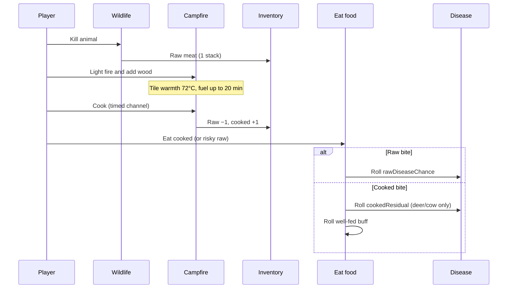

# Cooking and campfire mechanics and gameplay

How meat cooking feels in play and how the runtime executes it.

## Player-facing loop

## Prerequisites (campfire cooking)

All must pass before the cook channel starts (`validatingWorldPlazaCampfireCookStart.ts`):

1. **Lit campfire** on the selected pit tile.
2. **Raw wildlife meat** in inventory (first qualifying slot in bag order).
3. **Bag space** for one cooked stack (capacity probe before channel).

During the channel (`usingWorldPlazaCampfireCookProgress.ts`) the player must:

- Stay within **2** tile Chebyshev range of the pit.
- Keep the campfire **selected** as the active interactable.
- Keep the fire **lit** (campfire cell still present).

Failure cancels progress with no item change.

## Cook channel

| Step | Behavior |
| ---- | -------- |
| Start | Scene calls `startingCampfireCook(block, recipe)` after validation. |
| Duration | Per-species `cookDurationMs` from meat catalog (**2.5s** chicken → **10s** bear). |
| UI | Timed interaction ring on the Cook label (`renderingWorldPlazaCampfireInteractionLabels.tsx`). |
| Complete | `cookingWildlifeMeatAtCampfire` consumes 1 raw, adds 1 cooked atomically. |
| Toast | Cooked display name shown on success. |

Recipes are auto-derived in `definingWildlifeMeatCookRecipes.ts` from `DEFINING_WILDLIFE_MEAT_CATALOG`.

## Eating meat (inventory-food + disease)

Eat routing: `resolvingWorldPlazaInventoryFoodEatEffects.ts` (see [inventory-food](../inventory-food/)).

### Raw meat

1. Roll `sicknessRoll < rawDiseaseChance` → contract [disease](../disease/) (`applyingWorldPlazaEntityDisease`).
2. On miss → fallback toxic poison DoT (EV **5** over **60s**).
3. Hunger restore × **0.5** if already symptomatic or food-sickness debuff active.

### Cooked meat

1. Roll `sicknessRoll < cookedResidualDiseaseChance` when residual fields exist (deer **5%** chronic-wasting, cow **3%** mad-cow).
2. Separate roll `wellFedRoll < cookedWellFedChance` → apply `well-fed-*` buff from registry.
3. Full hunger ratio when healthy; × **0.5** while symptomatic (same food sickness rule).

Disease details, incubation, and symptom staging: [disease/mechanics.md](../disease/mechanics.md).

## Campfire fuel

Source: `src/shared/worldCampfireFuel.ts`. Ignite and refuel interaction: [fire](../fire/).

### Duration from wood count

| Total wood (placed nearby + inventory fed) | Burn rate | Examples |
| ---------------------------------------- | --------- | -------- |
| 1-3 | **3 min** per wood | 1 wood = 3 min; 3 wood = 9 min |
| 4+ | **1 min** per wood | 4 wood = 4 min; 10 wood = 10 min |

**Max stored fuel:** **20 minutes** (`WORLD_CAMPFIRE_FUEL_MAX_MS`).

Refueling one inventory wood uses the **nearby placed wood tier** to pick 3 min vs 1 min (`computingWorldCampfireFuelMsFromInventoryWoodRefuel`).

### Placed wood (flame size and burn tier)

Counts unburnt blocks within **2** tile radius (pit tile excluded):

- Wood floor, wooden door, wooden sign definition ids.

| Nearby placed wood | Burn tier | Flame intensity (approx.) |
| ------------------ | --------- | --------------------------- |
| 0 | weak | 0.24 |
| 1 | small | 0.38 |
| 2 | small | 0.50 |
| 3 | mid | 0.68 |
| 4+ | big | 0.86-1.0 |

Effective flame tier also includes inventory wood fed at ignite/refuel. Fuel depletion dims light and flame scale as the timer runs down.

## Campfire warmth

Lit campfire tiles emit **72°C** (`DEFINING_WORLD_PLAZA_TEMPERATURE_CELSIUS` in `definingWorldPlazaTemperatureConstants.ts`). Contributes to neighbor temperature averaging for cold mitigation. Full environmental model: [environment](../environment/).

## Loot source

Each of the 11 species drops exactly **1** raw stack matching its meat row when killed. Loot ids attach in `definingWildlifeSpeciesRegistry.ts` via `resolvingWildlifeMeatCatalogEntry`. Ecology and combat: [wildlife](../wildlife/).

## Well-fed buffs (cooked reward)

Independent roll per cooked bite. Buff definitions in `definingWorldPlazaEntityBuffRegistry.ts`:

| Buff id | Label | Effect (summary) | Duration |
| ------- | ----- | ---------------- | -------- |
| well-fed-comfort-buff | Comfort Food | Stamina regen ×1.2 | 60s |
| well-fed-fleet-buff | Fleet Footed | Move speed ×1.2 | 90s |
| well-fed-strength-buff | Predator Strength | Attack EV ×1.15 | 90s |
| well-fed-endurance-buff | Savanna Endurance | Stamina regen ×1.35 | 120s |
| well-fed-toughened-buff | Toughened | Incoming damage ×0.85 | 90s |
| well-fed-vigor-buff | Pasture Vigor | Incoming heal amp ×1.2 | 90s |
| well-fed-prime-buff | Prime Cut | Attack EV ×1.1 | 100s |
| well-fed-hearty-buff | Hearty Meal | +80 temp max HP | 120s |
| well-fed-reptile-buff | River Hunter | Incoming damage ×0.9 | 90s |

Per-species mapping and chances: [catalog.md](./catalog.md).

## Design knobs (balance)

| Knob | Location |
| ---- | -------- |
| Raw/cooked hunger ratios | `definingWildlifeMeatRegistry.ts` |
| Cook duration | `cookDurationMs` per meat row |
| Raw disease odds | `rawDiseaseId` + `rawDiseaseChance` |
| Prion residual | `cookedResidualDiseaseId` + `cookedResidualDiseaseChance` |
| Well-fed odds | `cookedWellFedBuffId` + `cookedWellFedChance` |
| Fuel minutes per wood | `worldCampfireFuel.ts` |
| Max fuel cap | `WORLD_CAMPFIRE_FUEL_MAX_MS` |
| Campfire warmth | `definingWorldPlazaTemperatureConstants.ts` |
| Food sickness multiplier | `DEFINING_WILDLIFE_FOOD_SICKNESS_HUNGER_MULTIPLIER` |

## Failure and edge cases

- **Inventory full at complete:** Validation prevents start; atomic cook should not partial-apply.
- **Fire dies mid-channel:** Progress cancels; raw meat kept.
- **Multiple raw types:** First slot in bag order wins for cook (not player-selected stack).
- **Cooked deer/beef:** Still small prion residual; most species have no cooked disease path.
- **Eat raw while cooking nearby:** Independent risk; cooking does not sterilize meat already in bag.
- **Well-fed and disease:** Rolls are independent; you can theoretically get both residual disease and a well-fed buff on one bite.

## Key files

| Concern | File |
| ------- | ---- |
| Meat catalog | `definingWildlifeMeatRegistry.ts` |
| Cook recipes | `definingWildlifeMeatCookRecipes.ts` |
| Validate start | `validatingWorldPlazaCampfireCookStart.ts` |
| Channel hook | `usingWorldPlazaCampfireCookProgress.ts` |
| Complete swap | `cookingWildlifeMeatAtCampfire.ts` |
| Eat effects | `resolvingWorldPlazaInventoryFoodEatEffects.ts` |
| Fuel math | `src/shared/worldCampfireFuel.ts` |
| Scene wiring | `renderingWorldPlazaPixiScene.tsx` |
