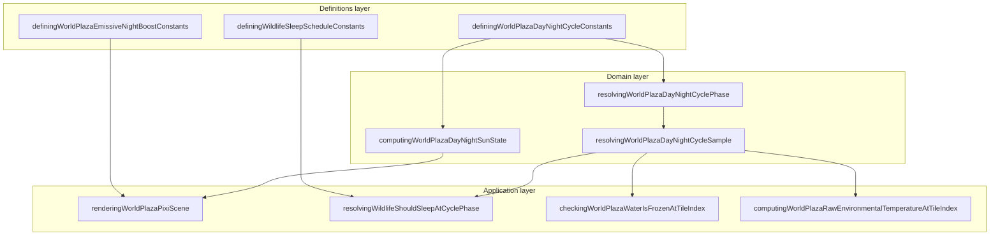

# Day / night bounded context (DDD)

|                  |            |
| ---------------- | ---------- |
| **Version**      | 1.0.0      |
| **Last updated** | 2026-07-08 |

Plaza **day/night** is a bounded context inside the **World Simulation** subdomain. Every client derives identical cycle phase, lighting, and downstream night effects from UTC epoch time without server sync.

## Docs in this folder

| File | Purpose |
| ---- | ------- |
| [glossary.md](./glossary.md) | Ubiquitous language for cycle phase, lighting, and night effects |
| [mechanics.md](./mechanics.md) | Phase table, darkness curve, downstream systems |
| [catalog.md](./catalog.md) | Every tuning constant and exact code touchpoints |

## DDD map

### Bounded context

**Plaza Global Day/Night Cycle** — shared wall-clock phase that drives sky tint, shadows, screen darkness, night ambient cooling, frozen water, emissive boosts, wildlife sleep windows, and HUD day counter.

Touches **Environment** (night cooling), **Wildlife** (sleep schedules), **Fire** (campfire emissive boost), **Water** (freeze/melt), and **Entity Health** (disease time scale via [in-game-time](../../shared/in-game-time.md)). Does not own temperature damage math or wildlife AI paths.

### Aggregates

| Aggregate | Root | Responsibility |
| --------- | ---- | -------------- |
| **Cycle sample** | `ResolvingWorldPlazaDayNightCycleSample` | One instant: `sharedEpochMs`, `cyclePhase`, `isDaytime` |
| **Sun state** | `ComputingWorldPlazaDayNightSunState` | Quantized lighting snapshot: shadows, sky tint, vignette |

Neither aggregate is persisted. Both are recomputed from `Date.now()` each poll interval.

### Value objects

- `cyclePhase` — `0..1`, where `0` = midnight and `0.5` = noon
- `bucketIndex` — `0..239` quantization for stable shadow redraw keys
- `DefiningWorldPlazaDayNightSkyTintKeyframe` — RGBA overlay keyframe at a phase
- HUD day number — `1..30` wrap from epoch anchor

### Domain services (pure)

| Service | File |
| ------- | ---- |
| Resolve cycle phase | `resolvingWorldPlazaDayNightCyclePhase.ts` |
| Resolve sample epoch (debug override) | `resolvingWorldPlazaDayNightSampleEpochMs.ts` |
| Build cycle sample | `resolvingWorldPlazaDayNightCycleSample.ts` |
| Compute sun/lighting state | `computingWorldPlazaDayNightSunState.ts` |
| Format HUD day number | `formattingWorldPlazaDayNightDayNumber.ts` |

### Application layer

| Use case | Entry |
| -------- | ----- |
| React sun state poll | `usingWorldPlazaDayNightSunState.ts` |
| Pixi scene lighting | `renderingWorldPlazaPixiScene.tsx` |
| Wildlife sleep gate | `resolvingWildlifeShouldSleepAtCyclePhase.ts` |
| Frozen water check | `checkingWorldPlazaWaterIsFrozenAtTileIndex.ts` |
| Night emissive boost | `definingWorldPlazaEmissiveNightBoostConstants.ts` |

### Infrastructure

| Concern | File |
| ------- | ---- |
| Debug phase override | `managingWorldPlazaDayNightDebugOverrideStore.ts` |
| In-game duration helpers | `computingWorldPlazaInGameDurationMs.ts` |

### Declarative registries (source of truth)

| Registry | File |
| -------- | ---- |
| Cycle timing and lighting | `src/client/world/domains/definingWorldPlazaDayNightCycleConstants.ts` |
| Emissive night boost | `src/client/world/domains/definingWorldPlazaEmissiveNightBoostConstants.ts` |
| Wildlife sleep schedules | `src/client/world/wildlife/domains/definingWildlifeSleepScheduleConstants.ts` |

## Layer diagram

## How to tune day length or twilight

1. **Cycle duration** — edit `DEFINING_WORLD_PLAZA_DAY_NIGHT_CYCLE_DURATION_MS` (currently 40 real minutes). All `computingWorldPlazaInGameHoursToRealMs` callers inherit the new scale.
2. **Sunrise/sunset** — edit `SUNRISE_PHASE` / `SUNSET_PHASE`.
3. **Midnight darkness** — edit `MIDNIGHT_DARKNESS_CURVE_EXPONENT` and edge vignette alphas.
4. **Sky color bands** — edit `SKY_TINT_KEYFRAMES` (must stay sorted by phase).
5. **Wildlife sleep** — edit species profiles in wildlife sleep resolvers, not the cycle constants.
6. **Verify** — visual check in plaza + `formattingWorldPlazaDayNightDayNumber.test.ts`.

## Related AI references

- Shared time kernel: [gameplay/shared/in-game-time.md](../../shared/in-game-time.md)
- Night cooling consumer: [environment](../environment/)
- Tuning numbers: [memory/game-mechanics-reference.md](../../../memory/game-mechanics-reference.md) (section 1)
- Engine wiring: [memory/game-engines-reference.md](../../../memory/game-engines-reference.md)
