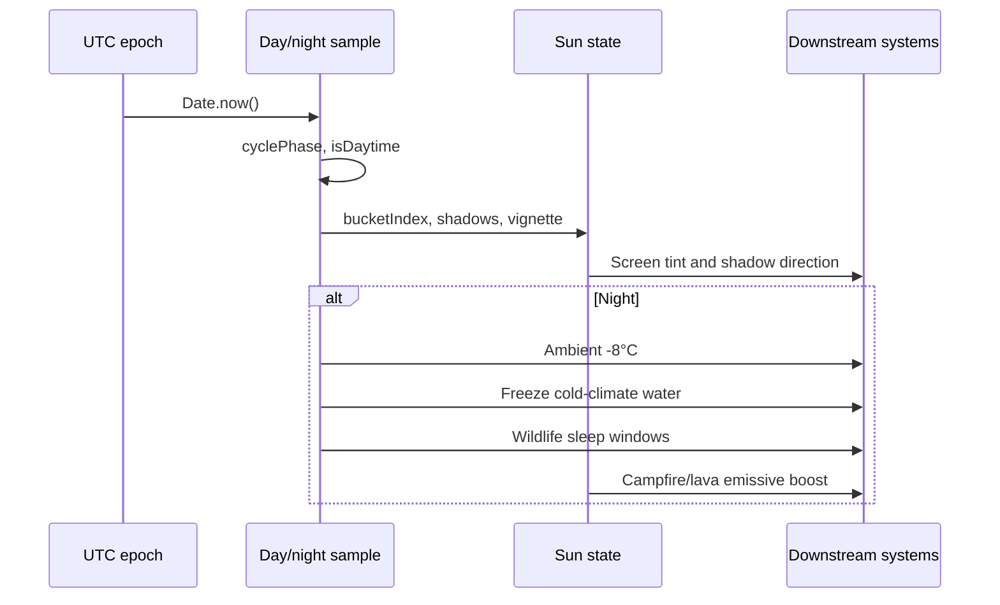
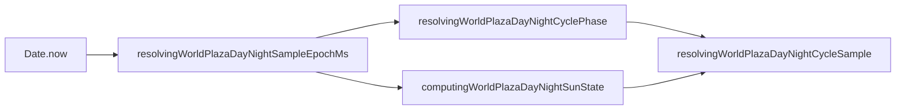

# Day / night mechanics and gameplay

How the shared cycle feels in play and how lighting propagates to other systems.

## Player-facing loop



## Cycle phase table

All phases use `resolvingWorldPlazaDayNightCyclePhase`. One full cycle = **40 real minutes** (`2_400_000` ms).

| Cycle phase | Approx. real time from midnight | isDaytime | Player feel |
| ----------- | ------------------------------ | --------- | ------------- |
| **0.00** | 0:00 (midnight) | false | Deepest vignette (**0.48** alpha); moon key light |
| **0.16** | 6:24 | false | Pre-dawn deep blue sky tint (**α 0.56**) |
| **0.20** | 8:00 (sunrise) | true | Day begins; warm sunrise band |
| **0.25** | 10:00 | true | Golden hour orange (**α 0.18**) |
| **0.32** | 12:48 | true | Morning haze fading |
| **0.41** | 16:24 | true | Midday: transparent sky tint |
| **0.50** | 20:00 (noon) | true | Short shadows; vignette **0.02** |
| **0.61** | 24:24 | true | Afternoon clear sky |
| **0.73** | 29:12 | true | Late-day warm tint returning |
| **0.82** | 32:48 (sunset) | false | Day ends; orange sunset (**α 0.34**) |
| **0.86** | 34:24 | false | Twilight to deep night |
| **0.90** | 36:00 | false | Near-midnight blue (**α 0.78**) |

**Day length:** phase `0.20` → `0.82` = **62%** of cycle ≈ **24.8 real minutes**.

**Night length:** remaining **38%** ≈ **15.2 real minutes**.

**In-game hours:** 1 hour ≈ **2.5 real minutes** (cycle / 24). See [in-game-time](../../shared/in-game-time.md).

## Darkness curve

Night edge vignette uses two mechanisms:

### 1. Daytime twilight band

During day, vignette interpolates between:

- High noon: **0.02**
- Golden hour (edges of day arc): **0.10**

Mix factor: `1 - sin(arcProgress × π)` where `arcProgress` is sun position along the day arc.

### 2. Night midnight concentration

During night, vignette interpolates twilight → midnight using:

```
midnightMix = sin(arcProgress × π) ^ 2.4
vignette = lerp(0.10, 0.48, midnightMix)
```

Exponent **2.4** (`DEFINING_WORLD_PLAZA_DAY_NIGHT_MIDNIGHT_DARKNESS_CURVE_EXPONENT`) keeps dusk/dawn readable while making a short window near phase **0.0** feel almost pitch black.

### Shadow and sky companions

| Signal | Day range | Night range |
| ------ | --------- | ----------- |
| Shadow length scale | **2.1** (horizon) → **0.75** (noon) | Same arc under moon |
| Shadow alpha | **0.3** (twilight) → **1.0** (noon) | **0.16** (floor) → **0.42** (moonlit) |
| Sky tint alpha | **0** at midday | up to **0.78** at deep night |

Full keyframes: [catalog.md](./catalog.md).

## Sampling pipeline



- **Poll interval** for React consumers: **1000 ms**
- **Bucket count**: **240** (~10s per bucket at 40 min cycle)
- **Debug override**: `managingWorldPlazaDayNightDebugOverrideStore` replaces epoch with a fixed preview phase

## Downstream effects

### Environment (night cooling)

`computingWorldPlazaRawEnvironmentalTemperatureAtTileIndex` subtracts **8°C** when `isDaytime` is false. Stacks with climate noise and local heat sources. See [environment](../environment/).

### Frozen surface water

When `isDaytime` is false and climate temperature noise ≤ **0.3**, surface water tiles use **−14°C** locally. Nearby campfires/lava can push effective temperature to **0°C** and thaw ice. See `checkingWorldPlazaWaterIsFrozenAtTileIndex`.

### Emissive readability

At deepest midnight, self-lit features get sprite alpha boosts so they punch through the CSS sky tint:

| Source | Midnight alpha boost |
| ------ | -------------------- |
| Lava | ×**1.4** |
| Campfire flame | ×**1.45** |

Constants: `definingWorldPlazaEmissiveNightBoostConstants.ts`.

### Wildlife sleep

`resolvingWildlifeShouldSleepAtCyclePhase` reads the same `cyclePhase`. Diurnal species sleep through the night arc; cathemeral species roll per bucket. Schedules: `definingWildlifeSleepScheduleConstants.ts`. Details: [wildlife](../wildlife/).

### Disease and hunger time scale

Disease incubation and hunger drain are authored in in-game hours/days but keyed to **world epoch** (`Date.now()`), not cycle phase. Day length changes in cycle constants still rescale in-game duration helpers used by disease registry.

### HUD day counter

`formattingWorldPlazaDayNightDayNumber` shows **Day 1–30** (wrap) counting 40-minute days since epoch anchor. Display only; does not gate mechanics.

## Design knobs (balance)

| Knob | Location |
| ---- | -------- |
| Real minutes per in-game day | `DEFINING_WORLD_PLAZA_DAY_NIGHT_CYCLE_DURATION_MS` |
| Sunrise / sunset | `SUNRISE_PHASE`, `SUNSET_PHASE` |
| Midnight peak darkness | `MIDNIGHT_DARKNESS_CURVE_EXPONENT`, `EDGE_VIGNETTE_ALPHA_*` |
| Sky color bands | `SKY_TINT_KEYFRAMES` |
| Shadow length/opacity | `SHADOW_LENGTH_SCALE_*`, `SHADOW_ALPHA_SCALE_*` |
| Night cooling magnitude | `DEFINING_WORLD_PLAZA_TEMPERATURE_NIGHT_COOLING_CELSIUS` (environment) |
| Emissive boost | `definingWorldPlazaEmissiveNightBoostConstants.ts` |

## Failure and edge cases

- **Timezone changes**: No effect. Phase uses UTC epoch, not `getHours()`.
- **Offline clients**: Phase advances with wall clock; rejoining mid-night resumes correct darkness.
- **Debug override**: Forces a fixed phase for previews; does not persist to save data.
- **Multiplayer**: All players in the same post sample identical phase without sync packets.
