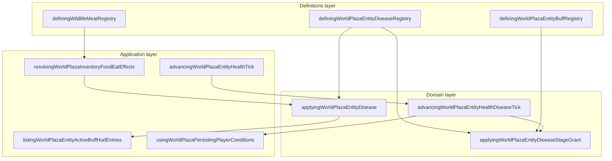

# Disease bounded context (DDD)

|                  |            |
| ---------------- | ---------- |
| **Version**      | 1.0.0      |
| **Last updated** | 2026-07-08 |

Plaza **disease** is a bounded context inside the **Entity Health** subdomain. Infections are declarative definitions plus a wall-clock scheduler that stages symptoms onto the player health aggregate.

## Docs in this folder

| File | Purpose |
| ---- | ------- |
| [glossary.md](./glossary.md) | Ubiquitous language: terms every contributor should use the same way |
| [mechanics.md](./mechanics.md) | Player-facing gameplay and the runtime pipeline |
| [catalog.md](./catalog.md) | Every disease, severity, meat source, and exact code touchpoints |

## DDD map

### Bounded context

**Plaza Entity Disease** — timed illnesses contracted from food (primarily raw wildlife meat) that schedule debuffs, poison, bleed, confusion, sleep, and fated damage onto the local player health state.

Touches **Inventory/Food**, **Wildlife/Meat**, **Entity Health**, **Save Slots**, and **Home/Mechanics UI**. Does not own combat damage rolls or wildlife AI.

### Aggregates

| Aggregate | Root | Responsibility |
| --------- | ---- | -------------- |
| **Disease definition** | `DefiningWorldPlazaEntityDiseaseDescriptor` | Static catalog entry: incubation, illness duration, severity, staged grants |
| **Player health** | `DefiningWorldPlazaEntityHealthState` | Runtime vitals; holds `diseaseEffects[]` scheduler entries alongside poison, bleed, buffs |

A **disease instance** (`DefiningWorldPlazaEntityHealthDiseaseEffect`) is not its own aggregate root. It lives inside player health and references a definition by `diseaseId`.

### Value objects

- `DefiningWorldPlazaEntityDiseaseId` — stable string id (`salmonellosis`, `mad-cow`, …)
- `DefiningWorldPlazaEntityDiseaseSeverity` — `mild | moderate | severe | critical`
- `DefiningWorldPlazaEntityDiseaseStageGrant` — one timed symptom payload (`poison`, `bleed`, `buff`, …)
- Wall-clock timestamps — `contractedAtMs`, `symptomsStartAtMs`, `expiresAtMs`, `fireAtMs`

### Domain services (pure)

| Service | File |
| ------- | ---- |
| Contract disease | `applyingWorldPlazaEntityDisease.ts` |
| Advance scheduler | `advancingWorldPlazaEntityHealthDiseaseTick` (same file) |
| Fire one grant | `applyingWorldPlazaEntityDiseaseStageGrant.ts` |
| Resolve world epoch | `resolvingWorldPlazaEntityDiseaseWorldEpochMs.ts` |

### Application layer

| Use case | Entry |
| -------- | ----- |
| Eat raw/cooked meat | `resolvingWorldPlazaInventoryFoodEatEffects.ts` |
| Health frame tick | `advancingWorldPlazaEntityHealthTick.ts` |
| HUD rows | `listingWorldPlazaEntityActiveBuffHudEntries.ts` |
| Persist across sessions | `usingWorldPlazaPersistingPlayerConditions.ts` |
| Mechanics guide | `resolvingPlazaMechanicsDiseaseBadgeGuideEntries.ts` |

### Infrastructure

| Concern | File |
| ------- | ---- |
| Save slot shape | `shared/plazaSinglePlayerSavesDevvit.ts` |
| Serialize / parse | `serializingWorldPlazaPlayerConditions.ts` |
| Local + cloud write | `writingWorldPlazaPlayerConditionsToStorage.ts` |

### Declarative registries (source of truth)

| Registry | File |
| -------- | ---- |
| Disease catalog | `src/client/world/health/domains/definingWorldPlazaEntityDiseaseRegistry.ts` |
| Meat → disease mapping | `src/client/world/wildlife/domains/definingWildlifeMeatRegistry.ts` |
| Disease debuff buffs | `src/client/world/health/domains/definingWorldPlazaEntityBuffRegistry.ts` (`disease-*` ids) |

## Layer diagram

## How to add a new disease

1. **Definition** — add id to the union and a descriptor block in `definingWorldPlazaEntityDiseaseRegistry.ts` (incubation, duration, severity, grants).
2. **Source** — wire `rawDiseaseId` / `rawDiseaseChance` on a meat row in `definingWildlifeMeatRegistry.ts` (or a future non-meat trigger).
3. **Debuff buff** (if needed) — add `disease-*-debuff` to `definingWorldPlazaEntityBuffRegistry.ts`.
4. **Copy** (optional) — item description in `definingWildlifeMeatItemDescriptionCorpus.ts`, tutorial/mechanics constants.
5. **Icon** (if new) — register in `registeringBundledIconifyIcons.ts`.
6. **Verify** — `npm run test -- definingWorldPlazaEntityDiseaseRegistry`.

No changes needed to the tick runner, HUD lister, or save serializer when reusing existing grant kinds.

## Related AI references

- Engine wiring: [memory/game-engines-reference.md](../../../memory/game-engines-reference.md) (Entity health engine)
- Tuning numbers: [memory/game-mechanics-reference.md](../../../memory/game-mechanics-reference.md) (section 7)
