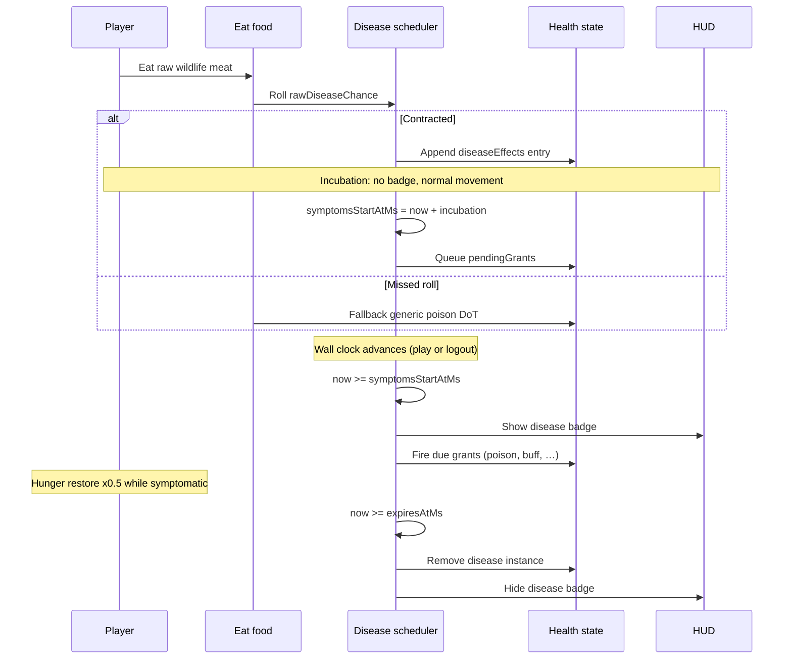

# Disease mechanics and gameplay

How diseases feel in play and how the runtime executes them.

## Player-facing loop

## Phases (what the player experiences)

### 1. Contract (instant, often invisible)

Eating raw meat runs `resolvingWorldPlazaInventoryFoodEatEffects`. If `sicknessRoll < rawDiseaseChance`, `applyingWorldPlazaEntityDisease` appends a scheduler entry. No toast, no HUD change.

Cooked meat can still contract **residual** prion diseases (deer, beef) at low odds.

### 2. Incubation (silent)

`checkingWorldPlazaEntityDiseaseIsIncubating` is true. Player moves and fights normally. Infection persists in save data across logout.

Duration is per disease (see [catalog.md](./catalog.md)). Authored in in-game hours/days, stored as real milliseconds.

### 3. Symptomatic illness

When `worldEpochMs >= symptomsStartAtMs`:

- Disease badge appears under the health bar (icon + countdown to `expiresAtMs`).
- Pending grants at `delayMs: 0` fire immediately; later grants wait on `fireAtMs`.
- Eating food applies **food sickness**: hunger restore × **0.5**.

Symptom buffs use ids like `disease-grant:{instanceId}:{index}:{buffId}` and are **hidden** from the buff row. The disease badge is the player-facing signal.

### 4. Recovery

When `worldEpochMs >= expiresAtMs`, the disease instance is dropped. Badge goes away. Poison/bleed/confusion from fired grants may linger until their own effect timers end.

## Time scale

| In-game | Real time |
| ------- | --------- |
| 1 hour | ~2.5 minutes |
| 1 day | 40 minutes |

Example: Salmonellosis incubates 8 in-game hours (~13 real minutes), then runs 2 in-game days symptomatic (~80 real minutes).

Diseases use **world epoch** (`Date.now()`), not simulation frame time, so incubation completes while the player is offline.

## Grant dispatch (symptom staging)

Each grant in the descriptor becomes either:

- **Fired immediately** on contract (if already past `symptomsStartAtMs + delayMs`), or
- **Queued** in `pendingGrants` until `advancingWorldPlazaEntityHealthDiseaseTick` sees `fireAtMs <= now`.

`applyingWorldPlazaEntityDiseaseStageGrant` routes by `kind`:

| Kind | Health mutation |
| ---- | ---------------- |
| `buff` | Movement modifier, stamina drain, or incoming damage multiplier from buff registry |
| `poison` | Adds to toxic/venomous/lethal poison pool |
| `bleed` | Adds bleed pool at severity tier |
| `confusion` | Adds confusion effect with intensity cap |
| `sleep` | Adds sleep incapacitation |
| `potential_damage` | Schedules fated EV damage |

Grants are **data-driven**. Adding a disease does not add branches to the tick runner.

## Primary infection vector: wildlife meat

Species → disease mapping lives in `definingWildlifeMeatRegistry.ts`. Each row sets:

- `rawDiseaseId` + `rawDiseaseChance` for raw cuts
- `cookedResidualDiseaseId` + `cookedResidualDiseaseChance` for prions only (deer, cow)
- `cookedWellFedBuffId` + `cookedWellFedChance` for safe cooked reward

Inventory items are registered from the same catalog in `registeringWorldPlazaWildlifeMeatInventoryItems.ts`.

## Persistence

`usingWorldPlazaPersistingPlayerConditions` serializes active `diseaseEffects` (including `pendingGrants`) to the single-player save slot. On load, `advancingWorldPlazaEntityHealthDiseaseTick` catches up overdue grants.

## HUD and teaching surfaces

| Surface | Builder |
| ------- | ------- |
| In-run buff/disease row | `listingWorldPlazaEntityActiveBuffHudEntries.ts` |
| Home mechanics panel | `resolvingPlazaMechanicsDiseaseBadgeGuideEntries.ts` |
| Stage timeline copy | `resolvingPlazaMechanicsDiseaseStageGuideEntries.ts` |
| Tutorial demos | `renderingPlazaTutorialVisualDemos.tsx` |

Mechanics entries sort by **severity** (critical first), then label.

## Design knobs (balance)

| Knob | Location |
| ---- | -------- |
| Incubation / illness length | Descriptor `incubationMs`, `durationMs` |
| Symptom staging | Descriptor `grants[]` delays and payloads |
| Contract odds | Meat catalog `rawDiseaseChance` |
| Prion cook risk | `cookedResidualDiseaseChance` |
| Severity label | Descriptor `severity` |
| Debuff strength | `definingWorldPlazaEntityBuffRegistry.ts` multipliers and `actionLocks` |
| Hunger penalty while sick | `DEFINING_WILDLIFE_FOOD_SICKNESS_HUNGER_MULTIPLIER` |

## Failure and edge cases

- **Stacking**: Each contract creates a new instance id. Same disease can be contracted again while a prior instance is active.
- **Missed disease roll on raw**: Generic poison/sickness path still punishes raw food.
- **Symptomatic without new contract**: Eating while already sick keeps hunger ×0.5 even if the new bite did not roll disease.
- **Death**: Disease scheduler does not pause on death; persistence keeps unfinished illnesses for respawn load.
