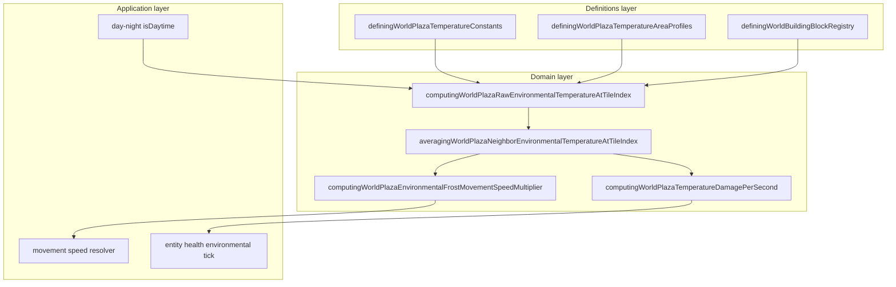

# Environment bounded context (DDD)

|                  |            |
| ---------------- | ---------- |
| **Version**      | 1.0.0      |
| **Last updated** | 2026-07-08 |

Plaza **environment** is a bounded context inside the **Entity Health** subdomain. Climate noise, local heat sources, and comfort bands resolve into temperature samples that drive DoT, frost slow, and hazard HUD.

## Docs in this folder

| File | Purpose |
| ---- | ------- |
| [glossary.md](./glossary.md) | Ubiquitous language for temperature, comfort, and frost |
| [mechanics.md](./mechanics.md) | Sampling pipeline, damage, frost curve |
| [catalog.md](./catalog.md) | Comfort bands, local sources, constants table |

## DDD map

### Bounded context

**Plaza Environmental Temperature** — per-tile and per-player effective °C that gates movement speed, environmental damage, lava hazard labeling, and frozen water melt.

Touches **Day/Night** (night cooling), **Fire** (campfire **72°C** tile), **Building** (block temperature levels), **Combat** (environmental damage kind), and **Wildlife** (mob temperature profiles). Does not own day/night phase or fire spread.

### Aggregates

| Aggregate | Root | Responsibility |
| --------- | ---- | -------------- |
| **Temperature sample** | `DefiningWorldPlazaEnvironmentalTemperatureSample` | Resolved °C + exposure kind + DoT rates |
| **Player local temperature** | Smoothed readout on entity | Eased toward tile target for HUD and damage |

### Value objects

- `celsius` — canonical temperature unit (`DEFINING_WORLD_PLAZA_TEMPERATURE_DISPLAY_UNIT`)
- `DefiningWorldPlazaEntityTemperatureResistance` — heat/cold resist and immunity flags
- `DefiningWorldPlazaEnvironmentalTemperatureLevel` — assignable block/area heat level
- Comfort band edges — **−10°C** low, **50°C** high

### Domain services (pure)

| Service | File |
| ------- | ---- |
| Raw tile temperature | `computingWorldPlazaRawEnvironmentalTemperatureAtTileIndex.ts` |
| Neighbor averaging | `averagingWorldPlazaNeighborEnvironmentalTemperatureAtTileIndex.ts` |
| Climate → °C | `convertingWorldPlazaClimateNormalizedToCelsius.ts` |
| Damage rates | `computingWorldPlazaTemperatureDamagePerSecond.ts` |
| Frost speed multiplier | `computingWorldPlazaEnvironmentalFrostMovementSpeedMultiplier.ts` |
| Entity frost (immunity) | `resolvingWorldPlazaEnvironmentalFrostMovementSpeedMultiplierForEntity.ts` |
| Hazard builder | `buildingWorldPlazaEnvironmentalHazardFromTemperatureCelsius.ts` |

### Application layer

| Use case | Entry |
| -------- | ----- |
| Player temperature tick | Entity health environmental advance hooks |
| Minimap environment bar | `renderingWorldPlazaMiniMapEnvironmentBar.tsx` |
| Movement speed apply | Movement resolver (frost multiplier) |
| Wildlife environmental tick | `advancingWildlifeEnvironmentalDamageTick.ts` |

### Declarative registries (source of truth)

| Registry | File |
| -------- | ---- |
| Comfort and damage constants | `src/client/world/health/domains/definingWorldPlazaTemperatureConstants.ts` |
| Area temperature profiles | `src/client/world/health/domains/definingWorldPlazaTemperatureAreaProfiles.ts` |
| Mob temperature profiles | `src/client/world/health/domains/definingWorldPlazaMobTemperatureProfiles.ts` |
| Block environmental levels | `definingWorldBuildingBlockRegistry.ts` (`environmentalTemperature`) |

## Layer diagram

## Cross-context links

- Night **−8°C**: [day-night](../day-night/)
- Campfire warmth and cooking: [cooking-campfire](../cooking-campfire/)
- Combat damage kinds: [combat](../combat/)
- Character cold immunity: [characters](../characters/)

## Related AI references

- Tuning numbers: [memory/game-mechanics-reference.md](../../../memory/game-mechanics-reference.md) (section 5)
- Engine wiring: [memory/game-engines-reference.md](../../../memory/game-engines-reference.md)
