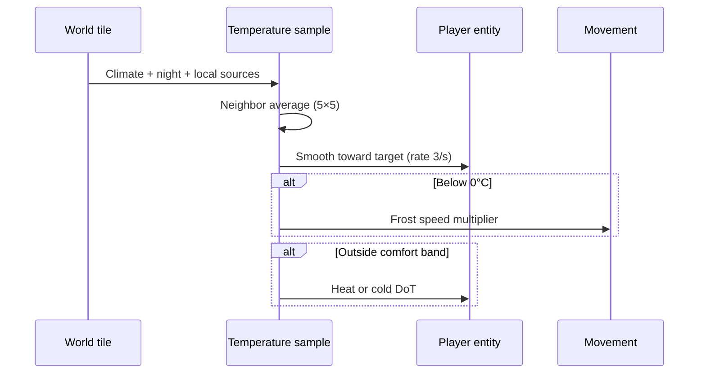
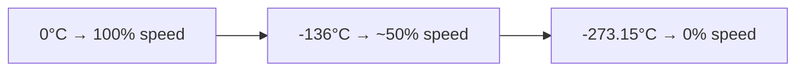

# Environment mechanics and gameplay

How temperature feels in play and how the runtime resolves hazards.

## Player-facing loop



## Comfort bands

No environmental HP damage inside the comfort window.

| Boundary                 | °C          | Below / above effect               |
| ------------------------ | ----------- | ---------------------------------- |
| Comfort low              | **−10**     | Cold DoT begins below this         |
| Comfort high             | **50**      | Heat DoT begins above this         |
| Frost movement threshold | **0**       | Speed reduction begins at or below |
| Absolute zero            | **−273.15** | Movement multiplier hits **0**     |

Between **−10°C** and **0°C**: no climate DoT, but **frost slow** still applies.

## Damage formulas

Let `excess = max(0, celsius − 50)` and `deficit = max(0, −10 − celsius)`.

| Kind | Flat HP/s       | Max-HP %/s          |
| ---- | --------------- | ------------------- |
| Heat | `excess × 0.35` | `excess × 0.00005`  |
| Cold | `deficit × 0.3` | `deficit × 0.00004` |

Total HP/s = `flat + effectiveMaxHealth × percent`.

Example: standing on lava (**920°C**) → excess **870°C** → **304.5** flat HP/s plus **4.35%** max HP/s.

The engine picks heat vs cold by whichever combined rate is higher.

## Resistance and weakness

After raw DoT rates resolve, entity `temperatureResistance` scales them:

```
multiplier = (1 − resistance) × (1 + weakness)
```

| Field                               | Effect                                     |
| ----------------------------------- | ------------------------------------------ |
| `heatResistance` / `coldResistance` | Cuts matching DoT (0..1)                   |
| `heatWeakness` / `coldWeakness`     | Amplifies matching DoT (0..1 → +0%..+100%) |
| `isHeatImmune` / `isColdImmune`     | Multiplier **0** for that exposure         |

Instant buffs: `heat-resistance-buff` / `cold-resistance-buff` (+25% resist). Instant debuffs: `heat-weakness-debuff` / `cold-weakness-debuff` (+25% weakness). See [buffs](../buffs/).

Cold-immune entities also skip frost slow.

## Frost movement curve

`computingWorldPlazaEnvironmentalFrostMovementSpeedMultiplier(celsius)`:

| Condition           | Multiplier                               |
| ------------------- | ---------------------------------------- |
| `celsius === null`  | **1**                                    |
| `celsius ≥ 0`       | **1**                                    |
| `celsius ≤ −273.15` | **0**                                    |
| Between             | Linear: `(celsius − (−273.15)) / 273.15` |



Cold-immune entities always get **1** via `resolvingWorldPlazaEnvironmentalFrostMovementSpeedMultiplierForEntity`.

## Tile sampling pipeline

### Step 1: Ambient climate

`climate.temperature` (0..1) → `convertingWorldPlazaClimateNormalizedToCelsius`:

```
celsius = -25 + noise × (48 - (-25))   // -25°C to 48°C
```

### Step 2: Night cooling

If `isDaytime` is false: `ambient −= 8°C`.

### Step 3: Biome and water overrides

| Condition                                              | Override                       |
| ------------------------------------------------------ | ------------------------------ |
| Firelands biome tile                                   | `ambient = max(ambient, 62°C)` |
| Surface water + cold climate (≤ **0.3** noise) + night | **−14°C**                      |

### Step 4: Local sources (merge max)

Merged with `mergingWorldPlazaEnvironmentalTemperatureLevels`:

- Lava tile: **920°C**
- Block `environmentalTemperature` levels on tile
- Painted area profiles
- Lit campfire cell on tile: **72°C** (via block/cell wiring)

### Step 5: Neighbor averaging

Ring **2** (5×5). Tiles that **host** assignable sources (lava, campfire, painted zones) keep their peak; neighbors blend toward the average.

### Step 6: Player smoothing

Player readout eases toward the sampled tile target at **3**/second so HUD and damage do not snap on tile borders.

## Local heat source reference

| Source            | °C          | Radius / notes                               |
| ----------------- | ----------- | -------------------------------------------- |
| Lava tile         | **920**     | Single tile; neighbors warm via 5×5 average  |
| Campfire tile     | **72**      | Standing tile on lit `utility:campfire` cell |
| Frozen water      | **−14**     | Climate-frozen surface water at night        |
| Firelands ambient | **62** min  | Floor on ambient, not a point source         |
| Climate range     | **−25..48** | Before night offset                          |

Campfire fuel tiers affect **light** and **burn duration**, not the **72°C** tile constant. See [fire](../fire/) and [cooking-campfire](../cooking-campfire/).

## Frozen water interaction

Climate-frozen water (noise ≤ **0.3**) freezes at night when no nearby heat pushes effective temp to **0°C**.

- Frozen: walkable, no flow animation
- Thaw: stand near campfire/lava until neighbor-averaged temp ≥ **0°C**
- Re-freeze: heat removed, night returns

Resolver: `checkingWorldPlazaWaterIsFrozenAtTileIndex`.

## HUD and teaching

| Surface                  | Builder                                                     |
| ------------------------ | ----------------------------------------------------------- |
| Minimap environment bar  | `renderingWorldPlazaMiniMapEnvironmentBar.tsx`              |
| Temperature exposure HUD | `computingWorldPlazaEnvironmentalTemperatureHudExposure.ts` |

## Design knobs

| Knob                 | Location                                                  |
| -------------------- | --------------------------------------------------------- |
| Comfort edges        | `COMFORT_LOW/HIGH_CELSIUS`                                |
| DoT per degree       | `*_DAMAGE_PER_DEGREE_PER_SECOND`                          |
| Max-HP percent rates | `*_MAX_HEALTH_PERCENT_PER_DEGREE_PER_SECOND`              |
| Climate range        | `CLIMATE_MIN/MAX_CELSIUS`                                 |
| Night cooling        | `NIGHT_COOLING_CELSIUS` (also [day-night](../day-night/)) |
| Source temps         | `LAVA/CAMPFIRE/FROZEN_WATER_CELSIUS`                      |
| Neighbor ring        | `NEIGHBOR_AVERAGING_RING`                                 |
| Player smoothing     | `SMOOTHING_RATE_PER_SECOND`                               |

## Edge cases

- **Campfire edge standing**: Neighbor average may be below **0°C** while on the fire tile; frost uses **local** eased readout.
- **Heat + cold sources**: Merge takes the effective level from combined block/area/lava rules, then averaging softens neighbors.
- **Firelands at night**: Ambient floor **62°C** still applies; night −8°C cannot drop Firelands below **62°C** ambient base after clamp.
