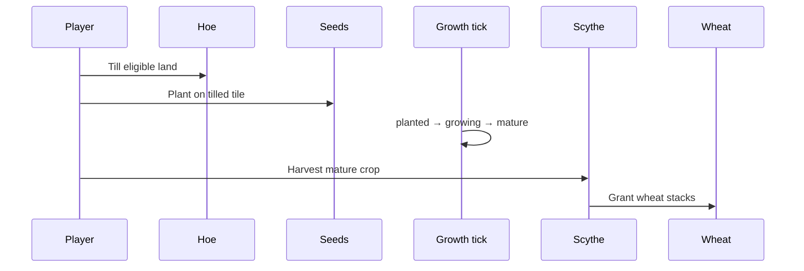

# Farming mechanics and gameplay

## Player-facing loop

## Phases

| Phase     | Player action  | Next         |
| --------- | -------------- | ------------ |
| (none)    | Hoe till       | `tilled`     |
| `tilled`  | Plant seed     | `planted`    |
| `planted` | wait **12s**   | `growing`    |
| `growing` | wait **24s**   | `mature`     |
| `mature`  | Scythe harvest | tile cleared |

Growth advances on read and on a **1s** local poll that persists phase changes.

## Action timings (base)

Divided by equipped tool `harvestSpeedMultiplier` (minimum divisor **0.25**).

| Action  | Base ms  | Tool         |
| ------- | -------- | ------------ |
| Till    | **1400** | Hoe          |
| Plant   | **900**  | (seeds only) |
| Harvest | **1200** | Scythe       |

## Range and persistence

| Rule           | Value                                                  |
| -------------- | ------------------------------------------------------ |
| Player range   | **2** tiles Chebyshev                                  |
| Persistence    | `localStorage` prefix `world-plaza-farmland:{ownerId}` |
| Ground visuals | Colored isometric markers per phase                    |

## Wheat crop (V1)

| Yield | **2** `world-plaza-wheat` |
| Seed item | `world-plaza-wheat-seed` |

## Runtime pipeline

1. Click ground tile with hoe/scythe/seeds context → farmland selection key.
2. `RenderingWorldPlazaFarmingInteractionLabels` shows Till / Plant / Harvest.
3. `usingWorldPlazaFarmingProgress` channels the action.
4. `usingWorldPlazaFarmingInteraction` mutates farmland store and inventory.

## Code entry points

| Step       | Module                                            |
| ---------- | ------------------------------------------------- |
| Till check | `checkingWorldPlazaFarmingTillEligibility.ts`     |
| Growth     | `advancingWorldPlazaFarmlandGrowthPhases.ts`      |
| Store      | `managingWorldPlazaLocalFarmland.ts`              |
| Labels     | `renderingWorldPlazaFarmingInteractionLabels.tsx` |
| Markers    | `renderingWorldPlazaFarmlandGroundMarkers.tsx`    |
