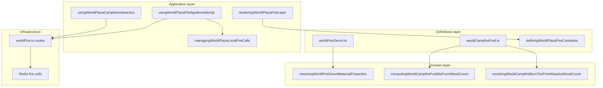

# Fire bounded context (DDD)

|                  |            |
| ---------------- | ---------- |
| **Version**      | 1.0.3      |
| **Last updated** | 2026-07-09 |

Plaza **fire** covers wildfire spread, campfire ignite/refuel, fuel tiers, and Redis-backed fire cells. Procedural **Firelands** placement (volcanic biome layout, spawn exclusion, structure anchors) is documented here because it shares `definingWorldPlazaFirelandsBiomeConstants.ts` with environment heat. Cooking timed interactions live in [cooking-campfire](../cooking-campfire/).

## Docs in this folder

| File                           | Purpose                                    |
| ------------------------------ | ------------------------------------------ |
| [glossary.md](./glossary.md)   | Ignite, spread, fuel, and cell terminology |
| [mechanics.md](./mechanics.md) | Player loop, spread sim, campfire tiers    |
| [catalog.md](./catalog.md)     | Materials, fuel math, API paths, constants |

## DDD map

### Bounded context

**Plaza World Fire** — tile-level burning state (`spreading` or `campfire`), lazy spread simulation, inventory-gated ignite/refuel, and client render (glow, flames, lightmap holes).

Touches **Building** (placed blocks, campfire utility block), **Inventory** (flint, wood), **Environment** (campfire **72°C** tile), and **Multiplayer** (shared Redis cells vs local SP store). Does not own meat cooking timers.

### Aggregates

| Aggregate                 | Root                                      | Responsibility                                              |
| ------------------------- | ----------------------------------------- | ----------------------------------------------------------- |
| **Fire cell**             | `WorldFireDevvitCell`                     | One burning tile: kind, fuel, intensity, inventory wood fed |
| **Campfire fuel context** | Nearby placed wood count + inventory wood | Burn tier, duration, flame size                             |

### Value objects

- `WorldFireDevvitCellKind` — `spreading | campfire`
- `WorldCampfireBurnTier` — `weak | small | mid | big`
- `WorldFireDevvitMaterialProperties` — `flammability`, `burnDurationMs`
- Tile key — `"tileX,tileY,worldLayer"`

### Domain services (pure)

| Service           | File                                                                 |
| ----------------- | -------------------------------------------------------------------- |
| Material lookup   | `resolvingWorldFireDevvitMaterialProperties` (`worldFireDevvit.ts`)  |
| Fuel ms from wood | `computingWorldCampfireFuelMsFromWoodCount` (`worldCampfireFuel.ts`) |
| Burn tier         | `resolvingWorldCampfireBurnTierFromNearbyWoodCount`                  |
| Flame intensity   | `computingWorldCampfireEffectiveIntensity`                           |
| Fuel wood count   | `countingWorldCampfireNearbyFuelWoodBlocks`                          |

### Application layer

| Use case                                   | Entry                                                 |
| ------------------------------------------ | ----------------------------------------------------- |
| Flint / SP ground ignite (secondary click) | `usingWorldPlazaFlintIgnitionAttempt.ts`              |
| Campfire ignite/refuel                     | `usingWorldPlazaCampfireInteraction.ts`               |
| Local SP fire cells                        | `managingWorldPlazaLocalFireCells.ts`                 |
| Fire layer render                          | `renderingWorldPlazaFireLayer.tsx`                    |
| Cells poll                                 | `usingWorldPlazaFireCells.ts`                         |
| Ignite/refuel feedback                     | `showingReigncraftToast` → plaza Sonner above minimap |

### Infrastructure

| Concern            | File                             |
| ------------------ | -------------------------------- |
| Server spread sim  | `src/server/routes/worldFire.ts` |
| Redis cell storage | `src/server/domains/*WorldFire*` |
| API client         | `callingWorldFireDevvitApi.ts`   |

### Declarative registries (source of truth)

| Registry             | File                                                                    |
| -------------------- | ----------------------------------------------------------------------- |
| Spread and API       | `src/shared/worldFireDevvit.ts`                                         |
| Campfire fuel        | `src/shared/worldCampfireFuel.ts`                                       |
| Fire glow render     | `src/client/world/fire/domains/definingWorldPlazaFireConstants.ts`      |
| Firelands procedural | `src/client/world/domains/definingWorldPlazaFirelandsBiomeConstants.ts` |
| Flint item           | `WORLD_FIRE_DEVVIT_FLINT_ITEM_TYPE_ID`                                  |
| Wood item            | `WORLD_FIRE_DEVVIT_WOOD_ITEM_TYPE_ID`                                   |

## Layer diagram

## Cross-context links

- Campfire cooking: [cooking-campfire](../cooking-campfire/)
- Campfire **72°C**: [environment](../environment/)
- Firelands procedural scale: [biome-discovery](../biome-discovery/) (`DEFINING_WORLD_PLAZA_BIOME_WORLD_LINEAR_SCALE`)
- Online vs local cells: [multiplayer](../multiplayer/)
- Wood inventory item: [inventory-food](../inventory-food/)

## Related AI references

- Tuning numbers: [memory/game-mechanics-reference.md](../../../memory/game-mechanics-reference.md) (section 13, fire)
- Engine wiring: [memory/game-engines-reference.md](../../../memory/game-engines-reference.md)
