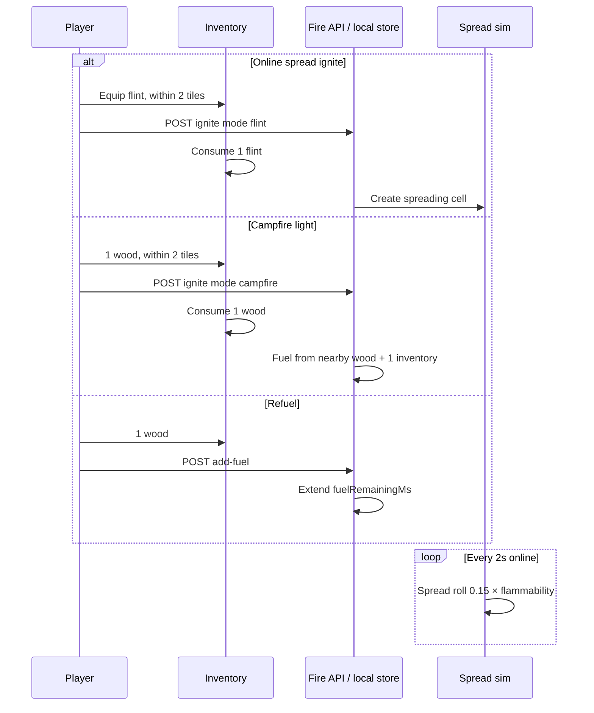

# Fire mechanics and gameplay

How fire spread, campfires, and refuel feel in play.

## Player-facing loop

## Ignite rules

### Online multiplayer (Redis cells)

| Action | Requirement | Consumes | Result |
| ------ | ----------- | -------- | ------ |
| Spread ignite | Flint + flammable block within **2** tiles | **1 flint** | `kind: spreading`, `initialFuelMs = material.burnDurationMs` |
| Campfire light | Wood + `utility:campfire` within **2** tiles | **1 wood** | `kind: campfire`, fuel from wood tier math |
| Refuel campfire | Wood + lit campfire within **2** tiles | **1 wood** | Adds fuel ms; bumps `inventoryFuelWoodCount` |

Non-flammable blocks toast: "That material is not flammable."

### Single-player (local fire store)

When `onlineUserId` is null:

- **No placed blocks required** for ground ignite
- Flint lights a campfire-style cell on clicked ground tile
- Wood refuels existing local burn
- State in `managingWorldPlazaLocalFireCells` (not Redis)

Hook: `usingWorldPlazaFlintIgnitionAttempt.ts`.

## Campfire fuel math

Total wood = **nearby placed fuel wood** + **inventory wood fed** (at light/refuel).

### Duration

| Total wood count | ms per wood | Examples |
| ---------------- | ----------- | -------- |
| **1–3** | **180_000** (3 min) | 1 wood → 3 min; 3 wood → 9 min |
| **4+** | **60_000** (1 min) | 4 wood → 4 min; 20 wood → 20 min (cap) |

Cap: `WORLD_CAMPFIRE_FUEL_MAX_MS` = **1_200_000** (20 min).

Refuel picks tier from **current nearby placed wood** (not total fed history):

- `< 4` nearby → add **180_000 ms** per wood
- `≥ 4` nearby → add **60_000 ms** per wood

### First light (server)

On campfire ignite, server counts nearby fuel wood, adds **+1** for the consumed inventory wood, then sets `initialFuelMs` and `inventoryFuelWoodCount: 1`.

## Burn tier and flames

Nearby **placed** wood (excluding campfire tile, excluding burnt):

| Count | Burn tier | Base intensity |
| ----- | --------- | -------------- |
| 0 | weak | 0.24 |
| 1 | small | 0.38 |
| 2 | small | 0.50 |
| 3 | mid | 0.68 |
| 4 | big | 0.86 |
| 5+ | big | 1.0 |

**Flame sprite tier** (1–5): `nearbyPlaced + inventoryFuelWood` (each inventory wood advances one tier).

**Fuel dimming**: intensity × `(0.5 + 0.5 × fuelRatio)`; flame scale **0.65..1.0** as fuel depletes.

## Spreading fire simulation

| Parameter | Value |
| --------- | ----- |
| Tick interval | **2000 ms** |
| Base spread chance | **0.15** |
| Per-neighbor roll | `random < 0.15 × flammability` |

Client polls cells every **1500 ms** (`WORLD_FIRE_DEVVIT_CELLS_POLL_INTERVAL_MS`).

### Material flammability table

See [catalog.md](./catalog.md) for all entries.

Grass surface spreads easily; campfire block has flammability **0** (cannot spread onto pit).

## Render and light

- Ground glow radius **56** px; max **24** visible glows per frame
- Campfire lightmap hole scales by burn tier; dims with fuel ratio (**0.7..1.0** radius, **0.45..1.0** brightness)
- Night emissive boost on flames: ×**1.45** at midnight ([day-night](../day-night/))

## Environment coupling

Lit campfire cell contributes **72°C** on its standing tile. Neighbors warm through 5×5 temperature average ([environment](../environment/)).

Cooking requires lit campfire + raw meat: [cooking-campfire](../cooking-campfire/).

## Multiplayer note

| Mode | Fire state |
| ---- | ---------- |
| Online room | Shared Redis cells; all clients poll |
| No room / SP | Local fire store only |

Details: [multiplayer](../multiplayer/).

## Design knobs

| Knob | Location |
| ---- | -------- |
| Spread tick / chance | `worldFireDevvit.ts` |
| Material flammability | `WORLD_FIRE_DEVVIT_MATERIAL_PROPERTIES` |
| Fuel minutes per wood | `worldCampfireFuel.ts` |
| Burn tier light/flame | `WORLD_CAMPFIRE_BURN_TIER_*` |
| Interaction range | `WORLD_FIRE_DEVVIT_INTERACTION_RADIUS_TILES` |
| Glow render cap | `definingWorldPlazaFireConstants.ts` |

## Edge cases

- **Burnt wood blocks** do not count as fuel.
- **Campfire tile** never counts as its own fuel wood neighbor.
- **Extinguished campfire** metadata cleared on successful re-light.
- **Flint on empty tile online** fails (needs flammable placed block).
