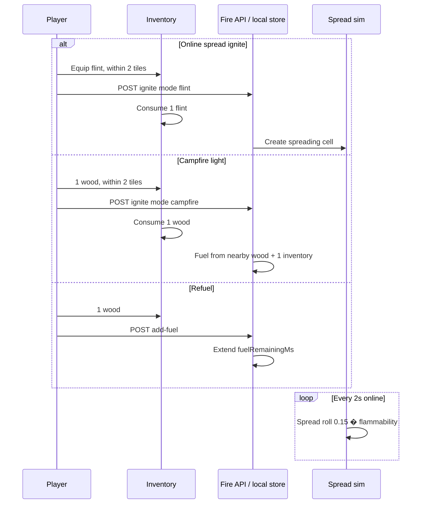
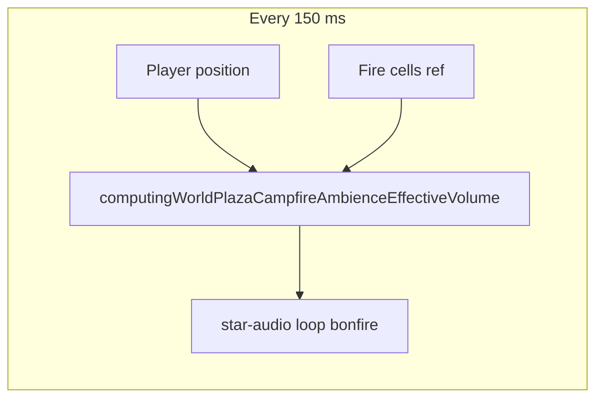
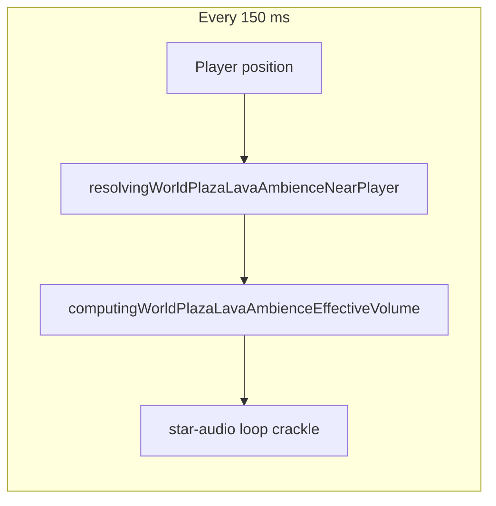

# Fire mechanics and gameplay

How fire spread, campfires, and refuel feel in play.

## Player-facing loop

## Ignite rules

### Input (controls)

| Input                                            | Fire behavior                                    |
| ------------------------------------------------ | ------------------------------------------------ |
| **Secondary click** on a tile (not primary walk) | Calls `attemptingWorldPlazaFlintIgnitionAtTile`  |
| Secondary click on `utility:campfire` block      | Skipped here; campfire popover owns light/refuel |
| Primary click                                    | Walk / path only (no ignite)                     |

Hook: `usingWorldPlazaFlintIgnitionAttempt.ts` (wired from `renderingWorldPlazaPixiScene.tsx`).

### Online multiplayer (Redis cells)

| Action                          | Requirement                                           | Consumes    | Result                                                       |
| ------------------------------- | ----------------------------------------------------- | ----------- | ------------------------------------------------------------ |
| Spread ignite (secondary click) | Flint + flammable **placed** block within **2** tiles | **1 flint** | `kind: spreading`, `initialFuelMs = material.burnDurationMs` |
| Empty tile / no block           | Flint present                                         | none        | No-op (`false`; other handlers may run)                      |
| Campfire light                  | Wood + `utility:campfire` within **2** tiles          | **1 wood**  | `kind: campfire`, fuel from wood tier math                   |
| Refuel campfire                 | Wood + lit campfire within **2** tiles                | **1 wood**  | Adds fuel ms; bumps `inventoryFuelWoodCount`                 |

Online flint path posts `mode: 'flint'` to `WORLD_FIRE_DEVVIT_IGNITE_API_PATH`, then mirrors **1 flint** consume on the client so the next inventory save stays in sync.

### Feedback toasts (Reigncraft Sonner)

Ignite/refuel feedback uses the in-game **Reigncraft toast** stack above the minimap (`showingReigncraftToast`), not Reddit/Devvit platform toasts.

| Situation                         | Message                                  |
| --------------------------------- | ---------------------------------------- |
| Non-flammable block (online)      | That material is not flammable.          |
| Too far to ignite block (online)  | Move closer to ignite that block.        |
| Ignite succeeded (online)         | Fire started.                            |
| Ignite API failed                 | Error message, or Could not ignite fire. |
| No wood to refuel (SP)            | You need wood to fuel the fire.          |
| Too far to refuel (SP)            | Move closer to the fire.                 |
| Refuel succeeded (SP)             | Added wood to the fire.                  |
| Too far to start ground fire (SP) | Move closer to start a fire there.       |

### Single-player (local fire store)

When `onlineUserId` is null (needs `localPersistenceOwnerId`):

1. If a local fire cell already burns on that tile: wood refuels it (toasts above). No flint.
2. Else if inventory has flint: ignite a **campfire-style** cell on the ground tile (no placed block required).
3. Else: return `false` (no toast).

State lives in `managingWorldPlazaLocalFireCells` (not Redis). No wildfire spread onto structures in this SP path.

## Campfire fuel math

Total wood = **nearby placed fuel wood** + **inventory wood fed** (at light/refuel).

### Duration

| Total wood count | ms per wood         | Examples                               |
| ---------------- | ------------------- | -------------------------------------- |
| **1�3**          | **180_000** (3 min) | 1 wood ? 3 min; 3 wood ? 9 min         |
| **4+**           | **60_000** (1 min)  | 4 wood ? 4 min; 20 wood ? 20 min (cap) |

Cap: `WORLD_CAMPFIRE_FUEL_MAX_MS` = **1_200_000** (20 min).

Refuel picks tier from **current nearby placed wood** (not total fed history):

- `< 4` nearby ? add **180_000 ms** per wood
- `= 4` nearby ? add **60_000 ms** per wood

### First light (server)

On campfire ignite, server counts nearby fuel wood, adds **+1** for the consumed inventory wood, then sets `initialFuelMs` and `inventoryFuelWoodCount: 1`.

## Burn tier and flames

Nearby **placed** wood (excluding campfire tile, excluding burnt):

| Count | Burn tier | Base intensity |
| ----- | --------- | -------------- |
| 0     | weak      | 0.24           |
| 1     | small     | 0.38           |
| 2     | small     | 0.50           |
| 3     | mid       | 0.68           |
| 4     | big       | 0.86           |
| 5+    | big       | 1.0            |

**Flame sprite tier** (1�5): `nearbyPlaced + inventoryFuelWood` (each inventory wood advances one tier).

**Fuel dimming**: intensity � `(0.5 + 0.5 � fuelRatio)`; flame scale **0.65..1.0** as fuel depletes.

## Spreading fire simulation

| Parameter          | Value                          |
| ------------------ | ------------------------------ |
| Tick interval      | **2000 ms**                    |
| Base spread chance | **0.15**                       |
| Per-neighbor roll  | `random < 0.15 � flammability` |

Client polls cells every **1500 ms** (`WORLD_FIRE_DEVVIT_CELLS_POLL_INTERVAL_MS`).

### Material flammability table

See [catalog.md](./catalog.md) for all entries.

Grass surface spreads easily; campfire block has flammability **0** (cannot spread onto pit).

## Render and light

- Ground glow radius **56** px; max **24** visible glows per frame
- Campfire lightmap hole scales by burn tier; dims with fuel ratio (**0.7..1.0** radius, **0.45..1.0** brightness)
- Night emissive boost on flames: �**1.45** at midnight ([day-night](../day-night/))

## Campfire ambience (audio)

**Engine note (render perf, no player-visible change):** `renderingWorldPlazaFireLayer.tsx` clears and refills a reused `activeFireTileKeysRef` set each Pixi tick when reconciling the flame visual pool, instead of allocating a new `Set` every frame. Ignite, spread, fuel, and flame presentation rules are unchanged.

When a **lit** campfire cell is on the player's **world layer**, a looping bonfire crackle plays with distance falloff.

| Rule                 | Value                                                                                                                                         |
| -------------------- | --------------------------------------------------------------------------------------------------------------------------------------------- |
| Eligible cells       | `kind: campfire` and `fuelRemainingMs > 0` on listener `worldLayer`                                                                           |
| Source position      | Tile center (`tileX + 0.5`, `tileY + 0.5`)                                                                                                    |
| Full volume distance | **= 2** grid tiles                                                                                                                            |
| Max audible distance | **= 14** grid tiles (silent beyond)                                                                                                           |
| Falloff curve        | Squared linear between full and max distance                                                                                                  |
| Multiple campfires   | Loudest (nearest) source wins                                                                                                                 |
| Base loop volume     | **0.42** before falloff                                                                                                                       |
| Volume mixer         | Plaza **Ambience volume** slider (Settings)                                                                                                   |
| Volume resolver      | `computingWorldPlazaSfxEffectiveVolume` (base � falloff � optional clip multiplier � slider)                                                  |
| Poll interval        | **150 ms**                                                                                                                                    |
| Loop playback        | One `SoundHandle` while in range; start via `playingWorldPlazaStarAudioSfx`; each poll calls `updatingWorldPlazaStarAudioActiveSfxPlayVolume` |
| Loop restart         | Only when no handle exists, volume hits **0**, or hook unmounts                                                                               |
| Shared audio bus     | `managingWorldPlazaStarAudio.ts` (one star-audio pool per session)                                                                            |
| Asset                | `public/fire/sfx/campfire/bonfire.ogg`                                                                                                        |
| Unlock               | Same user-gesture unlock bus as other plaza star-audio hooks                                                                                  |

Extinguished or unlit campfires are silent. Spreading wildfire cells do not play this loop.

The hook does **not** restart the loop every poll tick. That avoids choppy crackle when the underlying player briefly reports `playing: false` between loop wraps.

Hook: `usingWorldPlazaCampfireAmbience.ts` via `renderingWorldPlazaCampfireAmbience.tsx` in `renderingWorldPlazaPixiScene.tsx`.

## Lava ambience (audio)

When **procedural lava tiles** or **Firelands ruin lava** sit within scan range of the player, a looping fire crackle plays with distance falloff. This is separate from lit **campfire cells** and from biome ambience beds.

| Rule                 | Value                                                                                                                                         |
| -------------------- | --------------------------------------------------------------------------------------------------------------------------------------------- |
| Eligible tiles       | `checkingWorldPlazaLavaAtTileIndex` true (Firelands pools, hot-climate sparse lava, ruin-forced lava)                                         |
| Scan radius          | **12** tiles around player floor tile (square window)                                                                                         |
| Source position      | Lava tile center (`tileX + 0.5`, `tileY + 0.5`)                                                                                               |
| Full volume distance | **= 1.5** grid tiles                                                                                                                          |
| Max audible distance | **= 12** grid tiles (silent beyond)                                                                                                           |
| Falloff curve        | Squared linear between full and max distance                                                                                                  |
| Multiple lava tiles  | Loudest (nearest) tile wins                                                                                                                   |
| Base loop volume     | **0.36** before falloff                                                                                                                       |
| Volume mixer         | Plaza **Ambience volume** slider (Settings)                                                                                                   |
| Volume resolver      | `computingWorldPlazaSfxEffectiveVolume` (base � falloff � optional clip multiplier � slider)                                                  |
| Poll interval        | **150 ms**                                                                                                                                    |
| Loop playback        | One `SoundHandle` while in range; start via `playingWorldPlazaStarAudioSfx`; each poll calls `updatingWorldPlazaStarAudioActiveSfxPlayVolume` |
| Asset                | `public/fire/sfx/campfire/bonfire.ogg` (clip id `crackle`)                                                                                    |
| Star-audio key       | `lava-ambience.crackle`                                                                                                                       |

Campfire and lava loops can both play when the player stands near a lit campfire on lava terrain (two handles, same WAV).

Hook: `usingWorldPlazaLavaAmbience.ts` via `renderingWorldPlazaLavaAmbience.tsx` in `renderingWorldPlazaPixiScene.tsx`.

Lava **920�C** hazard damage and floor tint: [environment](../environment/).

## Environment coupling

Lit campfire cell contributes **72�C** on its standing tile. Neighbors warm through 5�5 temperature average ([environment](../environment/)).

Cooking requires lit campfire + raw meat: [cooking-campfire](../cooking-campfire/).

### Firelands biome (world placement)

Procedural Firelands layout lives in `definingWorldPlazaFirelandsBiomeConstants.ts`. It scales with `DEFINING_WORLD_PLAZA_BIOME_WORLD_LINEAR_SCALE` (**4** in `definingWorldPlazaBiomeConstants.ts`).

| Player-visible effect   | Detail                                                                                                                                                                                                                                 |
| ----------------------- | -------------------------------------------------------------------------------------------------------------------------------------------------------------------------------------------------------------------------------------- |
| Far from spawn          | Firelands cannot appear within **3000** tiles of origin (base **750** x world scale **4**).                                                                                                                                            |
| Larger volcanic regions | Body noise spans ~**1040** tiles (was ~**260**).                                                                                                                                                                                       |
| Sparser landmarks       | Volcano and ruin anchors sit on a **192**-tile grid (was **48**).                                                                                                                                                                      |
| No trees or rocks       | Open-ground scatter is **mini-volcano** (large) and **lava_plant** (small) only. No `lava_tree` / `volcanic_rock` rolls. Procedural column rocks and pebbles also stay out of Firelands. Ruins, full volcanoes, and lava pools remain. |

**Unchanged in this pass:** flint ignite, wildfire spread, campfire light/refuel, fuel tiers, and **62C** Firelands ambient floor ([environment](../environment/)). Lava tile heat (**920C**) and campfire warmth (**72C**) use the same rules as before. Lava ambience loop unchanged (see above).

**This pass:** Firelands open-ground scatter no longer mixes lava trees or volcanic rocks (`resolvingWorldPlazaFirelandsPropAtTileIndex.ts`). Biomes Guide foraging list drops stone / scorched stumps to match.

World-scale context: [biome-discovery](../biome-discovery/).

## Multiplayer note

| Mode         | Fire state                           |
| ------------ | ------------------------------------ |
| Online room  | Shared Redis cells; all clients poll |
| No room / SP | Local fire store only                |

Details: [multiplayer](../multiplayer/).

## Design knobs

| Knob                  | Location                                         |
| --------------------- | ------------------------------------------------ |
| Spread tick / chance  | `worldFireDevvit.ts`                             |
| Material flammability | `WORLD_FIRE_DEVVIT_MATERIAL_PROPERTIES`          |
| Fuel minutes per wood | `worldCampfireFuel.ts`                           |
| Burn tier light/flame | `WORLD_CAMPFIRE_BURN_TIER_*`                     |
| Interaction range     | `WORLD_FIRE_DEVVIT_INTERACTION_RADIUS_TILES`     |
| Glow render cap       | `definingWorldPlazaFireConstants.ts`             |
| Campfire ambience     | `definingWorldPlazaCampfireAmbienceConstants.ts` |
| Lava ambience         | `definingWorldPlazaLavaAmbienceConstants.ts`     |

## Edge cases

- **Burnt wood blocks** do not count as fuel.
- **Campfire tile** never counts as its own fuel wood neighbor.
- **Extinguished campfire** metadata cleared on successful re-light.
- **Flint on empty tile online** fails (needs flammable placed block).
