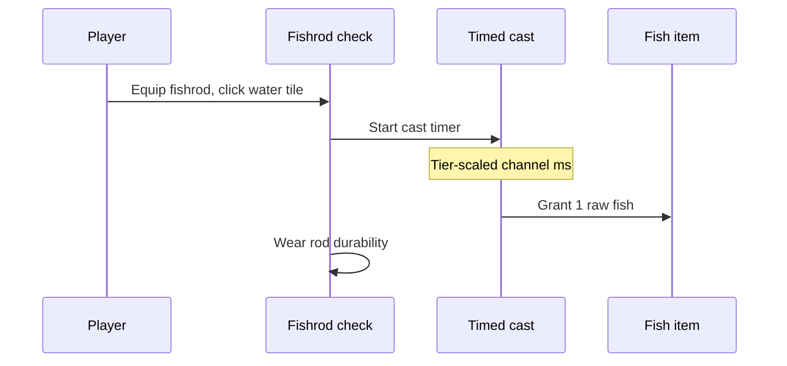

# Fishing mechanics and gameplay

## Player-facing loop

## Cast rules

| Rule           | Value                           |
| -------------- | ------------------------------- |
| Required tool  | Fishrod equipped                |
| Target         | Adjacent liquid, unfrozen water |
| Player range   | **2** tiles (Chebyshev)         |
| Fish per catch | **1** (`world-plaza-fish`)      |
| Base channel   | **2200 ms**                     |

### Cast duration by tier

`durationMs = round(2200 × tierMultiplier / harvestSpeedMultiplier)`

| Tier  | Multiplier |
| ----- | ---------- |
| wood  | **1.00**   |
| iron  | **0.88**   |
| steel | **0.76**   |
| gold  | **0.64**   |

Higher-tier rods and `harvestSpeedMultiplier` on the item shorten the channel.

## Food outcome

Raw fish restores hunger per `DEFINING_WORLD_PLAZA_HUNGER_RESTORE_FISH` and may trigger raw-sickness like other uncooked meat (**8%** chance).

## Runtime pipeline

1. Primary click on ground → `handlingToolGroundPointerSelection` selects water tile key.
2. `RenderingWorldPlazaFishingInteractionLabels` shows **Fish** affordance.
3. `usingWorldPlazaFishingProgress` runs shared timed interaction.
4. `usingWorldPlazaFishingInteraction` validates water, wears rod, stacks fish into inventory.

## Code entry points

| Step         | Module                                               |
| ------------ | ---------------------------------------------------- |
| Eligibility  | `checkingWorldPlazaFishingCastEligibility.ts`        |
| Listing      | `listingWorldPlazaFishingTilesInInteractionRange.ts` |
| Progress     | `usingWorldPlazaFishingProgress.ts`                  |
| Complete     | `usingWorldPlazaFishingInteraction.ts`               |
| Scene wiring | `renderingWorldPlazaPixiScene.tsx`                   |
