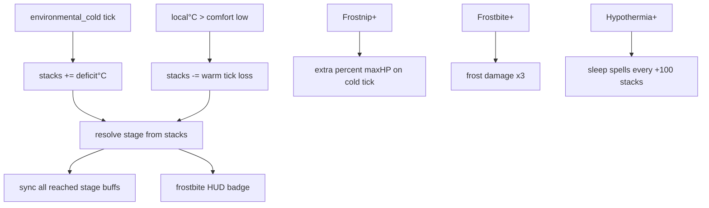
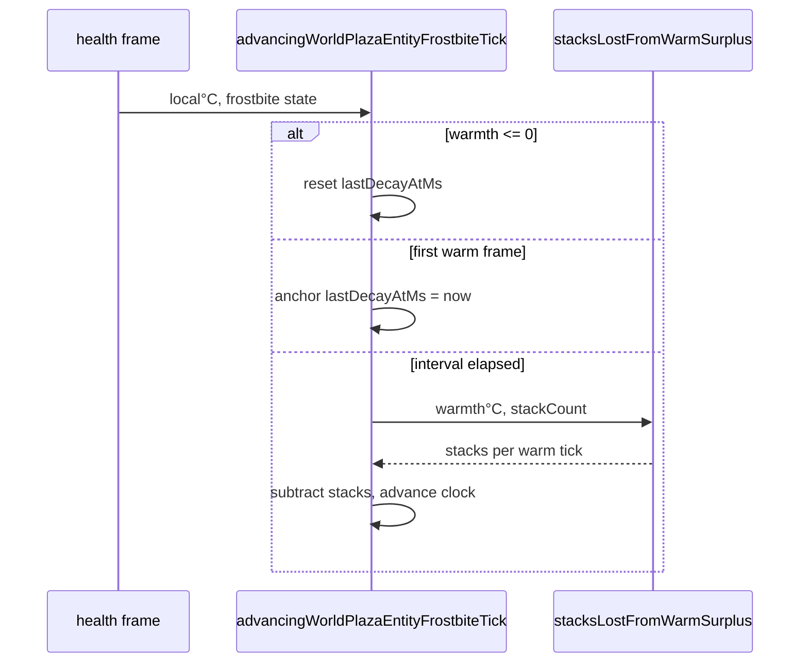

# Frostbite mechanics

## Player loop



## Stages

| Stacks | Stage | Tier effects (speed and stamina regen are linear; see below) |
| ------ | ----- | ------- |
| 0–49 | none | — |
| 50 | Chilled | stage label only |
| 100 | Numb | stamina max ×0.80 |
| 200 | Frostnip | outgoing damage ×0.85; ambient cold + percent maxHP |
| 500 | Hypothermia | stamina max ×0.50; jump ×0.50; outgoing ×0.75; confusion; sleep spells |
| 750 | Frostbite | cannot jump; frost damage ×3; outgoing ×0.50 |
| 1000 | Necrotic | stun immobilize; heal blocked; icy tint |

**Walk speed (linear):** `walkSpeedMultiplier = 1 - 0.75 × (stacks / 1000)`. At 0 stacks: full walk speed. At 1000: 75% slower walking (×0.25). Sprint/run still uses normal speed multipliers until Necrotic immobilize forces speed 0.

**Stamina regen (linear):** same formula as walk speed. At 1000: 75% slower regen (×0.25).

**Inheritance:** every reached tier's other buffs stay active. Overlapping stamina max, jump, and outgoing-damage modifiers keep the **harshest** value only. Unique prior effects still apply (example: Numb stamina max ×0.80 remains at Frostnip).

## Gain and decay

Both use the same environmental temperature tick interval (**1000 ms**; `DEFINING_WORLD_PLAZA_ENTITY_HEALTH_ENVIRONMENTAL_TEMPERATURE_TICK_INTERVAL_MS`).

### Cold gain

Each `environmental_cold` damage tick adds:

```
stacks += deficit°C × STACKS_PER_DEFICIT_CELSIUS
```

- **deficit°C** = `max(0, comfortLow − local°C)`
- Default **1 stack per °C** below comfort low
- Example: comfort −10°C at local −20°C → **+10 stacks** that tick

Source: `usingWorldPlazaPlayerHealth.ts` → `computingWorldPlazaFrostbiteStacksGainedFromColdDeficit.ts`

### Warm decay

Each warm tick removes stacks while **local°C is strictly above comfort low** (`warmth°C = local°C − comfortLow > 0`):

```
stacks -= warmth°C × STACKS_PER_DEFICIT_CELSIUS
```

- **1:1 mirror of cold gain:** no stack-count multiplier on recovery
- **Warmer = faster:** +69°C above comfort (e.g. local 59°C with default comfort low −10°C) → **−69 stacks per tick**
- **No decay at or below comfort low:** if the cold `/s` badge is still active, you are still in deficit and stacks will not drop
- Example: 500 stacks at local 59°C → **−69 stacks per tick** (~69/s)

Source: `advancingWorldPlazaEntityFrostbiteTick.ts` → `computingWorldPlazaFrostbiteStacksLostFromWarmSurplus.ts`

### Decay clock

On the first frame where warmth > 0, `lastDecayAtMs` is anchored to the current time. After one full tick interval elapses, the first warm decay tick fires and the clock advances by whole intervals. Leaving the warm zone (warmth ≤ 0) resets `lastDecayAtMs` so re-entry starts a fresh clock.



## Frostnip damage

On each cold tick at Frostnip+:

```
total = ambientColdTick + (effectiveMaxHealth × (base + stacks × 0.01) / 100)
```

At Frostbite+, both ambient and percent pieces are multiplied by 3.

## HUD

Status badge shows live **stack count** (ticks up as cold stacks build). Tap for stage name and inherited effect list only; stack number is not repeated in the popover. The separate **cold `/s` badge** includes ambient cold plus Frostnip+ percent max HP (and Frostbite+ multipliers), using the same tick math as combat.

## Debug

Dev panel → Health → Frostbite: jump to each stage, clear, ±10 / ±50.

## Player Guide

| Guide | Status |
| ----- | ------ |
| Controls | N/A |
| Mechanics Guide | Updated: Frost (Cold) entry mentions warm recovery above comfort low |
| Biomes Guide | N/A |
| Bestiary | N/A |
