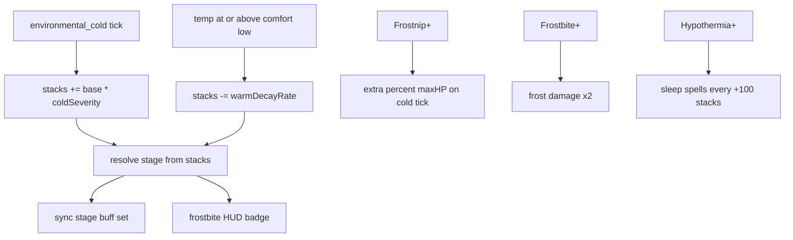

# Frostbite mechanics

## Player loop



## Stages

| Stacks | Stage | Effects |
| ------ | ----- | ------- |
| 0–49 | none | — |
| 50 | Chilled | speed ×0.90 |
| 100 | Numb | speed ×0.85; stamina max ×0.80; stamina regen ×0.80 |
| 200 | Frostnip | speed ×0.70; outgoing damage ×0.85; ambient cold + percent maxHP |
| 500 | Hypothermia | speed ×0.50; stamina max ×0.50; jump ×0.50; outgoing ×0.75; confusion; sleep spells |
| 750 | Frostbite | speed ×0.25; cannot jump; frost damage ×2; outgoing ×0.50 |
| 1000 | Necrotic | speed ×0; stun immobilize; heal blocked; icy tint |

Only the **current** stage buff set is active (no stacking stage speeds).

## Gain and decay

- **Gain:** each cold damage tick adds `BASE_STACKS_PER_COLD_TICK × (1 + deficit°C / REFERENCE_DEFICIT)`.
- **Decay:** while `local°C ≥ comfortLow`, lose stacks at `BASE + warmth°C × PER_CELSIUS` per second.

## Frostnip damage

On each cold tick at Frostnip+:

```
total = ambientColdTick + (effectiveMaxHealth × (base + stacks × 0.01) / 100)
```

At Frostbite+, both ambient and percent pieces are multiplied by 2.

## Debug

Dev panel → Health → Frostbite: jump to each stage, clear, ±10 / ±50.

## Player Guide

N/A for Controls / Biomes / Bestiary. Mechanics Guide: optional one-line cold exposure note later; not required for v1.
