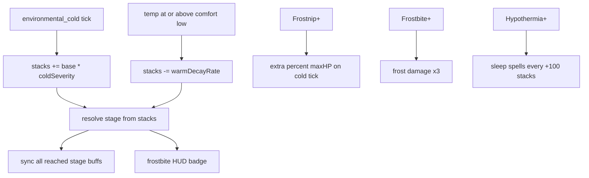

# Frostbite mechanics

## Player loop



## Stages

| Stacks | Stage | Tier effects (speed and stamina regen are linear; see below) |
| ------ | ----- | ------- |
| 0–49 | none | — |
| 50 | Chilled | stage label only |
| 100 | Numb | stamina max ×0.80 |
| 200 | Frostnip | outgoing damage ×0.85; ambient cold + percent maxHP |
| 500 | Hypothermia | stamina max ×0.50; jump ×0.50; outgoing ×0.75; confusion; sleep spells |
| 750 | Frostbite | cannot jump; frost damage ×3; outgoing ×0.50 |
| 1000 | Necrotic | stun immobilize; heal blocked; icy tint |

**Walk speed (linear):** `walkSpeedMultiplier = 1 - 0.75 × (stacks / 1000)`. At 0 stacks: full walk speed. At 1000: 75% slower walking (×0.25). Sprint/run still uses normal speed multipliers until Necrotic immobilize forces speed 0.

**Stamina regen (linear):** same formula as walk speed. At 1000: 75% slower regen (×0.25).

**Inheritance:** every reached tier's other buffs stay active. Overlapping stamina max, jump, and outgoing-damage modifiers keep the **harshest** value only. Unique prior effects still apply (example: Numb stamina max ×0.80 remains at Frostnip).

## Gain and decay

- **Gain:** each cold damage tick adds `deficit°C × STACKS_PER_DEFICIT_CELSIUS` (default 1 stack per °C below comfort low). Example: comfort −10°C at local −20°C → +10 stacks that tick.
- **Decay:** while `local°C ≥ comfortLow`, lose stacks at `BASE + warmth°C × PER_CELSIUS` per second.

## Frostnip damage

On each cold tick at Frostnip+:

```
total = ambientColdTick + (effectiveMaxHealth × (base + stacks × 0.01) / 100)
```

At Frostbite+, both ambient and percent pieces are multiplied by 3.

## HUD

Status badge shows live **stack count** (ticks up as cold stacks build). Tap for stage name and inherited effect list only; stack number is not repeated in the popover. The separate **cold `/s` badge** includes ambient cold plus Frostnip+ percent max HP (and Frostbite+ multipliers), using the same tick math as combat.

## Debug

Dev panel → Health → Frostbite: jump to each stage, clear, ±10 / ±50.

## Player Guide

N/A for Controls / Biomes / Bestiary. Mechanics Guide: optional one-line cold exposure note later; not required for v1.
