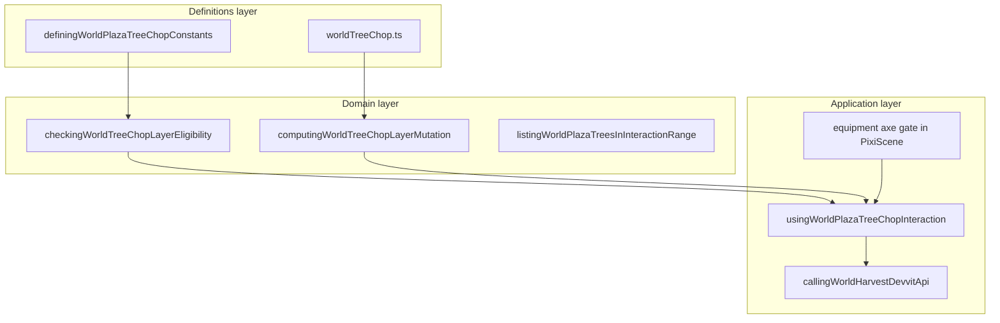

# Harvest bounded context (DDD)

|                  |            |
| ---------------- | ---------- |
| **Version**      | 1.0.0      |
| **Last updated** | 2026-07-08 |

Plaza **harvest** covers tree chopping: timed swings, wood yield, stump state, and persistence per tile.

## Docs in this folder

| File | Purpose |
| ---- | ------- |
| [glossary.md](./glossary.md) | Swing, layer, range, and persistence terms |
| [mechanics.md](./mechanics.md) | Chop loop, timing formula, pointer hit |
| [catalog.md](./catalog.md) | Constants table and code touchpoints |

## DDD map

### Bounded context

**Plaza Tree Harvest** — remove visual trunk layers from procedural trees, grant wood to inventory or ground drops, leave stumps, persist chop state per tile.

Touches **Inventory** (wood item), **Equipment** (axe gate), **Movement** (player range), and **Multiplayer** (Redis chop state vs local persistence). Does not own tree procedural placement.

### Aggregates

| Aggregate | Root | Responsibility |
| --------- | ---- | -------------- |
| **Chopped tree tile** | `WorldTreeChopTileState` / `DefiningWorldPlazaChoppedTreeTileState` | `remainingVisualLayer`, `isStump` per tile key |
| **Chop swing** | Timed interaction | One completed swing removes up to **3** layers |

### Value objects

- Tile key — `"tileX,tileY"` (`formattingWorldTreeChopTileKey`)
- Wood per layer — **2**
- Layers per swing — **3**
- Chebyshev player range — **2** tiles

### Domain services (pure)

| Service | File |
| ------- | ---- |
| Eligibility check | `checkingWorldTreeChopLayerEligibility` (`worldTreeChop.ts`) |
| Layer mutation | `computingWorldTreeChopLayerMutation` (`worldTreeChop.ts`) |
| Pointer distance | `computingWorldPlazaTreeChopPointerDistanceFromFootprint.ts` |
| Trees in range | `listingWorldPlazaTreesInInteractionRange.ts` |

### Application layer

| Use case | Entry |
| -------- | ----- |
| Timed chop interaction | `usingWorldPlazaTreeChopInteraction.ts` |
| Pointer tree resolve | `resolvingWorldPlazaInteractableTreeFromPointerGridPoint.ts` |
| Online chop API | `callingWorldHarvestDevvitApi.ts` |
| Local persistence | `managingWorldPlazaLocalChoppedTrees.ts` |
| Wood ground drop | `droppingWorldPlazaTreeChopWoodGroundItem.ts` |

### Declarative registries (source of truth)

| Registry | File |
| -------- | ---- |
| Client chop constants | `src/client/world/harvest/domains/definingWorldPlazaTreeChopConstants.ts` |
| Shared chop rules | `src/shared/worldTreeChop.ts` |
| Timed interaction UI | `definingWorldPlazaTreeChopTimedInteractionConstants.ts` |

## Layer diagram

## Cross-context links

- Wood item: [inventory-food](../inventory-food/)
- Fire fuel wood: [fire](../fire/)
- Equipment axe: [characters](../characters/) / equipment engine

## Related AI references

- Tuning numbers: [memory/game-mechanics-reference.md](../../../memory/game-mechanics-reference.md) (section 13, harvest)
- Engine wiring: [memory/game-engines-reference.md](../../../memory/game-engines-reference.md)
