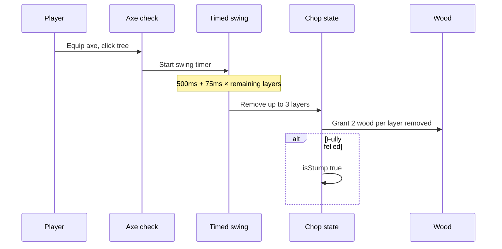
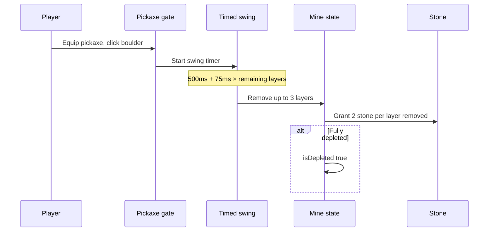

# Harvest mechanics and gameplay

How tree chopping and rock mining feel, and how wood/stone are granted.

## Player-facing loop (trees)



## Player-facing loop (rocks)



## Chop rules

| Rule                   | Value         |
| ---------------------- | ------------- |
| Wood per layer removed | **2**         |
| Max layers per swing   | **3**         |
| Max wood per swing     | **6** (3 × 2) |
| Player Chebyshev range | **2** tiles   |
| Required tool          | Axe (soft gate today) |

### Swing duration

```
durationMs = 500 + 75 × choppableLayersRemaining
```

Examples:

| Choppable layers left | Swing time  |
| --------------------- | ----------- |
| 12                    | **1400 ms** |
| 6                     | **950 ms**  |
| 3                     | **725 ms**  |
| 1                     | **575 ms**  |

Constants: `DEFINING_WORLD_PLAZA_TREE_CHOP_BASE_DURATION_MS`, `DEFINING_WORLD_PLAZA_TREE_CHOP_DURATION_PER_REMAINING_LAYER_MS`.

### Felling

When `remainingVisualLayer <= standingSurfaceLayer`:

- Set `isStump: true`
- Stump height **14 px**, width **×1.35** trunk multiplier
- Further chops return `already-felled`

## Rock mine rules

Same economy as trees, keyed by **rock anchor** (not every footprint tile):

| Rule                   | Value         |
| ---------------------- | ------------- |
| Stone per layer removed | **2**        |
| Max layers per swing   | **3**         |
| Max stone per swing    | **6** (3 × 2) |
| Player Chebyshev range | **2** tiles to footprint center |
| Required tool          | Pickaxe equipped (hard gate) |

Duration formula matches trees (`ROCK_MINE_BASE_DURATION_MS` + per remaining layer).

### Depletion

When `remainingVisualLayer <= ground layer`:

- Set `isDepleted: true`
- Column rock graphics and collision disappear
- Further mines return `already-depleted`

Standing floor for mine math is the ground world layer (**1**); rock height is absolute surface layer minus ground.

## Targeting (trees)

Players can click trunk or canopy:

- Trunk: Chebyshev distance to tile center ≤ **2**
- Pointer: searches **3** tile radius; canopy uses **1.08** hit radius multiplier
- **8 px** padding on trunk silhouette for small screens

Resolver: `resolvingWorldPlazaInteractableTreeFromPointerGridPoint.ts`.

## Targeting (rocks)

Players click any tile in a mega-boulder footprint:

- Resolve to spacing **anchor** via column-rock metadata
- Player range measured to footprint center
- Pointer search radius **4** tiles (footprints up to 6×6)
- Hit uses max of collision radius and **1.2** tile pad

Resolver: `resolvingWorldPlazaInteractableRockFromPointerGridPoint.ts`.

## Persistence modes

| Session         | Owner id                  | Trees                                         | Rocks                                         |
| --------------- | ------------------------- | --------------------------------------------- | --------------------------------------------- |
| Reddit online   | `redditUserId`            | Redis `/chopped-trees`, `/chop-tree`          | Redis `/mined-rocks`, `/mine-rock`            |
| Local / SP slot | `localPersistenceOwnerId` | localStorage `world-plaza-chopped-trees`      | localStorage `world-plaza-mined-rocks`        |

Hooks: `usingWorldPlazaTreeChopInteraction.ts`, `usingWorldPlazaRockMineInteraction.ts`.

On success, wood/stone drop as ground items (`droppingWorldPlazaTreeChopWoodGroundItem.ts`, `droppingWorldPlazaRockMineStoneGroundItem.ts`).

## Shared mutation (server and client)

`computingWorldTreeChopLayerMutation` in `worldTreeChop.ts`:

1. `checkingWorldTreeChopLayerEligibility`
2. `layersRemoved = min(3, choppableLayers)`
3. `woodQuantity = layersRemoved × 2`
4. Return `nextTileState`

Server route mirrors the same math for authoritative online chops.

## Tiered axes and pickaxes

Wood, iron, steel, and gold axes share the chop loop; pickaxes share the mine loop. Higher tiers raise `harvestSpeedMultiplier` (**1.0–1.6**) and max durability per `definingWorldPlazaToolTierConstants.ts`. Wood Axe (`world-plaza-axe`) and Wood Pickaxe (`world-plaza-pickaxe`) are starter tools. New inventories get both. Held overlay is currently **off** (see below); pickaxe reuses the axe sheet id until `pickaxes.png` ships.

## Held tool overlay

**Currently disabled.** `DEFINING_WORLD_PLAZA_HELD_ITEM_OVERLAY_ENABLED` in `definingWorldPlazaHeldItemTypes.ts` is **`false`**. Equipping a tool does not draw a floating sprite on the local or remote avatar. Inventory glyphs, tool kinds, harvest speed, and chop timing still work. Set the flag to **`true`** to restore overlays.

When enabled, the equipped tool sprite follows the avatar with a per-facing pose: a hand offset in avatar-frame px, a carry tilt, and a behind-avatar flag for the three facing-away directions. Base scale is **3.8×** the avatar sprite scale (scythe **4.2×**, fishing rod **3.5×**) with nearest-neighbor filtering for crisp pixels. Full pose table and per-tool offsets: [catalog.md](./catalog.md#held-tool-overlay-presentation).

During a chop (when enabled), the tool plays a keyframed swing on top of the carry pose: windup behind the shoulder, strike across the body, short follow-through, back to carry. One cycle lasts **520 ms** and loops until the timed interaction ends. Each of the 8 facings has its own keyframe track; eating does not swing. Exact phases and offsets: [catalog.md](./catalog.md#swing-move-set-tool-actions).

## Design knobs

| Knob             | Location                                              |
| ---------------- | ----------------------------------------------------- |
| Wood yield       | `TREE_CHOP_WOOD_PER_LAYER`                            |
| Stone yield      | `ROCK_MINE_STONE_PER_LAYER` / `WORLD_ROCK_MINE_*`     |
| Layers per swing | `*_LAYERS_PER_SWING`                                  |
| Swing timing     | `*_BASE/DURATION_PER_REMAINING_LAYER_MS`              |
| Player range     | `*_PLAYER_RANGE_TILES`                                |
| Hit radii        | Tree `POINTER_HIT_*`; rock `ROCK_MINE_POINTER_HIT_*`  |
| Stump visuals    | `TREE_STUMP_HEIGHT_PX`, `TREE_STUMP_WIDTH_MULTIPLIER` |

## Edge cases

- **No persistence owner**: Toast that chop/mine is unavailable in this session.
- **No pickaxe**: Toast "Equip a pickaxe to mine rocks."
- **Concurrent swings**: `isCompletionPendingRef` blocks double completion.
- **Tall tree on slope**: `standingSurfaceLayer` prevents chopping below walkable floor.
- **Multi-tile boulder**: Persist and select by anchor; any footprint click maps to that anchor.
- **Fire spread on trees**: `natural:tree:oak` is flammable ([fire](../fire/)); chop state independent of burn.
- **Pebbles**: Only medium+ column rocks are mineable; floor pebbles stay decoration.
