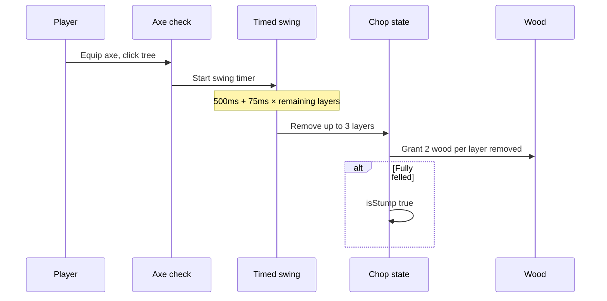

# Harvest mechanics and gameplay

How tree chopping feels and how wood is granted.

## Player-facing loop



## Chop rules

| Rule | Value |
| ---- | ----- |
| Wood per layer removed | **2** |
| Max layers per swing | **3** |
| Max wood per swing | **6** (3 × 2) |
| Player Chebyshev range | **2** tiles |
| Required tool | Axe equipped |

### Swing duration

```
durationMs = 500 + 75 × choppableLayersRemaining
```

Examples:

| Choppable layers left | Swing time |
| --------------------- | ---------- |
| 12 | **1400 ms** |
| 6 | **950 ms** |
| 3 | **725 ms** |
| 1 | **575 ms** |

Constants: `DEFINING_WORLD_PLAZA_TREE_CHOP_BASE_DURATION_MS`, `DEFINING_WORLD_PLAZA_TREE_CHOP_DURATION_PER_REMAINING_LAYER_MS`.

### Felling

When `remainingVisualLayer <= standingSurfaceLayer`:

- Set `isStump: true`
- Stump height **14 px**, width **×1.35** trunk multiplier
- Further chops return `already-felled`

## Targeting

Players can click trunk or canopy:

- Trunk: Chebyshev distance to tile center ≤ **2**
- Pointer: searches **3** tile radius; canopy uses **1.08** hit radius multiplier
- **8 px** padding on trunk silhouette for small screens

Resolver: `resolvingWorldPlazaInteractableTreeFromPointerGridPoint.ts`.

## Persistence modes

| Session | Owner id | Storage |
| ------- | -------- | ------- |
| Reddit online | `redditUserId` | Redis via `/api/world-harvest` |
| Local / SP slot | `localPersistenceOwnerId` | localStorage prefix `world-plaza-chopped-trees` |

Hook: `usingWorldPlazaTreeChopInteraction.ts` picks path via `checkingWorldPlazaChoppedTreesUseLocalPersistence`.

On success, wood may enter inventory or drop as ground item (`droppingWorldPlazaTreeChopWoodGroundItem.ts`) depending on bag space.

## Shared mutation (server and client)

`computingWorldTreeChopLayerMutation` in `worldTreeChop.ts`:

1. `checkingWorldTreeChopLayerEligibility`
2. `layersRemoved = min(3, choppableLayers)`
3. `woodQuantity = layersRemoved × 2`
4. Return `nextTileState`

Server route mirrors the same math for authoritative online chops.

## Design knobs

| Knob | Location |
| ---- | -------- |
| Wood yield | `TREE_CHOP_WOOD_PER_LAYER` |
| Layers per swing | `TREE_CHOP_LAYERS_PER_SWING` |
| Swing timing | `TREE_CHOP_BASE/DURATION_PER_REMAINING_LAYER_MS` |
| Player range | `TREE_CHOP_PLAYER_RANGE_TILES` |
| Hit radii | `POINTER_HIT_*`, `CANOPY_POINTER_HIT_*` |
| Stump visuals | `TREE_STUMP_HEIGHT_PX`, `TREE_STUMP_WIDTH_MULTIPLIER` |

## Edge cases

- **No persistence owner**: Toast "Tree chopping is unavailable in this session."
- **Concurrent swings**: `isCompletionPendingRef` blocks double completion.
- **Tall tree on slope**: `standingSurfaceLayer` prevents chopping below walkable floor.
- **Fire spread on trees**: `natural:tree:oak` is flammable ([fire](../fire/)); chop state independent of burn.
