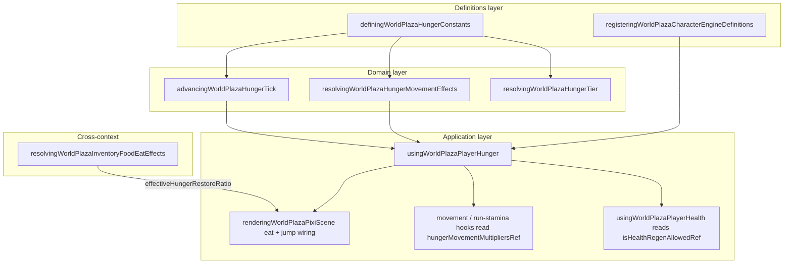

# Hunger bounded context (DDD)

|                  |            |
| ---------------- | ---------- |
| **Version**      | 1.0.0      |
| **Last updated** | 2026-07-08 |

Plaza **hunger** tracks how full the local player is as a 0..1 ratio, drains it by activity, gates health regen, applies tier movement penalties, and rolls starvation damage when the bar bottoms out.

## Docs in this folder

| File | Purpose |
| ---- | ------- |
| [glossary.md](./glossary.md) | Ubiquitous language: terms every contributor should use the same way |
| [mechanics.md](./mechanics.md) | Player-facing gameplay and the runtime pipeline |
| [catalog.md](./catalog.md) | Tier thresholds, restore constants, metabolism multipliers per avatar |

## DDD map

### Bounded context

**Plaza Player Hunger** — client-authoritative hunger ratio, drain, tier effects, starvation ticks, and HUD snapshot for the local avatar.

Touches **Movement/Stamina**, **Entity Health** (regen gate, starvation damage), **Inventory/Food** (restore on eat), and **Characters** (per-skin metabolism). Does not own food disease rolls or combat damage.

### Aggregates

| Aggregate | Root | Responsibility |
| --------- | ---- | -------------- |
| **Hunger state** | `DefiningWorldPlazaHungerState` | `hungerRatio` (0..1) and `lastStarvationTickAtMs` for tick gating |
| **Hunger HUD snapshot** | `UsingWorldPlazaPlayerHungerHudSnapshot` | Throttled React state: ratio, named tier, starving flag |

Hunger is **not** persisted to save slots today. It resets on respawn and when hunger is disabled (edit sessions).

### Value objects

- `DefiningWorldPlazaHungerTier` — `well_fed | content | peckish | hungry | starving`
- `DEFINING_WORLD_PLAZA_HUNGER_TIER_THRESHOLD` — ratio cutoffs (0.75, 0.4, 0.2, 0.05)
- `ResolvingWorldPlazaHungerMovementEffects` — speed, stamina, jump multipliers plus sprint/jump/health-drain flags
- Hunger ratio — clamped 0..1; 1 = full, 0 = empty

### Domain services (pure)

| Service | File |
| ------- | ---- |
| Resolve tier from ratio | `resolvingWorldPlazaHungerTier` in `definingWorldPlazaHungerConstants.ts` |
| Resolve movement/stamina effects | `resolvingWorldPlazaHungerMovementEffects.ts` |
| Advance drain + starvation tick | `advancingWorldPlazaHungerTick.ts` |

### Application layer

| Use case | Entry |
| -------- | ----- |
| Own hunger loop + refs | `usingWorldPlazaPlayerHunger.ts` |
| Eat food restore | `eatingFoodRef` called from `renderingWorldPlazaPixiScene.tsx` after eat effects |
| Jump hunger spend | `consumingJumpHungerRef` wired into movement |
| HUD indicator | Hunger bar above hotbar (inventory overlay) |
| Regen gate | `isHealthRegenAllowedRef` written each frame for health hook |

### Infrastructure

| Concern | File |
| ------- | ---- |
| Frame scheduler | `subscribingWorldPlazaDomOverlayFrame` (shared DOM overlay rAF) |
| Scene integration | `renderingWorldPlazaPixiScene.tsx` (hunger hook + eat callback) |
| Character metabolism | `selectedCharacterEngineDefinition.stats.hungerDrainMultiplier` |

### Declarative registries (source of truth)

| Registry | File |
| -------- | ---- |
| Hunger constants + tier resolver | `src/client/world/hunger/domains/definingWorldPlazaHungerConstants.ts` |
| Movement tier effects | `src/client/world/hunger/domains/resolvingWorldPlazaHungerMovementEffects.ts` |
| Initial state shape | `src/client/world/hunger/domains/definingWorldPlazaHungerTypes.ts` |
| Avatar metabolism | `src/client/world/character/domains/registeringWorldPlazaCharacterEngineDefinitions.ts` |

## Layer diagram

## How to tune hunger

1. **Drain speed** — edit `DEFINING_WORLD_PLAZA_HUNGER_IDLE_DRAIN_DURATION_MS` (currently 1.5 in-game days). Walk/sprint multipliers sit beside it.
2. **Tier thresholds** — edit `DEFINING_WORLD_PLAZA_HUNGER_TIER_THRESHOLD` and matching multipliers in the same file; mirror changes in `resolvingWorldPlazaHungerMovementEffects.ts` if tier behavior changes.
3. **Starvation lethality** — edit `DEFINING_WORLD_PLAZA_HUNGER_STARVATION_TIME_TO_DEATH_MS` (2 in-game days) and tick interval; percent-per-tick is derived automatically.
4. **Food restore** — generic berries/apple/cooked constants in hunger file; species meat in `definingWildlifeMeatRegistry.ts` (see [inventory-food](../inventory-food/)).
5. **Per-avatar metabolism** — `hungerDrainMultiplier` on each row in `registeringWorldPlazaCharacterEngineDefinitions.ts`.
6. **Regen gate** — `DEFINING_WORLD_PLAZA_HUNGER_HEALTH_REGEN_MIN_RATIO` (30%).
7. **Verify** — play idle, walk, sprint drain; hit starving tier; eat while diseased (restore should halve via inventory-food).

No tick-runner changes needed when only constants move.

## Related contexts

- Restore and sickness penalty: [inventory-food](../inventory-food/)
- Symptomatic disease halves restore: [disease](../disease/)
- Meat cooking before eat: [cooking-campfire](../cooking-campfire/)
- Starvation damage and regen: [combat](../combat/)
- Avatar metabolism table: [characters](../characters/)
- In-game day scale: [shared/in-game-time.md](../../shared/in-game-time.md)

## Related AI references

- Engine wiring: [memory/game-engines-reference.md](../../../memory/game-engines-reference.md) (Hunger row)
- Tuning numbers: [memory/game-mechanics-reference.md](../../../memory/game-mechanics-reference.md) (section 6)
