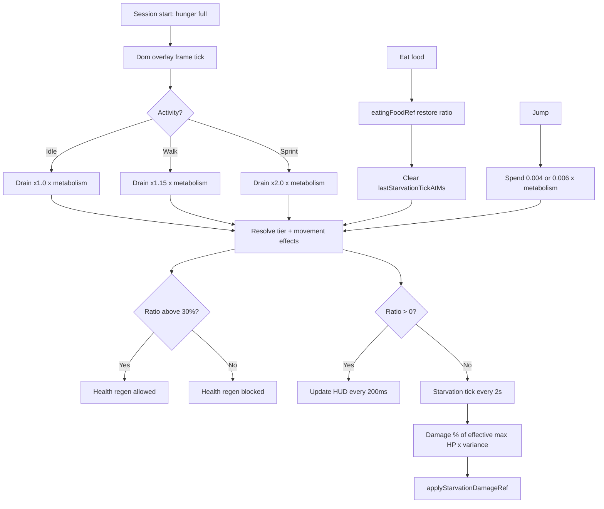

# Hunger mechanics and gameplay

How hunger feels in play and how the runtime executes drain, tiers, and starvation.

## Player-facing loop

## Time scale

| Duration | Real time | In-game time |
| -------- | --------- | ------------ |
| 1 in-game day | 40 min | 1 day |
| Full bar drain (idle) | 60 min | 1.5 days |
| Full bar drain (walk only) | ~52 min | ~1.3 days |
| Full bar drain (sprint only) | 30 min | 0.75 day |
| Starvation death from full HP | 80 min | 2 days |

**Source:** `DEFINING_WORLD_PLAZA_DAY_NIGHT_CYCLE_DURATION_MS` = **2,400,000 ms** (40 min). Hunger durations are multiples of that constant. See [shared/in-game-time.md](../../shared/in-game-time.md).

## Drain numbers

| Constant | Value | Player effect |
| -------- | ----- | ------------- |
| `DEFINING_WORLD_PLAZA_HUNGER_IDLE_DRAIN_DURATION_MS` | 3,600,000 ms (60 min) | Full to empty at rest |
| `DEFINING_WORLD_PLAZA_HUNGER_IDLE_DRAIN_PER_SECOND` | 1/3600 ≈ 0.000278/s | Derived from duration |
| `DEFINING_WORLD_PLAZA_HUNGER_WALK_DRAIN_MULTIPLIER` | 1.15 | Faster drain while moving |
| `DEFINING_WORLD_PLAZA_HUNGER_SPRINT_DRAIN_MULTIPLIER` | 2.0 | Fastest drain while sprinting |
| `DEFINING_WORLD_PLAZA_HUNGER_JUMP_COST_RATIO` | 0.004 | Standing/walk jump spend |
| `DEFINING_WORLD_PLAZA_HUNGER_RUN_JUMP_COST_RATIO` | 0.006 | Run jump spend |
| `DEFINING_WORLD_PLAZA_HUNGER_HEALTH_REGEN_MIN_RATIO` | 0.3 (30%) | Regen blocked at or below |

## Tier table

| Tier | Ratio range | Speed | Stamina drain | Stamina regen | Jump cost | Sprint | Jump | Health drain |
| ---- | ----------- | ----- | ------------- | ------------- | --------- | ------ | ---- | ------------ |
| **Well fed** | ≥75% | 1.0 | 1.0 | **1.1** | 1.0 | Yes | Yes | No |
| **Content** | 40–75% | 1.0 | 1.0 | 1.0 | 1.0 | Yes | Yes | No |
| **Peckish** | 20–40% | 1.0 | **1.25** | 1.0 | **1.25** | Yes | Yes | No |
| **Hungry** | 5–20% | **0.9** | 1.0 | 1.0 | **1.5** | **No** | Yes | No |
| **Starving** | &lt;5% (to 0) | **0.8** | 1.0 | 1.0 | 1.0 | **No** | **No** | **Yes** |

Tier resolution: `resolvingWorldPlazaHungerTier` in `definingWorldPlazaHungerConstants.ts`. Effects: `resolvingWorldPlazaHungerMovementEffects.ts`.

Movement systems read `hungerMovementMultipliersRef` every frame. Hunger tier penalties stack with [buff](../buffs/) movement modifiers and [disease](../disease/) action locks separately.

## Starvation timeline

When `hungerRatio` reaches **0**:

1. `advancingWorldPlazaHungerTick` keeps ratio clamped at 0.
2. Every **2000 ms**, one tick rolls damage:
   - Base percent of effective max HP per tick: **(2000 / 4,800,000) × 100 ≈ 0.0417%**
   - Variance roll uniform **0.7–1.4×** on that percent
3. `usingWorldPlazaPlayerHunger` converts percent to flat damage: `(percent / 100) × effectiveMaxHealth`
4. Flat amount goes through `applyStarvationDamageRef` (bypasses shields and regen-delay reset)

| Constant | Value |
| -------- | ----- |
| `DEFINING_WORLD_PLAZA_HUNGER_STARVATION_TIME_TO_DEATH_MS` | 4,800,000 ms (80 min, 2 in-game days) |
| `DEFINING_WORLD_PLAZA_HUNGER_STARVATION_TICK_INTERVAL_MS` | 2000 ms |
| `DEFINING_WORLD_PLAZA_HUNGER_STARVATION_VARIANCE_MIN` | 0.7 |
| `DEFINING_WORLD_PLAZA_HUNGER_STARVATION_VARIANCE_MAX` | 1.4 |

At average variance, **~2400 ticks** over 80 minutes removes full effective health from a standing start at 0% hunger.

Eating clears `lastStarvationTickAtMs` and raises ratio, stopping starvation immediately.

## Eating and cross-context penalties

Food restore is **not** computed inside the hunger hook.

1. Hotbar eat in `renderingWorldPlazaPixiScene.tsx` calls `resolvingWorldPlazaInventoryFoodEatEffects`.
2. Effective restore ratio (may be ×**0.5** when sick) passes to `eatingFoodRef`.
3. If already full (`ratio >= 1`), eat aborts with toast "Already full."

See [inventory-food](../inventory-food/) for raw/cooked pipelines and [disease](../disease/) for symptomatic food sickness.

## Key files

| Concern | File |
| ------- | ---- |
| All tunable numbers | `src/client/world/hunger/domains/definingWorldPlazaHungerConstants.ts` |
| Tier movement effects | `src/client/world/hunger/domains/resolvingWorldPlazaHungerMovementEffects.ts` |
| Per-frame drain/starvation | `src/client/world/hunger/domains/advancingWorldPlazaHungerTick.ts` |
| State shape + initial full | `src/client/world/hunger/domains/definingWorldPlazaHungerTypes.ts` |
| Hunger hook | `src/client/world/hunger/hooks/usingWorldPlazaPlayerHunger.ts` |
| Scene wiring (eat, metabolism) | `src/client/world/components/renderingWorldPlazaPixiScene.tsx` |
| Avatar metabolism | `src/client/world/character/domains/registeringWorldPlazaCharacterEngineDefinitions.ts` |
| Engine index | `memory/game-engines-reference.md` (Hunger) |

## Tuning checklist

| Goal | Edit |
| ---- | ---- |
| Slower/faster overall hunger | `DEFINING_WORLD_PLAZA_HUNGER_IDLE_DRAIN_DURATION_MS` |
| Walk/sprint tax | `WALK` / `SPRINT` drain multipliers |
| When regen stops | `DEFINING_WORLD_PLAZA_HUNGER_HEALTH_REGEN_MIN_RATIO` |
| Starvation lethality | `STARVATION_TIME_TO_DEATH_MS` (tick % is derived) |
| Tier breakpoints | `DEFINING_WORLD_PLAZA_HUNGER_TIER_THRESHOLD` + movement resolver |
| Per-skin metabolism | `hungerDrainMultiplier` in character definitions |
| Berry/apple restore | `HUNGER_RESTORE_BERRIES` / `HUNGER_RESTORE_APPLE` or inventory item types |
