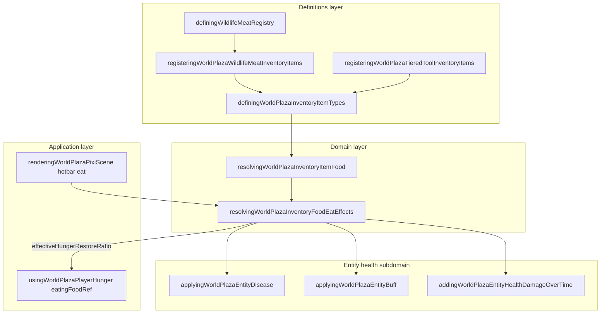

# Inventory and food bounded context (DDD)

|                  |            |
| ---------------- | ---------- |
| **Version**      | 1.1.2      |
| **Last updated** | 2026-07-09 |

Plaza **inventory food** describes which item types are edible, how long the eat channel takes, how much hunger they restore, and what health side effects fire when the player finishes eating from the hotbar. Non-food rows in the same registry (tiered tools, wheat seeds) are catalogued here so item-type edits stay in one place.

## Docs in this folder

| File                           | Purpose                                                       |
| ------------------------------ | ------------------------------------------------------------- |
| [glossary.md](./glossary.md)   | Ubiquitous language for food items and eat resolution         |
| [mechanics.md](./mechanics.md) | Eat pipeline, raw vs cooked, disease and buff rolls           |
| [catalog.md](./catalog.md)     | Every food item type with restore ratios and code touchpoints |

## DDD map

### Bounded context

**Plaza Inventory Food** — declarative food metadata on inventory item types, pure eat-effect resolution, and hotbar consume wiring into hunger and entity health.

Touches **Hunger** (restore ratio), **Entity Health** (disease, poison, buffs), **Wildlife/Meat** (species catalog), and **Cooking/Campfire** (raw→cooked item ids). Does not own hunger drain, campfire UI, or disease scheduler ticks.

### Aggregates

| Aggregate               | Root                                            | Responsibility                                                     |
| ----------------------- | ----------------------------------------------- | ------------------------------------------------------------------ |
| **Inventory item type** | `DefiningWorldPlazaInventoryItemTypeDefinition` | Static item row; optional `food` block with restore and meat hooks |
| **Food definition**     | `DefiningWorldPlazaInventoryFoodDefinition`     | Resolved edible view for one `itemTypeId` at eat time              |
| **Player health**       | `DefiningWorldPlazaEntityHealthState`           | Receives disease, poison, and buff mutations from eat              |

### Value objects

- `itemTypeId` — stable inventory key (`world-plaza-berries`, `world-plaza-raw-chicken-meat`, …)
- `hungerRestoreRatio` — fraction of max hunger restored per consume (0..1 scale)
- `meatKind` — `raw | cooked` for wildlife meat pipeline branching
- `rawDiseaseChance` / `cookedWellFedChance` — independent uniform rolls on eat
- `effectiveHungerRestoreRatio` — output after food sickness multiplier

### Domain services (pure)

| Service                     | File                                                    |
| --------------------------- | ------------------------------------------------------- |
| Resolve food from item type | `resolvingWorldPlazaInventoryItemFood.ts`               |
| Resolve eat duration        | `definingWorldPlazaInventoryFoodEatDurationRegistry.ts` |
| Resolve eat side effects    | `resolvingWorldPlazaInventoryFoodEatEffects.ts`         |
| Register meat item rows     | `registeringWorldPlazaWildlifeMeatInventoryItems.ts`    |
| Register tiered tool rows   | `registeringWorldPlazaTieredToolInventoryItems.ts`      |

### Application layer

| Use case                         | Entry                                                                                 |
| -------------------------------- | ------------------------------------------------------------------------------------- |
| Hotbar eat channel               | `usingWorldPlazaInventoryFoodEatProgress.ts` + Pixi scene                             |
| Eat continue / cancel gate       | `checkingWorldPlazaInventoryFoodEatShouldContinue.ts` (damage + walk / jump / roll)   |
| Apply hunger restore             | `eatingFoodRef` from `usingWorldPlazaPlayerHunger` (on channel complete)              |
| Item detail / inspect UI | `resolvingWorldPlazaInventoryItemDetailPopoverModel.ts` (hunger badges, break/drop badges, durability bar) |
| Weapon/tool slot reservation     | `checkingWorldPlazaInventoryHotbarSlotAcceptsItemTypeId.ts` + plaza add/move wrappers |
| Wildlife ground eat (NPC)        | `refillingWildlifeHungerAfterGroundFood.ts` (hunger only, no disease)                 |

### Infrastructure

| Concern       | File                                                                                  |
| ------------- | ------------------------------------------------------------------------------------- |
| Item registry | `definingWorldPlazaInventoryItemTypes.ts` + `definingWorldPlazaInventoryItemRegistry` |
| Stack consume | `consumingWorldPlazaInventoryItemByType` (inventory state)                            |
| Random rolls  | `Math.random()` for `sicknessRoll` and `wellFedRoll` at eat site                      |

### Declarative registries (source of truth)

| Registry                                                     | File                                                                                           |
| ------------------------------------------------------------ | ---------------------------------------------------------------------------------------------- |
| Base item types (berries, apple, wheat, fish, legacy axe, …) | `src/client/world/inventory/domains/definingWorldPlazaInventoryItemTypes.ts`                   |
| Tiered tools (sword/axe/hoe/scythe/fishrod, wood→gold)       | `registeringWorldPlazaTieredToolInventoryItems.ts` + `definingWorldPlazaToolTierConstants.ts`  |
| Eat durations (1–10 s)                                       | `src/client/world/inventory/domains/definingWorldPlazaInventoryFoodEatDurationRegistry.ts`     |
| Eat flavor lines                                             | `src/client/world/inventory/domains/definingWorldPlazaInventoryFoodEatFlavorTextConstants.ts`  |
| Wildlife meat rows (auto-generated)                          | `src/client/world/inventory/domains/registeringWorldPlazaWildlifeMeatInventoryItems.ts`        |
| Meat species catalog                                         | `src/client/world/wildlife/domains/definingWildlifeMeatRegistry.ts`                            |
| Food sickness multiplier                                     | `DEFINING_WILDLIFE_FOOD_SICKNESS_HUNGER_MULTIPLIER` in meat registry                           |
| Hunger restore constants (forage/catch)                      | `definingWorldPlazaHungerConstants.ts` (`HUNGER_RESTORE_BERRIES` / `APPLE` / `WHEAT` / `FISH`) |

## Layer diagram

## How to add a new food item

1. **Simple forage / catch food** — add item type with `food: { hungerRestoreRatio }` in `definingWorldPlazaInventoryItemTypes.ts`. Optionally add constant in `definingWorldPlazaHungerConstants.ts`. Raw catch (fish) may set `meatKind: 'raw'` and `rawSicknessChance` for popover copy even before a disease id is wired.
2. **Wildlife meat** — add species row to `DEFINING_WILDLIFE_MEAT_CATALOG` in `definingWildlifeMeatRegistry.ts` (raw/cooked ids, disease, well-fed buff). Inventory rows generate automatically via `registeringWorldPlazaWildlifeMeatInventoryItems()`.
3. **New disease on raw meat** — add disease in [disease](../disease/) registry, then wire `rawDiseaseId` / `rawDiseaseChance` on the meat row.
4. **New cooked buff** — add buff in [buffs](../buffs/) registry, then wire `cookedWellFedBuffId` / `cookedWellFedChance` on the meat row.
5. **Tiered tool family** — extend `registeringWorldPlazaTieredToolInventoryItems.ts` + item type ids + `DEFINING_WORLD_PLAZA_TOOL_TIER_STATS` (not food).
6. **Icon** — set `iconifyIcon` on the item row (preferred for tools/equipment); register that id in `registeringBundledIconifyIcons.ts`. Lucide `Icon` / emoji remain fallbacks.
7. **Verify** — `npm run test -- resolvingWorldPlazaInventoryFoodEatEffects`.

Eat resolver and hotbar wiring rarely need edits for new rows that follow existing `food` shape.

## Related contexts

- Hunger drain and tiers: [hunger](../hunger/)
- Campfire cook times and raw→cooked transform: [cooking-campfire](../cooking-campfire/)
- Disease definitions and grants: [disease](../disease/)
- Well-fed and symptom buffs: [buffs](../buffs/)
- Species loot and meat drops: [wildlife](../wildlife/)

## Related AI references

- Engine wiring: [memory/game-engines-reference.md](../../../memory/game-engines-reference.md) (Inventory, Hunger, Entity health)
- Tuning numbers: [memory/game-mechanics-reference.md](../../../memory/game-mechanics-reference.md) (sections 6–7)
