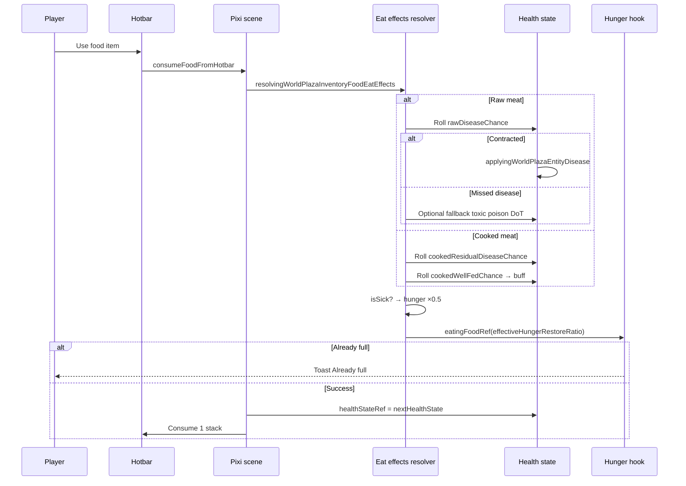

# Inventory and food mechanics

How eating works from the hotbar through hunger restore and health side effects.

## Player-facing loop

## Eat entry point

Hotbar food use in `renderingWorldPlazaPixiScene.tsx`:

1. Resolve `foodDefinition` from `itemTypeId` via `resolvingWorldPlazaInventoryFoodDefinition`.
2. Call `resolvingWorldPlazaInventoryFoodEatEffects` with `healthState`, `nowMs = Date.now()`, `sicknessRoll`, and separate `wellFedRoll`.
3. Pass `effectiveHungerRestoreRatio` to `eatingFoodRef`.
4. On success, assign `nextHealthState` to `healthStateRef` and consume one item from inventory.

Berries and apple skip meat branches (no `meatKind`). Wildlife meat rows include full disease and well-fed metadata from the meat catalog.

## Raw vs cooked

### Raw meat (`meatKind: 'raw'`)

| Step | Behavior |
| ---- | -------- |
| 1 | If `rawDiseaseId` and `sicknessRoll < rawDiseaseChance` → contract disease, stop poison fallback |
| 2 | Else if `rawPoisonFlatEv > 0` and `rawPoisonDurationMs > 0` → toxic DoT at `flatEv / duration` per second |
| 3 | Species values come from `definingWildlifeMeatRegistry.ts` per row |

Generic fallback constants (non-catalog items): `DEFINING_WILDLIFE_RAW_MEAT_POISON_FLAT_EV` = **5**, duration **60_000 ms**, legacy sickness chance **0.35** (used when food row supplies those fields).

### Cooked meat (`meatKind: 'cooked'`)

| Step | Behavior |
| ---- | -------- |
| 1 | Roll `cookedResidualDiseaseId` at `cookedResidualDiseaseChance` (prions: deer **5%**, beef **3%**) |
| 2 | Roll `cookedWellFedBuffId` at `cookedWellFedChance` → `applyingWorldPlazaEntityBuff` |
| 3 | No raw poison path on cooked |

Cook channel durations and campfire UI: [cooking-campfire](../cooking-campfire/).

## Disease roll

Raw and cooked residual paths call `applyingWorldPlazaEntityDisease` with the species-linked disease id.

- Incubation is silent (no HUD until symptomatic). See [disease mechanics](../disease/mechanics.md).
- Contract on eat sets `didRollDisease: true` for that bite.

## Hunger restore

| Case | Formula |
| ---- | ------- |
| Healthy | `foodDefinition.hungerRestoreRatio` |
| Sick (`didRollDisease` or symptomatic) | `hungerRestoreRatio × 0.5` |

Sick check uses `checkingWorldPlazaEntityDiseaseIsSymptomatic` with `resolvingWorldPlazaEntityDiseaseWorldEpochMs(nowMs)` so active illnesses penalize restore even if this bite did not roll a new disease.

Restore applies only through `eatingFoodRef` in the hunger hook. Health state mutation does not change hunger by itself.

## Buff apply (cooked well-fed)

On successful well-fed roll, `applyingWorldPlazaEntityBuff` adds a timed buff from [buffs catalog](../buffs/catalog.md) (`well-fed-*` ids). Each species maps to one buff id and chance in the meat catalog.

Buffs appear in the HUD row when not hidden. They stack with hunger tier effects independently.

## Food sickness sprint lock

Registry entry `food-sickness-debuff` blocks sprint when its movement modifier is active (`checkingWorldPlazaEntityActionLocked`). The eat pipeline today applies the **hunger multiplier** via `isSick` without always applying this buff instance. Disease symptom buffs use separate `disease-*` ids from the disease scheduler.

## Generic forage restore

| Item | `itemTypeId` | Restore ratio |
| ---- | ------------ | --------------- |
| Berries | `world-plaza-berries` | **15%** (0.15) |
| Apple | `world-plaza-apple` | **25%** (0.25) |

Constants: `DEFINING_WORLD_PLAZA_HUNGER_RESTORE_BERRIES`, `DEFINING_WORLD_PLAZA_HUNGER_RESTORE_APPLE`.

## Key files

| Concern | File |
| ------- | ---- |
| Eat resolver | `src/client/world/inventory/domains/resolvingWorldPlazaInventoryFoodEatEffects.ts` |
| Food metadata resolver | `src/client/world/inventory/domains/resolvingWorldPlazaInventoryItemFood.ts` |
| Item type registry | `src/client/world/inventory/domains/definingWorldPlazaInventoryItemTypes.ts` |
| Meat item generation | `src/client/world/inventory/domains/registeringWorldPlazaWildlifeMeatInventoryItems.ts` |
| Species meat catalog | `src/client/world/wildlife/domains/definingWildlifeMeatRegistry.ts` |
| Hotbar eat wiring | `src/client/world/components/renderingWorldPlazaPixiScene.tsx` |
| Hunger restore | `src/client/world/hunger/hooks/usingWorldPlazaPlayerHunger.ts` |
| Tests | `resolvingWorldPlazaInventoryFoodEatEffects.test.ts` |

## Tuning checklist

| Goal | Edit |
| ---- | ---- |
| Berry/apple restore | `definingWorldPlazaHungerConstants.ts` + item types |
| Species raw/cooked restore | `rawHungerRestoreRatio` / `cookedHungerRestoreRatio` in meat catalog |
| Raw disease odds | `rawDiseaseChance` on meat row + disease definition |
| Cooked buff odds | `cookedWellFedChance` + buff in buff registry |
| Prion residual | `cookedResidualDiseaseChance` on deer/beef rows |
| Sickness hunger penalty | `DEFINING_WILDLIFE_FOOD_SICKNESS_HUNGER_MULTIPLIER` (0.5) |
