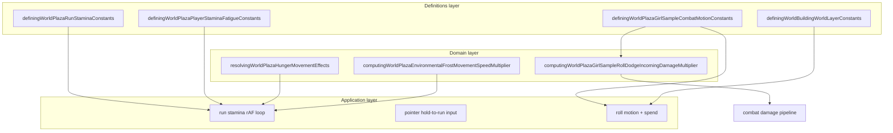

# Movement and stamina bounded context (DDD)

|                  |            |
| ---------------- | ---------- |
| **Version**      | 1.2.2      |
| **Last updated** | 2026-07-10 |

Plaza **movement and stamina** is a bounded context in the **Player Locomotion** subdomain. It governs walk-to-run upgrades, sprint drain, jump and roll costs, fatigue lockouts after emptying the bar, and Girl Sample roll dodge i-frames. Shared drain/regen latch also wraps wildlife via `advancingWildlifeStaminaTick` (species identities live in [wildlife](../wildlife/)).

## Docs in this folder

| File                           | Purpose                                                              |
| ------------------------------ | -------------------------------------------------------------------- |
| [glossary.md](./glossary.md)   | Ubiquitous language: terms every contributor should use the same way |
| [mechanics.md](./mechanics.md) | Player-facing locomotion loop and stamina pipeline                   |
| [catalog.md](./catalog.md)     | Fatigue tiers, stamina costs, regen delays, roll dodge params        |

## DDD map

### Bounded context

**Plaza Player Locomotion Economy** — stamina ratio tracking, fatigue tier progression, hold-to-run gating, jump/roll spend, and roll dodge damage mitigation for the local player avatar.

Touches **Characters** (per-skin walk/run speed), **Combat** (roll dodge reduces physical damage), **Hunger** (sprint lock and drain multipliers), **Environment** (frost walk/run slow), **Building** (jump layer reach), and **Wildlife** (shared stamina core latch + `runningForSeconds` for accel). Does not own wildlife species speed/jump tables or multiplayer position sync.

### Aggregates

| Aggregate               | Root                                               | Responsibility                                                                    |
| ----------------------- | -------------------------------------------------- | --------------------------------------------------------------------------------- |
| **Run stamina state**   | `DefiningWorldPlazaRunStaminaState`                | `staminaRatio`, fatigue tier, depletion lockout, regen pause, `runningForSeconds` |
| **Fatigue tier config** | `DefiningWorldPlazaPlayerStaminaFatigueTierConfig` | Per-tier unlock threshold and regen multiplier                                    |

Stamina is a **0..1 ratio** so the HUD bar width maps directly. Fatigue tier is player-only; it advances on each full bar empty and resets on a full refill.

### Value objects

- `DefiningWorldPlazaPlayerStaminaFatigueTier` — `fresh | winded | fatigued | spent | collapsed`
- Stamina cost ratios — jump **6.25%**, run jump **8.75%**, roll **18.75%**
- Roll dodge window — progress **15%–75%** of roll animation

### Domain services (pure)

| Service                 | File                                                                                            |
| ----------------------- | ----------------------------------------------------------------------------------------------- |
| Roll dodge multiplier   | `computingWorldPlazaGirlSampleRollDodgeIncomingDamageMultiplier.ts`                             |
| Jump layer reach        | `computingWorldPlazaPlayerJumpLayerReachMaxFromMultiplier` in building layer constants          |
| Hunger movement effects | `resolvingWorldPlazaHungerMovementEffects.ts`                                                   |
| Frost movement slow     | `computingWorldPlazaEnvironmentalFrostMovementSpeedMultiplier.ts`                               |
| Shared stamina latch    | `advancingStaminaCoreTick.ts` (opt-in); wildlife wrapper `advancingWildlifeStaminaTick.ts`      |
| Player burst run speed  | `computingWorldPlazaAcceleratedRunSpeed.ts` (**1s**/75%, **3s**/top, fade last **20%** stamina) |
| Player run frame scale  | `resolvingWorldPlazaRunAnimationSpeedScale.ts` (fps × current/full run speed)                   |

### Application layer

| Use case            | Entry                                     |
| ------------------- | ----------------------------------------- |
| Stamina rAF tick    | run stamina hook in plaza scene           |
| Pointer hold-to-run | input layer + **150ms** threshold         |
| Roll input          | Girl Sample combat motion + stamina spend |
| HUD bar color       | low ratio warning below **30%**           |

### Infrastructure

| Concern         | File                                                        |
| --------------- | ----------------------------------------------------------- |
| Multiplayer     | Stamina **not** synced (`plazaDevvitOnline.ts`); local only |
| Character speed | `computingWorldPlazaCharacterEngineDerivedStats.ts`         |

### Declarative registries (source of truth)

| Registry                      | File                                                                                       |
| ----------------------------- | ------------------------------------------------------------------------------------------ |
| Run stamina                   | `definingWorldPlazaRunStaminaConstants.ts`                                                 |
| Fatigue tiers                 | `definingWorldPlazaPlayerStaminaFatigueConstants.ts`                                       |
| Roll dodge / roll motion      | `definingWorldPlazaGirlSampleCombatMotionConstants.ts`                                     |
| Girl Sample walk / run sheets | `definingWorldPlazaGirlSampleWalkConstants.ts` (`/creatures/sprites/playable/girl-sample`) |
| Death / sleep fall strip      | `definingWorldPlazaGirlSampleCombatMotionConstants.ts` (27 frames)                         |
| Jump height                   | `definingWorldBuildingWorldLayerConstants.ts`                                              |
| Default grid speeds           | `definingWorldPlazaIsometricConstants.ts`                                                  |
| Auto jump                     | `definingWorldPlazaMobileAutoJumpConstants.ts`                                             |
| Wildlife accel (xref)         | `definingWildlifeSpeciesAccelerationRegistry.ts`                                           |

## Layer diagram

## How to tune sprint economy

1. **Drain/refill rates** — edit `DEFINING_WORLD_PLAZA_RUN_STAMINA_*_SECONDS` in `definingWorldPlazaRunStaminaConstants.ts`.
2. **Sprint burst ramp** — `DEFINING_WORLD_PLAZA_RUN_STAMINA_BURST_FAST_SECONDS` (**1**), `_TOP_SECONDS` (**3**), `_FAST_RATIO` (**0.75**) in the same file.
3. **Exhaustion fade** — `DEFINING_WORLD_PLAZA_RUN_STAMINA_EXHAUSTION_FADE_START_RATIO` (**0.2**): below that, speed lerps toward walk.
4. **Run frame scale** — clamp in `definingWorldPlazaRunAnimationSpeedScaleConstants.ts`; resolver `resolvingWorldPlazaRunAnimationSpeedScale.ts`.
5. **Action costs** — jump and roll ratio constants in the same file.
6. **Fatigue gates** — `useUnlockRatio` per tier in `definingWorldPlazaPlayerStaminaFatigueConstants.ts`.
7. **Roll dodge** — reduction ratios and window in `definingWorldPlazaGirlSampleCombatMotionConstants.ts`.
8. **Death strip frame count** — keep `frameCount` at populated cells only (death **27**, run **5**) to avoid blank-frame flicker.
9. **Cross-context** — hunger tier sprint lock in [hunger](../hunger/); frost slow in [environment](../environment/); wildlife exhaust / accel in [wildlife](../wildlife/).

## Player-facing guides (this context)

| Guide id          | Status | Notes                                                                                             |
| ----------------- | ------ | ------------------------------------------------------------------------------------------------- |
| `controls`        | N/A    | Tutorial copy unchanged; asset path move only (`public/creatures/sprites/playable/girl-sample/`). |
| `mechanics-guide` | N/A    | Roll/stamina numbers unchanged; no Mechanics panel edit needed.                                   |

## Related AI references

- Engine wiring: [memory/game-engines-reference.md](../../../memory/game-engines-reference.md) (Player movement hooks)
- Tuning numbers: [memory/game-mechanics-reference.md](../../../memory/game-mechanics-reference.md) (section 2)
- Roll damage mitigation: [combat](../combat/) bounded context
- Per-skin speeds: [characters](../characters/) bounded context
