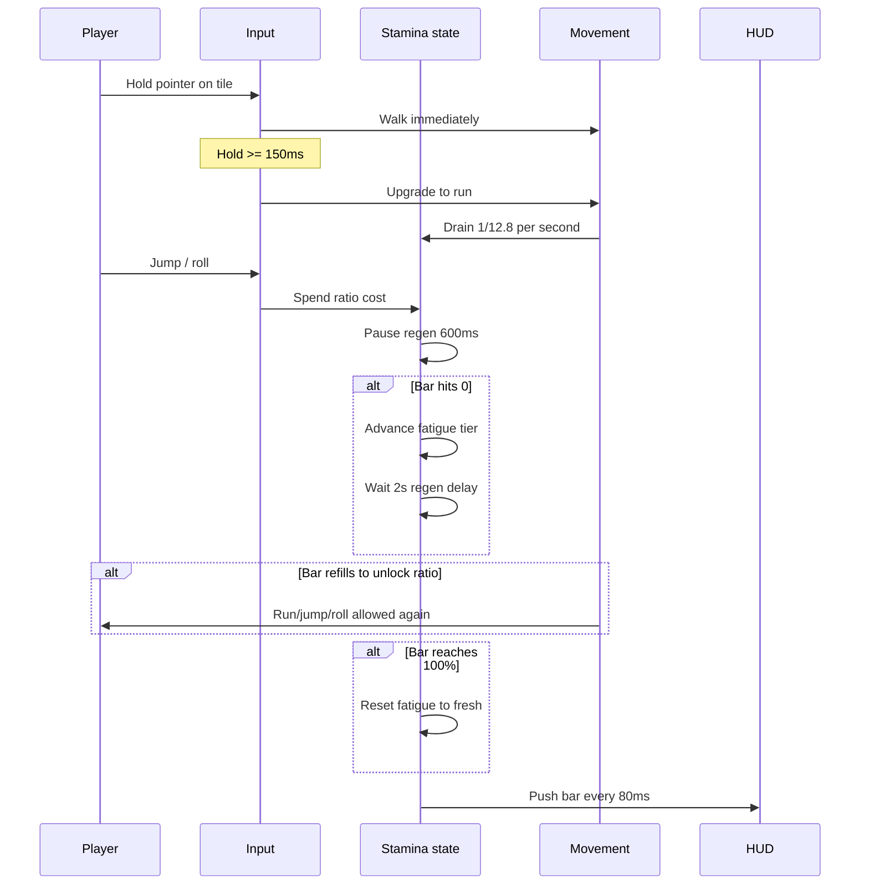
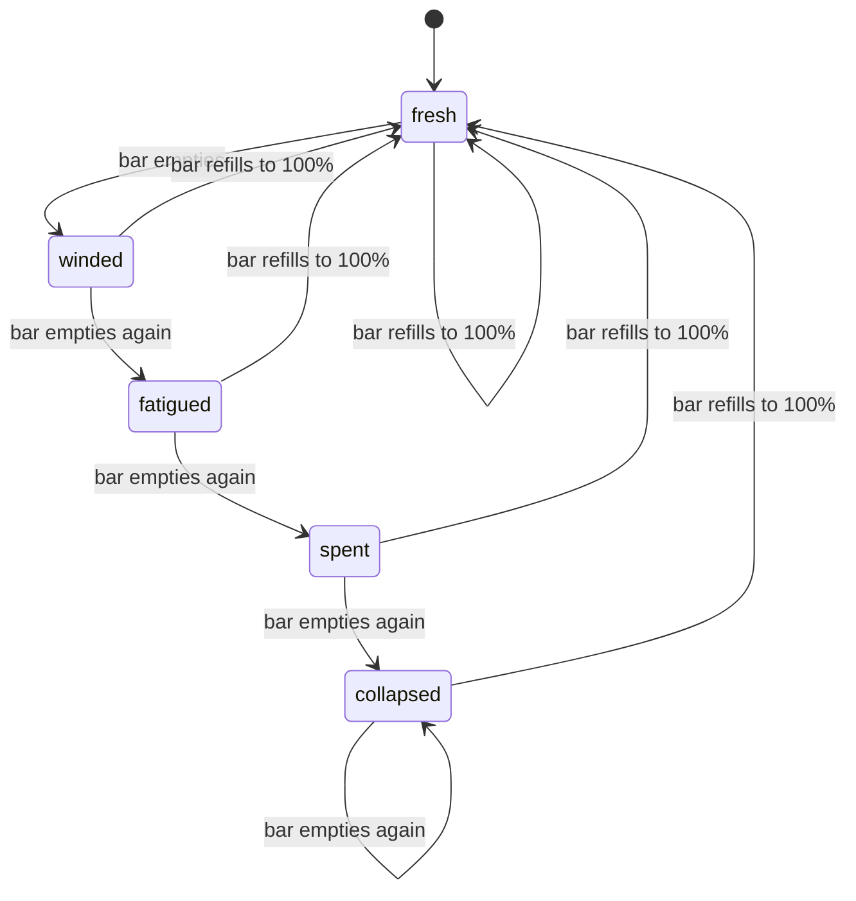

# Movement and stamina mechanics

How locomotion feels in play and how the runtime executes stamina.

## Player-facing loop

## Walk and sprint

### Hold-to-run

Pointer down on a walk target starts walking immediately. If the pointer stays held for **150ms** (`DEFINING_WORLD_PLAZA_RUN_STAMINA_HOLD_TO_RUN_MS`), intent upgrades to sprint.

Sprint is blocked when:

- Stamina is below the fatigue tier **use unlock ratio**
- Hunger tier is `hungry` or `starving` ([hunger](../hunger/))
- Depletion lockout has not elapsed (**2s** after hitting zero)
- Action locks from sleep, stun, or disease buffs ([combat](../combat/), [disease](../disease/))

### Speed sources

Effective walk/run speed stacks:

1. Character engine base speeds ([characters](../characters/)): default walk **2**, run **3** grid/s
2. Buff movement modifiers ([buffs](../buffs/)): e.g. swift stride **+20%**
3. Hunger tier speed penalties ([hunger](../hunger/))
4. Environmental frost multiplier ([environment](../environment/))

## Stamina drain and regen

| Phase                | Rate                                                   |
| -------------------- | ------------------------------------------------------ |
| Sprinting            | **1 / 12.8** ratio per second (full bar in **12.8s**)  |
| Resting              | **1 / 4.5** ratio per second (full refill in **4.5s**) |
| Collapsed tier regen | **0.5×** resting rate                                  |

After the bar hits **0**:

1. `isDepleted` flag sets; `depletedAtMs` records wall clock
2. Fatigue tier advances one step (`fresh` → `winded` → … → `collapsed`)
3. Regen stays paused **2000ms** (`DEFINING_WORLD_PLAZA_RUN_STAMINA_DEPLETION_REGEN_DELAY_MS`)
4. Player must refill to the tier **use unlock ratio** before sprint, jump, or roll

When the bar returns to **100%**, fatigue resets to `fresh`.

## Jump and roll costs

| Action    | Stamina cost              | Regen pause |
| --------- | ------------------------- | ----------- |
| Walk jump | **6.25%**                 | **600ms**   |
| Run jump  | **8.75%**                 | **600ms**   |
| Roll      | **18.75%** (3× walk jump) | **600ms**   |

Roll also triggers Girl Sample combat presentation (**500ms** animation). See roll dodge below.

## Jump vertical reach

From the player's current standing layer:

- Walk up **+1** layer per step
- Jump up to **+4** layers in one arc (`DEFINING_WORLD_BUILDING_WORLD_LAYER_JUMP_HEIGHT_MAX`)
- Buffs can scale reach via `jumpLayerReachMultiplier` (floored, minimum **1** layer)

Per-character `jumpDistanceScale` adjusts horizontal reach (Grizzly **0.9**, Fox Peach **1.1**).

## Auto jump

When **Auto jump** is enabled in Settings:

1. While walking or click-moving, scan forward up to **2.25** grid for procedural or placed water
2. If a gap is found and a **run jump** landing clears past the far bank, queue a jump (same stamina/hunger gates as a manual run jump)
3. Cooldown **450ms** between auto-jump attempts so bank edges do not spam stamina

Default when unset: **on** for mobile viewports, **off** for desktop. An explicit Settings choice applies on every viewport.

| Knob                                  | Location                                                 |
| ------------------------------------- | -------------------------------------------------------- |
| Toggle default / labels / scan tuning | `definingWorldPlazaMobileAutoJumpConstants.ts`           |
| Preference store                      | `managingWorldPlazaMobileAutoJumpStore.ts`               |
| Gap probe                             | `checkingWorldPlazaPlayerMobileAutoJumpWaterGapAhead.ts` |

## Fatigue tier progression

| Tier      | Must refill to   | Regen speed |
| --------- | ---------------- | ----------- |
| fresh     | **0%** (no gate) | **1×**      |
| winded    | **85%**          | **1×**      |
| fatigued  | **60%**          | **1×**      |
| spent     | **40%**          | **1×**      |
| collapsed | **15%**          | **0.5×**    |

The collapsed **15%** gate is the hardest recovery: the player cannot sprint, jump, or roll until the bar crosses that line.

## Roll dodge (Girl Sample)

During roll animation, an active dodge window mitigates incoming **physical** damage:

| Parameter          | Value                         |
| ------------------ | ----------------------------- |
| Roll duration      | **500ms** (9 frames @ 18 fps) |
| Active window      | Progress **15%–75%**          |
| Reduction at edges | **75%**                       |
| Reduction at peak  | **95%**                       |
| Forward travel     | **2.25** grid units           |

`computingWorldPlazaGirlSampleRollDodgeIncomingDamageMultiplier` returns a value in **[0.05, 0.25]** (i.e. **75–95%** damage stripped) based on roll progress within the window.

Chain rules:

- Next roll cannot start until current roll reaches **100%** progress
- Additional **150ms** pause after chain point

Full constant table: [catalog.md](./catalog.md). Combat context: [combat/catalog.md](../combat/catalog.md).

## Cross-context modifiers

### Hunger ([hunger](../hunger/))

| Tier     | Movement impact                                   |
| -------- | ------------------------------------------------- |
| Well fed | **+10%** stamina regen                            |
| Peckish  | **+25%** stamina drain and jump cost              |
| Hungry   | **−10%** speed, **+50%** jump cost, **no sprint** |
| Starving | **−20%** speed, **no sprint/jump**, health drain  |

### Environment ([environment](../environment/))

At or below **0°C** effective temperature, walk and run speed scale linearly toward **0** at absolute zero. Cold-immune characters (`cold` immunity from [characters](../characters/)) ignore frost slow.

## HUD and teaching surfaces

| Surface               | Detail                                              |
| --------------------- | --------------------------------------------------- |
| Stamina bar           | Width = `staminaRatio`; warning color below **30%** |
| Settings gear         | Master volume + **Auto jump** toggle                |
| Tutorial movement tab | Hold-to-run, jump costs, roll dodge callout         |
| Mechanics panel       | Sprint economy numbers from constants               |

## Design knobs (balance)

| Knob                          | Location                                               |
| ----------------------------- | ------------------------------------------------------ |
| Drain / refill seconds        | `definingWorldPlazaRunStaminaConstants.ts`             |
| Jump / roll costs             | same file                                              |
| Hold-to-run delay             | same file                                              |
| Fatigue unlock ratios         | `definingWorldPlazaPlayerStaminaFatigueConstants.ts`   |
| Collapsed regen penalty       | same file (`regenMultiplier: 0.5`)                     |
| Roll dodge window / reduction | `definingWorldPlazaGirlSampleCombatMotionConstants.ts` |
| Jump layer max                | `definingWorldBuildingWorldLayerConstants.ts`          |
| Per-skin speed                | `registeringWorldPlazaCharacterEngineDefinitions.ts`   |
| Auto jump                     | `definingWorldPlazaMobileAutoJumpConstants.ts`         |

## Failure and edge cases

- **Tab backgrounding**: Frame delta capped at **0.05s** so stamina does not drain huge chunks after alt-tab.
- **Stamina not synced**: Multiplayer sends position and health; stamina is local-only.
- **Roll during sleep/stun**: Action locks prevent roll input regardless of stamina fill.
- **Empty bar mid-sprint**: Run stops; depletion lockout and fatigue advance apply immediately.
- **Hunger + collapsed**: Both gates must clear before sprint returns.
