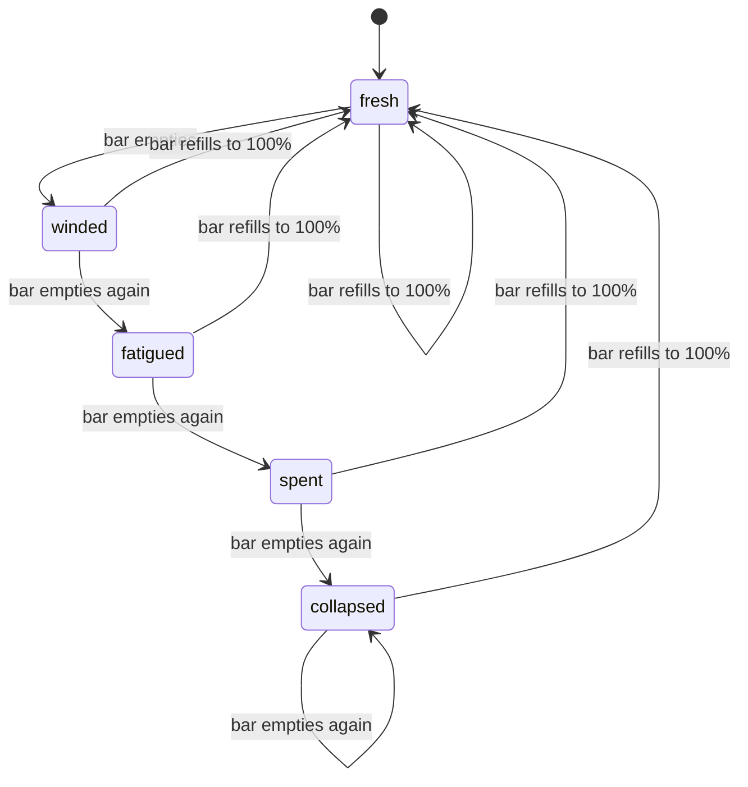

# Movement and stamina mechanics

How locomotion feels in play and how the runtime executes stamina.

## Player-facing loop

```mermaid
sequenceDiagram
  participant P as Player
  participant IN as Input
  participant ST as Stamina state
  participant MV as Movement
  participant HUD as HUD

  P->>IN: Hold pointer on tile
  IN->>MV: Walk immediately
  Note over IN: Hold >= 150ms
  IN->>MV: Upgrade to run
  MV->>ST: Drain 1/12.8 per second
  Note over MV: Burst 1s to 75% gap, 3s to full; fade walk from last 20% stamina

  P->>IN: Jump / roll
  IN->>ST: Spend ratio cost
  ST->>ST: Pause regen 600ms

  alt Bar hits 0
    ST->>ST: Advance fatigue tier
    ST->>ST: Wait 2s regen delay
  end

  alt Bar refills to unlock ratio
    MV->>P: Run/jump/roll allowed again
  end

  alt Bar reaches 100%
    ST->>ST: Reset fatigue to fresh
  end

  ST->>HUD: Push bar every 80ms
```

## Walk and sprint

### Hold-to-run

Pointer down on a walk target starts walking immediately. If the pointer stays held for **150ms** (`DEFINING_WORLD_PLAZA_RUN_STAMINA_HOLD_TO_RUN_MS`), intent upgrades to sprint.

While held, the steer loop re-aims the destination at most every **100ms** (`DEFINING_WORLD_PLAZA_HELD_POINTER_STEER_INTERVAL_MS`). This is internal scheduling; steering feels continuous because the target sits well ahead of the avatar.

Sprint is blocked when:

- Stamina is below the fatigue tier **use unlock ratio**
- Hunger tier is `hungry` or `starving` ([hunger](../hunger/))
- Depletion lockout has not elapsed (**2s** after hitting zero)
- Action locks from sleep, stun, or disease buffs ([combat](../combat/), [disease](../disease/))

### Sprint burst ramp

When hold-to-run upgrades to sprint, speed does not snap to full run. `runningForSeconds` on stamina state counts continuous sprint time and resets when the player stops running. `computingWorldPlazaAcceleratedRunSpeed` uses a two-phase ramp of the walk→run speed gap:

1. **Fast phase:** reach **75%** of the gap in **1s** (`DEFINING_WORLD_PLAZA_RUN_STAMINA_BURST_FAST_SECONDS` / `..._FAST_RATIO`)
2. **Top-end phase:** spend **3s** on the last **25%** (`DEFINING_WORLD_PLAZA_RUN_STAMINA_BURST_TOP_SECONDS`)

Full run speed lands at **4s** continuous sprint (`DEFINING_WORLD_PLAZA_RUN_STAMINA_BURST_RAMP_SECONDS`). Player has **no** long-term momentum above base run (wildlife can keep accelerating after burst; see [wildlife](../wildlife/)).

### Sprint exhaustion fade

While still sprinting, once stamina falls to **20%** (`DEFINING_WORLD_PLAZA_RUN_STAMINA_EXHAUSTION_FADE_START_RATIO`) and below, effective speed lerps from the current burst speed toward walk as the bar drains to **0**. At empty stamina the player is at walk speed before the depletion lockout stops the run.

Run-strip playback fps scales with `currentRunSpeed / fullRunSpeed` via `resolvingWorldPlazaRunAnimationSpeedScale` so feet match the burst and exhaustion curves (ice still multiplies by `resolvingWorldPlazaIceRunAnimationSpeedScale`).

### Speed sources

Effective walk/run speed stacks:

1. Character engine base speeds ([characters](../characters/)): default walk **2**, run **3** grid/s
2. Sprint burst ramp: **75%** of walk→run gap in **1s**, last **25%** in **3s** while `runningForSeconds` accumulates
3. Exhaustion fade: from **20%** stamina to **0**, burst speed lerps toward walk
4. Buff movement modifiers ([buffs](../buffs/)): e.g. swift stride **+20%**
5. Hunger tier speed penalties ([hunger](../hunger/))
6. Environmental frost multiplier ([environment](../environment/))

## Stamina drain and regen

| Phase     | Rate                                                   |
| --------- | ------------------------------------------------------ |
| Sprinting | **1 / 12.8** ratio per second (full bar in **12.8s**)  |
| Resting   | **1 / 4.5** ratio per second (full refill in **4.5s**) |

Fatigue tiers do not change the resting rate; regen runs at full speed at every tier.

After the bar hits **0**:

1. `isDepleted` flag sets; `depletedAtMs` records wall clock
2. Fatigue tier advances one step (`fresh` → `winded` → … → `collapsed`)
3. Regen stays paused **2000ms** (`DEFINING_WORLD_PLAZA_RUN_STAMINA_DEPLETION_REGEN_DELAY_MS`)
4. Player must refill to the tier **use unlock ratio** before sprint, jump, or roll

When the bar returns to **100%**, fatigue resets to `fresh`.

## Jump and roll costs

| Action    | Stamina cost              | Regen pause |
| --------- | ------------------------- | ----------- |
| Walk jump | **6.25%**                 | **600ms**   |
| Run jump  | **8.75%**                 | **600ms**   |
| Roll      | **18.75%** (3× walk jump) | **600ms**   |

Roll also triggers Girl Sample combat presentation (**500ms** animation). See roll dodge below.

## Jump vertical reach

From the player's current standing layer:

- Walk up **+1** layer per step
- Jump up to **+4** layers in one arc (`DEFINING_WORLD_BUILDING_WORLD_LAYER_JUMP_HEIGHT_MAX`)
- Buffs can scale reach via `jumpLayerReachMultiplier` (floored, minimum **1** layer)

Per-character `jumpDistanceScale` adjusts horizontal reach (Grizzly **0.9**, Fox Peach **1.1**).

## Auto jump

When **Auto jump** is enabled in Settings:

1. While walking or click-moving, scan forward up to **2.25** grid for procedural or placed water, at most once every **100ms**
2. If a gap is found and a **run jump** landing clears past the far bank, queue a jump (same stamina/hunger gates as a manual run jump)
3. Cooldown **450ms** between auto-jump attempts so bank edges do not spam stamina

Default when unset: **on** for mobile viewports, **off** for desktop. An explicit Settings choice applies on every viewport.

| Knob                                  | Location                                                 |
| ------------------------------------- | -------------------------------------------------------- |
| Toggle default / labels / scan tuning | `definingWorldPlazaMobileAutoJumpConstants.ts`           |
| Preference store                      | `managingWorldPlazaMobileAutoJumpStore.ts`               |
| Gap probe                             | `checkingWorldPlazaPlayerMobileAutoJumpWaterGapAhead.ts` |

## Fatigue tier progression



| Tier      | Must refill to   | Regen speed |
| --------- | ---------------- | ----------- |
| fresh     | **0%** (no gate) | **1×**      |
| winded    | **85%**          | **1×**      |
| fatigued  | **60%**          | **1×**      |
| spent     | **40%**          | **1×**      |
| collapsed | **15%**          | **1×**      |

The collapsed **15%** gate is the hardest recovery: the player cannot sprint, jump, or roll until the bar crosses that line.

## Roll dodge (Girl Sample)

Roll clips load from `public/creatures/sprites/playable/girl-sample/` (`DEFINING_WORLD_PLAZA_GIRL_SAMPLE_WALK_ASSET_BASE_URL` = `/creatures/sprites/playable/girl-sample`).

During roll animation, an active dodge window mitigates incoming **physical** damage:

| Parameter          | Value                         |
| ------------------ | ----------------------------- |
| Roll duration      | **500ms** (9 frames @ 18 fps) |
| Active window      | Progress **15%–75%**          |
| Reduction at edges | **75%**                       |
| Reduction at peak  | **95%**                       |
| Forward travel     | **2.25** grid units           |

`computingWorldPlazaGirlSampleRollDodgeIncomingDamageMultiplier` returns a value in **[0.05, 0.25]** (i.e. **75–95%** damage stripped) based on roll progress within the window.

Chain rules:

- Next roll cannot start until current roll reaches **100%** progress
- Additional **150ms** pause after chain point

Full constant table: [catalog.md](./catalog.md). Combat context: [combat/catalog.md](../combat/catalog.md).

## Girl Sample death strip (cross-context)

Player death and sleep fall reuse the death motion strip from `definingWorldPlazaGirlSampleCombatMotionConstants.ts` (sheet under `public/creatures/sprites/playable/girl-sample/`).

| Parameter        | Value                                                                                       |
| ---------------- | ------------------------------------------------------------------------------------------- |
| Sheet layout     | **4×7** grid, **256×256** px cells                                                          |
| Populated frames | **27** (last cell blank; same trim pattern as run strip)                                    |
| Death playback   | **10** fps, holds final frame                                                               |
| Collapse lerp    | Starts at frame **17** (`definingWorldPlazaGirlSampleCombatSpritePresentationConstants.ts`) |
| Sleep fall rate  | **6** fps → **~4500ms** to floor (`definingWorldPlazaEntitySleepConstants.ts`)              |

Player death flow: [combat/mechanics.md](../combat/mechanics.md#player-death).

## Cross-context modifiers

### Hunger ([hunger](../hunger/))

| Tier     | Movement impact                                   |
| -------- | ------------------------------------------------- |
| Well fed | **+10%** stamina regen                            |
| Peckish  | **+25%** stamina drain and jump cost              |
| Hungry   | **−10%** speed, **+50%** jump cost, **no sprint** |
| Starving | **−20%** speed, **no sprint/jump**, health drain  |

### Environment ([environment](../environment/))

At or below **0°C** effective temperature, walk and run speed scale linearly toward **0** at absolute zero. Cold-immune characters (`cold` immunity from [characters](../characters/)) ignore frost slow.

## HUD and teaching surfaces

| Surface               | Detail                                              |
| --------------------- | --------------------------------------------------- |
| Stamina bar           | Width = `staminaRatio`; warning color below **30%** |
| Settings gear         | Master volume + **Auto jump** + **Fahrenheit (°F)** |
| Tutorial movement tab | Hold-to-run, jump costs, roll dodge callout         |
| Mechanics panel       | Sprint economy numbers from constants               |

Guide copy is unchanged. The **100ms** probe cadence is internal scheduling and does not alter the Auto jump control or its teaching text.

## Shared stamina core (opt-in)

Player and wildlife both implement drain / regen / run-lock latch. A shared pure tick lives at `src/client/world/stamina/domains/advancingStaminaCoreTick.ts`.

| Flag                                | Default   | Effect                                                                                                 |
| ----------------------------------- | --------- | ------------------------------------------------------------------------------------------------------ |
| `DEFINING_STAMINA_CORE_TICK_OPT_IN` | **false** | Wrappers keep legacy inline loops (current production path)                                            |
| same, set **true**                  | —         | `updatingWorldPlazaRunStamina` and `advancingWildlifeStaminaTick` delegate the ratio latch to the core |

Fatigue tiers, depletion regen delay, jump/roll spends, and wildlife species multipliers stay outside the core either way.

### Wildlife wrapper extras (outside the core)

`advancingWildlifeStaminaTick` always owns these fields, whether legacy or core-opt-in. Touched when fleet prey locomotion / acceleration changes.

| Field               | Meaning                                                                                            |
| ------------------- | -------------------------------------------------------------------------------------------------- |
| `maxStaminaRatio`   | Species pool cap (default **1**; fleet prey **1.15–1.7**). Apex frame multiplies again (**1.3×**). |
| `runningForSeconds` | Continuous sprint time; resets when not running. Feeds burst/momentum speed ramps.                 |
| Exhaust exit        | Species `exhaustedRecoveryRatio` or global **35%** (fleet prey **75%**)                            |

Acceleration itself is wildlife-owned (`definingWildlifeSpeciesAccelerationRegistry.ts` + `computingWildlifeAcceleratedRunSpeed.ts`), wired from the wildlife sim tick after this wrapper advances stamina. Player burst uses the same `runningForSeconds` field on `DefiningWorldPlazaRunStaminaState` via `computingWorldPlazaAcceleratedRunSpeed.ts`. Fleet prey identities: [wildlife mechanics](../wildlife/mechanics.md#run-stamina-species-multipliers).

## Design knobs (balance)

| Knob                            | Location                                                                                     |
| ------------------------------- | -------------------------------------------------------------------------------------------- |
| Drain / refill seconds          | `definingWorldPlazaRunStaminaConstants.ts`                                                   |
| Jump / roll costs               | same file                                                                                    |
| Hold-to-run delay               | same file                                                                                    |
| Sprint burst fast / top / total | same file (`DEFINING_WORLD_PLAZA_RUN_STAMINA_BURST_FAST_*`, `_TOP_SECONDS`, `_RAMP_SECONDS`) |
| Sprint exhaustion fade start    | same file (`DEFINING_WORLD_PLAZA_RUN_STAMINA_EXHAUSTION_FADE_START_RATIO`)                   |
| Fatigue unlock ratios           | `definingWorldPlazaPlayerStaminaFatigueConstants.ts`                                         |
| Fatigue regen multipliers       | same file (`regenMultiplier`, all tiers **1**)                                               |
| Shared core opt-in              | `definingStaminaCoreOptInConstants.ts`                                                       |
| Wildlife drain/regen/exhaust    | `DEFINING_WILDLIFE_SPECIES_STAMINA` + `advancingWildlifeStaminaTick.ts`                      |
| Wildlife burst/momentum accel   | `definingWildlifeSpeciesAccelerationRegistry.ts`                                             |
| Roll dodge window / reduction   | `definingWorldPlazaGirlSampleCombatMotionConstants.ts`                                       |
| Jump layer max                  | `definingWorldBuildingWorldLayerConstants.ts`                                                |
| Per-skin speed                  | `registeringWorldPlazaCharacterEngineDefinitions.ts`                                         |
| Auto jump                       | `definingWorldPlazaMobileAutoJumpConstants.ts`                                               |

## Failure and edge cases

- **Tab backgrounding**: Frame delta capped at **0.05s** so stamina does not drain huge chunks after alt-tab.
- **Stamina not synced**: Multiplayer sends position and health; stamina is local-only.
- **Roll during sleep/stun**: Action locks prevent roll input regardless of stamina fill.
- **Roll during hit-react**: Damaged stagger no longer eats roll input. A successful roll cancels the hit-react clip and unlocks locomotion into the dodge.
- **Empty bar mid-sprint**: Run stops; depletion lockout and fatigue advance apply immediately.
- **Hunger + collapsed**: Both gates must clear before sprint returns.

**Player-facing Guides:** Controls updated (roll can cancel hit-react). Mechanics / Biomes / Bestiary: **N/A**.
