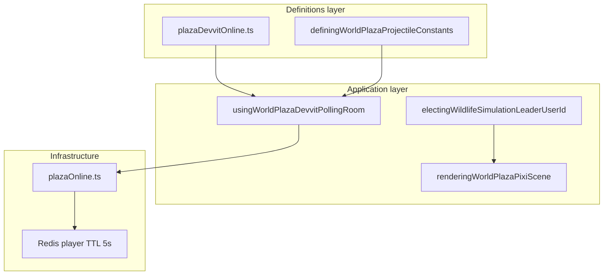

# Multiplayer bounded context (DDD)

|                  |            |
| ---------------- | ---------- |
| **Version**      | 1.2.0      |
| **Last updated** | 2026-07-13 |

Plaza **multiplayer** defines Devvit HTTP polling **named worlds**: create/join/continue, per-room cap **2-4**, host kick/delete, sync payload, Redis TTL, wildlife leader election, and what stays local.

## Docs in this folder

| File                           | Purpose                                    |
| ------------------------------ | ------------------------------------------ |
| [glossary.md](./glossary.md)   | Room, sync, leader, local-only terms       |
| [mechanics.md](./mechanics.md) | Sync diagram, leader rules, polling loop   |
| [catalog.md](./catalog.md)     | Payload fields, TTLs, intervals, API paths |

## DDD map

### Bounded context

**Plaza Devvit Online Room** — one **named world** (unique name per Reddit post) with a host-chosen cap of **2-4** travelers. Players share position/health/held-item snapshots via Redis; wildlife leader publishes mob state; followers consume. Hosts may kick travelers or delete their world.

Touches **Wildlife** (leader sim), **Combat** (projectile spawn events), **Inventory / equipment** (held-item visual + tier on wire), **Building/Fire/Harvest** (room-scoped Redis APIs), and **Entity Health** (synced HP/shields). Does not own hunger/stamina simulation or inventory contents.

### Aggregates

| Aggregate           | Root                              | Responsibility                            |
| ------------------- | --------------------------------- | ----------------------------------------- |
| **Room roster**     | Redis player records              | Active participants with TTL              |
| **Player snapshot** | `PlazaDevvitOnlinePlayerSnapshot` | Last sync payload + `userId`, `updatedAt` |

### Value objects

- `roomId` — named world slug on `?room=` for sync/players/world APIs
- `PlazaDevvitOnlineSyncRequest` — outbound POST body from each client
- Wildlife snapshot/damage event records
- Projectile spawn event records (max **8** per sync)

### Domain services (pure)

| Service                  | File                                                       |
| ------------------------ | ---------------------------------------------------------- |
| Wildlife leader election | `electingWildlifeSimulationLeaderUserId.ts`                |
| Remote player listing    | `listingWorldPlazaRemotePlayerFromDevvitOnlineSnapshot.ts` |
| HUD roster change gate   | `checkingWorldPlazaOnlineParticipantsSnapshotChanged.ts`   |
| Room API URL builder     | `buildingPlazaDevvitOnlineRoomApiUrl`                      |

### Application layer

| Use case            | Entry                                           |
| ------------------- | ----------------------------------------------- |
| Sync + poll loop    | `usingWorldPlazaDevvitPollingRoom.ts`           |
| Room browser        | `renderingPlazaMultiplayerRoomBrowserPanel.tsx` |
| Server sync/players | `src/server/routes/plazaOnline.ts`              |
| Scene integration   | `renderingWorldPlazaPixiScene.tsx`              |

The sync loop posts on the shared **150 ms** interval. Actions such as teleports, jumps, rolls, and walk arrival may request an immediate sync, but only one sync POST can be in flight. Click-walk steps rely on the interval instead of posting every rendered frame. `postingPlazaSync` also records `ONLINE_SYNC_*` performance diagnostics (skip/failure counters, round-trip sample, participant gauge).

### Infrastructure

| Concern                | File                                     |
| ---------------------- | ---------------------------------------- |
| Shared types/constants | `src/shared/plazaDevvitOnline.ts`        |
| Room scope resolver    | `resolvingPlazaDevvitOnlineRoomScope.ts` |
| Redis player keys      | `plazaOnline.ts` server domains          |

## Layer diagram

## Cross-context links

- Wildlife sim: [wildlife](../wildlife/)
- SP fire cells: [fire](../fire/)
- Shared building/harvest/fire APIs: [building](../building/), [harvest](../harvest/)
- Projectile cap: `DEFINING_WORLD_PLAZA_PROJECTILE_ONLINE_SYNC_MAX_SPAWN_EVENTS`
- Held-item visuals: [inventory-food](../inventory-food/) (`heldItemVisualId` / `heldItemTier` on equipment rows)

## Related AI references

- Tuning numbers: [memory/game-mechanics-reference.md](../../../memory/game-mechanics-reference.md) (section 14)
- Engine wiring: [memory/game-engines-reference.md](../../../memory/game-engines-reference.md)
