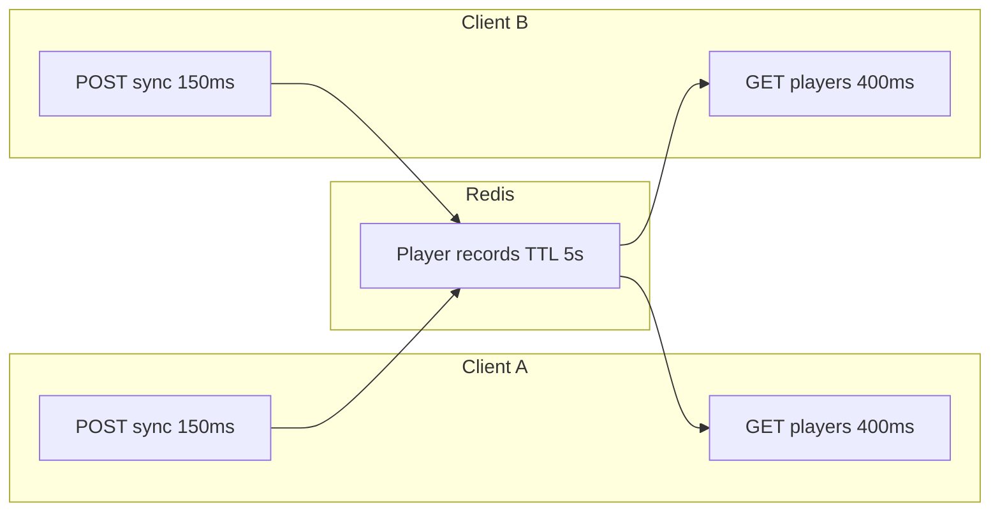
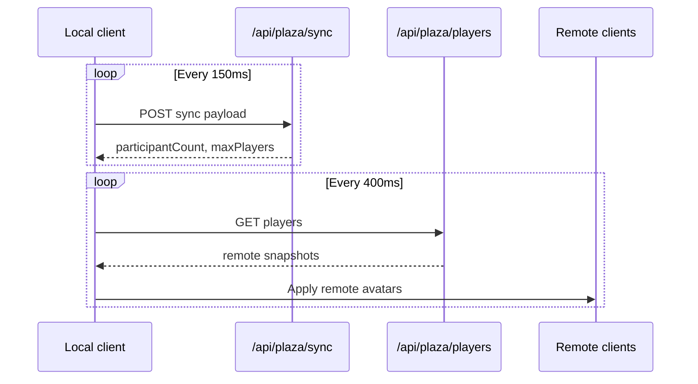
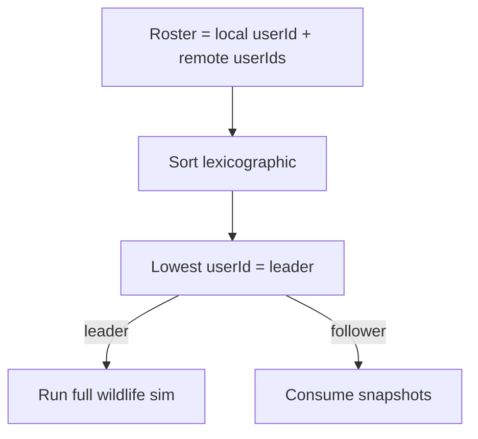

# Multiplayer mechanics and gameplay

How players coexist in a Devvit post room without WebSockets.

## Architecture overview

Devvit webviews use **HTTP polling** only. No persistent WebSocket channel.

## Room capacity

| Parameter            | Value      |
| -------------------- | ---------- |
| Max players per room | **3**      |
| Player TTL           | **5 s**    |
| Sync POST interval   | **150 ms** |
| Remote poll interval | **400 ms** |

Joining when full returns error with `isRoomFull: true`. UI message: "This plaza is full (3 players max)."

Room browser lists shards via `GET /api/plaza/rooms`.

## Sync loop (per client)

Hook: `usingWorldPlazaDevvitPollingRoom.ts`.

On disable/unmount, client stops POSTing; record expires after **5 s** TTL.

## Movement sync cadence

Normal movement is published by the **150 ms** sync interval. Click-walk updates the local position every rendered frame, but those steps do not start their own HTTP requests.

| Event                                       | Sync behavior                                     |
| ------------------------------------------- | ------------------------------------------------- |
| Click-walk step                             | Wait for the shared 150 ms interval               |
| Click-walk arrival                          | Request an immediate sync                         |
| Jump, roll, teleport, or respawn transition | Request an immediate sync                         |
| Request while another sync POST is active   | Skip it; the next interval sends the latest state |

`usingWorldPlazaDevvitPollingRoom.ts` owns the single-flight guard. `renderingWorldPlazaPixiScene.tsx` keeps inventory drop range checks on each walk step without coupling those checks to a network POST.

## What syncs

### Always on each POST

| Field                                                           | Purpose                                                                                                     |
| --------------------------------------------------------------- | ----------------------------------------------------------------------------------------------------------- |
| Position `x`, `y`, `layer`                                      | Avatar placement                                                                                            |
| `motionKind`, `facingDirection`                                 | Animation state                                                                                             |
| `jumpStartedAtMs`, `jumpArcPeakScreenPx`                        | Jump arc sync                                                                                               |
| `healthCurrent`, `healthEffectiveMax`                           | Health bar                                                                                                  |
| `shieldPoints`, `isInvincible`                                  | Combat state                                                                                                |
| `displayName`, `avatarUrl`, `profileStatusKind`, `avatarSkinId` | Nametag and cosmetics                                                                                       |
| `heldItemVisualId`, `heldItemTier`                              | Equipped hotbar overlay pair (still synced; draw gated by `DEFINING_WORLD_PLAZA_HELD_ITEM_OVERLAY_ENABLED`) |

Local walk avatar writes the pair onto motion state each tick from `equippedHeldItemPresentationRef`. Poll hook copies them onto `PlazaDevvitOnlineSyncRequest`. Remotes map snapshots into `DefiningWorldPlazaRemotePlayer`, then `renderingWorldPlazaGirlSampleRemoteAvatar` resolves presentation with `resolvingWorldPlazaHeldItemPresentationFromNetworkFields`. Overlay draw is currently **off** for local and remote (`DEFINING_WORLD_PLAZA_HELD_ITEM_OVERLAY_ENABLED = false`).

| Condition                            | Remote overlay            |
| ------------------------------------ | ------------------------- |
| Overlay flag false                   | Always hide               |
| Both fields valid registry ids       | Show matching sheet frame |
| Either `null` / missing / unknown id | Hide overlay (unarmed)    |

### Optional event arrays (when non-empty)

| Array                   | Publisher      | Consumer                  |
| ----------------------- | -------------- | ------------------------- |
| `projectileSpawnEvents` | Shooter client | Peers spawn visuals/logic |
| `wildlifeSnapshots`     | Leader only    | Followers render mobs     |
| `wildlifeDamageEvents`  | Leader only    | Followers apply damage    |

Projectile batch capped at **8** events per sync (`DEFINING_WORLD_PLAZA_PROJECTILE_ONLINE_SYNC_MAX_SPAWN_EVENTS`).

## Wildlife leader election

Function: `electingWildlifeSimulationLeaderUserId(localUserId, remoteUserIds)`.

Solo player: leader is self. Tie-break is stable string sort on Reddit-prefixed ids.

## What stays local

| System                  | Why                                |
| ----------------------- | ---------------------------------- |
| Hunger drain            | Not in sync payload                |
| Stamina / fatigue       | Not in sync payload                |
| Inventory stacks / bags | Only held visual pair syncs        |
| Disease incubation      | Save-slot world epoch              |
| Fire cells (no room)    | `managingWorldPlazaLocalFireCells` |
| Single-player chops     | localStorage when offline owner    |

Online room routes (**building**, **fire**, **harvest**) use `resolvingPlazaDevvitOnlineRoomScope()` for shared Redis.

## Room API URLs

`buildingPlazaDevvitOnlineRoomApiUrl(path, roomIndex)` appends `?room={index}` (minimum **1**).

| Path                 | Role                   |
| -------------------- | ---------------------- |
| `/api/plaza/sync`    | POST heartbeat + state |
| `/api/plaza/players` | GET remote roster      |
| `/api/plaza/rooms`   | GET shard listing      |

## Remote player application

Poll results map through `listingWorldPlazaRemotePlayerFromDevvitOnlineSnapshot` into `DefiningWorldPlazaRemotePlayer` registry (includes `heldItemVisualId` / `heldItemTier`). Scene applies live updates via `applyingWorldPlazaRemotePlayerLiveUpdate`.

Removed players drop from registry when absent from poll snapshot.

Presence-only remotes (non-Devvit broadcast path) default held fields to `null` until a full snapshot arrives (`handlingWorldPlazaOnlineRoomPositionBroadcastEvent`).

## HUD roster change detection

Room status HUD reads `roomSnapshot.onlineParticipants` and `participantCount` (`renderingWorldPlazaRoomStatusHud.tsx`).

| Check      | Detail                                                                                                  |
| ---------- | ------------------------------------------------------------------------------------------------------- |
| Helper     | `checkingWorldPlazaOnlineParticipantsSnapshotChanged.ts`                                                |
| Inputs     | Previous `DefiningWorldPlazaOnlineRoomSnapshot`, latest `participantCount`, latest `onlineParticipants` |
| True when  | Count differs, roster length differs, or any index differs in `userId` / `displayName`                  |
| False when | Same ordered roster ids and names (motion/health updates alone do not trip this gate)                   |

Use this before rewriting HUD-facing TanStack Query fields so join/leave/rename churn does not get lost in high-frequency position sync.

**Player-facing Guides:** Controls / Mechanics / Biomes / Bestiary: **N/A**. This changes transport scheduling, not controls, rules, biome content, or wildlife entries.

## Failure modes

| Condition        | Behavior                               |
| ---------------- | -------------------------------------- |
| Connection error | Toast: check connection                |
| Room full        | Sync error, `isRoomFull`               |
| Missing `userId` | Polling disabled                       |
| Stale remote     | TTL removes after **5 s** without sync |

## Design knobs

| Knob           | Location                                                       |
| -------------- | -------------------------------------------------------------- |
| Max players    | `PLAZA_DEVVIT_ONLINE_MAX_PLAYERS`                              |
| TTL            | `PLAZA_DEVVIT_ONLINE_PLAYER_TTL_SECONDS`                       |
| Intervals      | `SYNC_INTERVAL_MS`, `POLL_INTERVAL_MS`                         |
| Projectile cap | `DEFINING_WORLD_PLAZA_PROJECTILE_ONLINE_SYNC_MAX_SPAWN_EVENTS` |

## Edge cases

- **Multiple room shards**: Browser picks `roomIndex`; APIs scoped per shard.
- **Leader disconnect**: Next lexicographic user becomes leader on next election tick.
- **Projectile burst**: Engine queues spawns; only first **8** per sync POST ship.
- **Health defaults**: If ref unset, sync uses `DEFINING_WORLD_PLAZA_ENTITY_HEALTH_BASE_MAX`.
- **Held-item omit**: Older clients may omit the fields; parser treats non-string as `undefined`, listing maps to `null` (no overlay).
- **Sync overlap**: `isPostingSync` in `usingWorldPlazaDevvitPollingRoom.ts` drops overlapping POSTs; the **150 ms** timer always publishes the latest local refs next tick.
