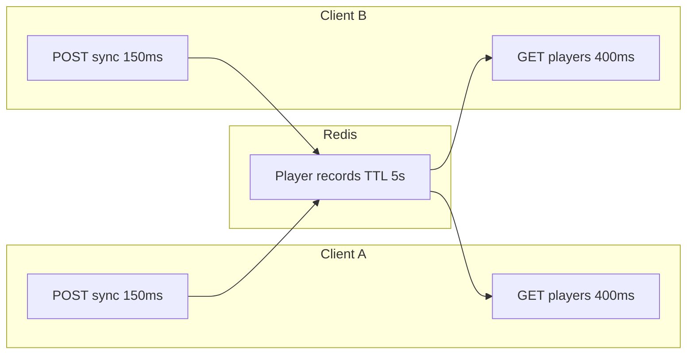
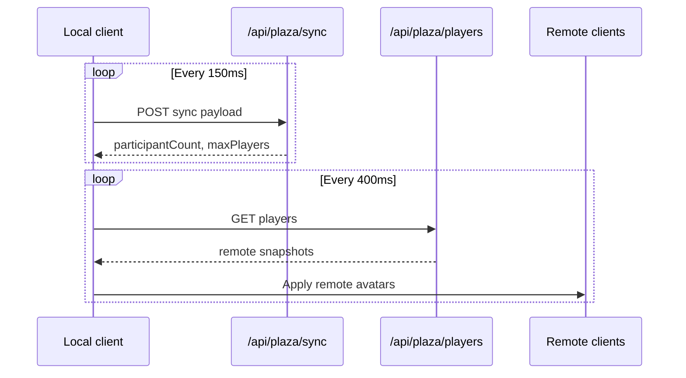
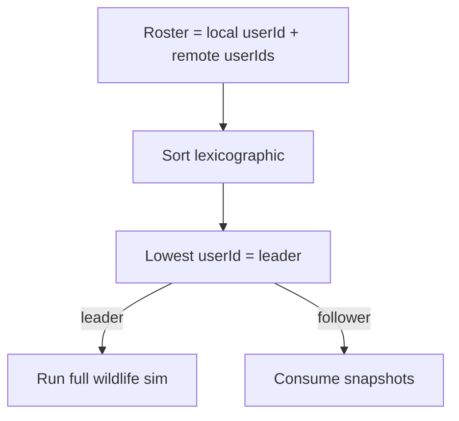

# Multiplayer mechanics and gameplay

How players coexist in a Devvit post room without WebSockets.

## Architecture overview

Devvit webviews use **HTTP polling** only. No persistent WebSocket channel.

## Room capacity

| Parameter | Value |
| --------- | ----- |
| Max players per room | **3** |
| Player TTL | **5 s** |
| Sync POST interval | **150 ms** |
| Remote poll interval | **400 ms** |

Joining when full returns error with `isRoomFull: true`. UI message: "This plaza is full (3 players max)."

Room browser lists shards via `GET /api/plaza/rooms`.

## Sync loop (per client)

Hook: `usingWorldPlazaDevvitPollingRoom.ts`.

On disable/unmount, client stops POSTing; record expires after **5 s** TTL.

## What syncs

### Always on each POST

| Field | Purpose |
| ----- | ------- |
| Position `x`, `y`, `layer` | Avatar placement |
| `motionKind`, `facingDirection` | Animation state |
| `jumpStartedAtMs`, `jumpArcPeakScreenPx` | Jump arc sync |
| `healthCurrent`, `healthEffectiveMax` | Health bar |
| `shieldPoints`, `isInvincible` | Combat state |
| `displayName`, `avatarUrl`, `profileStatusKind`, `avatarSkinId` | Nametag and cosmetics |

### Optional event arrays (when non-empty)

| Array | Publisher | Consumer |
| ----- | --------- | -------- |
| `projectileSpawnEvents` | Shooter client | Peers spawn visuals/logic |
| `wildlifeSnapshots` | Leader only | Followers render mobs |
| `wildlifeDamageEvents` | Leader only | Followers apply damage |

Projectile batch capped at **8** events per sync (`DEFINING_WORLD_PLAZA_PROJECTILE_ONLINE_SYNC_MAX_SPAWN_EVENTS`).

## Wildlife leader election

Function: `electingWildlifeSimulationLeaderUserId(localUserId, remoteUserIds)`.

Solo player: leader is self. Tie-break is stable string sort on Reddit-prefixed ids.

## What stays local

| System | Why |
| ------ | --- |
| Hunger drain | Not in sync payload |
| Stamina / fatigue | Not in sync payload |
| Disease incubation | Save-slot world epoch |
| Fire cells (no room) | `managingWorldPlazaLocalFireCells` |
| Single-player chops | localStorage when offline owner |

Online room routes (**building**, **fire**, **harvest**) use `resolvingPlazaDevvitOnlineRoomScope()` for shared Redis.

## Room API URLs

`buildingPlazaDevvitOnlineRoomApiUrl(path, roomIndex)` appends `?room={index}` (minimum **1**).

| Path | Role |
| ---- | ---- |
| `/api/plaza/sync` | POST heartbeat + state |
| `/api/plaza/players` | GET remote roster |
| `/api/plaza/rooms` | GET shard listing |

## Remote player application

Poll results map through `listingWorldPlazaRemotePlayerFromDevvitOnlineSnapshot` into `DefiningWorldPlazaRemotePlayer` registry. Scene applies live updates via `applyingWorldPlazaRemotePlayerLiveUpdate`.

Removed players drop from registry when absent from poll snapshot.

## Failure modes

| Condition | Behavior |
| --------- | -------- |
| Connection error | Toast: check connection |
| Room full | Sync error, `isRoomFull` |
| Missing `userId` | Polling disabled |
| Stale remote | TTL removes after **5 s** without sync |

## Design knobs

| Knob | Location |
| ---- | -------- |
| Max players | `PLAZA_DEVVIT_ONLINE_MAX_PLAYERS` |
| TTL | `PLAZA_DEVVIT_ONLINE_PLAYER_TTL_SECONDS` |
| Intervals | `SYNC_INTERVAL_MS`, `POLL_INTERVAL_MS` |
| Projectile cap | `DEFINING_WORLD_PLAZA_PROJECTILE_ONLINE_SYNC_MAX_SPAWN_EVENTS` |

## Edge cases

- **Multiple room shards**: Browser picks `roomIndex`; APIs scoped per shard.
- **Leader disconnect**: Next lexicographic user becomes leader on next election tick.
- **Projectile burst**: Engine queues spawns; only first **8** per sync POST ship.
- **Health defaults**: If ref unset, sync uses `DEFINING_WORLD_PLAZA_ENTITY_HEALTH_BASE_MAX`.
