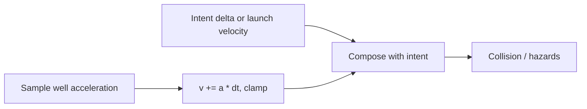

# Tile gravity well — mechanics

## Player feel

A gravity well slowly tugs anything inside its radius toward a tile (or arbitrary grid point). You can still walk, run, jump, and steer. Fighting the pull costs speed; standing still lets the well accelerate you inward over time.

Projectiles with `gravityPull` keep their launch velocity and curve into the target instead of snapping like hard homing. With `tracksLiveTarget`, the aim point updates to the nearest live hit target each tick (dev `gravity-ball`).

## Runtime pipeline

1. Caller builds a `DefiningWorldPlazaTileGravityWell` (tile factory or point factory).
2. Each tick, sample acceleration at the mover position.
3. Integrate into carried velocity (`v += a * dt`), then optional max-speed clamp.
4. Convert to a grid delta (`v * dt`) **or** write velocity back onto a projectile.
5. Add onto intentional movement; then run the existing collision / hazard pipeline.

## Composition rules

| Mover                              | How to apply                                                                                                             |
| ---------------------------------- | ------------------------------------------------------------------------------------------------------------------------ |
| Player / wildlife (position-based) | `computingWorldPlazaTileGravityWellGridDelta` → add `gridDelta` to walk/run/steering delta; keep `nextVelocity` in a ref |
| Projectile / velocity movers       | `computingWorldPlazaTileGravityWellVelocityStep` → write `velocity` then `pos += vel * dt`                               |
| Multiple wells                     | `computingWorldPlazaTileGravityWellAccelerationSum` then integrate once                                                  |

Intentional speed is **not** multiplied down by the well. The pull is additive, so a fast run can still leave the radius.

## Falloff

| Mode            | Inside radius                                 |
| --------------- | --------------------------------------------- |
| `none`          | Full acceleration until the edge              |
| `linear`        | Strongest at center, zero at radius (default) |
| `inverseSquare` | `1 / (1 + d²)`, then zero outside radius      |

Settle fade multiplies falloff near the attractor so the mover eases onto the point instead of oscillating.

## Design knobs

| Knob         | Default (shared utility) | Projectile `gravityPull` default |
| ------------ | ------------------------ | -------------------------------- |
| Acceleration | **1.8** grid/s²          | **3.5** grid/s²                  |
| Radius       | **4** grid               | **8** grid                       |
| Settle       | **0.12** grid            | **0.08** grid                    |
| Max speed    | **4.5** grid/s           | **10** grid/s                    |

Tune per well at creation time; constants are only defaults.
