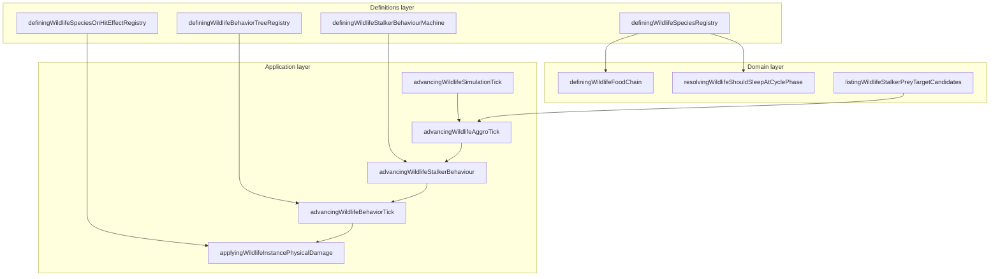

# Wildlife bounded context (DDD)

|                  |            |
| ---------------- | ---------- |
| **Version**      | 1.0.0      |
| **Last updated** | 2026-07-09 (Adrenaline Rush + Bestiary studied copy) |

Plaza **wildlife** is a bounded context inside the **World Simulation** subdomain. Eleven species spawn from biome tables, run behavior-tree AI, share threat/aggro state, and drop meat loot on death.

## Docs in this folder

| File                           | Purpose                                                                         |
| ------------------------------ | ------------------------------------------------------------------------------- |
| [glossary.md](./glossary.md)   | Ubiquitous language: terms every contributor should use the same way            |
| [mechanics.md](./mechanics.md) | Player-facing ecology, aggro, food chain, sleep, pack reactions, stalk hunts    |
| [catalog.md](./catalog.md)     | Every species: temperament, aggro, prey, on-hit procs, sleep, stalk eligibility |

## DDD map

### Bounded context

**Plaza Wildlife Simulation**: procedural spawn, temperament-driven behavior trees, threat tables, pack/herd reactions, grey-wolf stalk statechart, melee combat against player and prey, corpse loot, and multiplayer leader-follower sync.

Touches **Combat** (player damage, on-hit procs), **Day/Night** (activity schedules), **Inventory/Food** (meat loot via [cooking-campfire](../cooking-campfire/)), and **Disease** (raw meat infection source). Does not own campfire cooking or player hunger ticks.

### Aggregates

| Aggregate              | Root                                | Responsibility                                                                                      |
| ---------------------- | ----------------------------------- | --------------------------------------------------------------------------------------------------- |
| **Species definition** | `DefiningWildlifeSpeciesDefinition` | Static catalog: vitals, temperament, diet, aggro tuning, prey lists, loot                           |
| **Wildlife instance**  | `DefiningWildlifeInstance`          | Runtime position, health, hunger, stamina, AI intent, aggro threats, stalk phase, defend-young flag |

A **spawn anchor** (`DefiningWildlifeSpawnAnchor`) is not an aggregate root. It seeds deterministic placement, pack size, and bell-curve rolls (aggression, sleep, size).

### Value objects

- `DefiningWildlifeSpeciesId`: stable kebab-case key (`grey-wolf`, `brown-bear`, …)
- `DefiningWildlifeTemperamentId`: behavior tree key (`passive`, `stalker`, …)
- `DefiningWildlifeActivityPattern`: `diurnal | nocturnal | crepuscular | cathemeral`
- `DefiningWildlifeAggressionLevel`: per-spawn roll: `tame | normal | aggressive`
- `DefiningWildlifeThreatEntry`: `{ targetId, threat, lastUpdatedAtMs }`
- `DefiningWildlifeStalkPhase`: stalker hunt phase (`shadowing`, `surrounding`, …)

### Domain services (pure)

| Service                | File                                            |
| ---------------------- | ----------------------------------------------- |
| Food chain eligibility | `definingWildlifeFoodChain.ts`                  |
| Sleep at cycle phase   | `resolvingWildlifeShouldSleepAtCyclePhase.ts`   |
| On-hit proc resolution | `resolvingWildlifeSpeciesOnHitPlayerProcs.ts`   |
| Stalk prey candidates  | `listingWildlifeStalkerPreyTargetCandidates.ts` |
| On-sight aggro gate    | `checkingWildlifeMayAggroPlayerOnSight.ts`      |

### Application layer

| Use case             | Entry                                                                                                   |
| -------------------- | ------------------------------------------------------------------------------------------------------- |
| Simulation tick      | `advancingWildlifeSimulationTick.ts`                                                                    |
| Threat + target pick | `advancingWildlifeAggroTick.ts`                                                                         |
| Wildlife melee gate  | `checkingWildlifeMayMeleeWildlifeTarget.ts`                                                             |
| Stalk phase machine  | `advancingWildlifeStalkerBehaviour.ts`                                                                  |
| Behavior tree eval   | `advancingWildlifeBehaviorTick.ts`                                                                      |
| Player melee damage  | `applyingWildlifeInstancePhysicalDamage.ts` + `resolvingWildlifePlayerOutgoingPhysicalDamageOptions.ts` |
| Corpse loot drop     | wired through death tick + inventory spawn                                                              |
| Multiplayer sync     | `usingWorldPlazaDevvitPollingRoom.ts`                                                                   |

### Infrastructure

| Concern                  | File                                                                                        |
| ------------------------ | ------------------------------------------------------------------------------------------- |
| Instance store           | `managingWildlifeInstanceStore.ts`                                                          |
| Bestiary discovery store | `managingWorldPlazaBestiaryDiscoveryStore.ts` (sighted + studyCounts; player + dev writers) |
| Pixi tick host           | `renderingWildlifeLayer.tsx`                                                                |
| Scene integration        | `renderingWorldPlazaPixiScene.tsx`                                                          |
| Network snapshots        | `src/shared/plazaDevvitOnline.ts`                                                           |

### Declarative registries (source of truth)

| Registry                                                | File                                                                                                                                                               |
| ------------------------------------------------------- | ------------------------------------------------------------------------------------------------------------------------------------------------------------------ |
| Species catalog (11)                                    | `definingWildlifeSpeciesRegistry.ts`                                                                                                                               |
| Behavior trees (7 temperaments)                         | `definingWildlifeBehaviorTreeRegistry.ts`                                                                                                                          |
| On-hit player procs                                     | `definingWildlifeSpeciesOnHitEffectRegistry.ts`                                                                                                                    |
| Biome spawn pools                                       | `definingWildlifeBiomeSpawnTable.ts`                                                                                                                               |
| Difficulty levers (spawn density, predator mix, combat) | `definingWildlifeDifficultyLevers.ts`                                                                                                                              |
| Stalker statechart                                      | `definingWildlifeStalkerBehaviourMachine.ts`                                                                                                                       |
| Aggro / pack / stalk / sleep tuning                     | `definingWildlifeAggroConstants.ts`, `PackConstants.ts`, `StalkConstants.ts`, `SleepScheduleConstants.ts`, `FavoritePreyConstants.ts`, `HunterFeedingConstants.ts` |
| Ground-food forage scent + chew delay                   | `definingWildlifeHuntConstants.ts` (`GROUND_FOOD_SCENT_RADIUS_GRID`, `GROUND_FOOD_BITE_DELAY_MIN/MAX_MS`); chew apply in `applyingWildlifeGroundFoodBite.ts`      |
| Territory warn / escalate profiles                      | `definingWildlifeTerritoryConstants.ts` (boar, bear, lion, wolf, megafauna, heavy grazer, **rhino**, aggressive-herbivore synthetic) |
| Species stamina multipliers / max pool                  | `DEFINING_WILDLIFE_SPECIES_STAMINA` in `definingWildlifeSpeciesRegistry.ts`                                                                                         |
| Species passives (shell, Adrenaline Rush, …)            | `definingWildlifeSpeciesPassiveTraitConstants.ts` + `adrenalineRush` / `passiveDamageRollModifiers` on species rows; apply flee restore in `applyingWildlifeAdrenalineRushOnFleeEntry.ts` |
| Run acceleration (burst + momentum)                     | `definingWildlifeSpeciesAccelerationRegistry.ts`                                                                                                                   |
| Sprite sheet frame heights (ground shadow / head lift)  | `definingWildlifeSpriteSheetFrameHeightByFolder.ts`                                                                                                                |
| Sprite presentation (anchor / foot line overrides)      | `definingWildlifeSpritePresentationConstants.ts` + `resolvingWildlifeSpeciesSpritePresentation.ts`                                                                 |
| Ground shadow layout (size-scaled foot offset)          | `computingWildlifeGroundShadowLayout.ts` (drawn from `renderingWildlifeLayer.tsx`)                                                                                 |

## Layer diagram

## How to add a new species

1. **Species**: add id to the union and a descriptor block in `definingWildlifeSpeciesRegistry.ts` (temperament, diet, vitals, aggro, prey lists, activity pattern).
2. **Behavior**: ensure its `temperamentId` tree exists in `definingWildlifeBehaviorTreeRegistry.ts` (or add a new temperament tree).
3. **Loot**: add a meat row in `definingWildlifeMeatRegistry.ts` and update [cooking-campfire catalog](../cooking-campfire/catalog.md).
4. **On-hit** (if dangerous): add procs in `definingWildlifeSpeciesOnHitEffectRegistry.ts`.
5. **Spawn**: wire biome pools in `definingWildlifeBiomeSpawnTable.ts`.
6. **Animation**: register clips in `registeringWildlifeAnimationClips.ts`.
7. **Verify**: `npm run test -- definingWildlifeSpeciesRegistry` (and meat registry if lootable).
8. **Docs**: update [catalog.md](./catalog.md) and cross-linked disease/cooking catalogs.

## Related AI references

- Engine wiring: [memory/game-engines-reference.md](../../../memory/game-engines-reference.md) (Wildlife engine, section 12)
- Tuning numbers: [memory/game-mechanics-reference.md](../../../memory/game-mechanics-reference.md) (sections 10-11)
- Meat and cooking: [cooking-campfire](../cooking-campfire/)
- Raw meat diseases: [disease](../disease/)
