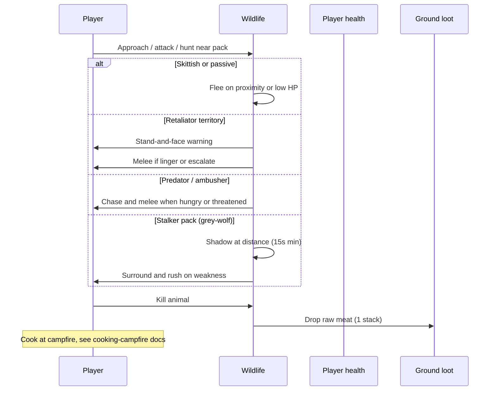
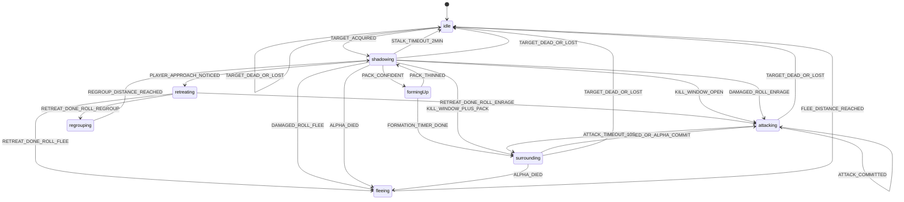
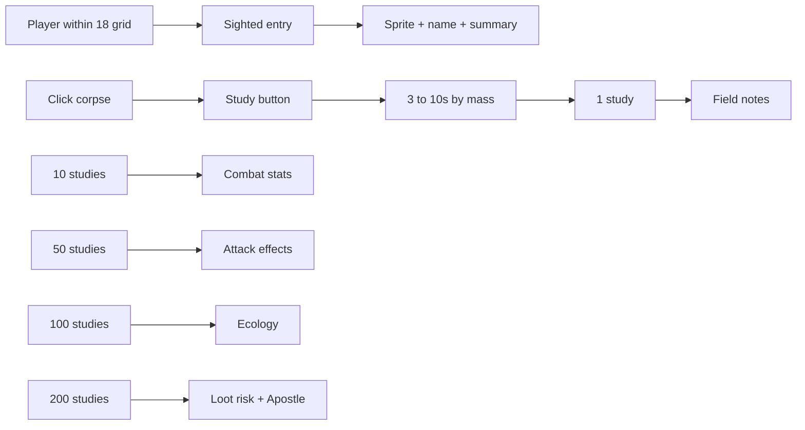
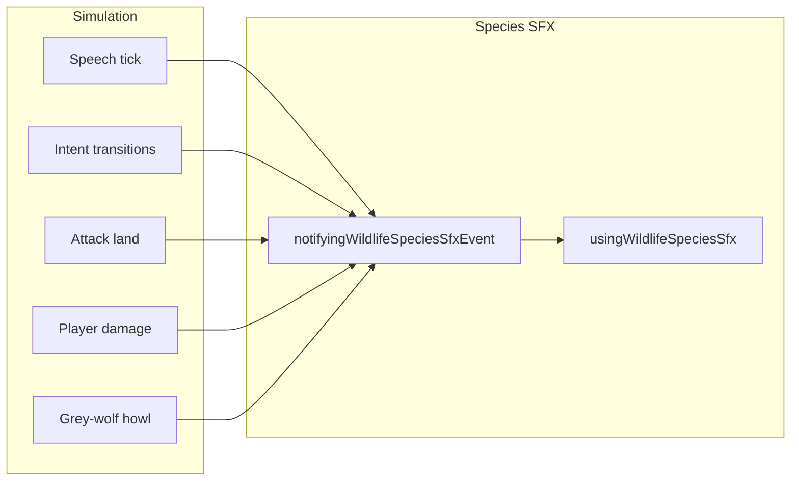

# Wildlife mechanics and gameplay

How animals behave in the plaza and how the simulation executes them.

## Player-facing loop

## Ecology overview

Full roster in the catalog. **7 temperaments**. Each spawn rolls aggression (tame/normal/aggressive), sleep schedule, and size from deterministic anchor seeds.

### Name tags (size s)

Revealed labels use `DEFINING_WILDLIFE_NAME_TAG_TIER_CONFIG` (`definingWildlifeNameTagConstants.ts`): `[prefix] displayName`. Locked pack alpha forces **Alpha** and drops size/aggression prefixes.

| s tier | Color                 | Prefix pool (examples)                    |
| ------ | --------------------- | ----------------------------------------- |
| **-2** | pastel pink `#f8c8dc` | Baby, Smoll, Lil, Tiny, Cute, �           |
| **-1** | azure `#F0FFFF`       | Young, Small, Little, Smol, �             |
| **0**  | off-white `#f1f1f1`   | (none)                                    |
| **+1** | pale gold `#eed691`   | Mama, Dada, Daddy, Mommy                  |
| **+2** | gold `#debe1f`        | Alpha, Giant, Lead, Prime                 |
| **+3** | orange `#ff6b35`      | Legendary, Gody, Hellish, Demon, Mythical |

Prefix pick is stable per spawn anchor. Full pools and reveal radii: wildlife catalog **Name tags**.

| Temperament | Species                                       | High-level behavior                                                                                                                               |
| ----------- | --------------------------------------------- | ------------------------------------------------------------------------------------------------------------------------------------------------- |
| docile      | shepherd-dog, cat-black, cat-white, cat-large | Approach: follow or flee from aggression tier; temporary trail **30�90s**. Forced bark/meow speech bubble on react. Betray? before player damage. |
| passive     | cow, sheep, chicken                           | Graze when hungry; flee when hurt. Aggressive spawns warn on territory then fight; chicken may attack on sight.                                   |
| skittish    | deer, zebra                                   | Flee when startled; aggressive spawns warn on territory then fight instead of fleeing.                                                            |
| retaliator  | boar, brown-bear                              | Territory warning, then chase/attack threats; hunt prey when motivated.                                                                           |
| predator    | lion, lioness                                 | Hunt in 14 grid radius; leash return; pride territory warnings.                                                                                   |
| ambusher    | crocodile                                     | Short aggro radius (3.5); pounce from water edge; melee player in radius.                                                                         |
| stalker     | grey-wolf                                     | Pack shadow hunt on player or prey (see stalk section).                                                                                           |

## Docile (dogs and cats)

Friendliness is the existing **aggression level** roll (skewed tame via `bellCurveMeanShift: -0.35`):

| Aggression | Follow chance on approach | Else |
| ---------- | ------------------------- | ---- |
| tame       | **85%**                   | flee |
| normal     | **55%**                   | flee |
| aggressive | **20%**                   | flee |

- Approach react radius **4** grid; re-roll cooldown **12s**.
- Follow trails the player **30�90s**, then returns to graze/wander.
- Clicking unauthorized docile stock shows outlined **Betray?** over the animal (Chop-style). Clicking the label starts **Betraying....** for **2s** with a backstab progress ring, then authorizes and applies damage for the session. No combat lock or melee swing. Clicking elsewhere cancels.
- Each player hit demotes aggression one step (`tame` ? `normal` ? `aggressive`), clears follow, and flees.

Constants: `definingWildlifeDocileConstants.ts`. Auth: `managingWildlifeDocileAttackAuthorizationStore.ts`.

Behavior trees live in `definingWildlifeBehaviorTreeRegistry.ts`. The evaluator picks the first passing branch each think tick.

## Gap jumps (water and terrain)

Jump-capable species (`species.jump.canJump`) clear short gaps while moving (not while stalking):

| Gap kind    | Trigger                                                                                    | Landing                                                           |
| ----------- | ------------------------------------------------------------------------------------------ | ----------------------------------------------------------------- |
| **Water**   | Forward scan finds non-wadable water within **2.5** grid                                   | Nearest safe tile past the far bank, at that tile's surface layer |
| **Terrain** | Forward scan finds a blocked rise within jump height (**2�4** layers above standing layer) | Nearest safe standable surface within `maxJumpDistanceGrid`       |

Planner: `resolvingWildlifeTerrainGapJumpPlan` in `resolvingWildlifeJumpPlan.ts`. One-layer stairs stay walkable (no jump). Walls taller than **4** layers stay solid. Stalk intents skip gap jumps. Predators may also **pounce** during chase via `resolvingWildlifePounceJumpPlan`.

## Safe-terrain seeking

Reusable heading bias toward nearby **jumpable** rivers or cliffs (layer rise **2�4**). Animals that opt in try to put a gap between themselves and a threat; the existing gap-jump planner then clears it once they are within **2.5** grid.

| Field                | Value                                                                                |
| -------------------- | ------------------------------------------------------------------------------------ |
| Species              | deer, stag, antilope, oryx, zebra (`DEFINING_WILDLIFE_SAFE_TERRAIN_SEEKING_SPECIES`) |
| Excluded             | ostrich (fleet but grounded), all non-jumpers                                        |
| Scan radius          | **8** grid                                                                           |
| Bearings             | **16**                                                                               |
| Threat alignment min | **0.15** (ignore gaps behind the hunter)                                             |
| Blend weight         | **0.55** into base flee heading                                                      |

| Module                                             | Role                                                     |
| -------------------------------------------------- | -------------------------------------------------------- |
| `definingWildlifeSafeTerrainSeekingConstants.ts`   | Species set + scan/blend knobs                           |
| `checkingWildlifeSpeciesUsesSafeTerrainSeeking.ts` | Opt-in + `canJump` gate                                  |
| `checkingWildlifeDirectionHasJumpableGapAhead.ts`  | Forward gap probe (shared classification with jump plan) |
| `resolvingWildlifeNearestSafeTerrainDirection.ts`  | Best gap heading                                         |
| `resolvingWildlifeSafeTerrainSeekingDirection.ts`  | Blend into any base heading                              |

**First consumer:** `resolvingWildlifeFleeFromThreatPointIntent` (behavior flee, collision startle, herd panic, pack scatter all flow through it). Other intents can call `resolvingWildlifeSafeTerrainSeekingDirection` the same way.

## Spawn and difficulty levers

Biome pools in `definingWildlifeBiomeSpawnTable.ts` define **what** can appear where. Global balance lives in **`definingWildlifeDifficultyLevers.ts`** (one file to tune rarity, predator mix, and combat danger).

| Lever                        | Effect                                                                 |
| ---------------------------- | ---------------------------------------------------------------------- |
| `spawnSpacingModulus`        | Anchor grid spacing in tiles. Higher = sparser wildlife everywhere.    |
| `densityThresholdBias`       | Added to every biome `densityThreshold`. Higher = fewer spawn patches. |
| `packSizeMultiplier`         | Scales rolled pack size min/max.                                       |
| `spawnWeightByRole.prey`     | Weight multiplier for passive / skittish / retaliator spawns.          |
| `spawnWeightByRole.predator` | Weight multiplier for predator / ambusher / stalker spawns.            |
| `allowPredatorSpawns`        | Toggle temperament `predator` (lion, hyena, �).                        |
| `allowAmbusherSpawns`        | Toggle temperament `ambusher` (crocodile).                             |
| `allowStalkerSpawns`         | Toggle temperament `stalker` (grey-wolf).                              |
| `healthAndAttackPowerScale`  | Global HP and melee damage multiplier at registry build.               |
| `aggroRadiusMultiplier`      | Runtime on-sight aggro radius multiplier.                              |
| `preyHuntRadiusMultiplier`   | Hunt notice radius and favorite-prey sight radius.                     |

Resolver: `resolvingWildlifeSpawnEntriesForDifficulty.ts` applies spawn levers at anchor resolution. Aggro radius: `resolvingWildlifeSpeciesAggroRadiusGrid.ts`.

Defaults: spacing **17** (~50% fewer anchors than the original 12-tile grid), density bias **0**, all toggles on, combat multipliers **1**.

## Dev QA load ("This a dev load")

Home ? Single Player ? **This a dev load** starts an ephemeral testing session (`loadProfile: 'dev-qa'`).

| Behavior         | Detail                                                                                                                                                           |
| ---------------- | ---------------------------------------------------------------------------------------------------------------------------------------------------------------- |
| Biomes           | Compact **24�24** tile cells in a **4�N** grid near origin. All biome kinds from `DEFINING_WORLD_PLAZA_DEV_QA_BIOME_GRID_KINDS`. Spawn at `(0,0)` in **plains**. |
| Natural wildlife | Skipped (no procedural hydration / respawn).                                                                                                                     |
| Spawned wildlife | Dev panel spawner still works. Animals stay **frozen** (no AI, no movement, no player push-out).                                                                 |
| Aggro            | Forced off (`checkingWildlifeMayAggroPlayerOnSight` returns false). Hits still apply damage / corpses.                                                           |
| Persistence      | Owner id `single-player:dev-qa`. No Redis save-slot hydration.                                                                                                   |

Code: `definingWorldPlazaDevQaLoadConstants.ts`, `managingWorldPlazaDevQaLoadStore.ts`, `resolvingWorldPlazaDevQaBiomeKindAtTileIndex.ts`, early return in `advancingWildlifeSimulationTick.ts`, session wiring in `plazaGameSession.ts` + `game.tsx`.

## Aggro pipeline

Threat accumulates from damage, starving proximity, territory linger, prey scent, and pack join while another wolf stalks (**1.1/s** within **14** grid).

| Constant                    | Value               | File                                            |
| --------------------------- | ------------------- | ----------------------------------------------- |
| Acquire target threshold    | **1.5**             | `definingWildlifeAggroConstants.ts`             |
| Threat per damage (default) | **2.5**             | species `aggro.threatPerDamage`                 |
| Threat decay (default)      | **0.4/s**           | species `aggro.threatDecayPerSecond`            |
| Pack threat share           | **45%**             | `DEFINING_WILDLIFE_PACK_THREAT_SHARE_RATIO`     |
| Starving proximity threat   | **0.8/s** � profile | `DEFINING_WILDLIFE_PROXIMITY_THREAT_PER_SECOND` |
| Melee range                 | **1.1** grid        | `DEFINING_WILDLIFE_MELEE_RANGE_GRID`            |

**Target switch margin** default **1.25**: a new threat must beat the active target by this factor to steal aggro.

Stalkers only melee the **player** once the stalk kill window is open (`checkingWildlifeMayTargetPlayer`). Until then they shadow or surround.

### Species passive traits

Some species apply permanent passives at spawn or on behavior transitions. Damage-roll passives stack with obese-frame block bias when both apply.

| Species               | Trait           | Effect                                                                                  |
| --------------------- | --------------- | --------------------------------------------------------------------------------------- |
| turtle                | Shell           | Incoming `block_bias` **1** (same tier shift as Tower Shield); hits skew toward blocked |
| turtle                | Fat shell       | Obese frame: **2�** render/collision size and **2�** obese health boost                 |
| grey-wolf, omega-wolf | Adrenaline Rush | On first enter into flee: stamina restores to full (clears exhaustion)                  |

Tune: `definingWildlifeSpeciesPassiveTraitConstants.ts` (`DEFINING_WILDLIFE_ADRENALINE_RUSH_STAMINA_RESTORE_RATIO` **1**). Opt in with `passiveDamageRollModifiers` / `adrenalineRush` on the species registry entry. Apply site: `applyingWildlifeAdrenalineRushOnFleeEntry.ts`.

**Bestiary Guide (studied tier):** grey-wolf and omega-wolf `studiedSummary` lines name **Adrenaline Rush** so players who Study corpses learn that a fleeing pack still has a full stamina bar for the sprint. Copy: `definingPlazaBestiaryGuideConstants.ts`.

### Ground shadow and sprite feet

Wildlife reuses the plaza avatar soft ellipse shadow. Layout is declarative:

1. **Frame height** from `definingWildlifeSpriteSheetFrameHeightByFolder.ts` (not a shared 84px guess).
2. **Anchor / foot line** from `resolvingWildlifeSpeciesSpritePresentation` (defaults `0.72` / `0.88`; overrides in `definingWildlifeSpritePresentationConstants.ts`).
3. **Foot offset** from `computingWildlifeGroundShadowFootOffsetBelowGridAnchorPx`: geometry `(footY - anchorY) * frameHeight * sizeScale`, then compensate so the shared drawer�s fixed avatar foot nudge scales with `sizeScale` (runts and bruisers).
4. Species with **planted feet** (chicken, elephant, elephant-female, mammoth, hippo, rhino, rhino-female, giraffe) set `anchorY = footY` on the painted foot line and cancel the avatar nudge so empty sheet margin under the feet does not float the body.

Player-facing effect: large animals (especially megafauna and giraffe) stand on their shadow instead of hovering above it. No Guide / Bestiary copy change.

## Food chain

Predators resolve prey through explicit lists first, then trophic tier + mass (`definingWildlifeFoodChain.ts`).

Wildlife melee against another animal uses `checkingWildlifeMayMeleeWildlifeTarget.ts`: huntable prey may be swung at under food-chain rules, and an **active threat target** may always be swung at so retaliators (boar, bear) can fight back against higher-tier attackers they cannot hunt.

| Rule                            | Detail                                                                                                                                                                                                     |
| ------------------------------- | ---------------------------------------------------------------------------------------------------------------------------------------------------------------------------------------------------------- |
| Hunt notice radius              | **14** grid                                                                                                                                                                                                |
| Immediate attack radius         | **6** grid                                                                                                                                                                                                 |
| Favorite prey sight             | **14** grid; wolf favorite is **sheep**                                                                                                                                                                    |
| Player revenge on favorite prey | **30s** lock after player hits sheep near wolves                                                                                                                                                           |
| Hunter post-kill feed           | **50%** chance to lock on corpse for **10s**; otherwise meat drops and hunter seeks new prey                                                                                                               |
| Ground food forage scent        | **12** grid                                                                                                                                                                                                |
| Ground food chew                | Each unit takes a rolled **5�10s** chew (`pendingGroundFoodBite`) before it is consumed; any non-eating intent (combat, flee, chase) cancels the chew, and returning to the stack restarts the full window |
| Meal theft                      | Pickup while an animal is eating that stack: contested channel **2�10s** + hard player aggro until death                                                                                                   |
| Ground food eat ring            | White circle around the stack while `forageEat`; fills over the current **5�10s** chew timer                                                                                                               |

**Grey-wolf** explicit prey: deer, zebra, cow, sheep, chicken, boar (denies other wolves).

**Crocodile** explicit prey: same herbivore/livestock list (no favorites).

**Lion / lioness / bear** use trophic tier 3 defaults: hunt tier 1-2 prey when mass allows (=1.1� predator mass; up to 1.35� when starving).

## Sleep and day/night

Activity pattern per species drives when schedule sleep is allowed. See [day-night](../day-night/) for cycle phases.

| Pattern     | Species                    | Sleep window                                            |
| ----------- | -------------------------- | ------------------------------------------------------- |
| diurnal     | cow, sheep, chicken, zebra | Night (sunset ? sunrise), widened/narrowed by sleep s   |
| nocturnal   | grey-wolf                  | Day (sunrise ? sunset), widened/narrowed by sleep s     |
| crepuscular | deer, boar, lion, lioness  | Night except dawn/dusk twilight bands                   |
| cathemeral  | brown-bear, crocodile      | Night buckets with probabilistic sleep (42% base at 0s) |

Per-instance **sleep schedule sample** shifts window edges: +s sleeps longer, -s sleeps shorter (~2.4 real min per edge per s). No species-specific `sleepSchedule.bellCurveMeanShift` is authored yet; all use 0s center.

**Wake rules**

- First hit on a sleeper sets `hasSleepBeenDisturbed` (no return to schedule sleep that life), unless an active deep-sleep health effect blocks wake (`canWakeFromDamage: false`).
- Bumping a sleeper: **33%** wake chance once per contact (`DEFINING_WILDLIFE_SLEEP_BUMP_WAKE_CHANCE`). Wake uses the same flee-or-attack startle as a hit (`resolvingWildlifeSleepWakeStartleIntent`). Deep sleep skips the wake.
- Every species has a unique **wake** vocalization bubble (`definingWildlifeSpeciesSpeechRegistry.ts`) on schedule wake, bump wake, or hit wake.
- Shared speech pools mix in a few longer playful stretchers that stay species-generic (e.g. **Snoooooooort...**, **SNOOOOOORT!**, **Awooooooooo!**). Cow moos, sheep baas, and other species calls live only in `definingWildlifeSpeciesSpeechRegistry.ts`.
- Same-species neighbors within **10** grid: **40%** wake chance per sleeper (deep sleep neighbors ignored).
- Sleep ambush first hit uses lethal-tier damage roll.
- **45s** post-combat block before schedule sleep resumes.

## Pack and herd reactions

| Event                        | Response                                                                   | Distance                               |
| ---------------------------- | -------------------------------------------------------------------------- | -------------------------------------- |
| Pack alpha death             | Survivors flee                                                             | **18** grid                            |
| Baby (s tier **-2**) hurt    | Same-species adults (s tier **=0**) attack the attacker (**defend young**) | pack share radius (default **8** grid) |
| Passive herd ally hit        | Herd panic flee                                                            | **10** grid                            |
| Wolf damaged during shadow   | **65%** pack abandons hunt                                                 | **18** grid flee                       |
| Player rushes shadowing wolf | **?** flee, **?** enrage, **?** regroup                                    | see stalk table                        |

**Defend young:** On by default for every species (`socialBehavior.defendsYoung`, opt out with `false`). Size tiers stand in for age until a numeric age roll exists: baby = **-2**, adult defender = **=0** (proxy for age **20+**). Adults get boosted pack threat and a `defendingYoungUntilMs` flag so passive/skittish trees chase/melee instead of fleeing. Young (**-1**) do not join.

**Separation anxiety:** On by default (`socialBehavior.separationAnxiety`, opt out with `false`). Young animals (s tier **= -1**) run (`followGuardian`) toward the nearest larger same-species ally when farther than **4** grid, and stop within **2** grid. Search radius **14** grid. Constants: `definingWildlifeSeparationAnxietyConstants.ts`.

**Social hunter:** Opt-in (`socialBehavior.socialHunter: true` on grey-wolf and omega-wolf). While the living area pack (stalk join radius **14** grid, grey+omega mixed) has fewer than **3** members, the hunter forgoes opening a new hunt and instead runs (`seekPackmate`) toward the nearest packmate within search radius **28** grid (comfort **3**). Once pack size = **3**, normal stalk initiation resumes. Mid-hunt locks and pack-join inheritance are not cleared by this gate. Constants: `definingWildlifeSocialHunterConstants.ts`.

Pack follow distances while stalking/roaming: `definingWildlifePackConstants.ts` (grey-wolf alpha shadow **5.5** grid, follower offset **1.75** grid per rank). Omega Wolf alphas use a wider ring from `definingWildlifeOmegaWolfConstants.ts` (**9** / **7.5** / **11**).

**Howl rally:** When a wolf howls (hunt opens, territory warn, alpha rush call, pack forms up), every other live wolf (grey or omega) within **45** grid hears it, including wolves off screen. Each hearer rolls **45%** to answer. An answering wolf runs (`seekPackmate`) to the howl point for up to **25s**, then resumes normal behavior; it counts as arrived within **4** grid. Wolves that are dead, asleep, already fighting (active aggro target), or already answering another howl never answer. Combat and flee intents always win over the rally pull, but the pull resumes if the fight ends before the timer runs out. Constants: `definingWildlifeWolfVocalizationConstants.ts`; roll logic: `applyingWildlifeWolfHowlPackAttraction.ts`; travel intent: `resolvingWildlifeWolfHowlSummonIntent.ts`. Practical effect: one howl can pull unseen wolves toward the player's area, so a lone shadowing wolf may not stay lone for long.

## Territory warnings

Retaliators and predators with `territory` config warn before full combat. **Aggressive (pissed) herbivores** on passive/skittish trees use the same warn branch: species with a `territory` row keep that profile; others get a synthetic band (warn **4.5** / escalate **2.5** / linger **2s**).

Player-facing field names map to config as:

| Player term                 | Field                | Meaning                                                                                       |
| --------------------------- | -------------------- | --------------------------------------------------------------------------------------------- |
| Territory size              | `warnRadiusGrid`     | Stand-and-face band around the animal (while inside home patch)                               |
| Territory threaten size     | `escalateRadiusGrid` | Close band that spikes threat to fight                                                        |
| Home patch / territory line | `anchorRadiusGrid`   | Bubble around spawn; outside it, no territory threat. Bluff abort when the player leaves this |

Profiles live in `definingWildlifeTerritoryConstants.ts`.

| Species / profile                        | Home patch | Territory size (warn) | Threaten (escalate) | Linger   |
| ---------------------------------------- | ---------- | --------------------- | ------------------- | -------- |
| boar                                     | 9          | 5                     | 2.8                 | 2.5s     |
| brown-bear                               | 12         | 7                     | 3.5                 | 3s       |
| lion / lioness                           | 11         | 8                     | 3.2                 | 2.5s     |
| grey-wolf / omega-wolf                   | 10         | 6                     | 3                   | 3s       |
| megafauna (elephant, mammoth, hippo, �)  | 13         | 8                     | 4                   | 3.5s     |
| heavy grazer (bison, bull, buffalo, yak) | 10         | 6                     | 3                   | 2.5s     |
| **rhino / rhino-female**                 | **11**     | **7**                 | **3.5**             | **2.5s** |
| aggressive herbivore (synthetic default) | 8          | 4.5                   | 2.5                 | 2s       |

Rhino uses its own profile (`DEFINING_WILDLIFE_RHINO_TERRITORY_CONFIG`), not the shared heavy-grazer row.

Escalation applies **4** threat/s while inside escalate radius. Tame spawns never warn. Territory warn bubbles often roll **Snort!**, **Grunting!**, or **Stomp!** (`definingWildlifeSpeciesSpeechRegistry.ts` / shared warn pool).

### Bluff charge (rhino)

Rhino and rhino-female use a one-shot **bluff charge** on the first player rush (`definingWildlifeSpeciesChargeRegistry.ts` ? `bluff`):

1. Player enters the home patch and gets too close / lingers ? territory warn ? fight ? charge wind-up.
2. Charge origin is stored (where the rhino stood when wind-up began).
3. If the player **runs past the territory line** (leaves `anchorRadiusGrid` around spawn) during that charge, and stamina falls to **50%** (`bluff.staminaAbortThreshold`), the rhino aborts, clears aggro, and walks back to the charge origin.
4. If the player stays inside the patch, the charge continues as a real fight (bluff is consumed once stamina hits the normal charge exit).
5. Later charges in the same life are always committed.

Declarative knobs on `charge.bluff`: `enabled`, `staminaAbortThreshold` (**0.5**), `requiresPlayerExitedTerritory` (**true**).

## On-hit effects (player)

Landeds wildlife melee swings against the player roll species procs from `definingWildlifeSpeciesOnHitEffectRegistry.ts`. Livestock and skittish prey have no entries. Full table in [catalog.md](./catalog.md).

## Entity HUD badge listing (data path)

Wildlife instances already carry `DefiningWorldPlazaEntityHealthState` (same HP / buff / disease / bleed engine as the player). `resolvingWildlifeInstanceEntityHudBadgeSnapshot` turns that state into:

- `activeBuffs` via `listingWorldPlazaEntityActiveBuffHudEntries`
- `statusEffectHudRows` via `listingWorldPlazaEntityStatusEffectHudRows` (no player temperature exposure)

No animal DOM badge UI yet. Listing is ready for a later world-anchored overlay.

## Run stamina (species multipliers)

Wildlife share a stamina bar (`DEFINING_WILDLIFE_STAMINA_DRAIN_PER_SECOND` **0.22**, regen **0.15**). Species multiply those rates in `DEFINING_WILDLIFE_SPECIES_STAMINA` and may raise capacity via `maxStaminaRatio` (default **1**). Default tick stays in `advancingWildlifeStaminaTick`; set `DEFINING_STAMINA_CORE_TICK_OPT_IN` to route the latch through shared `advancingStaminaCoreTick` (see [movement-stamina](../movement-stamina/)).

| Species    | Drain �   | Regen � | Exhaust exit | Max stamina | Approx full sprint / full refill |
| ---------- | --------- | ------- | ------------ | ----------- | -------------------------------- |
| grey-wolf  | **0.28**  | **2.4** | **22%**      | 1           | **~16s** / **~3s**               |
| omega-wolf | **0.187** | **3.6** | **22%**      | 1           | **~24s** / **~2s**               |
| hyena      | 0.75      | 1.1     | 45%          | 1           | ~6s / ~6s                        |

### Fleet prey locomotion identities

Player walk/run is **2 / 3** grid/s. Fleet prey top speed is always above player run. Hunt loop: animal ramps from walk (catch window at chase start), burns a larger stamina pool, then walks until **75%** refill.

| Species  | Walk | Run     | Jump dist / arc / speed | Max stamina | Burst ramp | Momentum         | Theme             |
| -------- | ---- | ------- | ----------------------- | ----------- | ---------- | ---------------- | ----------------- |
| deer     | 1.6  | 4.0     | 4 / 24px / 7            | **1.15**    | **0.4s**   | none             | Startle sprinter  |
| stag     | 1.6  | 4.1     | **4.5** / **26px** / 7  | **1.35**    | 0.8s       | +5% over 5s      | Heavy leaper      |
| antilope | 1.7  | **4.4** | 4.5 / **28px** / **8**  | **1.5**     | 0.6s       | **+15%** over 4s | Apex runner       |
| oryx     | 1.6  | 3.8     | 3 / 18px / 6            | **1.7**     | 1.2s       | +8% over **8s**  | Desert diesel     |
| zebra    | 1.7  | 4.2     | 3.5 / 16px / 6          | **1.5**     | **1.5s**   | +12% over 6s     | Slow-start gallop |
| ostrich  | 1.8  | **4.8** | grounded (no jump)      | **1.3**     | 1.0s       | +10% over 3s     | Fastest biped     |

Stag drain is **0.78�** (heavier body); other fleet drain/regen stay as in `DEFINING_WILDLIFE_SPECIES_STAMINA`. Other species keep global exhaust exit **35%** unless the table above or a charge config overrides it.

### Run acceleration

`definingWildlifeSpeciesAccelerationRegistry.ts` + `computingWildlifeAcceleratedRunSpeed.ts`. Continuous run time lives on `staminaState.runningForSeconds` (advanced in `advancingWildlifeStaminaTick`; resets when not sprinting). Simulation applies the resolved speed in `advancingWildlifeSimulationTick`.

1. **Burst ramp** (`burstRampSeconds`): lerp walk speed ? base run speed.
2. **Momentum** (`momentumRampSeconds` + `momentumBonusMultiplier`): after burst completes, lerp base run ? run � (1 + bonus).

Species absent from the acceleration registry keep instant top speed (legacy). Tune short-term with `burstRampSeconds`; tune long-term with `momentumBonusMultiplier` / `momentumRampSeconds`.

**Apex size frame:** max stamina � **1.3**, stamina regen � **1.15** (`definingWildlifeLargeSizeFrameConstants.ts`).

### Steering curves (flee / chase)

Context steering still scores **16** candidate headings (`definingWildlifeSteeringWeights.ts`), but movement no longer snaps to the winner each re-score:

1. **Heading continuity** (`headingContinuityBonus` **0.45**): near-ties prefer the current heading so animals do not oscillate between neighbor octants.
2. **Turn-rate cap** (`maxTurnRadiansPerSecond` **2.8**): each step rotates from the previous heading toward the scored heading at that rate, so flee/chase paths read as smooth arcs.
3. **Hazard override**: if the smoothed step would land in a blocked/lethal cell, the sharper scored heading is used so animals can still dodge.

Previous heading comes from `aiState.steeringCache` even when the intent key churns (chase target coords change every think). Cache clear on jump / new flee lock still allows an immediate new heading.

## Omega Wolf (night elite)

The **Omega Wolf** is a rare, night-only elite stalker that spawns in packs of 5: 1 Omega + 4 grey-wolf escorts. It never sleeps, is always elected pack alpha, and shares the grey wolf's stalk behavior tree.

### Spawn rules

| Field             | Value                                                                                                                                                                 |
| ----------------- | --------------------------------------------------------------------------------------------------------------------------------------------------------------------- |
| Pack composition  | 1� omega-wolf, 4� grey-wolf (index 0 is the Omega)                                                                                                                    |
| Spawn biomes      | forest, snowy_plains, rocky, badlands                                                                                                                                 |
| Night-only        | Yes; filtered out during daytime hydration                                                                                                                            |
| Daytime cleanup   | Live omega + pending night-only entries despawn at sunrise (`despawningWildlifeNightOnlyInstancesDuringDaytime`)                                                      |
| Kill / respawn    | **No** pending random respawn. Corpse expiry keeps the spawn tile in `knownAnchorIds` so hydrate cannot recreate the elite until the player leaves the despawn radius |
| Pack size         | Fixed 5                                                                                                                                                               |
| Spawn weight      | **0.35** (rare vs grey-wolf weight 1�3)                                                                                                                               |
| Pack ally species | omega-wolf + grey-wolf treated as one pack                                                                                                                            |

### Unique traits

| Trait               | Value                                                                                                         |
| ------------------- | ------------------------------------------------------------------------------------------------------------- |
| HP                  | 135 base (3� grey wolf), scaled by difficulty lever                                                           |
| Attack power        | 42 base (3� grey wolf), scaled by difficulty lever                                                            |
| Defense             | 9 (3� grey wolf)                                                                                              |
| Siphoning lifesteal | **25%** of physical damage dealt restored as HP (permanent modifier at spawn)                                 |
| Adrenaline Rush     | Same as grey wolf: full stamina restore on flee entry                                                         |
| Outgoing crit bias  | **0.55** bias toward critical rolls on wildlife targets via `resolvingWildlifeOmegaWolfOutgoingDamageOptions` |
| Hemorrhage proc     | **45%** chance per hit, 0.35 damage scale                                                                     |
| Three-hit combo     | Same attack/attack2/attack3 rotation as grey wolf; omega multipliers from `resolvingWildlifeWolfComboTuning`  |
| Name tag color      | Dark red `#8b0000`, fixed regardless of size tier                                                             |
| Always pack alpha   | `alwaysPackAlpha: true`; omega is preferred in alpha election even over a larger grey wolf                    |
| Never sleeps        | `neverSleeps: true`; sleep tick is skipped entirely for omega instances                                       |
| Size sample         | Forced to **+3s** at spawn (always apex frame)                                                                |
| Aggression          | Always `aggressive` at spawn                                                                                  |
| Shadow ring         | Ideal **9** grid (min **7.5**, max **11**); farther than a grey-wolf alpha's **5.5** ring                     |
| Sprite frames       | Sheet frame height from `definingWildlifeSpriteSheetFrameHeightByFolder.ts` (**96** for ELITE Wolf)           |

### Mixed-pack rules

Omega-wolf and grey-wolf count as one stalk pack everywhere pack membership matters: `checkingWildlifeSameStalkPackSpecies` (in `definingWildlifeOmegaWolfConstants.ts`) is the shared predicate used by packmate listing (`listingWildlifeNearbyPackmates`, `listingWildlifeStalkPackmatesTargetingPrey`), spawn-pack sharing (`checkingWildlifeShareSpawnPack`), threat sharing in the simulation tick, and the stalk approach tick. This keeps the mixed pack's confidence roll counting all 5 members, so the Omega alpha can commit to an attack instead of the pack circling forever. `resolvingWildlifePackAlphaInstanceId` prefers `alwaysPackAlpha` species before the sticky-alpha and size-election fallbacks.

**Movement speed vs size:** the species-level bell-curve mean shift (Omega +3s) scales visuals and combat stats only. Walk/run speed uses the individual size roll without the shift (`resolvingWildlifeInstanceSpeedStatMultiplier`), so elites keep their authored `vitals` speeds and stay in sync with run animation and pounce tuning.

## Stalk and pack hunts (grey-wolf + omega-wolf)

Only `temperamentId: 'stalker'` runs `DEFINING_WILDLIFE_STALKER_BEHAVIOUR_MACHINE`. The chart is reusable for future stalker species.

### Statechart

### Commit and pressure rules

| Rule                                               | Value                                   |
| -------------------------------------------------- | --------------------------------------- |
| Mandatory shadow after target lock                 | **15s**                                 |
| Commit if prey HP low                              | **<50%** (force)                        |
| Commit if prey stamina depleted                    | **=2%** (force)                         |
| Commit if prey standing still                      | **8s** (force)                          |
| Commit from pack confidence (no weakness)          | **10% / 22% / 40% / 62% / 88%** at 1�5+ |
| Pack surround minimum                              | **=3** wolves                           |
| Solo / small pack after commit                     | Direct **attacking** rush               |
| Confident pack (formingUp early)                   | **=5** wolves                           |
| Confident formation timer                          | **10-15s**                              |
| Stalk aggro timeout without kill                   | **120s**                                |
| Attack burst then re-flank (once committed)        | **4s**, then **surrounding** again      |
| Damage during stalk: pack abandons hunt            | **65%** chance                          |
| Player rush (=**5.5** grid, closing dot **=0.35**) | **?** flee, **?** enrage, **?** regroup |
| Player approach reaction cooldown                  | **12s** pack-wide                       |

### Shadowing distances

| Constant                  | Grid          |
| ------------------------- | ------------- |
| Ideal follow distance     | **7.5**       |
| Too close (walk back)     | **<6**        |
| Catch up                  | **>9.5**      |
| Pack join radius          | **14**        |
| Surround radius min / max | **2.4 / 4.4** |

### Comfort-band shadow wander

Inside the follow ring (6�9.5 grid), stalkers no longer flip between circle / widen / hold legs. They reuse the same **bounded random walk** as calm wander, anchored on the prey:

| Rule                | Value                                     |
| ------------------- | ----------------------------------------- |
| Wander bucket       | **6s** (stable destination per bucket)    |
| Idle / watch chance | **28%** of buckets                        |
| Walk steps per leg  | **4** cardinal steps                      |
| Destination clamp   | Outside too-close ring, inside max follow |

Too-close and too-far corrections still override wander. Pack followers still catch up to the alpha when they drift past max follow.

### Stalk prey eligibility

Alpha wolves pick targets from `listingWildlifeStalkerPreyTargetCandidates`:

- **Player**: inside aggro radius and passes on-sight gate (not tame). Treated as **70 kg** for size bias.
- **Wildlife prey**: in allow list or trophic/mass rules; within 14 grid scent, 6 grid proximity, or favorite prey sight.

When several candidates are in range, the alpha rolls a **mass-weighted** pick (`pickingWildlifeStalkAlphaPreyTargetId`): weight is `1 / max(mass, 1)^0.5`, so smaller animals are more likely than large ones. Favorite prey (sheep for grey-wolf) gets an extra **1.75�** multiplier on top of that bias. Re-rolls every **15s** until a hunt locks.

**Pack shared prey:** only the sticky pack alpha may open a stalk lock. Followers copy the alpha's `stalkLockedPreyTargetId` (or active target) within **14** grid join radius and cannot start a different hunt while that lock is live. Nearby same-species wolves count as one pack by proximity (not only same spawn tile), so mixed / dev-spawned wolves still share one prey.

**Pack alpha:** largest living nearby pack wolf at first election (`packAlphaInstanceId`). The lock sticks even if a bigger wolf joins later. When the alpha dies, survivors flee to a shared regroup point for **8s**, stay unlocked during that window, then elect a new alpha from whoever is nearby again. When the name tag is revealed (proximity / facing / hover / recent combat), the locked alpha uses the **Alpha** prefix and drops aggression/size prefixes. Hunting the player alone does not force the label on.

Other species are **not** stalk-eligible; they use predator, ambusher, or retaliator trees instead.

## Death and loot

On death each species drops raw meat per `loot` config (resolved from [cooking-campfire](../cooking-campfire/catalog.md)). Meat spawns on **player kills**, **predator kills**, and **environmental/DoT deaths** (lava, heat, bleed, poison) when a local meat-drop context exists. Eating raw meat may contract [disease](../disease/) at per-species chance and intensity; cooking reduces risk except prion residuals on deer and beef.

Runtime gates:

| Gate              | Effect                                                                                                           |
| ----------------- | ---------------------------------------------------------------------------------------------------------------- |
| Meat-drop context | Needs a local player position; without it, no player-visible drop                                                |
| Leader-only sim   | Only the wildlife simulation leader processes death loot                                                         |
| Corpse tile spawn | Meat lands on the corpse tile and is **not** limited by the inventory 2-tile drop radius                         |
| Persist retry     | `hasDroppedLoot` clears if the ground persist fails so a later tick can retry                                    |
| Predator feed     | Hunter kills always spawn meat; **50%** chance the predator locks onto the pile for **10s**, else it hunts again |
| Meal theft        | Player pickup on a contested stack rolls **2�10s** and flips the eater onto the player until death               |

## Multiplayer note

Wildlife simulation leader (lowest `userId`) runs full AI ticks; followers apply snapshots and forward damage events. Stalk approach reactions run globally once per tick on the leader.

## Design knobs (balance)

| Knob                           | Location                                                               |
| ------------------------------ | ---------------------------------------------------------------------- |
| Species vitals and temperament | `definingWildlifeSpeciesRegistry.ts`                                   |
| Behavior priority              | `definingWildlifeBehaviorTreeRegistry.ts`                              |
| Stalk timings and distances    | `definingWildlifeStalkConstants.ts`                                    |
| Stalk prey mass-weight pick    | `resolvingWildlifeStalkPreyPickWeight.ts` + stalk pick constants       |
| Pack layout                    | `definingWildlifePackConstants.ts`                                     |
| Global aggro thresholds        | `definingWildlifeAggroConstants.ts`                                    |
| On-hit proc odds               | `definingWildlifeSpeciesOnHitEffectRegistry.ts`                        |
| Sleep window width             | `definingWildlifeSleepScheduleConstants.ts` + species activity pattern |

## Streaming hydrate / despawn

Wildlife only lives inside a ring around the player (`DEFINING_WILDLIFE_SIM_RADIUS_GRID` **28**, despawn at **36**). Anchors hydrate when their spawn enters the sim ring. Live animals that flee past the despawn radius are removed from the store, but their `knownAnchorIds` entry stays until the **spawn tile** itself leaves the despawn ring. That stops herd panic from recreating the same deer at the fight site mid-combat.

True respawns after a kill still go through `pendingRespawns` (player must leave the death site by **20** grid). **Exception:** `nightOnly` species (Omega Wolf) never enter that queue; a kill permanently clears that elite until the player streams out of the despawn ring and a later night hydrates the tile again.

## Failure and edge cases

- **Tame spawns** never on-sight aggro; skittish herbivores still flee.
- **Stalker player damage** before kill window: shadow/regroup/flee, not immediate full pack melee.
- **Leash**: lions and crocodiles return to anchor if chase exceeds leash (18 grid default; croc **10**).
- **Sleeping hunters**: crocodile and bear may be caught in cathemeral sleep at night buckets.
- **Chicken aggressive spawn**: only herbivore with `aggressiveAttacksOnSight: true`.
- **Flee past despawn**: animal is culled from sim, not killed; it must not rehydrate at the spawn while you stay nearby.

## Bestiary codex (Guide)

Opened from the action bar **Guide ? Bestiary**. Mirrors the biomes codex layout: biome filter tabs, locked `???` cards, sighted cards, and a detail page.

**Biomes Guide cross-link:** explored **Region details** also list an **Animals** chip row from that biome's spawn table (`definingWildlifeBiomeSpawnTable.ts`). Sighted species show their name; unsighted slots stay `???` (same sighted set as the bestiary). Resolver: `resolvingPlazaBiomesGuideAnimalsDisplay.ts`.

| Stage   | Unlock rule                    | Player sees                                                                            |
| ------- | ------------------------------ | -------------------------------------------------------------------------------------- |
| Locked  | Never sighted                  | Dark sprite silhouette + `???` card, not clickable                                     |
| Sighted | Within name-tag visible radius | Full sprite portrait, name, short summary, habitat chips (explored biome name / `???`) |
| Studied | **1** corpse Study             | Studied summary, temperament, diet, activity                                           |
| Combat  | **10** studies                 | Scaled HP, attack, defense, attack interval, walk/run speed                            |
| Procs   | **50** studies                 | On-hit bleed/poison/buff rows with icon + exact proc %                                 |
| Ecology | **100** studies                | Favorite prey, hunt list, aggro/pack share, stamina multipliers, mass, tier            |
| Full    | **200** studies                | Loot meat/qty, raw disease %, cooked buff %, hazards, Apostle flavor                   |

The same study thresholds gate **wildlife meat item details** in the hotbar info dialog (title-only at 0 ? full disease/buff odds at 200). See [inventory-food mechanics](../inventory-food/mechanics.md#wildlife-meat-inspect-study-gated).

**Corpse window:** bodies persist **60s** (`DEFINING_WILDLIFE_CORPSE_LIFETIME_MS`), fully opaque until a final **10s** fade. Click a corpse ? **Study** (chop-style timed label). Duration scales with mass from **3s** to **10s**. While the Study channel is active (including cancel fade), the local player's world name + HP/stamina stack hide so the Study ring stays clean. Completing Study awards **1�3** study points by mass (`computingWildlifeCorpseStudyPoints.ts`), pops a rising `+N` float above the corpse (book icon), plays a Fantasy UI learn chime (`public/home/sfx/fantasy-ui/study-learn.ogg`), and marks the corpse studied. Cards show a book icon + `N/200`.

**Persistence:** `localStorage` per session owner (`managingWorldPlazaBestiaryDiscoveryStore.ts`). Stores `sighted[]` plus per-species `studyCounts{}`; legacy `killCounts` / `killed[]` migrate in. Mutations persist, refresh snapshot caches, then notify subscribers.

**Player write paths**

| Event                                 | Store effect                                                              |
| ------------------------------------- | ------------------------------------------------------------------------- |
| Within **18** grid of a living animal | Adds species to `sighted`                                                 |
| Player finishes Study on a corpse     | Adds **1�3** to that species' `studyCount` by mass (and keeps it sighted) |

**Dev write paths** (plaza Dev Mode bestiary controls; not available in normal play)

| Helper                                            | Effect                                                                        |
| ------------------------------------------------- | ----------------------------------------------------------------------------- |
| `settingWorldPlazaBestiarySpeciesKillCountForDev` | Sets study count; count **> 0** also marks sighted; **0** clears studies only |
| `settingWorldPlazaBestiarySpeciesSightedForDev`   | Toggles sighted; locking (unsight) also clears that species' study count      |
| `unlockingWorldPlazaBestiaryDiscoveryAllForDev`   | Sights every catalog species and sets study count to full-study (**200**)     |
| `lockingWorldPlazaBestiaryDiscoveryAllForDev`     | Clears all sighted + study progress                                           |

Dev presets and unlock species list live in `definingWorldPlazaDevModeBestiaryUnlockConstants.ts` (full unlock count = study tier `full` threshold).

**Tier config:** `definingPlazaBestiaryStudyTier.ts`. Stat payloads resolve from wildlife/health registries in `resolvingPlazaBestiaryGuideTieredStats.ts`.

**Copy source:** `definingPlazaBestiaryGuideConstants.ts` (lore from `lore/species/wildlife.md`). Biome membership is derived from `definingWildlifeBiomeSpawnTable.ts`, not duplicated on entries. Habitat chips on the detail page show the biome display name only after that biome is explored; otherwise `???` (`resolvingPlazaBestiaryGuideDisplayEntries.ts` + explored biomes store).

**Guide sync (2026-07-09):** grey-wolf / omega-wolf studied blurbs mention pack howl rally and **Adrenaline Rush** on flee. No Biomes Guide or Mechanics Guide panel copy change (trait is species-specific bestiary text only).

## Audio (vocals + footsteps)

Wildlife audio splits into **species vocals** (moo, bark, growl, �) and **locomotion footsteps** (surface-dependent one-shots). Both use the shared plaza **star-audio** bus and the Settings ? **SFX** volume slider (not music or ambience).

### Species vocals

| Rule          | Detail                                                                                                                                                                                                       |
| ------------- | ------------------------------------------------------------------------------------------------------------------------------------------------------------------------------------------------------------ |
| Shipped packs | **omega-wolf** (`public/creatures/sfx/vocals/werewolf/`, dedicated hook) + **farm/predator registry** (`public/creatures/sfx/vocals/farm-animal/`, `usingWildlifeSpeciesSfx.ts`)                             |
| Wired species | **29** profile rows + omega-wolf (**31** vocal actors total). **17** roster species still silent (no clips yet).                                                                                             |
| Event sources | Speech bubble emission (`applyingWildlifeSpeechTickWithSpeciesSfx.ts`), intent edges (`notifyingWildlifeSpeciesSfxOnIntentTransition`), attack swing land, player melee `hit_taken`, grey-wolf howl triggers |
| Distance      | Farm **14** grid max, predators **22**, megafauna **28**; full-volume bands **4** / **4** / **6** grid respectively                                                                                          |
| Full catalog  | [sfx-catalog.md](./sfx-catalog.md)                                                                                                                                                                           |

### Wildlife footsteps

| Rule             | Detail                                                                                                                           |
| ---------------- | -------------------------------------------------------------------------------------------------------------------------------- |
| Enable flag      | `DEFINING_WILDLIFE_FOOTSTEP_SFX_ENABLED` (**true**)                                                                              |
| Scene mount      | `RenderingWildlifeFootsteps` in `renderingWorldPlazaPixiScene.tsx`                                                               |
| Poll interval    | **80 ms**; max **4** step sounds per tick (nearest instances first)                                                              |
| Motion gate      | Instance `motionClip` must be `walk` or `run` above **0.25** grid/s                                                              |
| Clip pools       | Avatar short-one-shot surface tables + per-tier overrides (`definingFilmcowFootstepSfxConstants.ts`); **no** composite run loops |
| Playback cap     | Shared with avatar: **0.52s** walk / **0.28s** run hard `duration` on each one-shot                                              |
| Interval scaling | Base **680 ms** walk / **390 ms** run, scaled by visual size and movement speed (`computingWildlifeFootstepIntervalMs.ts`)       |
| Preload          | Surface-keyed manifest via `buildingFilmcowFootstepWildlifeStarAudioManifestForSurfaces`                                         |

Wiring: `usingWildlifeFootsteps.ts` scans `wildlifeStoreRef`, resolves surface under each instance, rotates clips per instance id.

**Player-facing Guides:** Controls / Mechanics / Biomes � **N/A** (audio is ambient feedback; Bestiary does not list per-species sound yet).
