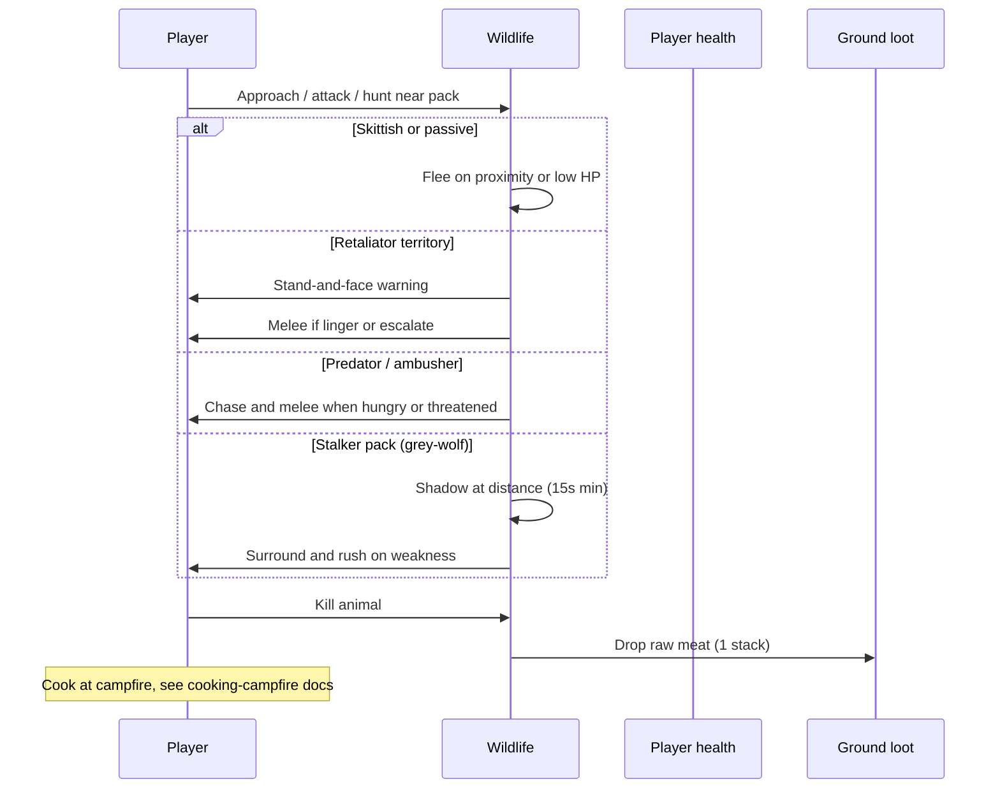
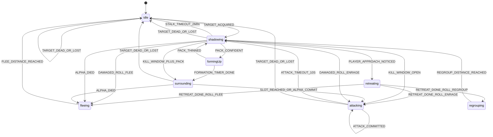

# Wildlife mechanics and gameplay

How animals behave in the plaza and how the simulation executes them.

## Player-facing loop

## Ecology overview

**11 species**, **6 temperaments**. Each spawn rolls aggression (tame/normal/aggressive), sleep schedule, and size from deterministic anchor seeds.

| Temperament | Species             | High-level behavior                                                                 |
| ----------- | ------------------- | ----------------------------------------------------------------------------------- |
| passive     | cow, sheep, chicken | Graze when hungry; flee when hurt. Chicken may attack on sight if aggressive spawn. |
| skittish    | deer, zebra         | Flee when player too close (run/jump startle) or low HP; graze when hungry.         |
| retaliator  | boar, brown-bear    | Territory warning, then chase/attack threats; hunt prey when motivated.             |
| predator    | lion, lioness       | Hunt in 14 grid radius; leash return; pride territory warnings.                     |
| ambusher    | crocodile           | Short aggro radius (3.5); pounce from water edge; melee player in radius.           |
| stalker     | grey-wolf           | Pack shadow hunt on player or prey (see stalk section).                             |

Behavior trees live in `definingWildlifeBehaviorTreeRegistry.ts`. The evaluator picks the first passing branch each think tick.

## Aggro pipeline

Threat accumulates from damage, starving proximity, territory linger, prey scent, and pack join while another wolf stalks (**1.1/s** within **14** grid).

| Constant                    | Value               | File                                            |
| --------------------------- | ------------------- | ----------------------------------------------- |
| Acquire target threshold    | **1.5**             | `definingWildlifeAggroConstants.ts`             |
| Threat per damage (default) | **2.5**             | species `aggro.threatPerDamage`                 |
| Threat decay (default)      | **0.4/s**           | species `aggro.threatDecayPerSecond`            |
| Pack threat share           | **45%**             | `DEFINING_WILDLIFE_PACK_THREAT_SHARE_RATIO`     |
| Starving proximity threat   | **0.8/s** × profile | `DEFINING_WILDLIFE_PROXIMITY_THREAT_PER_SECOND` |
| Melee range                 | **1.1** grid        | `DEFINING_WILDLIFE_MELEE_RANGE_GRID`            |

**Target switch margin** default **1.25**: a new threat must beat the active target by this factor to steal aggro.

Stalkers only melee the **player** once the stalk kill window is open (`checkingWildlifeMayTargetPlayer`). Until then they shadow or surround.

## Food chain

Predators resolve prey through explicit lists first, then trophic tier + mass (`definingWildlifeFoodChain.ts`).

| Rule                            | Detail                                           |
| ------------------------------- | ------------------------------------------------ |
| Hunt notice radius              | **14** grid                                      |
| Immediate attack radius         | **6** grid                                       |
| Favorite prey sight             | **14** grid; wolf favorite is **sheep**          |
| Player revenge on favorite prey | **30s** lock after player hits sheep near wolves |
| Hunter post-kill feed           | **10s** locked on corpse                         |
| Ground food forage scent        | **12** grid                                      |

**Grey-wolf** explicit prey: deer, zebra, cow, sheep, chicken, boar (denies other wolves).

**Crocodile** explicit prey: same herbivore/livestock list (no favorites).

**Lion / lioness / bear** use trophic tier 3 defaults: hunt tier 1-2 prey when mass allows (≤1.1× predator mass; up to 1.35× when starving).

## Sleep and day/night

Activity pattern per species drives when schedule sleep is allowed. See [day-night](../day-night/) for cycle phases.

| Pattern     | Species                    | Sleep window                                            |
| ----------- | -------------------------- | ------------------------------------------------------- |
| diurnal     | cow, sheep, chicken, zebra | Night (sunset → sunrise), widened/narrowed by sleep σ   |
| nocturnal   | grey-wolf                  | Day (sunrise → sunset), widened/narrowed by sleep σ     |
| crepuscular | deer, boar, lion, lioness  | Night except dawn/dusk twilight bands                   |
| cathemeral  | brown-bear, crocodile      | Night buckets with probabilistic sleep (42% base at 0σ) |

Per-instance **sleep schedule sample** shifts window edges: +σ sleeps longer, −σ sleeps shorter (~2.4 real min per edge per σ). No species-specific `sleepSchedule.bellCurveMeanShift` is authored yet; all use 0σ center.

**Wake rules**

- First hit on a sleeper sets `hasSleepBeenDisturbed` (no return to schedule sleep that life).
- Same-species neighbors within **10** grid: **40%** wake chance per sleeper.
- Sleep ambush first hit uses lethal-tier damage roll.
- **45s** post-combat block before schedule sleep resumes.

## Pack and herd reactions

| Event                        | Response                                | Distance         |
| ---------------------------- | --------------------------------------- | ---------------- |
| Pack alpha death             | Survivors flee                          | **18** grid      |
| Passive herd ally hit        | Herd panic flee                         | **10** grid      |
| Wolf damaged during shadow   | **65%** pack abandons hunt              | **18** grid flee |
| Player rushes shadowing wolf | **⅓** flee, **⅓** enrage, **⅓** regroup | see stalk table  |

Pack follow distances while stalking/roaming: `definingWildlifePackConstants.ts` (alpha shadow **5.5** grid, follower offset **1.75** grid per rank).

## Territory warnings

Retaliators and predators with `territory` config warn before full combat:

| Species        | Warn radius | Escalate radius | Linger before fight |
| -------------- | ----------- | --------------- | ------------------- |
| boar           | 5           | 2.8             | 2.5s                |
| brown-bear     | 7           | 3.5             | 3s                  |
| lion / lioness | 8           | 3.2             | 2.5s                |
| grey-wolf      | 6           | 3               | 3s                  |

Escalation applies **4** threat/s while inside escalate radius.

## On-hit effects (player)

Landeds wildlife melee swings against the player roll species procs from `definingWildlifeSpeciesOnHitEffectRegistry.ts`. Livestock and skittish prey have no entries. Full table in [catalog.md](./catalog.md).

## Stalk and pack hunts (grey-wolf)

Only `temperamentId: 'stalker'` runs `DEFINING_WILDLIFE_STALKER_BEHAVIOUR_MACHINE`. The chart is reusable for future stalker species.

### Statechart

### Commit and pressure rules

| Rule                                               | Value                                   |
| -------------------------------------------------- | --------------------------------------- |
| Mandatory shadow after target lock                 | **15s**                                 |
| Commit if prey HP low                              | **<50%**                                |
| Commit if prey stamina depleted                    | **≤2%**                                 |
| Commit if prey standing still                      | **8s**                                  |
| Pack surround minimum                              | **≥3** wolves                           |
| Confident pack (skip weakness wait)                | **≥5** wolves                           |
| Confident formation timer                          | **10-15s**                              |
| Stalk aggro timeout without kill trigger           | **120s**                                |
| Attack timeout then resume shadow                  | **10s**                                 |
| Damage during stalk: pack abandons hunt            | **65%** chance                          |
| Player rush (≤**5.5** grid, closing dot **≥0.35**) | **⅓** flee, **⅓** enrage, **⅓** regroup |
| Player approach reaction cooldown                  | **12s** pack-wide                       |

### Shadowing distances

| Constant                  | Grid          |
| ------------------------- | ------------- |
| Ideal follow distance     | **7.5**       |
| Too close (walk back)     | **<6**        |
| Catch up                  | **>9.5**      |
| Pack join radius          | **14**        |
| Surround radius min / max | **2.4 / 4.4** |

### Comfort-band shadow wander

Inside the follow ring (6–9.5 grid), stalkers no longer flip between circle / widen / hold legs. They reuse the same **bounded random walk** as calm wander, anchored on the prey:

| Rule                | Value                                     |
| ------------------- | ----------------------------------------- |
| Wander bucket       | **6s** (stable destination per bucket)    |
| Idle / watch chance | **28%** of buckets                        |
| Walk steps per leg  | **4** cardinal steps                      |
| Destination clamp   | Outside too-close ring, inside max follow |

Too-close and too-far corrections still override wander. Pack followers still catch up to the alpha when they drift past max follow.

### Stalk prey eligibility

Alpha wolves pick targets from `listingWildlifeStalkerPreyTargetCandidates`:

- **Player**: inside aggro radius and passes on-sight gate (not tame).
- **Wildlife prey**: in allow list or trophic/mass rules; within 14 grid scent, 6 grid proximity, or favorite prey sight.

Other species are **not** stalk-eligible; they use predator, ambusher, or retaliator trees instead.

## Death and loot

On death each species drops **1** raw meat stack per `loot` config (resolved from [cooking-campfire](../cooking-campfire/catalog.md)). Eating raw meat may contract [disease](../disease/); cooking reduces risk except prion residuals on deer and beef.

## Multiplayer note

Wildlife simulation leader (lowest `userId`) runs full AI ticks; followers apply snapshots and forward damage events. Stalk approach reactions run globally once per tick on the leader.

## Design knobs (balance)

| Knob                           | Location                                                               |
| ------------------------------ | ---------------------------------------------------------------------- |
| Species vitals and temperament | `definingWildlifeSpeciesRegistry.ts`                                   |
| Behavior priority              | `definingWildlifeBehaviorTreeRegistry.ts`                              |
| Stalk timings and distances    | `definingWildlifeStalkConstants.ts`                                    |
| Pack layout                    | `definingWildlifePackConstants.ts`                                     |
| Global aggro thresholds        | `definingWildlifeAggroConstants.ts`                                    |
| On-hit proc odds               | `definingWildlifeSpeciesOnHitEffectRegistry.ts`                        |
| Sleep window width             | `definingWildlifeSleepScheduleConstants.ts` + species activity pattern |

## Failure and edge cases

- **Tame spawns** never on-sight aggro; skittish herbivores still flee.
- **Stalker player damage** before kill window: shadow/regroup/flee, not immediate full pack melee.
- **Leash**: lions and crocodiles return to anchor if chase exceeds leash (18 grid default; croc **10**).
- **Sleeping hunters**: crocodile and bear may be caught in cathemeral sleep at night buckets.
- **Chicken aggressive spawn**: only herbivore with `aggressiveAttacksOnSight: true`.
