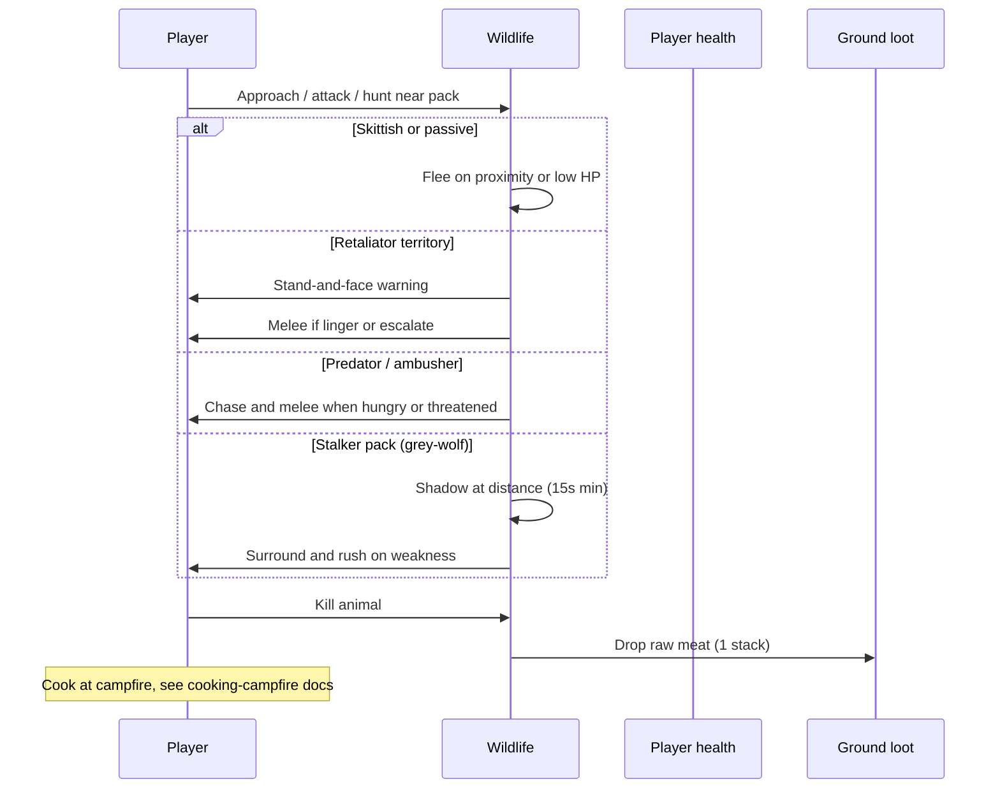
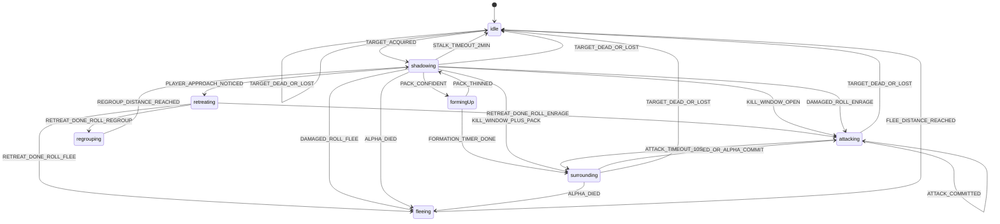
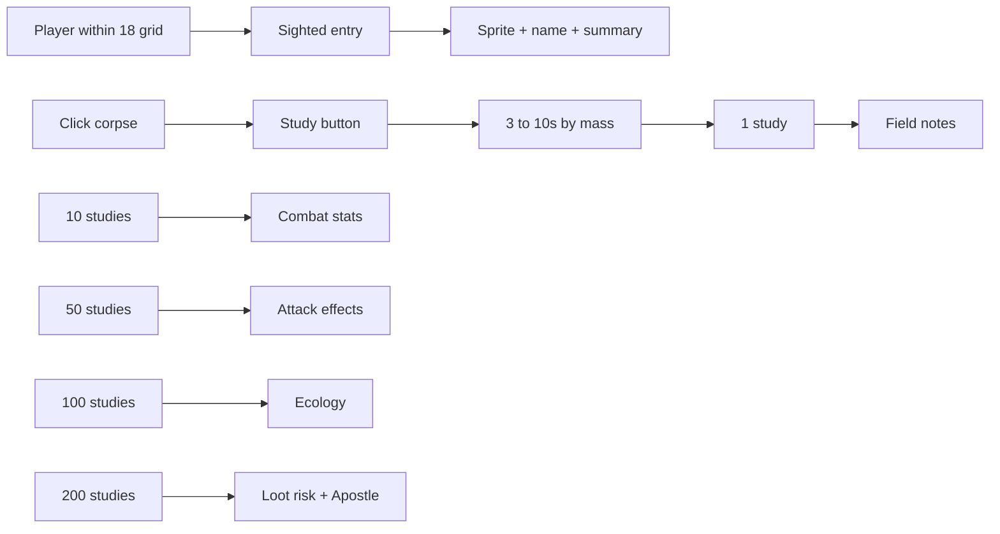

# Wildlife mechanics and gameplay

How animals behave in the plaza and how the simulation executes them.

## Player-facing loop

## Ecology overview

**11 species**, **6 temperaments**. Each spawn rolls aggression (tame/normal/aggressive), sleep schedule, and size from deterministic anchor seeds.

| Temperament | Species             | High-level behavior                                                                                             |
| ----------- | ------------------- | --------------------------------------------------------------------------------------------------------------- |
| passive     | cow, sheep, chicken | Graze when hungry; flee when hurt. Aggressive spawns warn on territory then fight; chicken may attack on sight. |
| skittish    | deer, zebra         | Flee when startled; aggressive spawns warn on territory then fight instead of fleeing.                          |
| retaliator  | boar, brown-bear    | Territory warning, then chase/attack threats; hunt prey when motivated.                                         |
| predator    | lion, lioness       | Hunt in 14 grid radius; leash return; pride territory warnings.                                                 |
| ambusher    | crocodile           | Short aggro radius (3.5); pounce from water edge; melee player in radius.                                       |
| stalker     | grey-wolf           | Pack shadow hunt on player or prey (see stalk section).                                                         |

Behavior trees live in `definingWildlifeBehaviorTreeRegistry.ts`. The evaluator picks the first passing branch each think tick.

## Gap jumps (water and terrain)

Jump-capable species (`species.jump.canJump`) clear short gaps while moving (not while stalking):

| Gap kind    | Trigger                                                                                    | Landing                                                           |
| ----------- | ------------------------------------------------------------------------------------------ | ----------------------------------------------------------------- |
| **Water**   | Forward scan finds non-wadable water within **2.5** grid                                   | Nearest safe tile past the far bank, at that tile's surface layer |
| **Terrain** | Forward scan finds a blocked rise within jump height (**2–4** layers above standing layer) | Nearest safe standable surface within `maxJumpDistanceGrid`       |

Planner: `resolvingWildlifeTerrainGapJumpPlan` in `resolvingWildlifeJumpPlan.ts`. One-layer stairs stay walkable (no jump). Walls taller than **4** layers stay solid. Stalk intents skip gap jumps. Predators may also **pounce** during chase via `resolvingWildlifePounceJumpPlan`.

## Spawn and difficulty levers

Biome pools in `definingWildlifeBiomeSpawnTable.ts` define **what** can appear where. Global balance lives in **`definingWildlifeDifficultyLevers.ts`** (one file to tune rarity, predator mix, and combat danger).

| Lever                        | Effect                                                                 |
| ---------------------------- | ---------------------------------------------------------------------- |
| `spawnSpacingModulus`        | Anchor grid spacing in tiles. Higher = sparser wildlife everywhere.    |
| `densityThresholdBias`       | Added to every biome `densityThreshold`. Higher = fewer spawn patches. |
| `packSizeMultiplier`         | Scales rolled pack size min/max.                                       |
| `spawnWeightByRole.prey`     | Weight multiplier for passive / skittish / retaliator spawns.          |
| `spawnWeightByRole.predator` | Weight multiplier for predator / ambusher / stalker spawns.            |
| `allowPredatorSpawns`        | Toggle temperament `predator` (lion, hyena, …).                        |
| `allowAmbusherSpawns`        | Toggle temperament `ambusher` (crocodile).                             |
| `allowStalkerSpawns`         | Toggle temperament `stalker` (grey-wolf).                              |
| `healthAndAttackPowerScale`  | Global HP and melee damage multiplier at registry build.               |
| `aggroRadiusMultiplier`      | Runtime on-sight aggro radius multiplier.                              |
| `preyHuntRadiusMultiplier`   | Hunt notice radius and favorite-prey sight radius.                     |

Resolver: `resolvingWildlifeSpawnEntriesForDifficulty.ts` applies spawn levers at anchor resolution. Aggro radius: `resolvingWildlifeSpeciesAggroRadiusGrid.ts`.

Defaults match pre-lever behavior (spacing **12**, density bias **0**, all toggles on, combat multipliers **1**).

## Aggro pipeline

Threat accumulates from damage, starving proximity, territory linger, prey scent, and pack join while another wolf stalks (**1.1/s** within **14** grid).

| Constant                    | Value               | File                                            |
| --------------------------- | ------------------- | ----------------------------------------------- |
| Acquire target threshold    | **1.5**             | `definingWildlifeAggroConstants.ts`             |
| Threat per damage (default) | **2.5**             | species `aggro.threatPerDamage`                 |
| Threat decay (default)      | **0.4/s**           | species `aggro.threatDecayPerSecond`            |
| Pack threat share           | **45%**             | `DEFINING_WILDLIFE_PACK_THREAT_SHARE_RATIO`     |
| Starving proximity threat   | **0.8/s** × profile | `DEFINING_WILDLIFE_PROXIMITY_THREAT_PER_SECOND` |
| Melee range                 | **1.1** grid        | `DEFINING_WILDLIFE_MELEE_RANGE_GRID`            |

**Target switch margin** default **1.25**: a new threat must beat the active target by this factor to steal aggro.

Stalkers only melee the **player** once the stalk kill window is open (`checkingWildlifeMayTargetPlayer`). Until then they shadow or surround.

### Species passive damage-roll traits

Some species apply permanent defender `damageRollModifiers` at spawn (`creatingWildlifeSpawnHealthState.ts`). These stack with obese-frame block bias when both apply.

| Species | Trait     | Effect                                                                                  |
| ------- | --------- | --------------------------------------------------------------------------------------- |
| turtle  | Shell     | Incoming `block_bias` **1** (same tier shift as Tower Shield); hits skew toward blocked |
| turtle  | Fat shell | Obese frame: **2×** render/collision size and **2×** obese health boost                 |

Tune: `definingWildlifeSpeciesPassiveTraitConstants.ts` + species `passiveDamageRollModifiers` on the registry entry.

## Food chain

Predators resolve prey through explicit lists first, then trophic tier + mass (`definingWildlifeFoodChain.ts`).

Wildlife melee against another animal uses `checkingWildlifeMayMeleeWildlifeTarget.ts`: huntable prey may be swung at under food-chain rules, and an **active threat target** may always be swung at so retaliators (boar, bear) can fight back against higher-tier attackers they cannot hunt.

| Rule                            | Detail                                           |
| ------------------------------- | ------------------------------------------------ |
| Hunt notice radius              | **14** grid                                      |
| Immediate attack radius         | **6** grid                                       |
| Favorite prey sight             | **14** grid; wolf favorite is **sheep**          |
| Player revenge on favorite prey | **30s** lock after player hits sheep near wolves |
| Hunter post-kill feed           | **10s** locked on corpse                         |
| Ground food forage scent        | **12** grid                                      |

**Grey-wolf** explicit prey: deer, zebra, cow, sheep, chicken, boar (denies other wolves).

**Crocodile** explicit prey: same herbivore/livestock list (no favorites).

**Lion / lioness / bear** use trophic tier 3 defaults: hunt tier 1-2 prey when mass allows (≤1.1× predator mass; up to 1.35× when starving).

## Sleep and day/night

Activity pattern per species drives when schedule sleep is allowed. See [day-night](../day-night/) for cycle phases.

| Pattern     | Species                    | Sleep window                                            |
| ----------- | -------------------------- | ------------------------------------------------------- |
| diurnal     | cow, sheep, chicken, zebra | Night (sunset → sunrise), widened/narrowed by sleep σ   |
| nocturnal   | grey-wolf                  | Day (sunrise → sunset), widened/narrowed by sleep σ     |
| crepuscular | deer, boar, lion, lioness  | Night except dawn/dusk twilight bands                   |
| cathemeral  | brown-bear, crocodile      | Night buckets with probabilistic sleep (42% base at 0σ) |

Per-instance **sleep schedule sample** shifts window edges: +σ sleeps longer, −σ sleeps shorter (~2.4 real min per edge per σ). No species-specific `sleepSchedule.bellCurveMeanShift` is authored yet; all use 0σ center.

**Wake rules**

- First hit on a sleeper sets `hasSleepBeenDisturbed` (no return to schedule sleep that life).
- Bumping a sleeper: **33%** wake chance once per contact (`DEFINING_WILDLIFE_SLEEP_BUMP_WAKE_CHANCE`). Wake uses the same flee-or-attack startle as a hit (`resolvingWildlifeSleepWakeStartleIntent`).
- Every species has a unique **wake** vocalization bubble (`definingWildlifeSpeciesSpeechRegistry.ts`) on schedule wake, bump wake, or hit wake.
- Same-species neighbors within **10** grid: **40%** wake chance per sleeper.
- Sleep ambush first hit uses lethal-tier damage roll.
- **45s** post-combat block before schedule sleep resumes.

## Pack and herd reactions

| Event                        | Response                                                                   | Distance                               |
| ---------------------------- | -------------------------------------------------------------------------- | -------------------------------------- |
| Pack alpha death             | Survivors flee                                                             | **18** grid                            |
| Baby (σ tier **−2**) hurt    | Same-species adults (σ tier **≥0**) attack the attacker (**defend young**) | pack share radius (default **8** grid) |
| Passive herd ally hit        | Herd panic flee                                                            | **10** grid                            |
| Wolf damaged during shadow   | **65%** pack abandons hunt                                                 | **18** grid flee                       |
| Player rushes shadowing wolf | **⅓** flee, **⅓** enrage, **⅓** regroup                                    | see stalk table                        |

**Defend young:** On by default for every species (`socialBehavior.defendsYoung`, opt out with `false`). Size tiers stand in for age until a numeric age roll exists: baby = **−2**, adult defender = **≥0** (proxy for age **20+**). Adults get boosted pack threat and a `defendingYoungUntilMs` flag so passive/skittish trees chase/melee instead of fleeing. Young (**−1**) do not join.

**Separation anxiety:** On by default (`socialBehavior.separationAnxiety`, opt out with `false`). Young animals (σ tier **≤ −1**) run (`followGuardian`) toward the nearest larger same-species ally when farther than **4** grid, and stop within **2** grid. Search radius **14** grid. Constants: `definingWildlifeSeparationAnxietyConstants.ts`.

Pack follow distances while stalking/roaming: `definingWildlifePackConstants.ts` (alpha shadow **5.5** grid, follower offset **1.75** grid per rank).

## Territory warnings

Retaliators and predators with `territory` config warn before full combat. **Aggressive (pissed) herbivores** on passive/skittish trees use the same warn branch: species with a `territory` row keep that profile; others get a synthetic band (warn **4.5** / escalate **2.5** / linger **2s**).

| Species / profile              | Warn radius | Escalate radius | Linger before fight |
| ------------------------------ | ----------- | --------------- | ------------------- |
| boar                           | 5           | 2.8             | 2.5s                |
| brown-bear                     | 7           | 3.5             | 3s                  |
| lion / lioness                 | 8           | 3.2             | 2.5s                |
| grey-wolf                      | 6           | 3               | 3s                  |
| aggressive herbivore (default) | 4.5         | 2.5             | 2s                  |

Escalation applies **4** threat/s while inside escalate radius. Tame spawns never warn.

## On-hit effects (player)

Landeds wildlife melee swings against the player roll species procs from `definingWildlifeSpeciesOnHitEffectRegistry.ts`. Livestock and skittish prey have no entries. Full table in [catalog.md](./catalog.md).

## Run stamina (species multipliers)

Wildlife share a 0–1 stamina bar (`DEFINING_WILDLIFE_STAMINA_DRAIN_PER_SECOND` **0.22**, regen **0.15**). Species multiply those rates in `DEFINING_WILDLIFE_SPECIES_STAMINA`.

| Species   | Drain ×  | Regen × | Exhaust exit | Approx full sprint / full refill |
| --------- | -------- | ------- | ------------ | -------------------------------- |
| grey-wolf | **0.28** | **2.4** | **22%**      | **~16s** / **~3s**               |
| hyena     | 0.75     | 1.1     | 45%          | ~6s / ~6s                        |
| deer      | 0.72     | 1.2     | (global 35%) | ~6s / ~6s                        |

## Stalk and pack hunts (grey-wolf)

Only `temperamentId: 'stalker'` runs `DEFINING_WILDLIFE_STALKER_BEHAVIOUR_MACHINE`. The chart is reusable for future stalker species.

### Statechart

### Commit and pressure rules

| Rule                                               | Value                                   |
| -------------------------------------------------- | --------------------------------------- |
| Mandatory shadow after target lock                 | **15s**                                 |
| Commit if prey HP low                              | **<50%** (force)                        |
| Commit if prey stamina depleted                    | **≤2%** (force)                         |
| Commit if prey standing still                      | **8s** (force)                          |
| Commit from pack confidence (no weakness)          | **10% / 22% / 40% / 62% / 88%** at 1–5+ |
| Pack surround minimum                              | **≥3** wolves                           |
| Solo / small pack after commit                     | Direct **attacking** rush               |
| Confident pack (formingUp early)                   | **≥5** wolves                           |
| Confident formation timer                          | **10-15s**                              |
| Stalk aggro timeout without kill                   | **120s**                                |
| Attack burst then re-flank (once committed)        | **4s**, then **surrounding** again      |
| Damage during stalk: pack abandons hunt            | **65%** chance                          |
| Player rush (≤**5.5** grid, closing dot **≥0.35**) | **⅓** flee, **⅓** enrage, **⅓** regroup |
| Player approach reaction cooldown                  | **12s** pack-wide                       |

### Shadowing distances

| Constant                  | Grid          |
| ------------------------- | ------------- |
| Ideal follow distance     | **7.5**       |
| Too close (walk back)     | **<6**        |
| Catch up                  | **>9.5**      |
| Pack join radius          | **14**        |
| Surround radius min / max | **2.4 / 4.4** |

### Comfort-band shadow wander

Inside the follow ring (6–9.5 grid), stalkers no longer flip between circle / widen / hold legs. They reuse the same **bounded random walk** as calm wander, anchored on the prey:

| Rule                | Value                                     |
| ------------------- | ----------------------------------------- |
| Wander bucket       | **6s** (stable destination per bucket)    |
| Idle / watch chance | **28%** of buckets                        |
| Walk steps per leg  | **4** cardinal steps                      |
| Destination clamp   | Outside too-close ring, inside max follow |

Too-close and too-far corrections still override wander. Pack followers still catch up to the alpha when they drift past max follow.

### Stalk prey eligibility

Alpha wolves pick targets from `listingWildlifeStalkerPreyTargetCandidates`:

- **Player**: inside aggro radius and passes on-sight gate (not tame). Treated as **70 kg** for size bias.
- **Wildlife prey**: in allow list or trophic/mass rules; within 14 grid scent, 6 grid proximity, or favorite prey sight.

When several candidates are in range, the alpha rolls a **mass-weighted** pick (`pickingWildlifeStalkAlphaPreyTargetId`): weight is `1 / max(mass, 1)^0.5`, so smaller animals are more likely than large ones. Favorite prey (sheep for grey-wolf) gets an extra **1.75×** multiplier on top of that bias. Re-rolls every **15s** until a hunt locks.

**Pack shared prey:** only the sticky pack alpha may open a stalk lock. Followers copy the alpha's `stalkLockedPreyTargetId` (or active target) within **14** grid join radius and cannot start a different hunt while that lock is live. Nearby same-species wolves count as one pack by proximity (not only same spawn tile), so mixed / dev-spawned wolves still share one prey.

**Pack alpha:** largest living nearby pack wolf at first election (`packAlphaInstanceId`). The lock sticks even if a bigger wolf joins later. When the alpha dies, survivors flee to a shared regroup point for **8s**, stay unlocked during that window, then elect a new alpha from whoever is nearby again. When the name tag is revealed (proximity / facing / hover / recent combat), the locked alpha uses the **Alpha** prefix and drops aggression/size prefixes. Hunting the player alone does not force the label on.

Other species are **not** stalk-eligible; they use predator, ambusher, or retaliator trees instead.

## Death and loot

On death each species drops **1** raw meat stack per `loot` config (resolved from [cooking-campfire](../cooking-campfire/catalog.md)). Eating raw meat may contract [disease](../disease/); cooking reduces risk except prion residuals on deer and beef.

## Multiplayer note

Wildlife simulation leader (lowest `userId`) runs full AI ticks; followers apply snapshots and forward damage events. Stalk approach reactions run globally once per tick on the leader.

## Design knobs (balance)

| Knob                           | Location                                                               |
| ------------------------------ | ---------------------------------------------------------------------- |
| Species vitals and temperament | `definingWildlifeSpeciesRegistry.ts`                                   |
| Behavior priority              | `definingWildlifeBehaviorTreeRegistry.ts`                              |
| Stalk timings and distances    | `definingWildlifeStalkConstants.ts`                                    |
| Stalk prey mass-weight pick    | `resolvingWildlifeStalkPreyPickWeight.ts` + stalk pick constants       |
| Pack layout                    | `definingWildlifePackConstants.ts`                                     |
| Global aggro thresholds        | `definingWildlifeAggroConstants.ts`                                    |
| On-hit proc odds               | `definingWildlifeSpeciesOnHitEffectRegistry.ts`                        |
| Sleep window width             | `definingWildlifeSleepScheduleConstants.ts` + species activity pattern |

## Streaming hydrate / despawn

Wildlife only lives inside a ring around the player (`DEFINING_WILDLIFE_SIM_RADIUS_GRID` **28**, despawn at **36**). Anchors hydrate when their spawn enters the sim ring. Live animals that flee past the despawn radius are removed from the store, but their `knownAnchorIds` entry stays until the **spawn tile** itself leaves the despawn ring. That stops herd panic from recreating the same deer at the fight site mid-combat.

True respawns after a kill still go through `pendingRespawns` (player must leave the death site by **20** grid).

## Failure and edge cases

- **Tame spawns** never on-sight aggro; skittish herbivores still flee.
- **Stalker player damage** before kill window: shadow/regroup/flee, not immediate full pack melee.
- **Leash**: lions and crocodiles return to anchor if chase exceeds leash (18 grid default; croc **10**).
- **Sleeping hunters**: crocodile and bear may be caught in cathemeral sleep at night buckets.
- **Chicken aggressive spawn**: only herbivore with `aggressiveAttacksOnSight: true`.
- **Flee past despawn**: animal is culled from sim, not killed; it must not rehydrate at the spawn while you stay nearby.

## Bestiary codex (Guide)

Opened from the action bar **Guide → Bestiary**. Mirrors the biomes codex layout: biome filter tabs, locked `???` cards, sighted cards, and a detail page.

| Stage   | Unlock rule                    | Player sees                                                                 |
| ------- | ------------------------------ | --------------------------------------------------------------------------- |
| Locked  | Never sighted                  | Dark sprite silhouette + `???` card, not clickable                          |
| Sighted | Within name-tag visible radius | Full sprite portrait, name, short summary, biome chips                      |
| Studied | **1** corpse Study             | Studied summary, temperament, diet, activity                                |
| Combat  | **10** studies                 | Scaled HP, attack, defense, attack interval, walk/run speed                 |
| Procs   | **50** studies                 | On-hit bleed/poison/buff rows with icon + exact proc %                      |
| Ecology | **100** studies                | Favorite prey, hunt list, aggro/pack share, stamina multipliers, mass, tier |
| Full    | **200** studies                | Loot meat/qty, raw disease %, cooked buff %, hazards, Apostle flavor        |

**Corpse window:** bodies persist **60s** (`DEFINING_WILDLIFE_CORPSE_LIFETIME_MS`), fully opaque until a final **10s** fade. Click a corpse → **Study** (chop-style timed label). Duration scales with mass from **3s** to **10s**. Completing Study awards **1–3** study points by mass (`computingWildlifeCorpseStudyPoints.ts`) and marks the corpse studied. Cards show a book icon + `N/200`.

**Persistence:** `localStorage` per session owner (`managingWorldPlazaBestiaryDiscoveryStore.ts`). Stores `sighted[]` plus per-species `studyCounts{}`; legacy `killCounts` / `killed[]` migrate in. Mutations persist, refresh snapshot caches, then notify subscribers.

**Player write paths**

| Event                                 | Store effect                                                              |
| ------------------------------------- | ------------------------------------------------------------------------- |
| Within **18** grid of a living animal | Adds species to `sighted`                                                 |
| Player finishes Study on a corpse     | Adds **1–3** to that species' `studyCount` by mass (and keeps it sighted) |

**Dev write paths** (plaza Dev Mode bestiary controls; not available in normal play)

| Helper                                            | Effect                                                                        |
| ------------------------------------------------- | ----------------------------------------------------------------------------- |
| `settingWorldPlazaBestiarySpeciesKillCountForDev` | Sets study count; count **> 0** also marks sighted; **0** clears studies only |
| `settingWorldPlazaBestiarySpeciesSightedForDev`   | Toggles sighted; locking (unsight) also clears that species' study count      |
| `unlockingWorldPlazaBestiaryDiscoveryAllForDev`   | Sights every catalog species and sets study count to full-study (**200**)     |
| `lockingWorldPlazaBestiaryDiscoveryAllForDev`     | Clears all sighted + study progress                                           |

Dev presets and unlock species list live in `definingWorldPlazaDevModeBestiaryUnlockConstants.ts` (full unlock count = study tier `full` threshold).

**Tier config:** `definingPlazaBestiaryStudyTier.ts`. Stat payloads resolve from wildlife/health registries in `resolvingPlazaBestiaryGuideTieredStats.ts`.

**Copy source:** `definingPlazaBestiaryGuideConstants.ts` (lore from `lore/species/wildlife.md`). Biome membership is derived from `definingWildlifeBiomeSpawnTable.ts`, not duplicated on entries.
