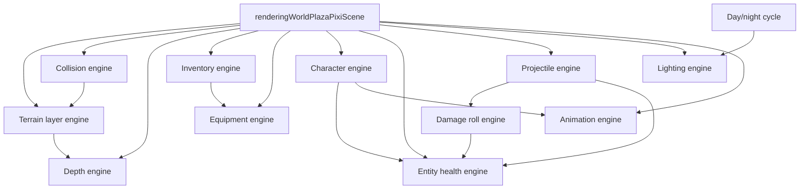

# Reigncraft game engines — AI reference

|                  |            |
| ---------------- | ---------- |
| **Version**      | 1.0.0      |
| **Last updated** | 2026-07-05 |

Read this when working on plaza world gameplay, combat, rendering sync, or inventory. There is **no central engine registry**; engines are folders and naming conventions scattered under `src/client/world/` and `src/client/components/inventory/`.

## Quick orientation

| Concept                                    | Location                                                       |
| ------------------------------------------ | -------------------------------------------------------------- |
| Main world shell (wires almost everything) | `src/client/world/components/renderingWorldPlazaPixiScene.tsx` |
| Game entry (lazy-loads Pixi scene)         | `src/client/game.tsx`                                          |
| Import alias                               | `@/components/world/...`, `@/components/inventory/...`         |
| Declarative style rules                    | `.cursor/rules/declarative-code.mdc`                           |
| Multiplayer reference (Redis polling)      | `memory/farmrush-reference.md`                                 |

### File prefix conventions

| Prefix                                    | Role                             | Example                                              |
| ----------------------------------------- | -------------------------------- | ---------------------------------------------------- |
| `defining*`                               | Config, registries, types        | `definingWorldCollisionProviderRegistry.ts`          |
| `registering*`                            | Populate registries              | `registeringWorldPlazaCharacterEngineDefinitions.ts` |
| `resolving*` / `computing*` / `checking*` | Pure helpers                     | `resolvingWorldCollisionBlockedWorldPoint.ts`        |
| `rendering*`                              | Thin React/Pixi UI               | `renderingWorldPlazaProjectileVisualLayer.tsx`       |
| `using*`                                  | React hooks wiring engines       | `usingWorldPlazaPlayerHealth.ts`                     |
| `managing*`                               | Mutable stores                   | `managingWorldPlazaProjectileStore.ts`               |
| `rolling*` / `running*` / `creating*`     | Engine factories or tick runners | `rollingWorldPlazaDamageEngine.ts`                   |

### What counts as an "engine"

In this codebase, **engine** means a self-contained subsystem with declarative config + a small imperative runner/hook. Not every game system uses the word (hunger, fire, building are separate).

---

## Engine catalog

### 1. Terrain layer engine

**Purpose:** Incremental Pixi terrain sync (floor chunks, water, trees, lava, rocks, etc.) driven by declarative layer descriptors and dependency snapshots.

|                     |                                                                                      |
| ------------------- | ------------------------------------------------------------------------------------ |
| **Folder**          | `src/client/world/engine/`                                                           |
| **Factory**         | `creatingWorldPlazaTerrainLayerEngine()` in `runningWorldPlazaTerrainLayerEngine.ts` |
| **Layer registry**  | `registeringWorldPlazaTerrainLayers.ts`                                              |
| **React shell**     | `renderingWorldPlazaDeclarativeTerrainSync.tsx`                                      |
| **Texture preload** | `registeringWorldPlazaTextureAssetManifest.ts`                                       |

**Registered layer ids** (`RUNNING_WORLD_PLAZA_TERRAIN_LAYER_ID`):

`rock-columns`, `firelands-decorations`, `floor-chunks`, `elevation-columns`, `tree-trunks`, `tree-shadows`, `tree-canopies`, `water-surface`, `water-shimmer`, `lava-overlay`, `canopy-alpha`, `tree-shake`

**Extend (new terrain layer):**

1. Add a `DefiningWorldPlazaTerrainLayerDescriptor` entry in `registeringWorldPlazaTerrainLayers.ts`.
2. Add dependency keys in `definingWorldPlazaTerrainDependencyKeys.ts` if the layer needs new inputs.
3. Wire cache keys in `buildingWorldPlazaTerrainLayerCacheKeys.ts` when incremental invalidation is needed.

---

### 2. Collision engine

**Purpose:** Unified movement blocking, push-out, clamp, ejection, and spatial overlap queries.

|                       |                                             |
| --------------------- | ------------------------------------------- |
| **Public API**        | `src/client/world/collision/index.ts`       |
| **Docs**              | `src/client/world/collision/README.md`      |
| **Provider registry** | `definingWorldCollisionProviderRegistry.ts` |
| **Pipeline**          | `resolvingWorldCollisionBlockedPoint.ts`    |
| **Blocker diagnosis** | `findingWorldCollisionBlockerAtPoint.ts`    |

**Push-out order:** placed blocks → column-rock diamonds → tree circles → Firelands props → pebble rocks → water tiles.

**Block-test order:** rock footprint bypass → placed blocks → terrain elevation columns → obstacle kinds.

**Extend (new obstacle type):**

1. Add `DefiningWorldCollisionProvider` in `definingWorldCollisionProviderRegistry.ts`.
2. Implement push-out and/or tile-grid block logic (often in `resolvingWorldCollisionBlockedPoint.ts`).
3. Add debug stroke color and tests in `resolvingWorldCollisionCharacterization.test.ts`.

Legacy shims under `src/client/world/domains/` re-export collision APIs during migration. Prefer `@/components/world/collision` for new work.

---

### 3. Depth engine

**Purpose:** Isometric z-sort keys, surface layers, avatar occlusion (standing bump, front occluder cap, hard floor raise).

|                       |                                                 |
| --------------------- | ----------------------------------------------- |
| **Public API**        | `src/client/world/depth/index.ts`               |
| **Docs**              | `src/client/world/depth/README.md`              |
| **Base sort key**     | `computingWorldDepthSortKey.ts`                 |
| **Bias ladder**       | `definingWorldDepthBiasLadder.ts`               |
| **Provider registry** | `definingWorldDepthProviderRegistry.ts`         |
| **Avatar body**       | `resolvingWorldDepthAvatarBodySortKey.ts`       |
| **Avatar shadow**     | `resolvingWorldDepthAvatarShadowSortKey.ts`     |
| **Walkable surface**  | `resolvingWorldDepthSurfaceLayerAtTileIndex.ts` |

**Extend (new world object depth):**

1. Add `DefiningWorldDepthProvider` in `definingWorldDepthProviderRegistry.ts`.
2. Register in `DEFINING_WORLD_DEPTH_SURFACE_LAYER_PROVIDERS` and/or `DEFINING_WORLD_DEPTH_AVATAR_OCCLUSION_PROVIDERS`.
3. Add bias constant in `definingWorldDepthBiasLadder.ts` if needed.
4. Test in `resolvingWorldDepthCharacterization.test.ts`.

---

### 4. Inventory engine (generic + plaza wrapper)

**Purpose:** Slot-based inventory with item registry, reducer, drag-and-drop ids, and persistence adapter.

|                         |                                                                                                |
| ----------------------- | ---------------------------------------------------------------------------------------------- |
| **Generic hook**        | `usingInventoryEngine()` in `src/client/components/inventory/hooks/usingInventoryEngine.ts`    |
| **Plaza wrapper**       | `usingWorldPlazaInventory()` in `src/client/world/inventory/hooks/usingWorldPlazaInventory.ts` |
| **Item types (plaza)**  | `definingWorldPlazaInventoryItemTypes.ts`                                                      |
| **Reducer**             | `reducingInventoryState.ts`                                                                    |
| **Persistence adapter** | Injected via `DefiningInventoryPersistenceAdapter`                                             |

The plaza hook wires Redis/save-slot persistence and optional demo seed. World features (equipment, consumables) read `DefiningInventoryState` from this hook.

**Extend (new item):**

1. Add `DefiningInventoryItemTypeDefinition` in `definingWorldPlazaInventoryItemTypes.ts` (or shared registry).
2. If equippable, map tool kind in `resolvingWorldPlazaEquipmentCapabilitiesForItemTypeId.ts`.
3. If consumable, add handler in `consumingWorldPlazaInventoryItemByType.ts`.

---

### 5. Character engine

**Purpose:** Declarative per-avatar stats, movement rules, immunities, starting buffs, and skill ids.

|                         |                                                          |
| ----------------------- | -------------------------------------------------------- |
| **Types**               | `definingWorldPlazaCharacterEngineTypes.ts`              |
| **Registry**            | `registeringWorldPlazaCharacterEngineDefinitions.ts`     |
| **Derived stats**       | `computingWorldPlazaCharacterEngineDerivedStats.ts`      |
| **Skills registry**     | `definingWorldPlazaCharacterEngineSkillRegistry.ts`      |
| **Skill execution**     | `applyingWorldPlazaCharacterEngineSkill.ts`              |
| **Immunities at spawn** | `applyingWorldPlazaCharacterEngineImmunities.ts`         |
| **Initial health**      | `creatingWorldPlazaCharacterEngineInitialHealthState.ts` |
| **Local player hook**   | `usingWorldPlazaSelectedCharacterEngineDefinition.ts`    |
| **Skill cooldowns**     | `usingWorldPlazaCharacterEngineSkillCooldowns.ts`        |

**Registered characters (skin id → engine def):**

`girl-sample` (default), `husky`, `golden-retriever`, `grizzly`, `pinguin`, `fox-peach`, `cat-orange`

**Registered skills:**

| skillId        | Effect     |
| -------------- | ---------- |
| `minor-heal`   | Flat heal  |
| `swift-stride` | Apply buff |
| `heat-ward`    | Apply buff |

**Extend (new playable avatar):**

1. Add skin constant in `definingWorldPlazaAvatarSkinConstants.ts`.
2. Add `DefiningWorldPlazaCharacterEngineDefinition` in `registeringWorldPlazaCharacterEngineDefinitions.ts`.
3. Wire sprite/motion clips in animation registries if needed.

---

### 6. Entity health engine

**Purpose:** Player vitals, shields, buffs, bleed/poison, environmental temperature hazards, float text, respawn, HUD sync.

|                     |                                                 |
| ------------------- | ----------------------------------------------- |
| **Main hook**       | `usingWorldPlazaPlayerHealth.ts`                |
| **State shape**     | `definingWorldPlazaEntityHealthTypes.ts`        |
| **State mutations** | `managingWorldPlazaEntityHealthState.ts`        |
| **Damage pipeline** | `computingWorldPlazaEntityHealthDamage.ts`      |
| **Damage kinds**    | `definingWorldPlazaEntityDamageKindRegistry.ts` |
| **Buffs**           | `definingWorldPlazaEntityBuffRegistry.ts`       |
| **Tick advance**    | `advancingWorldPlazaEntityHealthTick.ts`        |
| **Constants**       | `definingWorldPlazaEntityHealthConstants.ts`    |

Character engine feeds initial state via `creatingWorldPlazaCharacterEngineInitialHealthState`. Projectiles apply damage through `applyingWorldPlazaProjectilePayload.ts`.

---

### 7. Damage roll engine (sub-engine of health/combat)

**Purpose:** EV-based statistical damage rolls (spread, luck, tiers: block/dodge/hit/crit, etc.).

|                          |                                                                         |
| ------------------------ | ----------------------------------------------------------------------- |
| **Core function**        | `rollingWorldPlazaDamageEngine()` in `rollingWorldPlazaDamageEngine.ts` |
| **Roll params**          | `resolvingWorldPlazaEntityHealthDamageRollParams.ts`                    |
| **EV from raw amount**   | `resolvingWorldPlazaEntityHealthDamageRollBaseExpectedDamage.ts`        |
| **Tier registry**        | `definingWorldPlazaDamageOutcomeTierRegistry.ts`                        |
| **Dev presets**          | `definingWorldPlazaEntityHealthDamageRollPresets.ts`                    |
| **Mechanics UI preview** | `computingPlazaMechanicsCombatEvDamageRollPreview.ts`                   |

**Flow:** `computingWorldPlazaEntityHealthDamage` → resolve roll params → `rollingWorldPlazaDamageEngine` → apply modifiers/shield → update state.

Kinds that use the roll engine are declared in `definingWorldPlazaEntityDamageKindRegistry.ts` (`shouldWorldPlazaEntityDamageKindUseDamageRoll`).

**Dev panel:** Combat tab → subcategory `engine` → `renderingWorldPlazaDevModeCombatRollControls.tsx`.

---

### 8. Projectile engine

**Purpose:** Spawn, simulate, hit-test, split/impact behaviors, visuals, online spawn sync.

|                        |                                                           |
| ---------------------- | --------------------------------------------------------- |
| **Hook**               | `usingWorldPlazaProjectileEngine.ts`                      |
| **Store**              | `managingWorldPlazaProjectileStore.ts`                    |
| **Step sim**           | `computingWorldPlazaProjectileStep.ts`                    |
| **Hit resolution**     | `resolvingWorldPlazaProjectileHit.ts`                     |
| **Archetypes**         | `definingWorldPlazaProjectileArchetypeRegistry.ts`        |
| **Movement behaviors** | `definingWorldPlazaProjectileMovementBehaviorRegistry.ts` |
| **Impact behaviors**   | `definingWorldPlazaProjectileImpactBehaviorRegistry.ts`   |
| **Payload → health**   | `applyingWorldPlazaProjectilePayload.ts`                  |
| **Visual layer**       | `renderingWorldPlazaProjectileSimulation.tsx`             |

**Extend (new projectile):**

1. Add archetype in `definingWorldPlazaProjectileArchetypeRegistry.ts`.
2. Register movement/impact behavior if non-default.
3. Map payload to damage kind in `applyingWorldPlazaProjectilePayload.ts`.
4. Add animation clips in `registeringWorldPlazaProjectileAnimationClips.ts` if needed.

---

### 9. Lighting engine

**Purpose:** Screen-space darkness lightmap (Terraria-style radial holes at torches, campfires, player torch).

|                         |                                                                                                      |
| ----------------------- | ---------------------------------------------------------------------------------------------------- |
| **Tuning**              | `definingWorldPlazaLightingEngineConstants.ts`                                                       |
| **Darkness layer**      | `renderingWorldPlazaLightingDarknessLayer.tsx`                                                       |
| **Light sources**       | `definingWorldPlazaLightSource.ts`                                                                   |
| **Radial texture bake** | `creatingWorldPlazaLightingRadialBakedTexture.ts`                                                    |
| **Ground glows**        | `renderingWorldPlazaLightSourcesGroundGlow.tsx`, `renderingWorldPlazaPlayerNightLightGroundGlow.tsx` |

Darkness strength follows the **day/night cycle** (`computingWorldPlazaDayNightSunState.ts`), which is a separate system (not branded "engine").

---

### 10. Animation engine

**Purpose:** Declarative clip playback on Pixi sprites (avatar motion, fire, tools, projectiles).

|                         |                                                          |
| ----------------------- | -------------------------------------------------------- |
| **Types**               | `definingWorldPlazaAnimationTypes.ts`                    |
| **Clip registry**       | `registeringWorldPlazaAnimationClip.ts`                  |
| **Playback advance**    | `advancingWorldPlazaDeclarativeAnimationPlayback.ts`     |
| **Hook**                | `usingWorldPlazaDeclarativeAnimationPlayback.ts`         |
| **Avatar motion clips** | `registeringWorldPlazaAvatarMotionAnimationClips.ts`     |
| **Tool action clips**   | `definingWorldPlazaAvatarToolActionAnimationRegistry.ts` |
| **Component**           | `renderingWorldPlazaDeclarativeAnimatedSprite.tsx`       |

Describe playback with `clipId` (+ optional `variantKey`); the hook advances frames each Pixi tick.

---

### 11. Equipment engine

**Purpose:** Hotbar slot selection and tool-kind checks (axe, flint, etc.) for world interactions.

|                         |                                                            |
| ----------------------- | ---------------------------------------------------------- |
| **Hook**                | `usingWorldPlazaEquipment.ts`                              |
| **Tool kinds**          | `definingWorldPlazaEquipmentToolKind.ts`                   |
| **Slot check**          | `checkingWorldPlazaEquippedSlotHasToolKind.ts`             |
| **Item → capabilities** | `resolvingWorldPlazaEquipmentCapabilitiesForItemTypeId.ts` |

Depends on inventory state from `usingWorldPlazaInventory`. Used by harvest, fire ignition, and build flows in `renderingWorldPlazaPixiScene.tsx`.

---

## Dependency graph (high level)

---

## Related systems (not called engines)

Use these folders when the task is not covered above:

| System              | Folder                                   | Main hook                                                                           |
| ------------------- | ---------------------------------------- | ----------------------------------------------------------------------------------- |
| Hunger              | `src/client/world/hunger/`               | `usingWorldPlazaPlayerHunger.ts`                                                    |
| Fire / campfires    | `src/client/world/fire/`                 | `usingWorldPlazaFireCells.ts`                                                       |
| Building / plots    | `src/client/world/building/`             | `usingWorldPlazaBuildMode.ts`, `usingWorldPlazaPlacedBlocksQuery.ts`                |
| Harvest / tree chop | `src/client/world/harvest/`              | `usingWorldPlazaTreeChopInteraction.ts`                                             |
| Day/night cycle     | `src/client/world/domains/`              | `usingWorldPlazaDayNightSunState.ts`, `definingWorldPlazaDayNightCycleConstants.ts` |
| Online room         | `src/client/world/hooks/`                | `usingWorldPlazaDevvitPollingRoom.ts`                                               |
| Run stamina         | `src/client/world/hooks/`                | `usingWorldPlazaRunStamina.ts`                                                      |
| Mini-map            | `src/client/world/domains/` + components | `renderingWorldPlazaMiniMapStack.tsx`                                               |

---

## Task → where to start

| Task                               | Start here                                                                                   |
| ---------------------------------- | -------------------------------------------------------------------------------------------- |
| Player cannot walk through X       | Collision provider registry + `resolvingWorldCollisionBlockedPoint.ts`                       |
| Sprite draws behind wrong object   | Depth provider registry or `definingWorldDepthBiasLadder.ts`                                 |
| New ground/water/tree visual layer | `registeringWorldPlazaTerrainLayers.ts`                                                      |
| New damage type or shield rule     | `definingWorldPlazaEntityDamageKindRegistry.ts` + `computingWorldPlazaEntityHealthDamage.ts` |
| Change crit/block math             | `rollingWorldPlazaDamageEngine.ts` + tier registry                                           |
| New throwable / spell              | Projectile archetype + impact registry                                                       |
| New avatar stat or skill           | Character engine registry + skill registry                                                   |
| New hotbar item                    | Inventory item types + equipment capabilities                                                |
| Night lighting too dark/bright     | `definingWorldPlazaLightingEngineConstants.ts` + day/night constants                         |
| New walk/run animation             | `registeringWorldPlazaAvatarMotionAnimationClips.ts`                                         |
| Combat dev tuning                  | Dev panel combat tab, subcategory `engine`                                                   |

---

## Tests

Engine characterization tests usually live next to the engine:

| Engine          | Test file pattern                                                                       |
| --------------- | --------------------------------------------------------------------------------------- |
| Damage roll     | `rollingWorldPlazaDamageEngine.test.ts`                                                 |
| Terrain layer   | `runningWorldPlazaTerrainLayerEngine.test.ts`                                           |
| Collision       | `resolvingWorldCollisionCharacterization.test.ts`                                       |
| Depth           | `resolvingWorldDepthCharacterization.test.ts`                                           |
| Projectile      | `managingWorldPlazaProjectileStore.test.ts`, `resolvingWorldPlazaProjectileHit.test.ts` |
| Animation       | `advancingWorldPlazaDeclarativeAnimationPlayback.test.ts`                               |
| Character stats | `computingWorldPlazaCharacterEngineDerivedStats.test.ts`                                |

Run: `npm run test -- <file-name-without-path>`

---

## Anti-patterns

- **Do not** grow long `if/else` chains in components; add registry entries and pure resolvers instead.
- **Do not** import legacy `domains/` collision/depth shims in new code; use `@/components/world/collision` and `@/components/world/depth`.
- **Do not** put gameplay rules only in `renderingWorldPlazaPixiScene.tsx`; extract to `defining*` / `resolving*` modules.
- **Do not** assume WebSockets; multiplayer uses HTTP polling (see `memory/farmrush-reference.md`).
- **Do not** use `@devvit/public-api` blocks API; this project is Devvit Web only.

---

## Version history

| Version | Date       | Note                                 |
| ------- | ---------- | ------------------------------------ |
| 1.0.0   | 2026-07-05 | Initial engine map for AI navigation |
