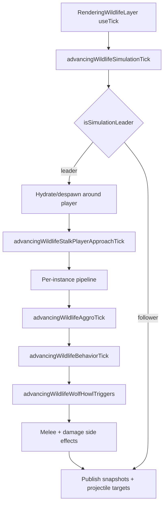
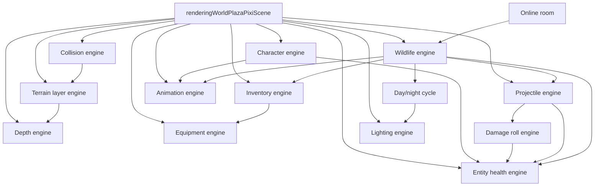

# Reigncraft game engines — AI reference

|                  |            |
| ---------------- | ---------- |
| **Version**      | 1.3.2      |
| **Last updated** | 2026-07-09 |

Read this when working on plaza world gameplay, combat, rendering sync, or inventory. There is **no central engine registry**; engines are folders and naming conventions scattered under `src/client/world/` and `src/client/components/inventory/`.

Player-facing numbers and behavior rules: [game-mechanics-reference.md](./game-mechanics-reference.md).

## Quick orientation

| Concept                                    | Location                                                             |
| ------------------------------------------ | -------------------------------------------------------------------- |
| Main world shell (wires almost everything) | `src/client/world/components/renderingWorldPlazaPixiScene.tsx`       |
| Game entry (lazy-loads Pixi scene)         | `src/client/game.tsx`                                                |
| Import alias                               | `@/components/world/...`, `@/components/inventory/...`               |
| Wildlife public API                        | `@/components/world/wildlife` → `src/client/world/wildlife/index.ts` |
| Declarative style rules                    | `.cursor/rules/declarative-code.mdc`                                 |

### File prefix conventions

| Prefix                                    | Role                             | Example                                              |
| ----------------------------------------- | -------------------------------- | ---------------------------------------------------- |
| `defining*`                               | Config, registries, types        | `definingWorldCollisionProviderRegistry.ts`          |
| `registering*`                            | Populate registries              | `registeringWorldPlazaCharacterEngineDefinitions.ts` |
| `resolving*` / `computing*` / `checking*` | Pure helpers                     | `resolvingWorldCollisionBlockedWorldPoint.ts`        |
| `rendering*`                              | Thin React/Pixi UI               | `renderingWorldPlazaProjectileVisualLayer.tsx`       |
| `using*`                                  | React hooks wiring engines       | `usingWorldPlazaPlayerHealth.ts`                     |
| `managing*`                               | Mutable stores                   | `managingWorldPlazaProjectileStore.ts`               |
| `advancing*`                              | Per-tick state advancement       | `advancingWildlifeSimulationTick.ts`                 |
| `applying*`                               | Side-effect application          | `applyingWildlifeStalkPackEvent.ts`                  |
| `rolling*` / `running*` / `creating*`     | Engine factories or tick runners | `rollingWorldPlazaDamageEngine.ts`                   |

### What counts as an "engine"

In this codebase, **engine** means a self-contained subsystem with declarative config + a small imperative runner/hook. Not every game system uses the word (hunger, fire, building are separate).

---

## Engine catalog

### 1. Terrain layer engine

**Purpose:** Incremental Pixi terrain sync (floor chunks, water, trees, lava, rocks, etc.) driven by declarative layer descriptors and dependency snapshots.

|                     |                                                                                      |
| ------------------- | ------------------------------------------------------------------------------------ |
| **Folder**          | `src/client/world/engine/`                                                           |
| **Factory**         | `creatingWorldPlazaTerrainLayerEngine()` in `runningWorldPlazaTerrainLayerEngine.ts` |
| **Layer registry**  | `registeringWorldPlazaTerrainLayers.ts`                                              |
| **React shell**     | `renderingWorldPlazaDeclarativeTerrainSync.tsx`                                      |
| **Texture preload** | `registeringWorldPlazaTextureAssetManifest.ts`                                       |

**Registered layer ids** (`RUNNING_WORLD_PLAZA_TERRAIN_LAYER_ID`):

`rock-columns`, `firelands-decorations`, `floor-chunks`, `elevation-columns`, `tree-trunks`, `tree-shadows`, `tree-canopies`, `water-surface`, `water-shimmer`, `lava-overlay`, `canopy-alpha`, `tree-shake`

**Extend (new terrain layer):**

1. Add a `DefiningWorldPlazaTerrainLayerDescriptor` entry in `registeringWorldPlazaTerrainLayers.ts`.
2. Add dependency keys in `definingWorldPlazaTerrainDependencyKeys.ts` if the layer needs new inputs.
3. Wire cache keys in `buildingWorldPlazaTerrainLayerCacheKeys.ts` when incremental invalidation is needed.

---

### 2. Collision engine

**Purpose:** Unified movement blocking, push-out, clamp, ejection, and spatial overlap queries.

|                       |                                             |
| --------------------- | ------------------------------------------- |
| **Public API**        | `src/client/world/collision/index.ts`       |
| **Docs**              | `src/client/world/collision/README.md`      |
| **Provider registry** | `definingWorldCollisionProviderRegistry.ts` |
| **Pipeline**          | `resolvingWorldCollisionBlockedPoint.ts`    |
| **Blocker diagnosis** | `findingWorldCollisionBlockerAtPoint.ts`    |

**Push-out order:** placed blocks → column-rock diamonds → tree circles → Firelands props → pebble rocks → water tiles.

**Block-test order:** rock footprint bypass → placed blocks → terrain elevation columns → obstacle kinds.

**Debug overlay:** terrain providers + placed blocks + live wildlife body circles (`drawingWorldPlazaVisibleWildlifeCollisionDebugOnGraphics.ts`, cyan `0x44ddff`) + player marker. Wildlife is not a terrain provider; solid-body push lives in the wildlife sim tick.

**Extend (new obstacle type):**

1. Add `DefiningWorldCollisionProvider` in `definingWorldCollisionProviderRegistry.ts`.
2. Implement push-out and/or tile-grid block logic (often in `resolvingWorldCollisionBlockedPoint.ts`).
3. Add debug stroke color and tests in `resolvingWorldCollisionCharacterization.test.ts`.

Legacy shims under `src/client/world/domains/` re-export collision APIs during migration. Prefer `@/components/world/collision` for new work.

---

### 3. Depth engine

**Purpose:** Isometric z-sort keys, surface layers, avatar occlusion (standing bump, front occluder cap, hard floor raise).

|                       |                                                 |
| --------------------- | ----------------------------------------------- |
| **Public API**        | `src/client/world/depth/index.ts`               |
| **Docs**              | `src/client/world/depth/README.md`              |
| **Base sort key**     | `computingWorldDepthSortKey.ts`                 |
| **Bias ladder**       | `definingWorldDepthBiasLadder.ts`               |
| **Provider registry** | `definingWorldDepthProviderRegistry.ts`         |
| **Avatar body**       | `resolvingWorldDepthAvatarBodySortKey.ts`       |
| **Avatar shadow**     | `resolvingWorldDepthAvatarShadowSortKey.ts`     |
| **Walkable surface**  | `resolvingWorldDepthSurfaceLayerAtTileIndex.ts` |

**Extend (new world object depth):**

1. Add `DefiningWorldDepthProvider` in `definingWorldDepthProviderRegistry.ts`.
2. Register in `DEFINING_WORLD_DEPTH_SURFACE_LAYER_PROVIDERS` and/or `DEFINING_WORLD_DEPTH_AVATAR_OCCLUSION_PROVIDERS`.
3. Add bias constant in `definingWorldDepthBiasLadder.ts` if needed.
4. Test in `resolvingWorldDepthCharacterization.test.ts`.

---

### 4. Inventory engine (generic + plaza wrapper)

**Purpose:** Slot-based inventory with item registry, reducer, drag-and-drop ids, and persistence adapter.

|                         |                                                                                                |
| ----------------------- | ---------------------------------------------------------------------------------------------- |
| **Generic hook**        | `usingInventoryEngine()` in `src/client/components/inventory/hooks/usingInventoryEngine.ts`    |
| **Plaza wrapper**       | `usingWorldPlazaInventory()` in `src/client/world/inventory/hooks/usingWorldPlazaInventory.ts` |
| **Item types (plaza)**  | `definingWorldPlazaInventoryItemTypes.ts`                                                      |
| **Reducer**             | `reducingInventoryState.ts`                                                                    |
| **Persistence adapter** | Injected via `DefiningInventoryPersistenceAdapter`                                             |

The plaza hook wires Redis/save-slot persistence and optional demo seed. World features (equipment, consumables) read `DefiningInventoryState` from this hook.

**Extend (new item):**

1. Add `DefiningInventoryItemTypeDefinition` in `definingWorldPlazaInventoryItemTypes.ts` (or shared registry).
2. If equippable, map tool kind in `resolvingWorldPlazaEquipmentCapabilitiesForItemTypeId.ts`.
3. If consumable, add handler in `consumingWorldPlazaInventoryItemByType.ts`.

---

### 5. Character engine

**Purpose:** Declarative per-avatar stats, movement rules, immunities, starting buffs, and skill ids.

|                         |                                                          |
| ----------------------- | -------------------------------------------------------- |
| **Types**               | `definingWorldPlazaCharacterEngineTypes.ts`              |
| **Registry**            | `registeringWorldPlazaCharacterEngineDefinitions.ts`     |
| **Derived stats**       | `computingWorldPlazaCharacterEngineDerivedStats.ts`      |
| **Skills registry**     | `definingWorldPlazaCharacterEngineSkillRegistry.ts`      |
| **Skill execution**     | `applyingWorldPlazaCharacterEngineSkill.ts`              |
| **Immunities at spawn** | `applyingWorldPlazaCharacterEngineImmunities.ts`         |
| **Initial health**      | `creatingWorldPlazaCharacterEngineInitialHealthState.ts` |
| **Local player hook**   | `usingWorldPlazaSelectedCharacterEngineDefinition.ts`    |
| **Skill cooldowns**     | `usingWorldPlazaCharacterEngineSkillCooldowns.ts`        |

**Registered characters (skin id → engine def):**

`girl-sample` (default), `husky`, `golden-retriever`, `grizzly`, `pinguin`, `fox-peach`, `cat-orange`

**Registered skills:**

| skillId        | Effect     |
| -------------- | ---------- |
| `minor-heal`   | Flat heal  |
| `swift-stride` | Apply buff |
| `heat-ward`    | Apply buff |

**Extend (new playable avatar):**

1. Add skin constant in `definingWorldPlazaAvatarSkinConstants.ts`.
2. Add `DefiningWorldPlazaCharacterEngineDefinition` in `registeringWorldPlazaCharacterEngineDefinitions.ts`.
3. Wire sprite/motion clips in animation registries if needed.

---

### 6. Entity health engine

**Purpose:** Player vitals, shields, buffs, bleed/poison, environmental temperature hazards, float text, respawn, HUD sync.

|                     |                                                 |
| ------------------- | ----------------------------------------------- |
| **Main hook**       | `usingWorldPlazaPlayerHealth.ts`                |
| **State shape**     | `definingWorldPlazaEntityHealthTypes.ts`        |
| **State mutations** | `managingWorldPlazaEntityHealthState.ts`        |
| **Damage pipeline** | `computingWorldPlazaEntityHealthDamage.ts`      |
| **Damage kinds**    | `definingWorldPlazaEntityDamageKindRegistry.ts` |
| **Buffs**           | `definingWorldPlazaEntityBuffRegistry.ts`       |
| **Tick advance**    | `advancingWorldPlazaEntityHealthTick.ts`        |
| **Constants**       | `definingWorldPlazaEntityHealthConstants.ts`    |

Character engine feeds initial state via `creatingWorldPlazaCharacterEngineInitialHealthState`. Projectiles apply damage through `applyingWorldPlazaProjectilePayload.ts`.

**Disease subsystem:**

|                          |                                                |
| ------------------------ | ---------------------------------------------- |
| **Disease registry**     | `definingWorldPlazaEntityDiseaseRegistry.ts`   |
| **Disease tick**         | `applyingWorldPlazaEntityDisease.ts`           |
| **Persistence hook**     | `usingWorldPlazaPersistingPlayerConditions.ts` |
| **In-game time scaling** | `computingWorldPlazaInGameDurationMs.ts`       |

**Registered disease ids:** `salmonellosis`, `chronic-wasting`, `trichinellosis`, `mad-cow`, `liver-fluke`, `sleeping-sickness`, `wolf-fever`, `bear-worm`, `toxoplasmosis`, `vibrio-infection`.

Eating raw or undercooked wildlife meat can grant diseases (ties wildlife meat loop to health engine).

---

### 7. Damage roll engine (sub-engine of health/combat)

**Purpose:** EV-based statistical damage rolls (spread, luck, tiers: block/dodge/hit/crit, etc.).

|                          |                                                                         |
| ------------------------ | ----------------------------------------------------------------------- |
| **Core function**        | `rollingWorldPlazaDamageEngine()` in `rollingWorldPlazaDamageEngine.ts` |
| **Roll params**          | `resolvingWorldPlazaEntityHealthDamageRollParams.ts`                    |
| **EV from raw amount**   | `resolvingWorldPlazaEntityHealthDamageRollBaseExpectedDamage.ts`        |
| **Tier registry**        | `definingWorldPlazaDamageOutcomeTierRegistry.ts`                        |
| **Dev presets**          | `definingWorldPlazaEntityHealthDamageRollPresets.ts`                    |
| **Mechanics UI preview** | `computingPlazaMechanicsCombatEvDamageRollPreview.ts`                   |

**Flow:** `computingWorldPlazaEntityHealthDamage` → resolve roll params → `rollingWorldPlazaDamageEngine` → apply modifiers/shield → update state.

Kinds that use the roll engine are declared in `definingWorldPlazaEntityDamageKindRegistry.ts` (`shouldWorldPlazaEntityDamageKindUseDamageRoll`).

**Dev panel:** Combat tab → subcategory `engine` → `renderingWorldPlazaDevModeCombatRollControls.tsx`.

---

### 8. Projectile engine

**Purpose:** Spawn, simulate, hit-test, split/impact behaviors, visuals, online spawn sync.

|                        |                                                           |
| ---------------------- | --------------------------------------------------------- |
| **Hook**               | `usingWorldPlazaProjectileEngine.ts`                      |
| **Store**              | `managingWorldPlazaProjectileStore.ts`                    |
| **Step sim**           | `computingWorldPlazaProjectileStep.ts`                    |
| **Hit resolution**     | `resolvingWorldPlazaProjectileHit.ts`                     |
| **Archetypes**         | `definingWorldPlazaProjectileArchetypeRegistry.ts`        |
| **Movement behaviors** | `definingWorldPlazaProjectileMovementBehaviorRegistry.ts` |
| **Impact behaviors**   | `definingWorldPlazaProjectileImpactBehaviorRegistry.ts`   |
| **Payload → health**   | `applyingWorldPlazaProjectilePayload.ts`                  |
| **Visual layer**       | `renderingWorldPlazaProjectileSimulation.tsx`             |

**Extend (new projectile):**

1. Add archetype in `definingWorldPlazaProjectileArchetypeRegistry.ts`.
2. Register movement/impact behavior if non-default.
3. Map payload to damage kind in `applyingWorldPlazaProjectilePayload.ts`.
4. Add animation clips in `registeringWorldPlazaProjectileAnimationClips.ts` if needed.

**Gravity pull:** movement behavior `gravityPull` uses the shared tile gravity-well utility (`computingWorldPlazaTileGravityWellVelocityStep`) toward the aim point. Set `tracksLiveTarget: true` to re-aim at the nearest live hit target each tick (`resolvingWorldPlazaProjectileAimPoint`). Examples: `gravity-well-bolt` (frozen aim), `gravity-ball` (live chase).

---

### 8b. Tile gravity well utility

**Purpose:** Reusable acceleration toward a tile or grid point for players, wildlife, projectiles, or any mover. Additive with intentional movement (walk/run still works).

|                      |                                                       |
| -------------------- | ----------------------------------------------------- |
| **Types**            | `definingWorldPlazaTileGravityWellTypes.ts`           |
| **Defaults**         | `definingWorldPlazaTileGravityWellConstants.ts`       |
| **Acceleration**     | `computingWorldPlazaTileGravityWellAcceleration.ts`   |
| **Velocity / delta** | `computingWorldPlazaTileGravityWellStep.ts`           |
| **Factories**        | `creatingWorldPlazaTileGravityWell.ts`                |
| **Tile attractor**   | `resolvingWorldPlazaTileGravityWellAttractorPoint.ts` |
| **Gameplay docs**    | `gameplay/mechanics/tile-gravity/`                    |

**Extend (apply to a mover):**

1. `creatingWorldPlazaTileGravityWellFromTile` or `FromPoint`.
2. Each tick: `computingWorldPlazaTileGravityWellGridDelta` (position) or `VelocityStep` (velocity).
3. Add result onto intent delta / velocity; collision after.

---

### 9. Lighting engine

**Purpose:** Screen-space darkness lightmap (Terraria-style radial holes at torches, campfires, player torch).

|                         |                                                                                                      |
| ----------------------- | ---------------------------------------------------------------------------------------------------- |
| **Tuning**              | `definingWorldPlazaLightingEngineConstants.ts`                                                       |
| **Darkness layer**      | `renderingWorldPlazaLightingDarknessLayer.tsx`                                                       |
| **Light sources**       | `definingWorldPlazaLightSource.ts`                                                                   |
| **Radial texture bake** | `creatingWorldPlazaLightingRadialBakedTexture.ts`                                                    |
| **Ground glows**        | `renderingWorldPlazaLightSourcesGroundGlow.tsx`, `renderingWorldPlazaPlayerNightLightGroundGlow.tsx` |

Darkness strength follows the **day/night cycle** (`computingWorldPlazaDayNightSunState.ts`), which is a separate system (not branded "engine").

---

### 10. Animation engine

**Purpose:** Declarative clip playback on Pixi sprites (avatar motion, fire, tools, projectiles).

|                         |                                                          |
| ----------------------- | -------------------------------------------------------- |
| **Types**               | `definingWorldPlazaAnimationTypes.ts`                    |
| **Clip registry**       | `registeringWorldPlazaAnimationClip.ts`                  |
| **Playback advance**    | `advancingWorldPlazaDeclarativeAnimationPlayback.ts`     |
| **Hook**                | `usingWorldPlazaDeclarativeAnimationPlayback.ts`         |
| **Avatar motion clips** | `registeringWorldPlazaAvatarMotionAnimationClips.ts`     |
| **Tool action clips**   | `definingWorldPlazaAvatarToolActionAnimationRegistry.ts` |
| **Component**           | `renderingWorldPlazaDeclarativeAnimatedSprite.tsx`       |

Describe playback with `clipId` (+ optional `variantKey`); the hook advances frames each Pixi tick.

---

### 11. Equipment engine

**Purpose:** Hotbar slot selection and tool-kind checks (axe, flint, etc.) for world interactions.

|                         |                                                            |
| ----------------------- | ---------------------------------------------------------- |
| **Hook**                | `usingWorldPlazaEquipment.ts`                              |
| **Tool kinds**          | `definingWorldPlazaEquipmentToolKind.ts`                   |
| **Slot check**          | `checkingWorldPlazaEquippedSlotHasToolKind.ts`             |
| **Item → capabilities** | `resolvingWorldPlazaEquipmentCapabilitiesForItemTypeId.ts` |

Depends on inventory state from `usingWorldPlazaInventory`. Used by harvest, fire ignition, and build flows in `renderingWorldPlazaPixiScene.tsx`.

---

### 12. Wildlife engine

**Purpose:** Procedural biome spawn, behavior-tree AI, threat/aggro, stalk-pack hunts, meat/food loop, corpse lifecycle, and multiplayer leader-follower sync.

|                                |                                                           |
| ------------------------------ | --------------------------------------------------------- |
| **Folder**                     | `src/client/world/wildlife/`                              |
| **Public API**                 | `index.ts`                                                |
| **Hook (store + damage only)** | `usingWildlifeSimulation.ts` (tick does **not** run here) |
| **Tick runner**                | `advancingWildlifeSimulationTick.ts`                      |
| **Pixi tick host**             | `renderingWildlifeLayer.tsx` (`useTick` calls sim tick)   |
| **Instance store**             | `managingWildlifeInstanceStore.ts`                        |

**Registries:**

| Registry                        | File                                                                                        |
| ------------------------------- | ------------------------------------------------------------------------------------------- |
| Species (11 ids)                | `definingWildlifeSpeciesRegistry.ts`                                                        |
| Biome spawn pools               | `definingWildlifeBiomeSpawnTable.ts`                                                        |
| Behavior trees (7 temperaments) | `definingWildlifeBehaviorTreeRegistry.ts`                                                   |
| Conditions / actions            | `definingWildlifeBehaviorConditionRegistry.ts`, `definingWildlifeBehaviorActionRegistry.ts` |
| Meat catalog                    | `definingWildlifeMeatRegistry.ts`                                                           |
| Animation clips                 | `registeringWildlifeAnimationClips.ts`                                                      |
| Locomotion anim speed scale     | `resolvingWildlifeLocomotionAnimationSpeedScale.ts` (walk/run feet track body speed)        |
| Boot texture warm-up            | `definingWildlifeBootTexturePreloadConstants.ts` + `preloadingWildlifeBootSpeciesTextures.ts` |

**Texture loading:** boot (`definingWorldPlazaWorldLoadingStepRegistry.ts` `wildlife-sprites` step) warms only the plains spawn roster, 3 species at a time. All other species lazy-load on first sighting in `renderingWildlifeLayer.tsx` via `ensuringWildlifeAnimationClipsRegistered`. Never preload all species in parallel: ~50 species x 6+ sheets OOM-kills mobile browser tabs (Chrome "Can't open this page" near 66%). Failed loads evict from the `loadingWildlifeSpeciesTextures` cache so lazy loading can retry.

**Texture LRU eviction:** after a species has zero live instances for `DEFINING_WILDLIFE_TEXTURE_EVICTION_GRACE_MS` (45s), `advancingWildlifeSpeciesTextureEviction` (throttled every 5s from `renderingWildlifeLayer.tsx`) tears down `wildlife-{speciesId}-*` clips, direction-row textures, the species cache entry, and `Assets.unload` sheet URLs. Plains boot roster from `listingWildlifeBootPreloadSpeciesIds()` is pinned and never evicted. Skip while load still pending. `loadedSpeciesRef` must shrink on eviction or the species never reloads.

**Registered temperaments:** `docile`, `passive`, `skittish`, `retaliator`, `predator`, `ambusher`, `stalker` (docile = dogs/cats; friendliness = aggression level; Attack? gate)

**Registered species:** `cow`, `sheep`, `chicken`, `deer`, `zebra`, `boar`, `grey-wolf`, `brown-bear`, `lion`, `lioness`, `crocodile`

**Stalker / pack pipeline** (grey-wolf is the reference `stalker` implementation):

Phases (`definingWildlifeStalkPhaseTypes.ts`): `idle` → `shadowing` → `retreating` → `regrouping` → `formingUp` → `surrounding` → `attacking` → `fleeing`

Statechart: `definingWildlifeStalkerBehaviourMachine.ts` + `definingWildlifeStalkerBehaviourRegistry.ts`, driven by `advancingWildlifeStalkerBehaviour.ts`.

| Concern                          | File                                                |
| -------------------------------- | --------------------------------------------------- |
| Threat table + pack share        | `advancingWildlifeAggroTick.ts`                     |
| Stalk-specific aggro             | `advancingWildlifeStalkAggroTick.ts`                |
| Player closing on shadowing wolf | `advancingWildlifeStalkPlayerApproachTick.ts`       |
| Pack event propagation           | `applyingWildlifeStalkPackEvent.ts`                 |
| Damage-triggered flee/enrage     | `applyingWildlifeStalkPackDamageResponse.ts`        |
| Alpha death scatter              | `applyingWildlifePackAlphaDeathScatter.ts`          |
| Favorite-prey revenge lock       | `applyingWildlifeFavoritePreyPlayerRevengeAggro.ts` |
| Herbivore herd flee              | `applyingWildlifeHerbivoreHerdFleeResponse.ts`      |
| Wolf howl                        | `advancingWildlifeWolfHowlTick.ts`                  |

**Multiplayer:** Leader election via `electingWildlifeSimulationLeaderUserId.ts` (lowest lexicographic `userId`). Snapshots and damage events sync through `usingWorldPlazaDevvitPollingRoom.ts`; shared types in `src/shared/plazaDevvitOnline.ts` (`PlazaDevvitOnlineWildlifeSnapshot`, `PlazaDevvitOnlineWildlifeDamageEvent`).

**Pixi scene integration** (`renderingWorldPlazaPixiScene.tsx`):

- `usingWildlifeSimulation` → store, tick config, `applyWildlifeDamageRef`
- `RenderingWildlifeLayer` inside Pixi `<Application>`
- DOM overlays: health float text, name tags, speech bubbles
- Player melee → `applyWildlifeDamageRef`; click target → `findingWildlifeInstanceAtGridPoint`
- Projectile engine → `extraTargetsRef` + `onExtraTargetHit`
- Player death → `clearingWildlifeAreaOnPlayerDeath`
- Campfire → `cookingWildlifeMeatAtCampfire`
- Dev panel → `RenderingWorldPlazaDevWildlifeSpawnerControls`

**Adaptive performance tiers:** `resolvingWorldPlazaPerformanceProfile` picks mount tier (LOW if viewport ≤767px or `(pointer: coarse)`, else MEDIUM; never HIGH). `usingWorldPlazaAdaptivePerformanceTier` always-on rAF sampler (warmup 5s, history 180 frames, upgrade p95 <17ms with zero ≥20ms frames, downgrade p95 >22ms sustained 2s, cooldown 10s) steps LOW↔MEDIUM↔HIGH one at a time. Provider: `providingWorldPlazaPerformanceProfile.tsx`. Profiles: `DEFINING_WORLD_PLAZA_PERFORMANCE_PROFILES`. Terrain sync already re-reads `performanceProfile` on change.

**Extend (new species / temperament):**

1. Add species in `definingWildlifeSpeciesRegistry.ts` + biome entry in `definingWildlifeBiomeSpawnTable.ts`.
2. Register animation clips in `registeringWildlifeAnimationClips.ts`.
3. If new temperament: add behavior tree + condition/action registry entries.
4. If stalker-like: extend stalk phase types / statechart (grey-wolf is the template).
5. If meat drops: add entry in `definingWildlifeMeatRegistry.ts` + inventory registration.

---

## Dependency graph (high level)

---

### 13. Navigation engine

**Purpose:** Grid A* path planning for player click-to-move, with declarative cost profiles, line-of-sight smoothing, and replan triggers. Generic A* lives in `src/client/lib/navigation/`; plaza-specific walkability and hooks live here.

|                            |                                                             |
| -------------------------- | ----------------------------------------------------------- |
| **Folder**                 | `src/client/world/navigation/`                              |
| **Public API**             | `@/components/world/navigation` → `index.ts`                |
| **Generic A\***            | `src/client/lib/navigation/computingNavigationAStarPath.ts` |
| **Player walk plan**       | `resolvingWorldPlazaNavigationWalkPlan.ts`                  |
| **Click hook**             | `trackingWorldPlazaClickMovementTarget.ts`                  |
| **Avatar waypoint follow** | `renderingWorldPlazaGirlSampleWalkAvatar.tsx`               |

**Pipeline:** click destination → direct-path blocked check → layered grid A\* → path smoother → waypoint queue → existing isometric step + collision eject.

**Registries:**

| Registry                         | File                                                                                  |
| -------------------------------- | ------------------------------------------------------------------------------------- |
| Cost profiles (`player.default`) | `definingWorldPlazaNavigationCostProfiles.ts`                                         |
| Movement/heuristic (lib)         | `definingNavigationMovementModeRegistry.ts`, `definingNavigationHeuristicRegistry.ts` |

**v1 limits:** 2D tile search at the agent's current layer only; elevation changes still handled by collision/jump at execution time. Wildlife pathing deferred.

**Extend (new cost profile):**

1. Add entry in `definingWorldPlazaNavigationCostProfiles.ts`.
2. Add species/player move-cost resolver alongside `resolvingWorldPlazaNavigationPlayerMoveCost.ts`.
3. Wire think-tick path cache in wildlife when ready (`advancingWildlifeSimulationTick.ts`).

---

## Related systems (not called engines)

Use these folders when the task is not covered above:

| System              | Folder                                   | Main hook                                                                                      |
| ------------------- | ---------------------------------------- | ---------------------------------------------------------------------------------------------- |
| Hunger              | `src/client/world/hunger/`               | `usingWorldPlazaPlayerHunger.ts`                                                               |
| Fire / campfires    | `src/client/world/fire/`                 | `usingWorldPlazaFireCells.ts`                                                                  |
| Building / plots    | `src/client/world/building/`             | `usingWorldPlazaBuildMode.ts`, `usingWorldPlazaPlacedBlocksQuery.ts`                           |
| Harvest / tree chop + rock mine | `src/client/world/harvest/`     | `usingWorldPlazaTreeChopInteraction.ts`, `usingWorldPlazaRockMineInteraction.ts`               |
| Held-item overlays  | `src/client/world/equipment/`            | `DEFINING_WORLD_PLAZA_HELD_ITEM_OVERLAY_ENABLED` (currently **false**), `definingWorldPlazaHeldItemPresentationRegistry.ts`, `usingWorldPlazaAvatarHeldItemOverlay.ts` |
| Fishing             | `src/client/world/fishing/`              | `usingWorldPlazaFishingInteraction.ts`                                                         |
| Farming             | `src/client/world/farming/`              | `usingWorldPlazaFarmingInteraction.ts`                                                         |
| Day/night cycle     | `src/client/world/domains/`              | `usingWorldPlazaDayNightSunState.ts`, `definingWorldPlazaDayNightCycleConstants.ts`            |
| Online room         | `src/client/world/hooks/`                | `usingWorldPlazaDevvitPollingRoom.ts`                                                          |
| Run stamina         | `src/client/world/hooks/` + `stamina/`   | `usingWorldPlazaRunStamina.ts`; shared core `advancingStaminaCoreTick.ts` (opt-in via `DEFINING_STAMINA_CORE_TICK_OPT_IN`, default off) |
| Wildlife badge list | `src/client/world/wildlife/domains/`     | `resolvingWildlifeInstanceEntityHudBadgeSnapshot.ts` (data path; no DOM yet)                                                           |
| Mini-map            | `src/client/world/domains/` + components | `renderingWorldPlazaMiniMapStack.tsx`                                                          |

---

## Task → where to start

| Task                                            | Start here                                                                                                                               |
| ----------------------------------------------- | ---------------------------------------------------------------------------------------------------------------------------------------- |
| Player click pathing detours around walls/water | `resolvingWorldPlazaNavigationWalkPlan.ts`, `trackingWorldPlazaClickMovementTarget.ts`                                                   |
| Navigation stuck / replan                       | `checkingWorldPlazaNavigationPathNeedsReplan.ts`, `renderingWorldPlazaGirlSampleWalkAvatar.tsx`                                          |
| New navigation cost profile                     | `definingWorldPlazaNavigationCostProfiles.ts`                                                                                            |
| Player cannot walk through X                    | Collision provider registry + `resolvingWorldCollisionBlockedPoint.ts`                                                                   |
| Sprite draws behind wrong object                | Depth provider registry or `definingWorldDepthBiasLadder.ts`                                                                             |
| New ground/water/tree visual layer              | `registeringWorldPlazaTerrainLayers.ts`                                                                                                  |
| New damage type or shield rule                  | `definingWorldPlazaEntityDamageKindRegistry.ts` + `computingWorldPlazaEntityHealthDamage.ts`                                             |
| Change crit/block math                          | `rollingWorldPlazaDamageEngine.ts` + tier registry                                                                                       |
| Power-law / Pareto sample utility               | `computingWorldPlazaPowerLawSample.ts`                                                                                                   |
| New throwable / spell                           | Projectile archetype + impact registry                                                                                                   |
| New avatar stat or skill                        | Character engine registry + skill registry                                                                                               |
| New hotbar item                                 | Inventory item types + equipment capabilities + `registeringWorldPlazaTieredToolInventoryItems.ts`                                       |
| Held-item overlay on avatar                     | `src/client/world/equipment/` + `usingWorldPlazaAvatarHeldItemOverlay.ts`                                                                |
| Tool swing arc / size / carry pose              | `definingWorldPlazaHeldItemSwingRegistry.ts` (per-direction keyframes) + `definingWorldPlazaHeldItemPresentationRegistry.ts` (scale, offsets) |
| Fishing cast / catch                            | `src/client/world/fishing/` + `renderingWorldPlazaPixiScene.tsx`                                                                         |
| Farming till / plant / harvest                  | `src/client/world/farming/` + `managingWorldPlazaLocalFarmland.ts`                                                                       |
| Night lighting too dark/bright                  | `definingWorldPlazaLightingEngineConstants.ts` + day/night constants                                                                     |
| New walk/run animation                          | `registeringWorldPlazaAvatarMotionAnimationClips.ts`                                                                                     |
| Combat dev tuning                               | Dev panel combat tab, subcategory `engine`                                                                                               |
| Wolf pack not stalking / wrong phase            | `definingWildlifeStalkerBehaviourMachine.ts`, `advancingWildlifeStalkAggroTick.ts`                                                       |
| Pack flees when alpha dies                      | `applyingWildlifePackAlphaDeathScatter.ts`                                                                                               |
| Player spotted while wolf shadows prey          | `advancingWildlifeStalkPlayerApproachTick.ts`                                                                                            |
| New wildlife species                            | `definingWildlifeSpeciesRegistry.ts` + `definingWildlifeBiomeSpawnTable.ts`                                                              |
| Animal feet moonwalk / too fast                 | `resolvingWildlifeLocomotionAnimationSpeedScale.ts`, sheet overrides in `definingWildlifeSpriteSheetLayout.ts`                           |
| Animal stuck at river / cliff gap               | `resolvingWildlifeTerrainGapJumpPlan` in `resolvingWildlifeJumpPlan.ts` (forward scan + landing surface layer)                           |
| Wolf runs backwards / stuck on run clip         | `resolvingWildlifeInstanceFacingDirection.ts` (face move while locomoting); jump land clears run in `advancingWildlifeSimulationTick.ts` |
| Wolf stalk back-and-forth / jittery shadowing   | `resolvingWildlifeStalkEngagementIntent.ts` + `resolvingWildlifeStalkShadowWanderTargetPoint.ts` (prey-ring random walk)                 |
| New temperament behavior                        | `definingWildlifeBehaviorTreeRegistry.ts`                                                                                                |
| Raw/cooked meat effects                         | `definingWildlifeMeatRegistry.ts`                                                                                                        |
| Projectile not hitting animals                  | `extraTargetsRef` wiring in Pixi scene                                                                                                   |
| Wildlife not syncing in multiplayer             | `electingWildlifeSimulationLeaderUserId.ts`, `plazaDevvitOnline.ts`                                                                      |
| Player sick from eating meat                    | `definingWorldPlazaEntityDiseaseRegistry.ts`                                                                                             |

---

## Tests

Engine characterization tests usually live next to the engine:

| Engine          | Test file pattern                                                                                                                             |
| --------------- | --------------------------------------------------------------------------------------------------------------------------------------------- |
| Damage roll     | `rollingWorldPlazaDamageEngine.test.ts`                                                                                                       |
| Terrain layer   | `runningWorldPlazaTerrainLayerEngine.test.ts`                                                                                                 |
| Collision       | `resolvingWorldCollisionCharacterization.test.ts`                                                                                             |
| Depth           | `resolvingWorldDepthCharacterization.test.ts`                                                                                                 |
| Projectile      | `managingWorldPlazaProjectileStore.test.ts`, `resolvingWorldPlazaProjectileHit.test.ts`                                                       |
| Animation       | `advancingWorldPlazaDeclarativeAnimationPlayback.test.ts`                                                                                     |
| Character stats | `computingWorldPlazaCharacterEngineDerivedStats.test.ts`                                                                                      |
| Wildlife        | `advancingWildlife*.test.ts`, `applyingWildlife*.test.ts`, `resolvingWildlife*.test.ts`, `checkingWildlife*.test.ts` (~88 files)              |
| Navigation      | `resolvingWorldPlazaNavigation*.test.ts`, `checkingWorldPlazaNavigationPathNeedsReplan.test.ts`, `computingNavigationAStarPath.test.ts` (lib) |

Key wildlife characterization tests: `advancingWildlifeStalkerBehaviour.test.ts`, `advancingWildlifeStalkAggroTick.test.ts`, `applyingWildlifePackAlphaDeathScatter.test.ts`, `advancingWildlifeFavoritePreyAggro.test.ts`, `electingWildlifeSimulationLeaderUserId.test.ts`.

Run: `npm run test -- <file-name-without-path>`

### Performance budget tests

Reusable harness for pure hot-path regression guards (no Pixi / FPS):

| Piece | Path |
| ----- | ---- |
| Spec types | `src/client/world/testing/domains/definingPerformanceBudgetTypes.ts` |
| Measure + assert | `src/client/world/testing/domains/measuringPerformanceBudget.ts` → `expectingPerformanceWithinBudget` |
| Examples | `managingWildlifeSpatialGrid.perf.test.ts`, `advancingStaminaCoreTick.perf.test.ts` |

**Add a new target:**

1. Import `expectingPerformanceWithinBudget` from `@/components/world/testing/domains/measuringPerformanceBudget`.
2. Colocate `*.perf.test.ts` next to the pure function under test.
3. Set `warmupIterations` / `sampleIterations`, then `medianBudgetMs` / `percentile95BudgetMs` at ~3–5× local timing so CI variance does not flake.
4. Keep the measured `run` free of I/O and React; only pure sim / resolve code.

**CI scale:** set env `PERF_BUDGET_SCALE` (e.g. `2`) to multiply all budgets. Default is `1`.

Run: `npm run test -- managingWildlifeSpatialGrid.perf` (or any `*.perf.test.ts`).

---

## Anti-patterns

- **Do not** grow long `if/else` chains in components; add registry entries and pure resolvers instead.
- **Do not** import legacy `domains/` collision/depth shims in new code; use `@/components/world/collision` and `@/components/world/depth`.
- **Do not** put gameplay rules only in `renderingWorldPlazaPixiScene.tsx`; extract to `defining*` / `resolving*` modules.
- **Do not** assume WebSockets; multiplayer uses HTTP polling on Devvit Web.
- **Do not** use `@devvit/public-api` blocks API; this project is Devvit Web only.
- **Do not** put wildlife simulation tick in a React `useEffect`; it belongs in `RenderingWildlifeLayer` Pixi `useTick`.
- **Do not** add wildlife to the collision provider registry; push-out is handled inside the sim tick.

---

## Version history

| Version | Date       | Note                                                                     |
| ------- | ---------- | ------------------------------------------------------------------------ |
| 1.3.2   | 2026-07-09 | Wildlife texture LRU eviction; adaptive performance tiers (un-pin LOW)   |
| 1.3.1   | 2026-07-09 | Reusable Vitest performance budget harness (`*.perf.test.ts`)            |
| 1.3.0   | 2026-07-09 | Shared stamina core opt-in; wildlife entity HUD badge listing resolver   |
| 1.2.0   | 2026-07-08 | Navigation engine: player A\* pathing, smoothing, waypoint queue, replan |
| 1.1.0   | 2026-07-08 | Wildlife engine catalog; stalk/pack/aggro/howl; entity disease registry  |
| 1.0.0   | 2026-07-05 | Initial engine map for AI navigation                                     |
