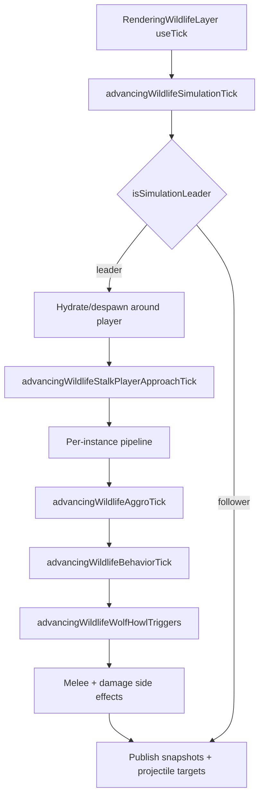
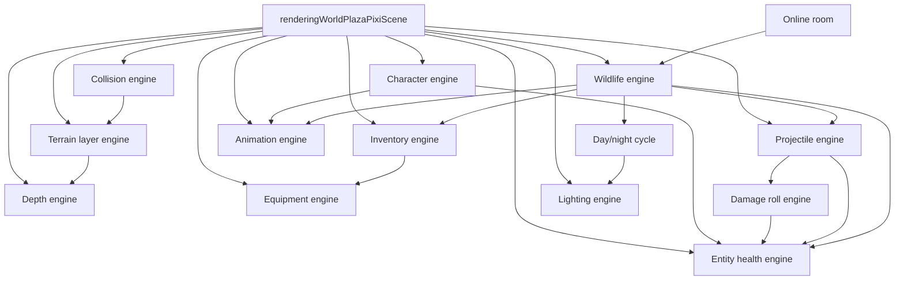

# Reigncraft game engines — AI reference

|                  |            |
| ---------------- | ---------- |
| **Version**      | 1.3.23     |
| **Last updated** | 2026-07-14 |

Read this when working on plaza world gameplay, combat, rendering sync, or inventory. There is **no central engine registry**; engines are folders and naming conventions scattered under `src/client/world/` and `src/client/components/inventory/`.

Player-facing numbers and behavior rules: [game-mechanics-reference.md](./game-mechanics-reference.md).

## Quick orientation

| Concept                                    | Location                                                             |
| ------------------------------------------ | -------------------------------------------------------------------- |
| Main world shell (wires almost everything) | `src/client/world/components/renderingWorldPlazaPixiScene.tsx`       |
| Game entry (lazy-loads Pixi scene)         | `src/client/game.tsx`                                                |
| Avatar boot texture gate                   | `preloadingWorldPlazaBootAvatarTextures.ts`                          |
| Import alias                               | `@/components/world/...`, `@/components/inventory/...`               |
| Wildlife public API                        | `@/components/world/wildlife` → `src/client/world/wildlife/index.ts` |
| NPC public API                             | `@/components/world/npc` → `src/client/world/npc/index.ts`           |
| Howler audio engine                        | `src/client/world/audio/engine/`                                     |
| Exclusive BGM bus (no overlapping tracks)  | `managingWorldPlazaMusicBus.ts` (home / loading / biome hooks)       |
| Declarative style rules                    | `.cursor/rules/declarative-code.mdc`                                 |

### File prefix conventions

| Prefix                                    | Role                             | Example                                              |
| ----------------------------------------- | -------------------------------- | ---------------------------------------------------- |
| `defining*`                               | Config, registries, types        | `definingWorldCollisionProviderRegistry.ts`          |
| `registering*`                            | Populate registries              | `registeringWorldPlazaCharacterEngineDefinitions.ts` |
| `resolving*` / `computing*` / `checking*` | Pure helpers                     | `resolvingWorldCollisionBlockedWorldPoint.ts`        |
| `rendering*`                              | Thin React/Pixi UI               | `renderingWorldPlazaProjectileVisualLayer.tsx`       |
| `using*`                                  | React hooks wiring engines       | `usingWorldPlazaPlayerHealth.ts`                     |
| `managing*`                               | Mutable stores                   | `managingWorldPlazaProjectileStore.ts`               |
| `advancing*`                              | Per-tick state advancement       | `advancingWildlifeSimulationTick.ts`                 |
| `applying*`                               | Side-effect application          | `applyingWildlifeStalkPackEvent.ts`                  |
| `rolling*` / `running*` / `creating*`     | Engine factories or tick runners | `rollingWorldPlazaDamageEngine.ts`                   |

### What counts as an "engine"

In this codebase, **engine** means a self-contained subsystem with declarative config + a small imperative runner/hook. Not every game system uses the word (hunger, fire, building are separate).

---

## Engine catalog

### 1. Audio engine

**Purpose:** One page-session Howler engine for bounded download/decode, per-instance voices, streaming music/ambience, cache eviction, visibility suspension, and exclusive BGM.

| Piece                | Path                                                                             |
| -------------------- | -------------------------------------------------------------------------------- |
| Compatibility facade | `src/client/world/domains/managingWorldPlazaStarAudio.ts`                        |
| Howler engine        | `src/client/world/audio/engine/managingWorldPlazaHowlerAudioEngine.ts`           |
| Local contracts      | `src/client/world/audio/definingWorldPlazaAudioTypes.ts`                         |
| Runtime budgets      | `src/client/world/audio/engine/definingWorldPlazaAudioEngineConstants.ts`        |
| Ref-counted scopes   | `src/client/world/audio/engine/managingWorldPlazaAudioScopeStore.ts`             |
| App audio statechart | `src/client/world/audio/lifecycle/definingWorldPlazaAudioLifecycleMachine.ts`    |
| Session audio gate   | `src/client/world/audio/lifecycle/managingWorldPlazaSessionAudioLoadingStore.ts` |
| Exclusive BGM        | `src/client/world/domains/managingWorldPlazaMusicBus.ts`                         |

**Lifecycle:** Home loads title/UI only. Session start begins critical music + spawn footsteps + girl-sample voice beside world code/texture loading. Current biome music and ambience use replaceable scopes. Wildlife vocals load from species currently present in the simulation store instead of loading the full catalog. Exit-to-home releases every `world:` scope. Hidden tabs suspend voices and force unused-asset eviction after 30 seconds; `pagehide` destroys all Howls.

**Budgets:** Warm fetch concurrency mobile/desktop **3/10**; Howler load concurrency **2/3**. Active SFX voices **20/40** and ambience voices **6/10**. Buffered resident keys **40/120**. Music streams max **2**. Voice stealing chooses lowest priority, then quietest, then oldest non-loop voice.

**Playback rule:** Domain code supplies semantic ids and effective volume. Engine owns `Howl` and always changes volume by Howler `soundId`; never set per-play gain through Howl-wide volume. Music and long ambience use HTML5 streaming; short SFX use Web Audio.

**Extend:**

1. Add clip data in a `defining*` catalog and build a local `Manifest`.
2. Put long streams under music/ambience paths or set `stream: true`.
3. Acquire a lifecycle scope before expected use; one-shot event handlers only play.
4. Give spatial sources live per-handle volume updates.
5. Do not call `new Howl()` outside the engine.

### 2. Terrain layer engine

**Purpose:** Incremental Pixi terrain sync (floor chunks, water, trees, lava, rocks, etc.) driven by declarative layer descriptors and dependency snapshots.

|                     |                                                                                                                                                                                                                                                                                                                                                                                                                                                                                                                                                                                                                                                                                                                                                                                                                                                                                                                                                                                                                                                                                                                                                                                                                                                                                                                                                                                                                                                                                                                                                                                                                                                                                                                                                                                                                                                                                                                                                                                                                                                                                                                                                                                                                                                                                                                                                                                                                                                                                                                                                                                                                                                                                                                                                                                                                                                                                                                                                                                                                                                                                                                                                                                                                                                                                                                                                                                                                                                                                                                                       |
| ------------------- | ------------------------------------------------------------------------------------------------------------------------------------------------------------------------------------------------------------------------------------------------------------------------------------------------------------------------------------------------------------------------------------------------------------------------------------------------------------------------------------------------------------------------------------------------------------------------------------------------------------------------------------------------------------------------------------------------------------------------------------------------------------------------------------------------------------------------------------------------------------------------------------------------------------------------------------------------------------------------------------------------------------------------------------------------------------------------------------------------------------------------------------------------------------------------------------------------------------------------------------------------------------------------------------------------------------------------------------------------------------------------------------------------------------------------------------------------------------------------------------------------------------------------------------------------------------------------------------------------------------------------------------------------------------------------------------------------------------------------------------------------------------------------------------------------------------------------------------------------------------------------------------------------------------------------------------------------------------------------------------------------------------------------------------------------------------------------------------------------------------------------------------------------------------------------------------------------------------------------------------------------------------------------------------------------------------------------------------------------------------------------------------------------------------------------------------------------------------------------------------------------------------------------------------------------------------------------------------------------------------------------------------------------------------------------------------------------------------------------------------------------------------------------------------------------------------------------------------------------------------------------------------------------------------------------------------------------------------------------------------------------------------------------------------------------------------------------------------------------------------------------------------------------------------------------------------------------------------------------------------------------------------------------------------------------------------------------------------------------------------------------------------------------------------------------------------------------------------------------------------------------------------------------------------- |
| **Folder**          | `src/client/world/engine/`                                                                                                                                                                                                                                                                                                                                                                                                                                                                                                                                                                                                                                                                                                                                                                                                                                                                                                                                                                                                                                                                                                                                                                                                                                                                                                                                                                                                                                                                                                                                                                                                                                                                                                                                                                                                                                                                                                                                                                                                                                                                                                                                                                                                                                                                                                                                                                                                                                                                                                                                                                                                                                                                                                                                                                                                                                                                                                                                                                                                                                                                                                                                                                                                                                                                                                                                                                                                                                                                                                            |
| **Factory**         | `creatingWorldPlazaTerrainLayerEngine()` in `runningWorldPlazaTerrainLayerEngine.ts`                                                                                                                                                                                                                                                                                                                                                                                                                                                                                                                                                                                                                                                                                                                                                                                                                                                                                                                                                                                                                                                                                                                                                                                                                                                                                                                                                                                                                                                                                                                                                                                                                                                                                                                                                                                                                                                                                                                                                                                                                                                                                                                                                                                                                                                                                                                                                                                                                                                                                                                                                                                                                                                                                                                                                                                                                                                                                                                                                                                                                                                                                                                                                                                                                                                                                                                                                                                                                                                  |
| **Layer registry**  | `registeringWorldPlazaTerrainLayers.ts`                                                                                                                                                                                                                                                                                                                                                                                                                                                                                                                                                                                                                                                                                                                                                                                                                                                                                                                                                                                                                                                                                                                                                                                                                                                                                                                                                                                                                                                                                                                                                                                                                                                                                                                                                                                                                                                                                                                                                                                                                                                                                                                                                                                                                                                                                                                                                                                                                                                                                                                                                                                                                                                                                                                                                                                                                                                                                                                                                                                                                                                                                                                                                                                                                                                                                                                                                                                                                                                                                               |
| **React shell**     | `renderingWorldPlazaDeclarativeTerrainSync.tsx`                                                                                                                                                                                                                                                                                                                                                                                                                                                                                                                                                                                                                                                                                                                                                                                                                                                                                                                                                                                                                                                                                                                                                                                                                                                                                                                                                                                                                                                                                                                                                                                                                                                                                                                                                                                                                                                                                                                                                                                                                                                                                                                                                                                                                                                                                                                                                                                                                                                                                                                                                                                                                                                                                                                                                                                                                                                                                                                                                                                                                                                                                                                                                                                                                                                                                                                                                                                                                                                                                       |
| **Texture preload** | `registeringWorldPlazaTextureAssetManifest.ts`                                                                                                                                                                                                                                                                                                                                                                                                                                                                                                                                                                                                                                                                                                                                                                                                                                                                                                                                                                                                                                                                                                                                                                                                                                                                                                                                                                                                                                                                                                                                                                                                                                                                                                                                                                                                                                                                                                                                                                                                                                                                                                                                                                                                                                                                                                                                                                                                                                                                                                                                                                                                                                                                                                                                                                                                                                                                                                                                                                                                                                                                                                                                                                                                                                                                                                                                                                                                                                                                                        |
| **Boot gate**       | `PlazaWorldBootGate` in `game.tsx` keeps the loading overlay until `checkingSpawnBootFloorChunksReady()` after scene mount (`managingWorldPlazaSpawnTerrainReadyStore.ts`; 8s timeout failsafe). Asset bar: `definingWorldPlazaWorldLoadingStepRegistry.ts`. Audio step starts ~79% (after fire); mobile soft-lock fix = in-flight key dedupe + concurrency 2 in `managingWorldPlazaStarAudio.ts`, 8s/manifest timeout + slim mobile priority in `preloadingWorldPlazaWorldBootStarAudio.ts` / `definingWorldPlazaWorldBootStarAudioManifestRegistry.ts`. Preload speed: `managingWorldPlazaStarAudio.ts` warms pending manifest URLs with low-priority fetches (HTTP cache) before the capped Howler workers load, so per-key `audio-preload` time is cache-read, not a serialized network round trip. Warm fetches are semaphore-capped (3 mobile / 10 desktop, `DEFINING_WORLD_PLAZA_STAR_AUDIO_WARM_FETCH_CONCURRENCY_*`) and stream-discard bodies instead of `arrayBuffer()` so mobile bandwidth/heap does not thrash during gameplay. Debug skip: ?skipAudioPreload=1, NEXT_PUBLIC_WORLD_PLAZA_SKIP_AUDIO_PRELOAD=true, or window.**WORLD_PLAZA_PERF**.skipAudioPreload(true) (sessionStorage; reload to skip boot step). Gates preloadingWorldPlazaStarAudioManifest so boot + runtime hooks no-op; clips still load on first play.                                                                                                                                                                                                                                                                                                                                                                                                                                                                                                                                                                                                                                                                                                                                                                                                                                                                                                                                                                                                                                                                                                                                                                                                                                                                                                                                                                                                                                                                                                                                                                                                                                                                                                                                                                                                                                                                                                                                                                                                                                                                                                                                                                                           |
| **Perf knobs**      | `DEFINING_WORLD_PLAZA_PERFORMANCE_PROFILES`: floor/elevation build budgets, `maxVisibleElevationColumns` (nearest-N trunk-layer cap; dense hills otherwise attach 1000+ sorted Graphics), `treeBuildBudgetPerFrame`, prefetch rings (`floorChunkPrefetchTiles` high/med/low 24/22/18; `viewportPaddingTiles` 3/2/2), `visibleBoundsSnapTiles`. Floor bounds never behind-trim (forward expand only) so trailing void cannot open under snap + camera dead-zone. `resolvingWorldPlazaVisibleIsometricTileBounds` adds `floor(snap/2)` to radius so snap center drift cannot uncover screen edges. Tier flags (`drawsStoneDecorations` on all tiers, `drawsTreeShadows`, `drawsTreeShake`, `drawsPlacedBlockShadowBlur`, `waterShimmerUpdateIntervalFrames` high/med 5 / low 9), `navigationMaxNodeExpansions`, `remoteAvatarPresentationCullGridRadius`, `wildlifePresentationCullGridRadius`. Water/lava hot path: memoized `checkingWorldPlazaLavaAtTileIndex` + `checkingWorldPlazaWaterIsFrozenAtTileIndex` (epoch = thaw-visual key); water surface is one bounds pass (not per-kind rescans); lava overlay skips mask/crust/light rebuild when visible lava tile set unchanged. Idle heavy-skip key uses snapped `floorBoundsKey` (not every player tile). Features debug controls use `DEFINING_WORLD_PLAZA_GENERATION_FEATURE_REGISTRY` + `managingWorldPlazaGenerationFeatureStore` to independently disable biomes, elevation, wildlife, trees, rock columns, stone decorations, lava, ocean, lakes, rivers, streams, ponds, swamp ponds, audio-sfx, projectiles, floor tiles, and DOM overlays. **This a Dev load** blank slate turns all of those off (flat plains) and also skips biome audio/backdrop mounts, fire ticks, auto-jump probes, and combat presentation while keeping avatar walk + camera + Pixi render; Features panel can re-enable layers without writing localStorage. Night lighting (lightmap + ground glows) stays mounted during blank slate so torch/fairy holes still work when wildlife is re-enabled. Terrain sync tick no-ops when floor/elevation/trees all off. Terrain layer engine skips rock/firelands/elevation/water/lava sync when gated features are off (`requiresAnyGenerationFeature`); water resolvers early-return; procedural tree spacing scans skip when Trees off; floor grass/stone decorations respect Biomes/Stone flags. Wildlife AI stays frozen / no aggro while Dev QA is on. The legacy **Procedural trees & rocks** master toggle remains for tester compatibility. Floor/tree prune uses `resolvingWorldPlazaTerrainCachePruneBudget` (burst + defer builds when stale Graphics backlog grows while walking). **Floor never defers builds** (`shouldDeferBuildsOnStaleBacklog: false`) and keeps pending chunk Graphics visible while baking so run-in cannot open diamond see-through holes; retention margin `DEFINING_WORLD_PLAZA_FLOOR_CHUNK_RETENTION_MARGIN_TILES` (16) soft-keeps edge chunks. Elevation columns use nearest-N attach + soft-retain detach (Map reuse, not trunk sort) + prune budget (`maxVisibleElevationColumns`, `DEFINING_WORLD_PLAZA_TERRAIN_ELEVATION_COLUMN_RETENTION_MARGIN_TILES` / `..._PRUNE_BUDGET_PER_CALL` in `definingWorldPlazaTerrainElevationConstants.ts`) so directional-prefetch bounds wobble does not destroy/rebuild columns while walking. `computingWorldPlazaDirectionalTerrainPrefetchBounds` uses fixed per-axis offsets (not magnitude-scaled) so the bounds cache key stays stable at steady walking speed. |

**Registered layer ids** (`RUNNING_WORLD_PLAZA_TERRAIN_LAYER_ID`):

`rock-columns`, `firelands-decorations`, `floor-chunks`, `elevation-columns`, `tree-trunks`, `tree-shadows`, `tree-canopies`, `water-surface`, `water-shimmer`, `lava-overlay`, `canopy-alpha`, `tree-shake`

**Procedural water:** `definingWorldPlazaWaterConstants.ts` + `resolvingWorldPlazaWaterAtTileIndex.ts`. Lakes/ponds use biome world linear scale for basin size; **river channel + valley frequencies stay absolute tiles** (same idea as streams) so ribbons stay jumpable and findable after `DEFINING_WORLD_PLAZA_BIOME_WORLD_LINEAR_SCALE` bumps.

**Extend (new terrain layer):**

1. Add a `DefiningWorldPlazaTerrainLayerDescriptor` entry in `registeringWorldPlazaTerrainLayers.ts`.
2. Add dependency keys in `definingWorldPlazaTerrainDependencyKeys.ts` if the layer needs new inputs.
3. Wire cache keys in `buildingWorldPlazaTerrainLayerCacheKeys.ts` when incremental invalidation is needed.

---

### 2. Collision engine

**Purpose:** Unified movement blocking, push-out, clamp, ejection, and spatial overlap queries.

|                       |                                             |
| --------------------- | ------------------------------------------- |
| **Public API**        | `src/client/world/collision/index.ts`       |
| **Docs**              | `src/client/world/collision/README.md`      |
| **Provider registry** | `definingWorldCollisionProviderRegistry.ts` |
| **Pipeline**          | `resolvingWorldCollisionBlockedPoint.ts`    |
| **Blocker diagnosis** | `findingWorldCollisionBlockerAtPoint.ts`    |

**Push-out order:** placed blocks → column-rock diamonds → tree circles → Firelands props → pebble rocks → water tiles.

**Block-test order:** rock footprint bypass → placed blocks → terrain elevation columns → obstacle kinds.

**Debug overlay:** terrain providers + placed blocks + live wildlife body circles (`drawingWorldPlazaVisibleWildlifeCollisionDebugOnGraphics.ts`, cyan `0x44ddff`) + player marker. Wildlife is not a terrain provider; solid-body push lives in the wildlife sim tick.

**Extend (new obstacle type):**

1. Add `DefiningWorldCollisionProvider` in `definingWorldCollisionProviderRegistry.ts`.
2. Implement push-out and/or tile-grid block logic (often in `resolvingWorldCollisionBlockedPoint.ts`).
3. Add debug stroke color and tests in `resolvingWorldCollisionCharacterization.test.ts`.

Legacy shims under `src/client/world/domains/` re-export collision APIs during migration. Prefer `@/components/world/collision` for new work.

---

### 3. Depth engine

**Purpose:** Isometric z-sort keys, surface layers, avatar occlusion (standing bump, front occluder cap, hard floor raise).

|                       |                                                 |
| --------------------- | ----------------------------------------------- |
| **Public API**        | `src/client/world/depth/index.ts`               |
| **Docs**              | `src/client/world/depth/README.md`              |
| **Base sort key**     | `computingWorldDepthSortKey.ts`                 |
| **Bias ladder**       | `definingWorldDepthBiasLadder.ts`               |
| **Provider registry** | `definingWorldDepthProviderRegistry.ts`         |
| **Avatar body**       | `resolvingWorldDepthAvatarBodySortKey.ts`       |
| **Avatar shadow**     | `resolvingWorldDepthAvatarShadowSortKey.ts`     |
| **Walkable surface**  | `resolvingWorldDepthSurfaceLayerAtTileIndex.ts` |

**Extend (new world object depth):**

1. Add `DefiningWorldDepthProvider` in `definingWorldDepthProviderRegistry.ts`.
2. Register in `DEFINING_WORLD_DEPTH_SURFACE_LAYER_PROVIDERS` and/or `DEFINING_WORLD_DEPTH_AVATAR_OCCLUSION_PROVIDERS`.
3. Add bias constant in `definingWorldDepthBiasLadder.ts` if needed.
4. Test in `resolvingWorldDepthCharacterization.test.ts`.

---

### 4. Inventory engine (generic + plaza wrapper)

**Purpose:** Slot-based inventory with item registry, reducer, drag-and-drop ids, and persistence adapter.

|                         |                                                                                                |
| ----------------------- | ---------------------------------------------------------------------------------------------- |
| **Generic hook**        | `usingInventoryEngine()` in `src/client/components/inventory/hooks/usingInventoryEngine.ts`    |
| **Plaza wrapper**       | `usingWorldPlazaInventory()` in `src/client/world/inventory/hooks/usingWorldPlazaInventory.ts` |
| **Item types (plaza)**  | `definingWorldPlazaInventoryItemTypes.ts`                                                      |
| **Reducer**             | `reducingInventoryState.ts`                                                                    |
| **Persistence adapter** | Injected via `DefiningInventoryPersistenceAdapter`                                             |

The plaza hook wires Redis/save-slot persistence and optional demo seed. World features (equipment, consumables) read `DefiningInventoryState` from this hook.

**Layout:** capacity **24** (`DEFINING_WORLD_PLAZA_INVENTORY_CAPACITY`). Row 1 (slots 0–5) is the always-visible main hotbar (equippable). Rows 2–4 are storage (18 slots), shown one page of 6 at a time via solid up/down arrows on the right (`resolvingWorldPlazaInventoryStoragePage.ts`, `renderingWorldPlazaInventoryPageArrowButtons.tsx`).

**Extend (new item):**

1. Add `DefiningInventoryItemTypeDefinition` in `definingWorldPlazaInventoryItemTypes.ts` (or shared registry).
2. If equippable, map tool kind in `resolvingWorldPlazaEquipmentCapabilitiesForItemTypeId.ts`.
3. If consumable, add handler in `consumingWorldPlazaInventoryItemByType.ts`.

---

### 4b. Craft cookbook recipes

**Purpose:** Declarative craft recipes in cookbooks. Pages attach once from inventory; craft only after attach.

| Piece                                    | Path                                                                                  |
| ---------------------------------------- | ------------------------------------------------------------------------------------- |
| Types (`recipeType: 'entity' \| 'item'`) | `crafting/domains/definingWorldPlazaCraftModeRecipeTypes.ts`                          |
| Registry (add recipes here)              | `crafting/domains/definingWorldPlazaCraftModeRecipeRegistry.ts`                       |
| Cookbook UI                              | `building/components/renderingWorldPlazaCraftModeCookbookDialog.tsx`                  |
| Attach store                             | `domains/managingWorldPlazaRecipeDiscoveryStore.ts` (`attachingWorldPlazaRecipePage`) |
| Recipe-page items (auto from registry)   | `crafting/domains/registeringWorldPlazaCraftRecipePageInventoryItems.ts`              |
| Dev QA: attach all + 99× ingredients     | `attachingWorldPlazaAllCraftModeRecipesForDevQa.ts`, `listingWorldPlazaCraftModeRecipeIngredientSeedItems.ts` (wired from Pixi recipe init + `usingWorldPlazaInventory`) |

**Extend (new recipe):**

1. Add id to `DEFINING_WORLD_PLAZA_CRAFT_MODE_RECIPE_ID`.
2. Append one row to `DEFINING_WORLD_PLAZA_CRAFT_MODE_RECIPE_REGISTRY` with `title`, `description`, `ingredients`, `recipeType`, and matching `outcome.kind` (`entity` = place block, `item` = inventory grant).
3. Recipe-page inventory item + Recipes guide entry appear automatically.
4. Player double-clicks the page item to attach (second attach refused). Cookbook only lists attached recipes.
5. Dev QA load auto-attaches every registry recipe and seeds 99 of each unique ingredient (no extra wiring).

### 4c. Ore smelting stations

**Purpose:** Bloomery, clay kiln, and clay stove accept one metal ore plus wood or coal, run a four-second timer, then add the matching ingot (scarlet ore produces mercury).

| Piece | Path |
| ----- | ---- |
| Ore/fuel/output registry | `crafting/domains/definingWorldPlazaOreSmeltingRegistry.ts` |
| Timed station state hook | `crafting/hooks/usingWorldPlazaOreSmeltingStations.ts` |
| Inventory DnD popover | `inventory/components/renderingWorldPlazaOreSmeltingPopover.tsx` |
| Active glow + bloomery smoke | `building/components/renderingWorldPlazaBlacksmithUtilityLayer.tsx` |

---

### 5. Character engine

**Purpose:** Declarative per-avatar stats, movement rules, immunities, starting buffs, and skill ids.

|                         |                                                          |
| ----------------------- | -------------------------------------------------------- |
| **Types**               | `definingWorldPlazaCharacterEngineTypes.ts`              |
| **Registry**            | `registeringWorldPlazaCharacterEngineDefinitions.ts`     |
| **Derived stats**       | `computingWorldPlazaCharacterEngineDerivedStats.ts`      |
| **Skills registry**     | `definingWorldPlazaCharacterEngineSkillRegistry.ts`      |
| **Skill execution**     | `applyingWorldPlazaCharacterEngineSkill.ts`              |
| **Immunities at spawn** | `applyingWorldPlazaCharacterEngineImmunities.ts`         |
| **Initial health**      | `creatingWorldPlazaCharacterEngineInitialHealthState.ts` |
| **Local player hook**   | `usingWorldPlazaSelectedCharacterEngineDefinition.ts`    |
| **Skill cooldowns**     | `usingWorldPlazaCharacterEngineSkillCooldowns.ts`        |

**Registered characters (skin id → engine def):**

`girl-sample` (default), `husky`, `golden-retriever`, `grizzly`, `pinguin`, `cat-orange`

**Registered skills:**

| skillId        | Effect     |
| -------------- | ---------- |
| `minor-heal`   | Flat heal  |
| `swift-stride` | Apply buff |
| `heat-ward`    | Apply buff |

**Extend (new playable avatar):**

1. Add skin constant in `definingWorldPlazaAvatarSkinConstants.ts`.
2. Add `DefiningWorldPlazaCharacterEngineDefinition` in `registeringWorldPlazaCharacterEngineDefinitions.ts`.
3. Wire sprite/motion clips in animation registries if needed.

---

### 6. Entity health engine

**Purpose:** Player vitals, shields, buffs, bleed/poison, environmental temperature hazards, float text, respawn, HUD sync.

|                     |                                                 |
| ------------------- | ----------------------------------------------- |
| **Main hook**       | `usingWorldPlazaPlayerHealth.ts`                |
| **State shape**     | `definingWorldPlazaEntityHealthTypes.ts`        |
| **State mutations** | `managingWorldPlazaEntityHealthState.ts`        |
| **Damage pipeline** | `computingWorldPlazaEntityHealthDamage.ts`      |
| **Damage kinds**    | `definingWorldPlazaEntityDamageKindRegistry.ts` |
| **Buffs**           | `definingWorldPlazaEntityBuffRegistry.ts`       |
| **Tick advance**    | `advancingWorldPlazaEntityHealthTick.ts`        |
| **Constants**       | `definingWorldPlazaEntityHealthConstants.ts`    |

Character engine feeds initial state via `creatingWorldPlazaCharacterEngineInitialHealthState`. Projectiles apply damage through `applyingWorldPlazaProjectilePayload.ts`.

**Disease subsystem:**

|                          |                                                |
| ------------------------ | ---------------------------------------------- |
| **Disease registry**     | `definingWorldPlazaEntityDiseaseRegistry.ts`   |
| **Disease tick**         | `applyingWorldPlazaEntityDisease.ts`           |
| **Persistence hook**     | `usingWorldPlazaPersistingPlayerConditions.ts` |
| **In-game time scaling** | `computingWorldPlazaInGameDurationMs.ts`       |

**Registered disease ids:** `salmonellosis`, `chronic-wasting`, `trichinellosis`, `mad-cow`, `liver-fluke`, `sleeping-sickness`, `wolf-fever`, `bear-worm`, `toxoplasmosis`, `vibrio-infection`.

Eating raw or undercooked wildlife meat can grant diseases (ties wildlife meat loop to health engine).

---

### 7. Damage roll engine (sub-engine of health/combat)

**Purpose:** EV-based statistical damage rolls (spread, luck, tiers: block/dodge/hit/crit, etc.).

|                          |                                                                         |
| ------------------------ | ----------------------------------------------------------------------- |
| **Core function**        | `rollingWorldPlazaDamageEngine()` in `rollingWorldPlazaDamageEngine.ts` |
| **Roll params**          | `resolvingWorldPlazaEntityHealthDamageRollParams.ts`                    |
| **EV from raw amount**   | `resolvingWorldPlazaEntityHealthDamageRollBaseExpectedDamage.ts`        |
| **Tier registry**        | `definingWorldPlazaDamageOutcomeTierRegistry.ts`                        |
| **Dev presets**          | `definingWorldPlazaEntityHealthDamageRollPresets.ts`                    |
| **Mechanics UI preview** | `computingPlazaMechanicsCombatEvDamageRollPreview.ts`                   |

**Flow:** `computingWorldPlazaEntityHealthDamage` → resolve roll params → `rollingWorldPlazaDamageEngine` → apply modifiers/shield → update state.

Kinds that use the roll engine are declared in `definingWorldPlazaEntityDamageKindRegistry.ts` (`shouldWorldPlazaEntityDamageKindUseDamageRoll`).

**Dev panel:** Combat tab → subcategory `engine` → `renderingWorldPlazaDevModeCombatRollControls.tsx`.

---

### 8. Projectile engine

**Purpose:** Spawn, simulate, hit-test, split/impact behaviors, visuals, online spawn sync.

|                        |                                                           |
| ---------------------- | --------------------------------------------------------- |
| **Hook**               | `usingWorldPlazaProjectileEngine.ts`                      |
| **Store**              | `managingWorldPlazaProjectileStore.ts`                    |
| **Step sim**           | `computingWorldPlazaProjectileStep.ts`                    |
| **Hit resolution**     | `resolvingWorldPlazaProjectileHit.ts`                     |
| **Archetypes**         | `definingWorldPlazaProjectileArchetypeRegistry.ts`        |
| **Movement behaviors** | `definingWorldPlazaProjectileMovementBehaviorRegistry.ts` |
| **Impact behaviors**   | `definingWorldPlazaProjectileImpactBehaviorRegistry.ts`   |
| **Payload → health**   | `applyingWorldPlazaProjectilePayload.ts`                  |
| **Visual layer**       | `renderingWorldPlazaProjectileSimulation.tsx`             |

**Extend (new projectile):**

1. Add archetype in `definingWorldPlazaProjectileArchetypeRegistry.ts`.
2. Register movement/impact behavior if non-default.
3. Map payload to damage kind in `applyingWorldPlazaProjectilePayload.ts`.
4. Add animation clips in `registeringWorldPlazaProjectileAnimationClips.ts` if needed.

**Gravity pull:** movement behavior `gravityPull` uses the shared tile gravity-well utility (`computingWorldPlazaTileGravityWellVelocityStep`) toward the aim point. Set `tracksLiveTarget: true` to re-aim at the nearest live hit target each tick (`resolvingWorldPlazaProjectileAimPoint`). Examples: `gravity-well-bolt` (frozen aim), `gravity-ball` (live chase).

---

### 8b. Tile gravity well utility

**Purpose:** Reusable acceleration toward a tile or grid point for players, wildlife, projectiles, or any mover. Additive with intentional movement (walk/run still works).

|                      |                                                       |
| -------------------- | ----------------------------------------------------- |
| **Types**            | `definingWorldPlazaTileGravityWellTypes.ts`           |
| **Defaults**         | `definingWorldPlazaTileGravityWellConstants.ts`       |
| **Acceleration**     | `computingWorldPlazaTileGravityWellAcceleration.ts`   |
| **Velocity / delta** | `computingWorldPlazaTileGravityWellStep.ts`           |
| **Factories**        | `creatingWorldPlazaTileGravityWell.ts`                |
| **Tile attractor**   | `resolvingWorldPlazaTileGravityWellAttractorPoint.ts` |
| **Gameplay docs**    | `gameplay/mechanics/tile-gravity/`                    |

**Extend (apply to a mover):**

1. `creatingWorldPlazaTileGravityWellFromTile` or `FromPoint`.
2. Each tick: `computingWorldPlazaTileGravityWellGridDelta` (position) or `VelocityStep` (velocity).
3. Add result onto intent delta / velocity; collision after.

---

### 9. Lighting engine

**Purpose:** Screen-space darkness lightmap (Terraria-style radial holes at torches, campfires, player torch).

|                         |                                                                                                      |
| ----------------------- | ---------------------------------------------------------------------------------------------------- |
| **Tuning**              | `definingWorldPlazaLightingEngineConstants.ts`                                                       |
| **Darkness layer**      | `renderingWorldPlazaLightingDarknessLayer.tsx`                                                       |
| **Light sources**       | `definingWorldPlazaLightSource.ts`                                                                   |
| **Radial texture bake** | `creatingWorldPlazaLightingRadialBakedTexture.ts`                                                    |
| **Ground glows**        | `renderingWorldPlazaLightSourcesGroundGlow.tsx`, `renderingWorldPlazaPlayerNightLightGroundGlow.tsx` |

Darkness strength follows the **day/night cycle** (`computingWorldPlazaDayNightSunState.ts`), which is a separate system (not branded "engine").

---

### 10. Animation engine

**Purpose:** Declarative clip playback on Pixi sprites (avatar motion, fire, tools, projectiles).

|                         |                                                          |
| ----------------------- | -------------------------------------------------------- |
| **Types**               | `definingWorldPlazaAnimationTypes.ts`                    |
| **Clip registry**       | `registeringWorldPlazaAnimationClip.ts`                  |
| **Playback advance**    | `advancingWorldPlazaDeclarativeAnimationPlayback.ts`     |
| **Hook**                | `usingWorldPlazaDeclarativeAnimationPlayback.ts`         |
| **Avatar motion clips** | `registeringWorldPlazaAvatarMotionAnimationClips.ts`     |
| **Tool action clips**   | `definingWorldPlazaAvatarToolActionAnimationRegistry.ts` |
| **Component**           | `renderingWorldPlazaDeclarativeAnimatedSprite.tsx`       |

Describe playback with `clipId` (+ optional `variantKey`); the hook advances frames each Pixi tick.

---

### 11. Equipment engine

**Purpose:** Hotbar slot selection and tool-kind checks (axe, flint, etc.) for world interactions.

|                         |                                                            |
| ----------------------- | ---------------------------------------------------------- |
| **Hook**                | `usingWorldPlazaEquipment.ts`                              |
| **Tool kinds**          | `definingWorldPlazaEquipmentToolKind.ts`                   |
| **Slot check**          | `checkingWorldPlazaEquippedSlotHasToolKind.ts`             |
| **Item → capabilities** | `resolvingWorldPlazaEquipmentCapabilitiesForItemTypeId.ts` |

Depends on inventory state from `usingWorldPlazaInventory`. Used by harvest, fire ignition, and build flows in `renderingWorldPlazaPixiScene.tsx`.

---

### 12. Wildlife engine

**Purpose:** Procedural biome spawn, behavior-tree AI, threat/aggro, stalk-pack hunts, meat/food loop, corpse lifecycle, and multiplayer leader-follower sync.

|                                |                                                                                                                                                                                                                                                                                                            |
| ------------------------------ | ---------------------------------------------------------------------------------------------------------------------------------------------------------------------------------------------------------------------------------------------------------------------------------------------------------- |
| **Folder**                     | `src/client/world/wildlife/`                                                                                                                                                                                                                                                                               |
| **Public API**                 | `index.ts`                                                                                                                                                                                                                                                                                                 |
| **Hook (store + damage only)** | `usingWildlifeSimulation.ts` (tick does **not** run here)                                                                                                                                                                                                                                                  |
| **Tick runner**                | `advancingWildlifeSimulationTick.ts`                                                                                                                                                                                                                                                                       |
| **Pixi tick host**             | `renderingWildlifeLayer.tsx` (`useTick` calls sim tick)                                                                                                                                                                                                                                                    |
| **Instance store**             | `managingWildlifeInstanceStore.ts`                                                                                                                                                                                                                                                                         |
| **AI think LOD + budget**      | `definingWildlifeAiLodConstants.ts`: distance-tiered think intervals (200/400/800ms) plus `DEFINING_WILDLIFE_AI_THINK_BUDGET_PER_STEP` (3) capping full thinks per sim step; over-budget instances keep steering on their current intent and retry next step. Proximity prey interrupts bypass the budget. |

**Registries:**

| Registry                        | File                                                                                          |
| ------------------------------- | --------------------------------------------------------------------------------------------- |
| Species (11 ids)                | `definingWildlifeSpeciesRegistry.ts`                                                          |
| Biome spawn pools               | `definingWildlifeBiomeSpawnTable.ts`                                                          |
| Behavior trees (7 temperaments) | `definingWildlifeBehaviorTreeRegistry.ts`                                                     |
| Conditions / actions            | `definingWildlifeBehaviorConditionRegistry.ts`, `definingWildlifeBehaviorActionRegistry.ts`   |
| Meat catalog                    | `definingWildlifeMeatRegistry.ts`                                                             |
| Animation clips                 | `registeringWildlifeAnimationClips.ts`                                                        |
| Locomotion anim speed scale     | `resolvingWildlifeLocomotionAnimationSpeedScale.ts` (walk/run feet track body speed)          |
| Boot texture warm-up            | `definingWildlifeBootTexturePreloadConstants.ts` + `preloadingWildlifeBootSpeciesTextures.ts` |

**Texture loading:** boot (`definingWorldPlazaWorldLoadingStepRegistry.ts` `wildlife-sprites` step) warms only the plains spawn roster, 3 species at a time. All other species lazy-load on first sighting in `renderingWildlifeLayer.tsx` via `ensuringWildlifeAnimationClipsRegistered`. Never preload all species in parallel: ~50 species x 6+ sheets OOM-kills mobile browser tabs (Chrome "Can't open this page" near 66%). Failed loads evict from the `loadingWildlifeSpeciesTextures` cache so lazy loading can retry.

**Texture LRU eviction:** `advancingWildlifeSpeciesTextureEviction` (every 5s from `renderingWildlifeLayer.tsx`) uses `resolvingWildlifeProximateSpeciesIdsAtWorldPoint`: mobile pins only the top `DEFINING_WILDLIFE_TEXTURE_EVICTION_MAX_CACHED_SPECIES_MOBILE` (6) highest-weight species from the **current** biome; desktop pins every species spawnable in the player tile plus a 48-tile sample ring (`resolvingWildlifeNearbyBiomeKindsAtWorldPoint`). Species outside that set cull after `DEFINING_WILDLIFE_BIOME_PROXIMITY_OUT_OF_RANGE_GRACE_MS` (5s). In-range species use the normal grace (45s desktop / 20s mobile) and the mobile resolved-texture cap. Boot warms only `DEFINING_WILDLIFE_BOOT_PRELOAD_MAX_SPECIES_MOBILE` (4) plains species on mobile. Skip eviction while load pending. `loadedSpeciesRef` must shrink on eviction or the species never reloads.

**Registered temperaments:** `docile`, `passive`, `skittish`, `retaliator`, `predator`, `ambusher`, `pack_hunter`, `stalker` (docile = dogs/cats; friendliness = aggression level; Attack? gate)

**Registered species:** `cow`, `sheep`, `chicken`, `deer`, `zebra`, `boar`, `grey-wolf`, `brown-bear`, `lion`, `lioness`, `crocodile`

**PackHunter / pack pipeline** (grey-wolf is the reference `PackHunter` implementation):

Phases (`definingWildlifeStalkPhaseTypes.ts`): `idle` → `shadowing` → `retreating` → `regrouping` → `formingUp` → `surrounding` → `attacking` → `fleeing`

Statechart: `definingWildlifePackHunterBehaviourMachine.ts` + `definingWildlifePackHunterBehaviourRegistry.ts`, driven by `advancingWildlifePackHunterBehaviour.ts`.

| Concern                          | File                                                                                               |
| -------------------------------- | -------------------------------------------------------------------------------------------------- |
| Threat table + pack share        | `advancingWildlifeAggroTick.ts`                                                                    |
| Stalk-specific aggro             | `advancingWildlifeStalkAggroTick.ts`                                                               |
| Player closing on shadowing wolf | `advancingWildlifeStalkPlayerApproachTick.ts`                                                      |
| Pack event propagation           | `applyingWildlifeStalkPackEvent.ts`                                                                |
| Damage-triggered flee/enrage     | `applyingWildlifeStalkPackDamageResponse.ts`                                                       |
| Alpha death scatter              | `applyingWildlifePackAlphaDeathScatter.ts`                                                         |
| Favorite-prey revenge lock       | `applyingWildlifeFavoritePreyPlayerRevengeAggro.ts`                                                |
| Herbivore herd flee              | `applyingWildlifeHerbivoreHerdFleeResponse.ts`                                                     |
| Herbivore herd landmark travel   | `resolvingWildlifeHerdLandmarkWanderIntent.ts` (rest → water/trees/pasture; alpha-led spawn packs) |
| Wolf howl                        | `advancingWildlifeWolfHowlTick.ts`                                                                 |

**Multiplayer:** Leader election via `electingWildlifeSimulationLeaderUserId.ts` (lowest lexicographic `userId`). Snapshots and damage events sync through `usingWorldPlazaDevvitPollingRoom.ts`; shared types in `src/shared/plazaDevvitOnline.ts` (`PlazaDevvitOnlineWildlifeSnapshot`, `PlazaDevvitOnlineWildlifeDamageEvent`). Position sync uses the 150ms room interval; immediate posts are single-flight and click-walk does not POST every render frame.

**Pixi scene integration** (`renderingWorldPlazaPixiScene.tsx`):

- `usingWildlifeSimulation` → store, tick config, `applyWildlifeDamageRef`
- `RenderingWildlifeLayer` inside Pixi `<Application>`
- DOM overlays: health float text, name tags, speech bubbles
- Player melee → `applyWildlifeDamageRef`; click target → `findingWildlifeInstanceAtGridPoint`
- Projectile engine → `extraTargetsRef` + `onExtraTargetHit`
- Player death → `clearingWildlifeAreaOnPlayerDeath`
- Campfire → `cookingWildlifeMeatAtCampfire`
- Dev panel → `RenderingWorldPlazaDevWildlifeSpawnerControls`

**Beta: Spirited Sprites preview** (not wildlife AI): `src/client/world/beta/spirited/`. Assets under `public/creatures/sprites/beta/spirited/`. Dev panel → **Beta Features → Spirited Sprites**. Visual-only horizontal strips via `RenderingSpiritedSpritesBetaLayer`.

**Adaptive performance tiers:** `resolvingWorldPlazaPerformanceProfile` picks mount tier (LOW if viewport ≤767px or `(pointer: coarse)`, else MEDIUM; never HIGH). `usingWorldPlazaAdaptivePerformanceTier` always-on rAF sampler (warmup 5s, history 180 frames, upgrade p95 <17ms with zero ≥20ms frames, downgrade p95 >22ms or p99 ≥50ms sustained 2s, cooldown 10s, 500ms eval interval, resume-gap ignore) steps LOW↔MEDIUM↔HIGH one at a time. Provider: `providingWorldPlazaPerformanceProfile.tsx`. Profiles: `DEFINING_WORLD_PLAZA_PERFORMANCE_PROFILES` (forward prefetch, terrain budgets, wildlife sim steps, nav replan interval + A\* cap, lighting RTT cadence, LOW-tier visual trims, presentation cull radii, wildlife React reconciliation cadence). Entity depth scans cached per tile via `managingWorldPlazaEntityDepthSortCache.ts`. Terrain sync reads `performanceProfileRef` each tick without remounting the engine on tier change.

**Plaza smoothness program:** Directional prefetch via `computingWorldPlazaSmoothedMovementDirection` + `computingWorldPlazaDirectionalTerrainPrefetchBounds` in `renderingWorldPlazaDeclarativeTerrainSync.tsx`. Terrain work yields on `managingWorldPlazaTerrainFrameWorkBudget`; floor chunks resume tile draws across frames in `syncingWorldPlazaVisibleTileChunkGraphicsLayer.ts` so one 8x8 bake cannot monopolize a tick. Parent sorts batch through `managingWorldPlazaTerrainParentSortRegistry`. GPU disposal time-slices in `queueingWorldPlazaPixiGpuResourceDisposal.ts`. `usingWorldPlazaSafeTick` keeps a stable Pixi callback across React renders and skips registration for shared animation playback. GirlSample combat strips load one motion at a time on first use instead of decoding all 56 strips after locomotion boot. Terrain dependency keys use identity-scoped memoization, so unchanged harvest and fire collections are not sorted every frame. Wildlife name tags, health floats, and speech bubbles refresh at the shared idle cadence, skip unchanged CSS writes, and round-robin work through a 0.75ms callback budget; hidden name tags also skip projection and scale work. Wildlife presentation reuses simulation-resolved standing layers instead of rescanning terrain and placed blocks for every visible animal each frame; diagnostics report this path as `wildlife-render-sync`. Tree trunk, shadow, and canopy layers share one visible-tree scan per terrain context; procedural listing visits only valid 3x3 spacing anchors, shadow pruning is incremental, and settled canopy alpha avoids redundant Pixi writes. Audio uses one global Howler decode semaphore across all concurrently mounted SFX hooks (2 mobile / 8 desktop); per-play volume repair only touches active instances of the same clip id, avatar surface lookup is tile-cached, and wildlife surface preload scans run once per second instead of every footstep poll. Non-spawn avatar surface clips background-warm after priority boot, avoiding runtime decode spikes at biome borders. Wildlife footsteps poll at 120ms and emit at most two voices per tick. Other runtime hot paths: allocation-free placed-block collision probes, avatar collision skip + nav replan throttle + 100ms mobile auto-jump probe cadence (`renderingWorldPlazaGirlSampleWalkAvatar.tsx`), direct ref writes for continuous pointer steering instead of per-frame A\* (`trackingWorldPlazaClickMovementTarget.ts`), wildlife imperative transforms plus tier-throttled and visible-pixel-quantized React structural fingerprint gating (`syncingWildlifeInstancesImperativePresentation.ts`, `computingWildlifeRenderStructuralFingerprint.ts`), mount-only DOM overlay updates, change-driven fire light publication, cached LOW-tier darkness geometry, lighting RTT min interval (`renderingWorldPlazaLightingDarknessLayer.tsx`), multiplayer HUD poll dedupe (`checkingWorldPlazaOnlineParticipantsSnapshotChanged.ts`), ResizeObserver-owned Pixi viewport resizing, and explicit animated water shimmer bounds to avoid per-frame ShapePath bounds scans.

**Performance diagnostics + multistep tester:** `measuringWorldPlazaPerformanceDiagnostics.ts` instruments frame times (p95/p99, very-slow frames, JS heap when available) and keyed samples (`terrain-sync`, `terrain-parent-sort`, `terrain-prune`, `wildlife-tick`, `lighting-rtt`, `dom-overlay`, `gpu-disposal`, etc.). Wildlife expands `wildlife-tick` into lifecycle, spatial-grid, AI, separation, player-collision, standing-layer, snapshot, remote-sync, and render-sync timings. `recordingWildlifePerformanceDiagnostics.ts` publishes population, intent category, movement, sleep, jump, aggro, culling, loaded-species, sim backlog, leader, snapshot, and contact gauges; texture loads/failures/evictions, sim steps, and React reconciles are event-rate counters. Player diagnostics split auto-jump probes, navigation plans and replans, collision, combat presentation, health, stamina, and hunger from `avatar-tick` / `dom-overlay`; gauges correlate spikes with speed, attempted speed, health, stamina, hunger, waypoints, A\* nodes, path length, layer, locomotion, airborne, roll, push, ice, stun, sleep, starvation, and death state. Shared `star-audio` diagnostics report SFX play and volume-sync cost, async preload duration, active SFX, loaded and in-flight assets, consumers, lock state, music voices, crossfades, load/play failures, and cache reuse. Projectile diagnostics report tick time, live instances, target count, substeps, spawns, hits, misses, and impacts. Devvit room diagnostics report sync/poll round trips, failures, overlapping-sync skips, participants, remote players, and remote wildlife snapshot pressure. Enable via `?perf=1`, the in-world Perf overlay, or `window.__WORLD_PLAZA_PERF__.enable()`. Render-layer isolation uses `settingWorldPlazaPerformanceDiagnosticsRenderLayer`. The **Perf tester** in the Features debug panel (`renderingWorldPlazaPerformanceTesterPanel.tsx`, store `managingWorldPlazaPerformanceTesterStore.ts`) runs a declarative 14-step suite with settle → warmup → sample windows, optional trials (walk prompt uses 3 with median row), device/tier metadata (`capturingWorldPlazaPerformanceTesterBenchmarkMetadata.ts`), and plain-text gates via `formattingWorldPlazaPerformanceTesterReport.ts`; restores prior toggles on done/cancel. Console: `runPerfSuite()`, `runPerfStep(id)`, `cancelPerfSuite()`, `getPerfSuiteResults()`. Benchmark production builds on desktop + low-end profiles; walk targets: p95 ≤20ms (medium/high), ≤33ms (low), p99 ≤50ms.

**Extend (new species / temperament):**

1. Add species in `definingWildlifeSpeciesRegistry.ts` + biome entry in `definingWildlifeBiomeSpawnTable.ts`.
2. Register animation clips in `registeringWildlifeAnimationClips.ts`.
3. If new temperament: add behavior tree + condition/action registry entries.
4. If PackHunter-like: extend stalk phase types / statechart (grey-wolf is the template).
5. If meat drops: add entry in `definingWildlifeMeatRegistry.ts` + inventory registration.

---

## Dependency graph (high level)

---

### 13. Navigation engine

**Purpose:** Grid A* path planning for player click-to-move, with declarative cost profiles, line-of-sight smoothing, and replan triggers. Generic A* lives in `src/client/lib/navigation/`; plaza-specific walkability and hooks live here.

|                            |                                                             |
| -------------------------- | ----------------------------------------------------------- |
| **Folder**                 | `src/client/world/navigation/`                              |
| **Public API**             | `@/components/world/navigation` → `index.ts`                |
| **Generic A\***            | `src/client/lib/navigation/computingNavigationAStarPath.ts` |
| **Player walk plan**       | `resolvingWorldPlazaNavigationWalkPlan.ts`                  |
| **Click hook**             | `trackingWorldPlazaClickMovementTarget.ts`                  |
| **Avatar waypoint follow** | `renderingWorldPlazaGirlSampleWalkAvatar.tsx`               |

**Pipeline:** click destination → direct-path blocked check → layered grid A\* → path smoother → waypoint queue → existing isometric step + collision eject. After hold-to-run activates, continuous pointer steering updates the camera-relative destination directly instead of rerunning A\* every animation frame.

**Registries:**

| Registry                         | File                                                                                  |
| -------------------------------- | ------------------------------------------------------------------------------------- |
| Cost profiles (`player.default`) | `definingWorldPlazaNavigationCostProfiles.ts`                                         |
| Movement/heuristic (lib)         | `definingNavigationMovementModeRegistry.ts`, `definingNavigationHeuristicRegistry.ts` |

**v1 limits:** 2D tile search at the agent's current layer only; elevation changes still handled by collision/jump at execution time. Wildlife pathing deferred.

**Extend (new cost profile):**

1. Add entry in `definingWorldPlazaNavigationCostProfiles.ts`.
2. Add species/player move-cost resolver alongside `resolvingWorldPlazaNavigationPlayerMoveCost.ts`.
3. Wire think-tick path cache in wildlife when ready (`advancingWildlifeSimulationTick.ts`).

---

## Related systems (not called engines)

Use these folders when the task is not covered above:

| System                          | Folder                                   | Main hook                                                                                                                                                              |
| ------------------------------- | ---------------------------------------- | ---------------------------------------------------------------------------------------------------------------------------------------------------------------------- |
| Hunger                          | `src/client/world/hunger/`               | `usingWorldPlazaPlayerHunger.ts`                                                                                                                                       |
| Fire / campfires                | `src/client/world/fire/`                 | `usingWorldPlazaFireCells.ts`                                                                                                                                          |
| Building / plots                | `src/client/world/building/`             | `usingWorldPlazaBuildMode.ts`, `usingWorldPlazaPlacedBlocksQuery.ts`                                                                                                   |
| Harvest / tree chop + rock mine | `src/client/world/harvest/`              | `usingWorldPlazaTreeChopInteraction.ts`, `usingWorldPlazaRockMineInteraction.ts`                                                                                       |
| Held-item overlays              | `src/client/world/equipment/`            | `DEFINING_WORLD_PLAZA_HELD_ITEM_OVERLAY_ENABLED` (currently **false**), `definingWorldPlazaHeldItemPresentationRegistry.ts`, `usingWorldPlazaAvatarHeldItemOverlay.ts` |
| Fishing                         | `src/client/world/fishing/`              | `usingWorldPlazaFishingInteraction.ts`                                                                                                                                 |
| Farming                         | `src/client/world/farming/`              | `usingWorldPlazaFarmingInteraction.ts`                                                                                                                                 |
| Day/night cycle                 | `src/client/world/domains/`              | `usingWorldPlazaDayNightSunState.ts`, `definingWorldPlazaDayNightCycleConstants.ts`                                                                                    |
| Online room                     | `src/client/world/hooks/`                | `usingWorldPlazaDevvitPollingRoom.ts`                                                                                                                                  |
| Run stamina                     | `src/client/world/hooks/` + `stamina/`   | `usingWorldPlazaRunStamina.ts`; shared core `advancingStaminaCoreTick.ts` (opt-in via `DEFINING_STAMINA_CORE_TICK_OPT_IN`, default off)                                |
| Wildlife badge list             | `src/client/world/wildlife/domains/`     | `resolvingWildlifeInstanceEntityHudBadgeSnapshot.ts` (data path; no DOM yet)                                                                                           |
| Mini-map                        | `src/client/world/domains/` + components | `renderingWorldPlazaMiniMapStack.tsx`                                                                                                                                  |

---

## Task → where to start

| Task                                            | Start here                                                                                                                                      |
| ----------------------------------------------- | ----------------------------------------------------------------------------------------------------------------------------------------------- |
| Player click pathing detours around walls/water | `resolvingWorldPlazaNavigationWalkPlan.ts`, `trackingWorldPlazaClickMovementTarget.ts`                                                          |
| Navigation stuck / replan                       | `checkingWorldPlazaNavigationPathNeedsReplan.ts`, `renderingWorldPlazaGirlSampleWalkAvatar.tsx`                                                 |
| New navigation cost profile                     | `definingWorldPlazaNavigationCostProfiles.ts`                                                                                                   |
| Player cannot walk through X                    | Collision provider registry + `resolvingWorldCollisionBlockedPoint.ts`                                                                          |
| Sprite draws behind wrong object                | Depth provider registry or `definingWorldDepthBiasLadder.ts`                                                                                    |
| New ground/water/tree visual layer              | `registeringWorldPlazaTerrainLayers.ts`                                                                                                         |
| New damage type or shield rule                  | `definingWorldPlazaEntityDamageKindRegistry.ts` + `computingWorldPlazaEntityHealthDamage.ts`                                                    |
| Change crit/block math                          | `rollingWorldPlazaDamageEngine.ts` + tier registry                                                                                              |
| Power-law / Pareto sample utility               | `computingWorldPlazaPowerLawSample.ts`                                                                                                          |
| New throwable / spell                           | Projectile archetype + impact registry                                                                                                          |
| New avatar stat or skill                        | Character engine registry + skill registry                                                                                                      |
| New hotbar item                                 | Inventory item types + equipment capabilities + `registeringWorldPlazaTieredToolInventoryItems.ts`                                              |
| Held-item overlay on avatar                     | `src/client/world/equipment/` + `usingWorldPlazaAvatarHeldItemOverlay.ts`                                                                       |
| Tool swing arc / size / carry pose              | `definingWorldPlazaHeldItemSwingRegistry.ts` (per-direction keyframes) + `definingWorldPlazaHeldItemPresentationRegistry.ts` (scale, offsets)   |
| Fishing cast / catch                            | `src/client/world/fishing/` + `renderingWorldPlazaPixiScene.tsx`                                                                                |
| Farming till / plant / harvest                  | `src/client/world/farming/` + `managingWorldPlazaLocalFarmland.ts`                                                                              |
| Night lighting too dark/bright                  | `definingWorldPlazaLightingEngineConstants.ts` + day/night constants                                                                            |
| New walk/run animation                          | `registeringWorldPlazaAvatarMotionAnimationClips.ts`                                                                                            |
| Combat too fast / slow for everyone             | `definingWorldPlazaGlobalCombatAttackSpeedConstants.ts` (`DEFINING_WORLD_PLAZA_GLOBAL_ATTACK_SPEED_SCALE`; 0.7 = 70% speed)                     |
| Attack-speed buffs (player / wildlife)          | `attack_speed` modifier + `quick-strikes-buff` / `bloodlust-buff` / `blinding-flurry-buff` / `relentless-tempo-buff` in buff registry           |
| Combat dev tuning                               | Dev panel combat tab, subcategory `engine`                                                                                                      |
| Wolf pack not stalking / wrong phase            | `definingWildlifePackHunterBehaviourMachine.ts`, `advancingWildlifeStalkAggroTick.ts`                                                           |
| Pack flees when alpha dies                      | `applyingWildlifePackAlphaDeathScatter.ts`                                                                                                      |
| Player spotted while wolf shadows prey          | `advancingWildlifeStalkPlayerApproachTick.ts`                                                                                                   |
| New wildlife species                            | `definingWildlifeSpeciesRegistry.ts` + `definingWildlifeBiomeSpawnTable.ts`                                                                     |
| Animal feet moonwalk / too fast                 | `resolvingWildlifeLocomotionAnimationSpeedScale.ts`, sheet overrides in `definingWildlifeSpriteSheetLayout.ts`                                  |
| Animal stuck at river / cliff gap               | `resolvingWildlifeTerrainGapJumpPlan` in `resolvingWildlifeJumpPlan.ts` (forward scan + landing surface layer)                                  |
| Tiger/cat freezes after pounce                  | Jump land fall-through + live chase target in `advancingWildlifeSimulationTick.ts`; attack→chase in `resolvingWildlifeMeleeEngagementIntent.ts` |
| Tiger endless chase with no hits                | `chaseGiveUpWithoutDamageMs` on tiger aggro + `checkingWildlifeChaseShouldGiveUpWithoutDamage.ts`                                               |
| Wolf runs backwards / stuck on run clip         | `resolvingWildlifeInstanceFacingDirection.ts` (face move while locomoting); jump land clears run in `advancingWildlifeSimulationTick.ts`        |
| Wolf stalk back-and-forth / jittery shadowing   | `resolvingWildlifeStalkEngagementIntent.ts` + `resolvingWildlifeStalkShadowWanderTargetPoint.ts` (prey-ring random walk)                        |
| New temperament behavior                        | `definingWildlifeBehaviorTreeRegistry.ts`                                                                                                       |
| Raw/cooked meat effects                         | `definingWildlifeMeatRegistry.ts`                                                                                                               |
| Projectile not hitting animals                  | `extraTargetsRef` wiring in Pixi scene                                                                                                          |
| Wildlife not syncing in multiplayer             | `electingWildlifeSimulationLeaderUserId.ts`, `plazaDevvitOnline.ts`                                                                             |
| Player sick from eating meat                    | `definingWorldPlazaEntityDiseaseRegistry.ts`                                                                                                    |

---

## Tests

Engine characterization tests usually live next to the engine:

| Engine          | Test file pattern                                                                                                                             |
| --------------- | --------------------------------------------------------------------------------------------------------------------------------------------- |
| Damage roll     | `rollingWorldPlazaDamageEngine.test.ts`                                                                                                       |
| Terrain layer   | `runningWorldPlazaTerrainLayerEngine.test.ts`                                                                                                 |
| Collision       | `resolvingWorldCollisionCharacterization.test.ts`                                                                                             |
| Depth           | `resolvingWorldDepthCharacterization.test.ts`                                                                                                 |
| Projectile      | `managingWorldPlazaProjectileStore.test.ts`, `resolvingWorldPlazaProjectileHit.test.ts`                                                       |
| Animation       | `advancingWorldPlazaDeclarativeAnimationPlayback.test.ts`                                                                                     |
| Character stats | `computingWorldPlazaCharacterEngineDerivedStats.test.ts`                                                                                      |
| Wildlife        | `advancingWildlife*.test.ts`, `applyingWildlife*.test.ts`, `resolvingWildlife*.test.ts`, `checkingWildlife*.test.ts` (~88 files)              |
| Navigation      | `resolvingWorldPlazaNavigation*.test.ts`, `checkingWorldPlazaNavigationPathNeedsReplan.test.ts`, `computingNavigationAStarPath.test.ts` (lib) |

Key wildlife characterization tests: `advancingWildlifePackHunterBehaviour.test.ts`, `advancingWildlifeStalkAggroTick.test.ts`, `applyingWildlifePackAlphaDeathScatter.test.ts`, `advancingWildlifeFavoritePreyAggro.test.ts`, `electingWildlifeSimulationLeaderUserId.test.ts`.

Run: `npm run test -- <file-name-without-path>`

### Performance budget tests

Reusable harness for pure hot-path regression guards (no Pixi / FPS):

| Piece            | Path                                                                                                  |
| ---------------- | ----------------------------------------------------------------------------------------------------- |
| Spec types       | `src/client/world/testing/domains/definingPerformanceBudgetTypes.ts`                                  |
| Measure + assert | `src/client/world/testing/domains/measuringPerformanceBudget.ts` → `expectingPerformanceWithinBudget` |
| Examples         | `managingWildlifeSpatialGrid.perf.test.ts`, `advancingStaminaCoreTick.perf.test.ts`                   |

**Add a new target:**

1. Import `expectingPerformanceWithinBudget` from `@/components/world/testing/domains/measuringPerformanceBudget`.
2. Colocate `*.perf.test.ts` next to the pure function under test.
3. Set `warmupIterations` / `sampleIterations`, then `medianBudgetMs` / `percentile95BudgetMs` at ~3–5× local timing so CI variance does not flake.
4. Keep the measured `run` free of I/O and React; only pure sim / resolve code.

**CI scale:** set env `PERF_BUDGET_SCALE` (e.g. `2`) to multiply all budgets. Default is `1`.

Run: `npm run test -- managingWildlifeSpatialGrid.perf` (or any `*.perf.test.ts`).

---

## Anti-patterns

- **Do not** grow long `if/else` chains in components; add registry entries and pure resolvers instead.
- **Do not** import legacy `domains/` collision/depth shims in new code; use `@/components/world/collision` and `@/components/world/depth`.
- **Do not** put gameplay rules only in `renderingWorldPlazaPixiScene.tsx`; extract to `defining*` / `resolving*` modules.
- **Do not** assume WebSockets; multiplayer uses HTTP polling on Devvit Web.
- **Do not** use `@devvit/public-api` blocks API; this project is Devvit Web only.
- **Do not** put wildlife simulation tick in a React `useEffect`; it belongs in `RenderingWildlifeLayer` Pixi `usingWorldPlazaSafeTick`.
- **Do not** add wildlife to the collision provider registry; push-out is handled inside the sim tick.
- **Loop errors:** Pixi ticks use `usingWorldPlazaSafeTick`; shared DOM overlay and GPU disposal use `invokingWorldPlazaLoopBodySafely` so one subsystem failure does not stop the frame loop. High-count wildlife sim, separation, projectile step/hit, and presentation loops use per-item isolation (`iteratingWorldPlazaLoopBodySafely` / per-instance try/catch). Collision entry points (`checkingWorldCollisionBlockedAtPoint`, blocked/eject resolvers) fail closed and log. Melee settle and wildlife on-hit procs are wrapped under `combat:*` labels.

---

## Version history

| Version | Date       | Note                                                                        |
| ------- | ---------- | --------------------------------------------------------------------------- |
| 1.3.22  | 2026-07-12 | Howler-only audio engine, lifecycle scopes, session gate, and cache budgets |
| 1.3.20  | 2026-07-11 | Player, audio, projectile, and online correlation metrics                   |
| 1.3.19  | 2026-07-11 | Granular wildlife, terrain, and water generation debug controls             |
| 1.3.18  | 2026-07-11 | Wildlife stage timings, state gauges, and workload event counters           |
| 1.3.17  | 2026-07-11 | Reuse wildlife simulation standing layers during presentation               |
| 1.3.13  | 2026-07-11 | Stable Pixi ticks, on-demand combat strips, memoized terrain keys           |
| 1.3.12  | 2026-07-10 | Time-slice floor chunk tile bakes under terrain ms budget                   |
| 1.3.11  | 2026-07-10 | 100ms held-steer clamp throttle; replan check on interval cadence           |
| 1.3.10  | 2026-07-10 | Throttle held pointer pathing and mobile auto-jump scans                    |
| 1.3.9   | 2026-07-10 | Stop per-frame HTTP position posts during mobile click-walk                 |
| 1.3.8   | 2026-07-10 | Avatar assets now fail boot instead of opening an immobile invisible player |
| 1.3.7   | 2026-07-10 | Mobile hot paths: collision probes, wildlife, fire, darkness, farmland      |
| 1.3.6   | 2026-07-10 | Per-item collision/combat/wildlife/projectile loop error isolation          |
| 1.3.5   | 2026-07-10 | Plaza loop error isolation: `usingWorldPlazaSafeTick`, safe DOM/GPU invoke  |
| 1.3.4   | 2026-07-10 | Terrain hitch: tree build budget, low-tier snap/prefetch, idle-skip key     |
| 1.3.2   | 2026-07-09 | Wildlife texture LRU eviction; adaptive performance tiers (un-pin LOW)      |
| 1.3.1   | 2026-07-09 | Reusable Vitest performance budget harness (`*.perf.test.ts`)               |
| 1.3.0   | 2026-07-09 | Shared stamina core opt-in; wildlife entity HUD badge listing resolver      |
| 1.2.0   | 2026-07-08 | Navigation engine: player A\* pathing, smoothing, waypoint queue, replan    |
| 1.1.0   | 2026-07-08 | Wildlife engine catalog; stalk/pack/aggro/howl; entity disease registry     |
| 1.0.0   | 2026-07-05 | Initial engine map for AI navigation                                        |
